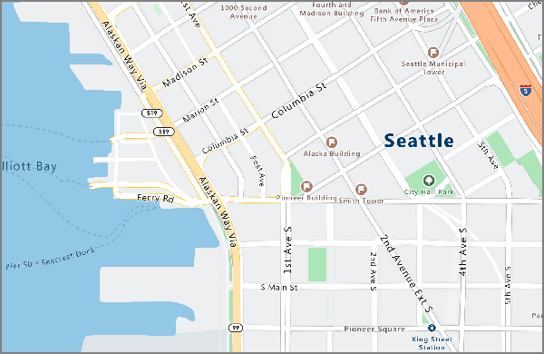
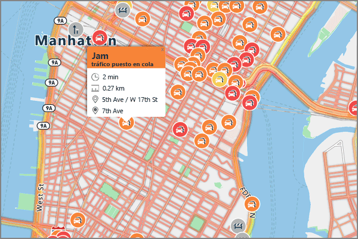

# <a name="an-introduction-to-azure-maps"></a>Introducción a Azure Maps
Azure Maps es una cartera de servicios geoespaciales que incluyen API de servicio para mapas, búsqueda, rutas, tráfico y zonas horarias. La cartera de servicios compatibles con Azure OneAPI le permite usar herramientas conocidas para desarrollar y escalar rápidamente soluciones que integran la información de ubicación en las soluciones de Azure. Azure Maps ofrece a los desarrolladores de todos los sectores funcionalidades geoespaciales eficaces, integradas con nuevos datos de asignación que son imperativos para proporcionar contexto geográfico a aplicaciones web y móviles. Azure Maps es un conjunto de API de REST, acompañado de un control de JavaScript basado en web que hace que el desarrollo sea sencillo, flexible y portátil en varios medios. 

En el siguiente vídeo se presenta Azure Maps:

<iframe src="https://channel9.msdn.com/Shows/Azure-Friday/Azure-Location-Based-Services/player" width="960" height="540" allowFullScreen frameBorder="0"></iframe>

Azure Maps consta de cinco servicios principales que refuerzan las aplicaciones de Azure que requieren un contexto geográfico. Cada uno de los servicios se explica con más detalle.

**Render Service** está diseñado para los desarrolladores para la creación de aplicaciones web y móviles basadas en mapas. El servicio emplea imágenes de gráficos de trama de alta calidad, disponibles en 19 niveles de zoom, o imágenes de mapa en formato vectorial totalmente personalizables.



**Route Service** contiene sólidos cálculos de geometría de infraestructura del mundo real y varias direcciones de modo de transporte. El servicio permite a los desarrolladores calcular direcciones entre distintos modos de viaje, como automóvil, camión, bicicleta o a pie. El servicio también puede tener en cuenta entradas como las condiciones del tráfico, las restricciones de peso o el transporte materiales peligrosos.


**Search Service** está diseñado para los desarrolladores, para la búsqueda de direcciones, lugares, listados de empresas por nombre o categoría y otra información geográfica. Search Service puede asimismo realizar la [codificación inversa](https://en.wikipedia.org/wiki/Reverse_geocoding) de direcciones y cruces de calles según una longitud y una latitud. 


**Time Zone Service** le permite consultar la información de zona horaria actual, histórica y futura mediante pares de latitud-longitud o un [identificador de IANA](http://www.iana.org/). Time Zone Service también permite convertir los identificadores de zona horaria de Microsoft Windows en zonas horarias de IANA, de forma que se captura una compensación de zona horaria a UTC y se obtiene la hora actual en una zona horaria respectiva. Una respuesta JSON típica de una consulta a Time Zone Service se parece al ejemplo siguiente:

```JSON
{
    "Version": "2017c",
    "ReferenceUtcTimestamp": "2017-11-20T23:09:48.686173Z",
    "TimeZones": [{
        "Id": "America/Los_Angeles",
        "ReferenceTime": {
            "Tag": "PST",
            "StandardOffset": "-08:00:00",
            "DaylightSavings": "00:00:00",
            "WallTime": "2017-11-20T15:09:48.686173-08:00",
            "PosixTzValidYear": 2017,
            "PosixTz": "PST+8PDT,M3.2.0,M11.1.0"
        }
    }]
}
```

**Traffic Service** es un conjunto de servicios web diseñados para los desarrolladores, para la creación de aplicaciones web y móviles que requieren tráfico. El servicio proporciona dos tipos de datos:
* Traffic Flow: velocidades observadas en tiempo real y tiempos de desplazamiento de todas las principales carreteras de la red. 
* Traffic Incidents: una vista exacta sobre los atascos y las incidencias de tráfico de toda la red de carreteras.



Azure Maps se diseño para la movilidad y puede potenciar las aplicaciones multiplataforma, dado que el modelo de programación es independiente y admite salidas JSON mediante las API de REST. Además, Azure Maps ofrece un práctico control de mapas de JavaScript con un modelo sencillo de programación para el desarrollo fácil y rápido de aplicaciones web y móviles. 

Azure Maps usa un esquema de autenticación basado en claves, donde el acceso a los servicios se realiza mediante la navegación a [Azure Portal](http://portal.azure.com) y la creación de una cuenta de Azure Maps. Su cuenta incluye dos claves que se generan previamente de manera automática. Comience a integrar estas funcionalidades de ubicación directamente en sus aplicaciones mediante el uso de una de sus claves en las solicitudes al servicio Azure Maps.

## <a name="unsupported-regions"></a>Regiones no admitidas
La API de Azure Maps no está disponible actualmente en los siguientes países. Compruebe la dirección IP actual y asegúrese de que la ubicación de la dirección IP no esté en uno de los siguientes países no admitidos:

* Argentina
* China
* India
* Marruecos
* Pakistán
* Corea del Sur

## <a name="relationship-with-bing-maps"></a>Relación con Mapas de Bing
Los mapas descritos en este documento son distintos de los que proporciona Mapas de Bing. Aunque comparten gran parte de la funcionalidad, los dos servicios son diferentes y no están relacionados. Este servicio de Azure no afecta a la oferta de productos ni los mapas de ruta de Mapas de Bing.

El objetivo de Microsoft es permitir elegir a la comunidad de desarrolladores con respecto a la ubicación de las ofertas de servicio. La tabla siguiente contiene instrucciones para los desarrolladores que están en proceso de decidir qué servicio usar: 

| Escenario | Use Azure Maps cuando: | Use Mapas de Bing cuando: |
| ------------- | ------------- | ------------- |
| Entorno de desarrollo | Compile o coordine con otros servicios de Azure | Utilice una nube de terceros u otro entorno de desarrollador |
| Fase de desarrollo  | Dado que Azure Maps está actualmente en la versión preliminar pública, está optimizado para las primeras pruebas y el desarrollo de la prueba de concepto | Un Acuerdo de Nivel de Servicio de nivel empresarial es necesario para un entorno de producción |
| Opciones de precios | Las opciones de precios preliminares para desarrolladores son suficientes | Se requieren precios personalizados de nivel empresarial |
| Entorno de casos prácticos | Se requiere el uso de vehículo | No se requiere el uso de vehículo |
| Cobertura geográfica | No se requiere para India, China, Japón y Corea del Sur | Se requiere la cobertura de mapas para India, China, Japón y Corea del Sur |
| Contenido de mapas | Los mapas con una superficie estándar son suficientes | Se requieren imágenes de calles laterales, aéreas o por satélite |
| Origen de mapas básicos | Se prefieren datos de mapas de TomTom | Se prefieren datos de mapas de HERE |

Regístrese para obtener una [cuenta de Azure Maps hoy mismo](http://aka.ms/azurelbsportal).

## <a name="next-steps"></a>Pasos siguientes

Ahora tiene una introducción a Azure Maps. El paso siguiente es probar una aplicación de ejemplo que demuestra el servicio.

> [!div class="nextstepaction"]
> [Iniciar un mapa de búsqueda interactiva de demostración](quick-demo-map-app.md)

