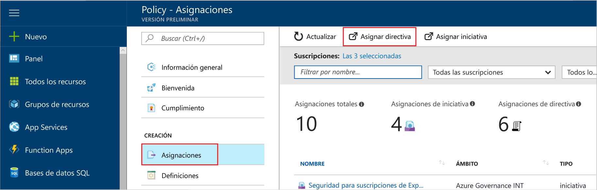
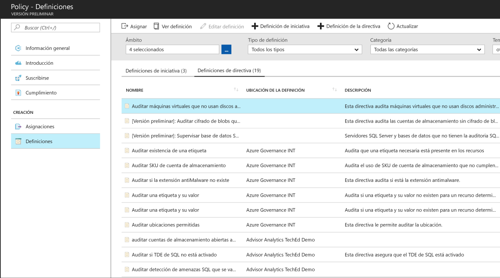
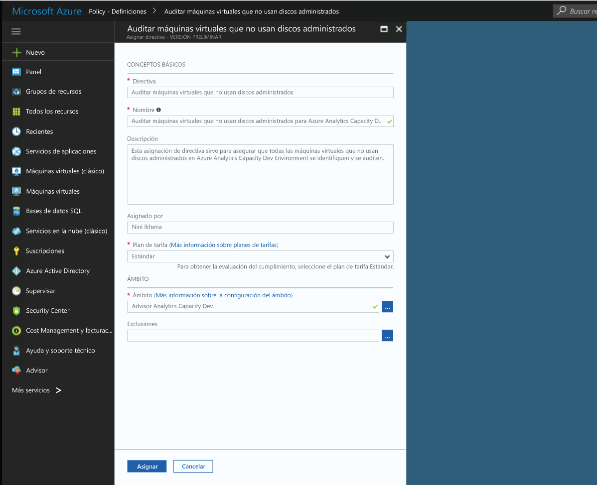
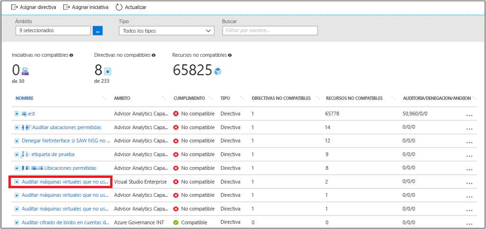
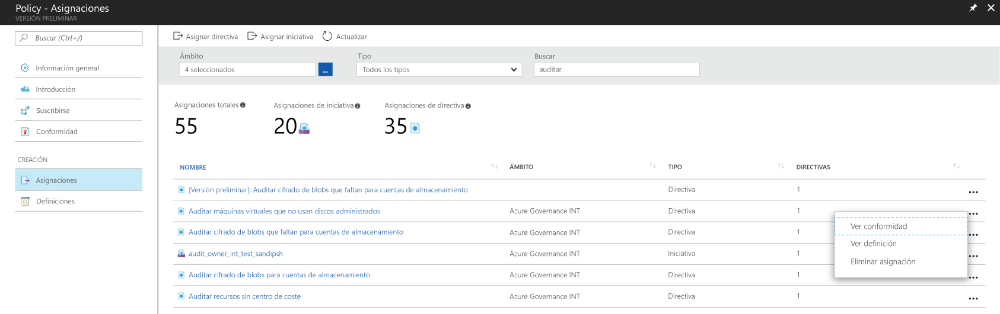

# Creación de una asignación de directiva para identificar recursos no compatibles en el entorno de Azure
El primer paso para entender el cumplimiento en Azure es identificar el estado de sus recursos. Este inicio rápido lo guiará por el proceso de creación de una asignación de directiva para identificar máquinas virtuales que no están usando discos administrados.

Al finalizar este proceso, habrá identificado correctamente máquinas virtuales que no utilizan discos administrados. No *son compatibles* con la asignación de directiva.

Si no tiene una suscripción a Azure, cree una [cuenta gratuita](https://azure.microsoft.com/free/?WT.mc_id=A261C142F) antes de empezar.

## Creación de una asignación de directiva

En esta guía de inicio rápido, se crea una asignación de directiva y se le asigna la definición de directiva *Audit VMs that do not use managed disks* (Auditoría de máquinas virtuales sin discos administrados).

1. Seleccione **Assignments** (Asignaciones) en el panel izquierdo de la página Azure Policy.
2. Seleccione **Asignar directiva** en la parte superior del panel **Asignaciones**.

   

3. En la página **Assign Policy** (Asignar directiva), haga clic en el  (Definición de directiva) junto al campo **Policy** (Directiva) para abrir la lista de las definiciones disponibles.

   

   Azure Policy viene ya con definiciones de directiva integradas para usarlas. Puede encontrar definiciones de directiva integradas como:

   - Enforce tag and its value (Forzar etiqueta y su valor)
   - Apply tag and its value (Aplicar una etiqueta y su valor)
   - Require SQL Server Version 12.0 (Requerir SQL Server 12.0)

    Para obtener una lista completa de todas las directivas integradas disponibles, consulte [Plantillas de directiva](json-samples.md).

4. Busque en sus definiciones de directiva para encontrar la definición de la *Auditoría de máquinas virtuales sin discos administrados*. Haga clic en esa directiva y después en **Seleccionar**.

   

5. Proporcione un **Nombre** para mostrar para la asignación de directiva. En este caso, vamos a usar *Auditoría de máquinas virtuales que no usan discos administrados*. También puede agregar una **Descripción** opcional. La descripción proporciona detalles acerca de cómo identifica esta asignación de directiva todas las máquinas virtuales que no utilizan discos administrados.
6. Cambie el plan de tarifa a **Standard** (Estándar) para asegurarse de que la directiva se aplique a los recursos existentes.

   Azure Policy ofrece dos planes de tarifa: *Free* (Gratis) y *Standard* (Estándar). Con el nivel Gratis, solo puede implementar las directivas en futuros recursos, mientras que con el plan Estándar, también puede hacerlo en los recursos ya existentes, para identificar mejor el estado de cumplimiento. Para más información sobre los precios, consulte la página sobre [precios de Azure Policy](https://azure.microsoft.com/pricing/details/azure-policy/).

7. Seleccione el **ámbito** al que desea que se aplique la directiva.  Un ámbito determina en qué recursos o agrupación de recursos se exige la asignación de directiva. Puede abarcar desde una suscripción hasta grupos de recursos.
8. Seleccione la suscripción (o el grupo de recursos) que registró anteriormente. En este ejemplo, se usa la suscripción **Azure Analytics Capacity Dev**, pero sus opciones pueden variar. Haga clic en **Seleccionar**.

   

9. Deje **Exclusiones** en blanco de momento y haga clic en **Asignar**.

Ahora ya está listo para identificar los recursos no compatibles para saber el estado de cumplimiento de su entorno.

## Identificación de recursos no compatibles

Seleccione **Cumplimiento** en el panel izquierdo y busque la asignación de directiva que ha creado.

Si hay algún recurso existente no compatible con esta nueva asignación, aparecerá en la pestaña **Recursos no compatibles**.

Si una condición se evalúa en todos los recursos existentes y el valor obtenido es true, estos recursos se marcarán como no compatibles con la directiva. La imagen del ejemplo anterior muestra los recursos no compatibles. En la tabla siguiente se muestra cómo funcionan las diferentes acciones de la directiva con la evaluación de la condición para el estado de cumplimiento resultante. Aunque no se ve la lógica de evaluación en Azure Portal, se muestran los resultados del estado de cumplimiento. El resultado del estado de cumplimiento puede ser compatible o no compatible.

|Recurso  |Si la condición de la directiva se evalúa como  |Acción en la directiva   |Estado de cumplimiento  |
|-----------|---------|---------|---------|
|Exists     |True     |Denegar     |Incompatible |
|Exists     |False    |Denegar     |Compatible     |
|Exists     |True     |Append   |Incompatible |
|Exists     |False    |Append   |Compatible     |
|Exists     |True     |Auditoría    |Incompatible |
|Exists     |False    |Auditoría    |Incompatible |

## Limpieza de recursos

Otras guías de esta colección se basan en esta guía de inicio rápido. Si tiene previsto seguir trabajando con los tutoriales siguientes, no elimine los recursos creados en esta guía de inicio rápido. Si no tiene previsto continuar, siga estos pasos para eliminar todos los recursos creados en esta guía de inicio rápido en Azure Portal.
1. Seleccione **Assignments** (Asignaciones) en el panel izquierdo.
2. Busque la asignación que ha creado y haga clic con el botón derecho en ella.

   

3.  Seleccione **Eliminar asignación**.

## pasos siguientes

En esta guía de inicio rápido, se ha asignado una definición de directiva a un ámbito. La definición de la directiva garantiza que todos los recursos del ámbito son compatibles y se identifican cuáles no lo son.

Para obtener información sobre la asignación de directivas para garantizar que los **futuros** recursos creados sean compatibles, continúe con este tutorial para:

> [!div class="nextstepaction"]
> [Crear y administrar directivas](./create-manage-policy.md)
