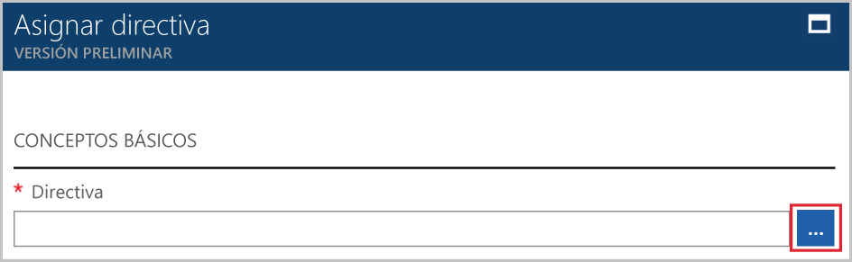

# <a name="create-and-manage-policies-to-enforce-compliance"></a>Creación y administración de directivas para aplicar el cumplimiento

Comprender cómo se crean y administran las directivas en Azure es importante para mantener el cumplimiento de los estándares corporativos y los contratos de nivel de servicio. En este tutorial, aprenderá a usar Azure Policy para realizar algunas de las tareas más comunes relacionadas con la creación, la asignación y la administración de directivas en toda la organización, por ejemplo:

> [!div class="checklist"]
> * Asignar una directiva para aplicar una condición a los recursos que se creen en el futuro
> * Crear y asignar una definición de iniciativa para realizar un seguimiento del cumplimiento para varios recursos
> * Resolver un recurso que no cumpla o que sea denegado
> * Implementar una nueva directiva en toda la organización

Si desea asignar una directiva para identificar el estado de cumplimiento actual de los recursos existentes, en los artículos de inicio rápido se examina cómo hacerlo. Si no tiene una suscripción a Azure, cree una [cuenta gratuita](https://azure.microsoft.com/free/?WT.mc_id=A261C142F) antes de empezar.

## <a name="assign-a-policy"></a>Asignación de una directiva

El primer paso para aplicar cumplimientos con Azure Policy es asignar una definición de directiva. Una definición de directiva precisa en qué condiciones se aplica una directiva y qué acción se debe realizar. En este ejemplo, asigne una definición de directiva integrada denominada *Require SQL Server Version 12.0* (Requerir SQL Server 12.0), para aplicar la condición de que todas las bases de datos SQL Server tengan que ser v12.0 para que satisfagan los requisitos de cumplimiento.

1. Inicie el servicio Azure Policy en Azure Portal buscando y seleccionando **Policy** (Directiva) en el panel izquierdo.

   

2. Seleccione **Assignments** (Asignaciones) en el panel izquierdo de la página Azure Policy. Una asignación es una directiva que se asignó para que se lleve a cabo dentro de un ámbito específico.
3. Seleccione **Assign Policy** (Asignar directiva) en la parte superior del panel **Assignments** (Asignaciones).

   

4. En la página **Assign Policy** (Asignar directiva), haga clic en el  (Definición de directiva) junto al campo **Policy** (Directiva) para abrir la lista de las definiciones disponibles. Puede filtrar el **tipo** de la definición de directiva por *BuiltIn* (Integrada) para verlas todas y leer sus descripciones.

   

5. Seleccione **Require SQL Server Version 12.0** (Requerir SQL Server 12.0). Si no la encuentra inmediatamente, escriba **Require SQL Server Version 12.0** (Requerir SQL Server 12.0) en el cuadro de búsqueda y presione ENTRAR.

   

6. El **nombre** para mostrar se rellena automáticamente, pero puede cambiarlo. En este ejemplo, use *Require SQL Server version 12.0* (Requerir SQL Server 12.0). También puede agregar una **Descripción** opcional. La descripción proporciona detalles sobre cómo esta asignación de directiva garantiza que todos los servidores SQL Server creados en este entorno tengan la versión 12.0.

7. Cambie el plan de tarifa a **Standard** (Estándar) para asegurarse de que la directiva se aplique a los recursos existentes.

   Azure Policy ofrece dos planes de tarifa: *Free* (Gratis) y *Standard* (Estándar). Con el nivel Gratis, solo puede implementar las directivas en futuros recursos, mientras que con el plan Estándar, también puede hacerlo en los recursos ya existentes, para identificar mejor el estado de cumplimiento. Como Azure Policy se encuentra en versión preliminar, aún no se dispone de un modelo de precios publicado, por lo que no recibirá una factura por seleccionar *Standard* (Estándar). Para más información sobre los precios, vea la página sobre [precios de Azure Policy](https://azure.microsoft.com/pricing/details/azure-policy).

8. Seleccione una opción en **Scope** (Ámbito): la suscripción o el grupo de recursos que registró anteriormente. Un ámbito determina en qué recursos o agrupación de recursos se implementa la asignación de directiva. Puede abarcar desde una suscripción hasta grupos de recursos.

   En este ejemplo se usa la suscripción **Azure Analytics Capacity Dev**. Su suscripción variará.

10. Seleccione **Asignar**.

## <a name="implement-a-new-custom-policy"></a>Implementación de una nueva directiva personalizada

Ahora que ha asignado una definición de directiva integrada, puede hacer más cosas con Azure Policy. A continuación, creará una nueva directiva personalizada para ahorrar costos, para lo cual se asegurará de que las máquinas virtuales creadas en el entorno no puedan estar en la serie G. De este modo, cada vez que un usuario de su organización intente crear una máquina virtual de la serie G, la solicitud le será denegada.

1. Seleccione **Definition** (Definición) en **Authoring** (Creación) en el panel izquierdo.

   

2. Seleccione **+ Policy Definition** (+Definición de directiva).
3. Escriba lo siguiente:

   - El nombre de la definición de directiva: *Require VM SKUs smaller than the G series* (Requerir SKU de máquina virtual inferiores a la serie G)
   - La descripción de para qué está diseñada la definición de directiva: esta definición de directiva exige que todas las máquinas virtuales creadas en este ámbito tengan SKU inferiores a la serie G para reducir el costo.
   - La suscripción en la que reside la definición de directiva. En este caso, la definición de directiva se encuentra en **Advisor Analytics Capacity Dev**. Su lista de suscripción variará.
   - Elija de las opciones existentes o cree una nueva categoría para esta definición de directiva.
   - Copie el siguiente código json y, a continuación, actualícelo según sus necesidades con:
      - Los parámetros de directiva.
      - Las reglas/condiciones de la directiva, en este caso: tamaño de SKU de máquina virtual igual a la serie G
      - El efecto de la directiva, en este caso: **Deny** (Denegar).

    Este es el aspecto que debería tener el json. Pegue el código revisado en Azure Portal.

    ```json
{
    "policyRule": {
      "if": {
        "allOf": [
          {
            "field": "type",
            "equals": "Microsoft.Compute/virtualMachines"
          },
          {
            "field": "Microsoft.Compute/virtualMachines/sku.name",
            "like": "Standard_G*"
          }
        ]
      },
      "then": {
        "effect": "deny"
      }
    }
}
    ```

    El valor de la *propiedad de campo* de la regla de directiva debe ser uno de los siguientes: nombre, tipo, ubicación, etiquetas o un alias. Por ejemplo, `"Microsoft.Compute/VirtualMachines/Size"`.

    Para ver más ejemplos de código JSON, lea el artículo [Plantillas para Azure Policy](json-samples.md).

4. Seleccione **Guardar**.

## <a name="create-a-policy-definition-with-rest-api"></a>Creación de una definición de directiva con la API de REST

Puede crear una directiva con la API de REST para definiciones de directiva. La API de REST permite crear y eliminar definiciones de directiva, así como recuperar información sobre las definiciones existentes.
Para crear una definición de directiva, use el siguiente ejemplo:

```
PUT https://management.azure.com/subscriptions/{subscription-id}/providers/Microsoft.authorization/policydefinitions/{policyDefinitionName}?api-version={api-version}

```
Incluya un cuerpo de solicitud similar al ejemplo siguiente:

```
{
  "properties": {
    "parameters": {
      "allowedLocations": {
        "type": "array",
        "metadata": {
          "description": "The list of locations that can be specified when deploying resources",
          "strongType": "location",
          "displayName": "Allowed locations"
        }
      }
    },
    "displayName": "Allowed locations",
    "description": "This policy enables you to restrict the locations your organization can specify when deploying resources.",
    "policyRule": {
      "if": {
        "not": {
          "field": "location",
          "in": "[parameters('allowedLocations')]"
        }
      },
      "then": {
        "effect": "deny"
      }
    }
  }
}
```

## <a name="create-a-policy-definition-with-powershell"></a>Creación de una definición de directiva con PowerShell

Antes de continuar con el ejemplo de PowerShell, asegúrese de que tiene instalada la última versión de Azure PowerShell. Se agregaron parámetros de directiva en la versión 3.6.0. Si tiene una versión anterior, los ejemplos devuelven un error que indica que no se encuentra el parámetro.

Puede crear una definición de directiva con el cmdlet `New-AzureRmPolicyDefinition`.

Para crear una definición de directiva desde un archivo, pase la ruta de acceso al archivo. Para un archivo externo, use el ejemplo siguiente:

```
$definition = New-AzureRmPolicyDefinition `
    -Name denyCoolTiering `
    -DisplayName "Deny cool access tiering for storage" `
    -Policy 'https://raw.githubusercontent.com/Azure/azure-policy-samples/master/samples/Storage/storage-account-access-tier/azurepolicy.rules.json'
```

Para un archivo local, use el ejemplo siguiente:

```
$definition = New-AzureRmPolicyDefinition `
    -Name denyCoolTiering `
    -Description "Deny cool access tiering for storage" `
    -Policy "c:\policies\coolAccessTier.json"
```

Para crear una definición de directiva con una regla insertada, use el ejemplo siguiente:

```
$definition = New-AzureRmPolicyDefinition -Name denyCoolTiering -Description "Deny cool access tiering for storage" -Policy '{
  "if": {
    "allOf": [
      {
        "field": "type",
        "equals": "Microsoft.Storage/storageAccounts"
      },
      {
        "field": "kind",
        "equals": "BlobStorage"
      },
      {
        "not": {
          "field": "Microsoft.Storage/storageAccounts/accessTier",
          "equals": "cool"
        }
      }
    ]
  },
  "then": {
    "effect": "deny"
  }
}'
```

La salida se almacena en un objeto `$definition`, que se usa durante la asignación de directivas.
En el ejemplo siguiente se crea una definición de directiva que incluye parámetros:

```
$policy = '{
    "if": {
        "allOf": [
            {
                "field": "type",
                "equals": "Microsoft.Storage/storageAccounts"
            },
            {
                "not": {
                    "field": "location",
                    "in": "[parameters(''allowedLocations'')]"
                }
            }
        ]
    },
    "then": {
        "effect": "Deny"
    }
}'

$parameters = '{
    "allowedLocations": {
        "type": "array",
        "metadata": {
          "description": "The list of locations that can be specified when deploying storage accounts.",
          "strongType": "location",
          "displayName": "Allowed locations"
        }
    }
}'

$definition = New-AzureRmPolicyDefinition -Name storageLocations -Description "Policy to specify locations for storage accounts." -Policy $policy -Parameter $parameters
```

## <a name="view-policy-definitions"></a>Visualización de definiciones de directiva

Para ver todas las definiciones de directiva en su suscripción, utilice el siguiente comando:

```
Get-AzureRmPolicyDefinition
```

Devuelve todas las definiciones de directiva disponibles, incluidas las directivas integradas. Cada directiva se devuelve con el formato siguiente:

```
Name               : e56962a6-4747-49cd-b67b-bf8b01975c4c
ResourceId         : /providers/Microsoft.Authorization/policyDefinitions/e56962a6-4747-49cd-b67b-bf8b01975c4c
ResourceName       : e56962a6-4747-49cd-b67b-bf8b01975c4c
ResourceType       : Microsoft.Authorization/policyDefinitions
Properties         : @{displayName=Allowed locations; policyType=BuiltIn; description=This policy enables you to
                     restrict the locations your organization can specify when deploying resources. Use to enforce
                     your geo-compliance requirements.; parameters=; policyRule=}
PolicyDefinitionId : /providers/Microsoft.Authorization/policyDefinitions/e56962a6-4747-49cd-b67b-bf8b01975c4c
```

## <a name="create-a-policy-definition-with-azure-cli"></a>Creación de una definición de directiva con la CLI de Azure

Puede crear una definición de directiva mediante la CLI de Azure con el comando de definición de directiva.
Para crear una definición de directiva con una regla insertada, use el ejemplo siguiente:

```
az policy definition create --name denyCoolTiering --description "Deny cool access tiering for storage" --rules '{
  "if": {
    "allOf": [
      {
        "field": "type",
        "equals": "Microsoft.Storage/storageAccounts"
      },
      {
        "field": "kind",
        "equals": "BlobStorage"
      },
      {
        "not": {
          "field": "Microsoft.Storage/storageAccounts/accessTier",
          "equals": "cool"
        }
      }
    ]
  },
  "then": {
    "effect": "deny"
  }
}'
```

## <a name="view-policy-definitions"></a>Visualización de definiciones de directiva

Para ver todas las definiciones de directiva en su suscripción, utilice el siguiente comando:

```
az policy definition list
```

Devuelve todas las definiciones de directiva disponibles, incluidas las directivas integradas. Cada directiva se devuelve con el formato siguiente:

```
{                                                            
  "description": "This policy enables you to restrict the locations your organization can specify when deploying resources. Use to enforce your geo-compliance requirements.",                      
  "displayName": "Allowed locations",
  "id": "/providers/Microsoft.Authorization/policyDefinitions/e56962a6-4747-49cd-b67b-bf8b01975c4c",
  "name": "e56962a6-4747-49cd-b67b-bf8b01975c4c",
  "policyRule": {
    "if": {
      "not": {
        "field": "location",
        "in": "[parameters('listOfAllowedLocations')]"
      }
    },
    "then": {
      "effect": "Deny"
    }
  },
  "policyType": "BuiltIn"
}
```

## <a name="create-and-assign-an-initiative-definition"></a>Creación y asignación de una definición de iniciativa

Con una definición de iniciativa, puede agrupar varias definiciones de directiva para lograr un objetivo general. Cree una definición de iniciativa para asegurarse de que los recursos en el ámbito de la definición permanezcan en conformidad con las definiciones de directiva que componen la definición de iniciativa.  Consulte la [Introducción a Azure Policy](./azure-policy-introduction.md) para más información sobre las definiciones de iniciativa.

### <a name="create-an-initiative-definition"></a>Creación de una definición de iniciativa

1. Seleccione **Definition** (Definición) en **Authoring** (Creación) en el panel izquierdo.

   

2. Seleccione **Initiative Definition** (Definición de iniciativa) en la parte superior de la página, esta selección le lleva hasta el formulario **Initiative Definition** (Definición de iniciativa).
3. Escriba el nombre y la descripción de la iniciativa.

   En este ejemplo, se asegurará de que los recursos guarden conformidad con las definiciones de directiva sobre protección. Así que, el nombre de la iniciativa sería **Get Secure** (Estar protegido) y la descripción sería: **This initiative has been created to handle all policy definitions associated with securing resources** (Esta iniciativa se ha creado para administrar todas las definiciones de directiva asociadas con la protección de los recursos).

   

4. Examine la lista **Available Definitions** (Definiciones disponibles) y seleccione las definiciones de directiva que le gustaría agregar a esa iniciativa. En nuestra iniciativa **Get secure** (Estar protegido), **agregue** las siguientes definiciones de directiva integrada:
   - Requisito de la versión 12.0 de SQL Server
   - Monitor unprotected web applications in Security Center (Supervisar las aplicaciones web no protegidas en Security Center).
   - Monitor permissive network across in Security Center (Supervisar la red permisiva en Security Center).
   - Monitor possible app Whitelisting in Security Center (Supervisar la creación de listas blancas por la aplicación en Security Center).
   - Monitor unencrypted VM Disks in Security Center (Supervisar los discos de máquina virtual sin cifrar en Security Center).

   

   Después de seleccionar las definiciones de directiva de la lista, las verá en **Policies and parameters** (Directivas y parámetros), como se muestra en la imagen anterior.

5. Use **Definition location** (Ubicación de definición) para seleccionar una suscripción para almacenar la definición. Seleccione **Guardar**.

### <a name="assign-an-initiative-definition"></a>Asignación de una definición de iniciativa

1. Vaya a la pestaña **Definitions** (Definiciones) en **Authoring** (Creación).
2. Busque la definición de iniciativa **Get secure** (Obtener con seguridad) que creó.
3. Seleccione la definición de iniciativa y, a continuación, seleccione **Assign** (Asignar).

   

4. Rellene el formulario **Assignment** (Asignación) con la siguiente información de ejemplo. Puede usar su propia información.
   - Name (Nombre): asignación Get secure (Estar protegido)
   - Description (Descripción): esta asignación de iniciativa está adaptada para aplicar este grupo de definiciones de directiva en la suscripción **Azure Advisor capacidad Dev**
   - Pricing Tier (Plan de tarifa): Standard
   - Ámbito al que le gustaría que se aplicara esta asignación: **Azure Advisor Capacity Dev**. Puede elegir su propia suscripción y grupo de recursos.

5. Seleccione **Asignar**.

## <a name="exempt-a-non-compliant-or-denied-resource-using-exclusion"></a>Exclusión de un recurso no conforme o denegado mediante Exclusión

Siguiendo el ejemplo anterior, después de asignar la definición de directiva para requerir SQL Server versión 12.0, un servidor de SQL Server que se cree con una versión diferente será denegado. En esta sección, se va a examinar cómo resolver un intento denegado de crear un servidor SQL Server de una versión diferente mediante la solicitud de una exclusión. La exclusión impide básicamente la aplicación de directivas. Se puede aplicar una exclusión a un grupo de recursos o se puede restringir la exclusión a recursos individuales.

1. Seleccione **Assignments** (Asignaciones) en el panel izquierdo.
2. Examine todas las asignaciones de directiva y abra la asignación *Require SQL Server version 12.0* (Requerir SQL Server 12.0).
3. **Seleccione** una exclusión para los recursos de los grupos de recursos donde intenta crear el servidor SQL Server. En este ejemplo, excluya Microsoft.Sql/servers/databases: *azuremetrictest/testdb* y *azuremetrictest/testdb2*.

   

   Otras maneras para resolver un recurso denegado incluyen: llegar al contacto asociado con la directiva si tiene algo que justifique claramente la necesidad de crear el servidor SQL Server y editar directamente la directiva si tiene acceso a ella.

4. Haga clic en **Asignar**.

En esta sección, se resuelve la denegación de su intento de crear un servidor SQL Server con la versión 12.0, solicitando una exclusión para los recursos.

## <a name="clean-up-resources"></a>Limpieza de recursos

Si tiene previsto seguir trabajando con los tutoriales siguientes, no elimine los recursos creados en esta guía. Si no va a continuar, use los pasos a continuación para eliminar todas las asignaciones y definiciones creadas:

1. Seleccione **Definitions** (Definiciones), o **Assignments** (Asignaciones) si está intentando eliminar una asignación en el panel izquierdo.
2. Busque la nueva iniciativa o definición de directiva (o asignación) recién creada.
3. Seleccione los puntos suspensivos al final de la definición o la asignación y seleccione **Delete Definition** (Eliminar definición) o **Delete Assignment** (Eliminar asignación).

## <a name="next-steps"></a>pasos siguientes

En este tutorial, ha realizado satisfactoriamente lo siguiente:

> [!div class="checklist"]
> * Ha asignado una directiva para aplicar una condición a los recursos que se creen en el futuro
> * Ha creado y asignado una definición de iniciativa para realizar un seguimiento del cumplimiento para varios recursos
> * Ha resuelto un recurso que no cumplía o que se había denegado
> * Ha implementado una nueva directiva en toda la organización

Para más información sobre las estructuras de las definiciones de directiva, consulte este artículo:

> [!div class="nextstepaction"]
> [Estructura de definición de Azure Policy](policy-definition.md)
