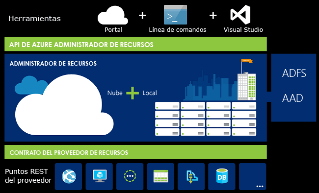
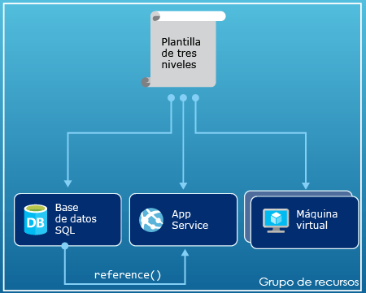
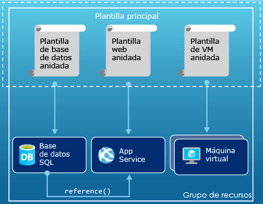
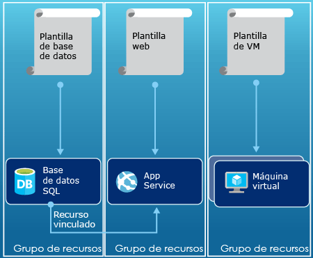

# <a name="azure-resource-manager-overview"></a>Información general del Administrador de recursos de Azure
La infraestructura de la aplicación está constituida normalmente por varios componentes: quizás una máquina virtual, una cuenta de almacenamiento y una red virtual, o una aplicación web, una base de datos, un servidor de bases de datos y servicios de terceros. Estos componentes no se ven como entidades independientes, sino como partes de una sola entidad relacionadas e interdependientes. Desea implementarlos, administrarlos y supervisarlos como grupo. Azure Resource Manager permite trabajar con los recursos de la solución como un grupo. Todos los recursos de la solución se pueden implementar, actualizar o eliminar en una sola operación coordinada. Para realizar la implementación se usa una plantilla, que puede funcionar en distintos entornos, como producción, pruebas y ensayo. Administrador de recursos proporciona funciones de seguridad, auditoría y etiquetado que le ayudan a administrar los recursos después de la implementación. 

## <a name="terminology"></a>Terminología
Si no conoce Azure Resource Manager, estos son algunos términos con los que puede no estar familiarizado.

* **recurso** : elemento administrable que está disponible a través de Azure. Algunos recursos comunes son una máquina virtual, una cuenta de almacenamiento, una aplicación web, una base de datos y una red virtual, pero hay muchos más.
* **grupo de recursos** : contenedor que almacena los recursos relacionados con una solución de Azure. El grupo de recursos puede incluir todos los recursos de la solución o solo aquellos que se desean administrar como grupo. Para decidir cómo asignar los recursos a los grupos de recursos, tenga en cuenta lo que más conviene a su organización. Consulte [Grupos de recursos](#resource-groups).
* **proveedor de recursos** : servicio que proporciona los recursos que puede implementar y administrar mediante Resource Manager. Cada proveedor de recursos ofrece operaciones para trabajar con los recursos que se implementan. Algunos proveedores de recursos comunes son Microsoft.Compute, que suministra el recurso de máquinas virtuales, Microsoft.Storage, que suministra el recurso de cuentas de almacenamiento y Microsoft.Web, que suministra recursos relacionados con aplicaciones web. Consulte [Proveedores de recursos](#resource-providers).
* **Plantilla de Resource Manager** : archivo de notación de objetos JavaScript (JSON) que define uno o más recursos para implementar en un grupo de recursos. También define las dependencias entre los recursos implementados. La plantilla se puede usar para implementar los recursos de manera repetida y uniforme. Consulte [Implementación de plantilla](#template-deployment).
* **sintaxis declarativa** : sintaxis que permite establecer lo que pretende crear sin tener que escribir la secuencia de comandos de programación para crearla. La plantilla de Resource Manager es un ejemplo de sintaxis declarativa. En el archivo, puede definir las propiedades de la infraestructura que se va a implementar en Azure. 

## <a name="the-benefits-of-using-resource-manager"></a>Ventajas de usar Administrador de recursos
Administrador de recursos ofrece varias ventajas:

* Puede implementar, administrar y supervisar todos los recursos de la solución en grupo, en lugar de controlarlos individualmente.
* Puede implementar la solución repetidamente a lo largo del ciclo de vida del desarrollo y tener la seguridad de que los recursos se implementan de forma coherente.
* Puede administrar la infraestructura mediante plantillas declarativas en lugar de scripts.
* Puede definir las dependencias entre recursos de modo que se implementen en el orden correcto.
* Puede aplicar control de acceso a todos los servicios del grupo de recursos al integrarse de forma nativa Control de acceso basado en rol (RBAC) en la plataforma de administración.
* Puede aplicar etiquetas a los recursos para organizar de manera lógica todos los recursos de la suscripción.
* Puede aclarar la facturación de su organización viendo los costos de un grupo de recursos que compartan la misma etiqueta.  

Resource Manager ofrece una nueva manera de implementar y administrar las soluciones. Si usó el anterior modelo de implementación y desea obtener más información sobre los cambios, consulte [Descripción de la implementación de Administrador de recursos y la implementación clásica](resource-manager-deployment-model.md).

## <a name="consistent-management-layer"></a>Capa de administración coherente
Resource Manager proporciona una capa de administración coherente para las tareas que se realizan a través de Azure PowerShell, la CLI de Azure, Azure Portal, API de REST y herramientas de desarrollo. Todas las herramientas utilizan un conjunto común de operaciones. Podrá usar aquellas herramientas que funcionen mejor y podrá usarlas indistintamente sin confusión. 

La siguiente imagen muestra cómo todas las herramientas interactúan con la misma API de Azure Resource Manager. La API pasa las solicitudes al servicio Resource Manager que las autentica y autoriza. A continuación, Resource Manager enruta las solicitudes a los proveedores de recursos adecuados.



## <a name="guidance"></a>Guía
Las siguientes sugerencias le ayudarán a sacar el máximo partido de Resource Manager cuando trabaje con sus soluciones.

1. Defina e implemente la infraestructura mediante la sintaxis declarativa en las plantillas de Administrador de recursos, en lugar de comandos imperativos.
2. Defina todos los pasos de implementación y configuración de la plantilla. No debería tener ningún paso manual para configurar la solución.
3. Ejecute comandos imperativos para administrar los recursos, como iniciar o detener una aplicación o un equipo.
4. Organice los recursos con el mismo ciclo de vida en un grupo de recursos. Use etiquetas para organizar los demás recursos.

Para más recomendaciones sobre platillas, consulte [Procedimientos recomendados para crear plantillas de Azure Resource Manager](resource-manager-template-best-practices.md).

Para obtener instrucciones sobre cómo las empresas pueden utilizar Resource Manager para administrar eficazmente las suscripciones, vea [Scaffold empresarial de Azure: Gobierno de suscripción prescriptivo](resource-manager-subscription-governance.md).

## <a name="resource-groups"></a>Grupos de recursos
Hay algunos factores importantes que se deben tener en cuenta al definir el grupo de recursos:

1. Todos los recursos del grupo deben compartir el mismo ciclo de vida. Se implementan, actualizan y eliminan de forma conjunta. Si un recurso, como un servidor de base de datos, debe existir en un ciclo de implementación diferente, debe estar en otro grupo de recursos.
2. Cada recurso solo puede existir en un grupo de recursos.
3. Puede agregar o quitar un recurso de un grupo de recursos en cualquier momento.
4. Puede mover un recurso de un grupo de recursos a otro. Para obtener más información, consulte [Traslado de los recursos a un nuevo grupo de recursos o a una nueva suscripción](resource-group-move-resources.md).
5. Un grupo de recursos puede contener recursos que residen en diferentes regiones.
6. Un grupo de recursos puede utilizarse para definir el ámbito de control de acceso para las acciones administrativas.
7. Un recurso puede interactuar con los recursos de otros grupos. Esta interacción es común cuando ambos recursos están relacionados, pero no comparten el mismo ciclo de vida (por ejemplo, aplicaciones web que se conectan a una base de datos).

Al crear un grupo de recursos, es preciso proporcionar una ubicación para dicho grupo de recursos. Pero puede preguntarse: "¿Por qué necesita un grupo de recursos una ubicación? Y si los recursos pueden tener ubicaciones distintas de las del grupo de recursos, ¿por qué es importante la ubicación de este?" Los grupos de recursos almacenan metadatos acerca de los recursos. Por consiguiente, al especificar la ubicación del grupo de recursos, se especifica el lugar en que se almacenan dichos metadatos. Por motivos de compatibilidad, es posible que sea preciso asegurarse de que los datos se almacenan en una región concreta.

## <a name="resource-providers"></a>Proveedores de recursos
Cada proveedor de recursos ofrece un conjunto de recursos y operaciones para trabajar con un servicio de Azure. Por ejemplo, si desea almacenar claves y secretos, trabajará con el proveedor de recursos **Microsoft.KeyVault**. Este proveedor de recursos ofrece un tipo de recurso denominado **almacenes** para crear el almacén de claves. 

El nombre de un tipo de recurso tiene el formato: **{proveedor de recursos}/{tipo de recurso}**. Por ejemplo, el tipo de almacén de claves es **Microsoft.KeyVault/vaults**.

Antes de comenzar a implementar los recursos, debe conocer los proveedores de recursos disponibles. Conocer los nombres de los recursos y sus proveedores ayuda a definir los recursos que desea implementar en Azure. Además, es necesario que conozca las ubicaciones y las versiones de API válidas de cada tipo de recurso. Para más información, consulte [Tipos y proveedores de recursos](resource-manager-supported-services.md).

## <a name="template-deployment"></a>Implementación de plantilla
Con Resource Manager, puede crear una plantilla (en formato JSON) que defina la infraestructura y la configuración de su solución de Azure. Mediante una plantilla, puede implementar la solución repetidamente a lo largo del ciclo de vida y tener la seguridad de que los recursos se implementan de forma coherente. Cuando crea una solución desde el Portal, la solución incluye automáticamente una plantilla de implementación. No tiene que crear la plantilla desde cero, puede empezar con la plantilla para la solución y personalizarla para satisfacer sus necesidades específicas. Puede recuperar una plantilla de un grupo de recursos existente mediante la exportación del estado actual del grupo de recursos o la visualización de la plantilla de una implementación determinada. Una buena estrategia para aprender sobre la sintaxis de una plantilla es consultar la [plantilla exportada](resource-manager-export-template.md).

Para más información sobre el formato de la plantilla y cómo se crea, consulte [Creación de la primera plantilla de Azure Resource Manager](resource-manager-create-first-template.md). Para ver la sintaxis JSON para los tipos de recursos, consulte [Define resources in Azure Resource Manager templates](/azure/templates/) (Definición de recursos en plantillas de Azure Resource Manager).

Resource Manager procesa la plantilla como cualquier otra solicitud (consulte la imagen para [Capa de administración coherente](#consistent-management-layer)). Analiza la plantilla y convierte su sintaxis en operaciones de API de REST para los proveedores de recursos adecuados. Por ejemplo, cuando Resource Manager recibe una plantilla con la siguiente definición de recursos:

```json
"resources": [
  {
    "apiVersion": "2016-01-01",
    "type": "Microsoft.Storage/storageAccounts",
    "name": "mystorageaccount",
    "location": "westus",
    "sku": {
      "name": "Standard_LRS"
    },
    "kind": "Storage",
    "properties": {
    }
  }
]
```

Convierte la definición en la siguiente operación de API de REST, que se envía al proveedor de recursos Microsoft.Storage:

```HTTP
PUT
https://management.azure.com/subscriptions/{subscriptionId}/resourceGroups/{resourceGroupName}/providers/Microsoft.Storage/storageAccounts/mystorageaccount?api-version=2016-01-01
REQUEST BODY
{
  "location": "westus",
  "properties": {
  }
  "sku": {
    "name": "Standard_LRS"
  },   
  "kind": "Storage"
}
```

La definición de plantillas y grupos de recursos depende únicamente de usted, al igual que la administración de la solución. Por ejemplo, puede implementar su aplicación de tres niveles a través de una única plantilla en un único grupo de recursos.



No obstante, no es necesario que defina toda la infraestructura en una sola plantilla. A menudo, tiene sentido dividir los requisitos de implementación en un conjunto de plantillas seleccionadas, específicas para un propósito. Estas plantillas se pueden reutilizar fácilmente para distintas soluciones. Para implementar una solución concreta, cree una plantilla maestra que vincule todas las plantillas necesarias. La imagen siguiente muestra cómo implementar una solución de tres niveles mediante una plantilla principal que incluye tres plantillas anidadas.



Si desea que sus niveles tengan ciclos de vida independientes, puede implementar los tres niveles en grupos de recursos independientes. Observe que todavía se pueden vincular los recursos a los recursos de otros grupos.



Para obtener sugerencias sobre cómo diseñar las plantillas, consulte [Prácticas recomendadas para diseñar plantillas de Azure Resource Manager](best-practices-resource-manager-design-templates.md). Para más información acerca de las plantillas anidadas, consulte [Uso de plantillas vinculadas con Azure Resource Manager](resource-group-linked-templates.md).

Azure Resource Manager analiza las dependencias para asegurarse de que los recursos se crean en el orden correcto. Si un recurso se basa en un valor de otro recurso (por ejemplo, una máquina virtual que necesita una cuenta de almacenamiento para los discos), establezca una dependencia. Para obtener más información, consulte [Definición de dependencias en plantillas del Administrador de recursos de Azure](resource-group-define-dependencies.md).

También puede utilizar la plantilla para las actualizaciones de la infraestructura. Por ejemplo, puede agregar un recurso a la solución y agregar reglas de configuración para los recursos que ya están implementados. Si la plantilla especifica la creación de un recurso pero ese recurso ya existe, Azure Resource Manager realiza una actualización, en lugar de crear un nuevo recurso. Administrador de recursos de Azure actualiza el activo existente al mismo estado que tendría si fuese nuevo.  

Administrador de recursos proporciona extensiones para escenarios en los que se necesitan operaciones adicionales, como la instalación de un software determinado que no está incluido en el programa de instalación. Si ya utiliza un servicio de administración de configuración, como DSC, Chef o Puppet, puede seguir trabajando con ese servicio mediante las extensiones. Para más información acerca de las extensiones de máquina virtual, consulte [Acerca de las características y extensiones de las máquinas virtuales](../virtual-machines/windows/extensions-features.md?toc=%2fazure%2fvirtual-machines%2fwindows%2ftoc.json). 

Por último, la plantilla se convierte en parte del código fuente de la aplicación. Puede protegerla en el repositorio de código fuente y actualizarla a medida que evoluciona la aplicación. Puede editar la plantilla mediante Visual Studio.

Después de definir la plantilla, está listo para implementar los recursos en Azure. Para ver los comandos que implementan los recursos, consulte:

* [Implementación de recursos con las plantillas de Resource Manager y Azure PowerShell](resource-group-template-deploy.md)
* [Implementación de recursos con plantillas de Resource Manager y la CLI de Azure](resource-group-template-deploy-cli.md)
* [Implementación de recursos con las plantillas de Resource Manager y Azure Portal](resource-group-template-deploy-portal.md)
* [Implementación de recursos con las plantillas de Resource Manager y la API de REST de Resource Manager](resource-group-template-deploy-rest.md)

## <a name="tags"></a>Etiquetas
Administrador de recursos proporciona una característica de etiquetado que permite clasificar los recursos de acuerdo con los requisitos de administración o facturación. Use etiquetas cuando tenga una colección compleja de grupos de recursos y recursos, y necesite visualizar dichos activos de la manera que le resulte más conveniente. Por ejemplo, puede etiquetar recursos que cumplen una función similar en la organización o que pertenecen al mismo departamento. Sin etiquetas, los usuarios de su organización pueden crear varios recursos que son difíciles de identificar y administrar posteriormente. Por ejemplo, puede desear eliminar todos los recursos de un proyecto concreto. Si dichos recursos no se etiquetan para el proyecto, tiene que buscarlos manualmente. El etiquetado puede ser un aspecto importante para reducir costos innecesarios en la suscripción. 

Los recursos no tienen que residir en el mismo grupo de recursos para compartir una etiqueta. Puede crear su propia taxonomía de etiquetas para asegurarse de que todos los usuarios de la organización utilizan etiquetas comunes y no aplican accidentalmente etiquetas ligeramente diferentes (por ejemplo, "dept" en lugar de "departamento").

En el ejemplo siguiente se muestra una etiqueta aplicada a una máquina virtual.

```json
"resources": [    
  {
    "type": "Microsoft.Compute/virtualMachines",
    "apiVersion": "2015-06-15",
    "name": "SimpleWindowsVM",
    "location": "[resourceGroup().location]",
    "tags": {
        "costCenter": "Finance"
    },
    ...
  }
]
```

Para recuperar todos los recursos con un valor de etiqueta, utilice el siguiente cmdlet de PowerShell:

```powershell
Find-AzureRmResource -TagName costCenter -TagValue Finance
```

O bien, el siguiente comando de la CLI de Azure 2.0:

```azurecli
az resource list --tag costCenter=Finance
```

También puede ver recursos etiquetados mediante Azure Portal.

El [informe de uso](../billing/billing-understand-your-bill.md) de la suscripción incluye los nombres y los valores de las etiquetas, lo que permite desglosar los costos por etiquetas. Para obtener más información sobre las etiquetas, consulte [Uso de etiquetas para organizar los recursos de Azure](resource-group-using-tags.md).

## <a name="access-control"></a>Control de acceso
Administrador de recursos permite controlar quién tiene acceso a acciones específicas para la organización. Integra de forma nativa el control de acceso basado en rol (RBAC) en la plataforma de administración y aplica dicho control a todos los servicios del grupo de recursos. 

Hay dos conceptos principales que debe entender al trabajar con el control de acceso basado en roles:

* Definiciones de rol: describen un conjunto de permisos y se pueden usar en muchas asignaciones.
* Las asignaciones de roles: asocian una definición con una identidad (usuario o grupo) para un ámbito determinado (suscripción, grupo de recursos o recurso). Los ámbitos inferiores heredan la asignación.

Puede agregar usuarios a roles de una plataforma predefinida y específicos de recursos. Por ejemplo, puede aprovechar el rol predefinido Lector que permite a los usuarios ver los recursos, pero no modificarlos. Puede agregar usuarios de la organización que necesiten este tipo de acceso al rol Lector y aplicar el rol a la suscripción, al grupo de recursos o al recurso.

Azure proporciona los siguientes cuatro roles de plataforma:

1. Propietario: puede administrar todo, incluido el acceso.
2. Colaborador: puede administrar todo, excepto el acceso.
3. Lector: puede ver todo, pero no realizar cambios.
4. Administrador de acceso de usuarios: puede administrar el acceso de los usuarios a los recursos de Azure.

Azure también proporciona varios roles específicos de los recursos. Algunos comunes son:

1. Colaborador de la máquina virtual: puede administrar máquinas virtuales, pero no otorga acceso a ellas, y no puede administrar la red virtual ni la cuenta de almacenamiento a la que está conectado.
2. Colaborador de la red: puede administrar todos los recursos de la red, pero no otorga acceso a ellas.
3. Colaborador de la cuenta de almacenamiento: puede administrar cuentas de almacenamiento, pero no otorga acceso a ellas.
4. Colaborador de SQL Server: puede administrar bases de datos y servidores SQL, pero no las directivas relacionadas con la seguridad.
5. Colaborador de sitio web: puede administrar sitios web, pero no los planes web a los que está conectado.

Para ver la lista completa de los roles y las acciones permitidas, consulte [RBAC: roles integrados](../active-directory/role-based-access-built-in-roles.md). Para más información sobre el control de acceso basado en roles, consulte [Control de acceso basado en roles de Azure](../active-directory/role-based-access-control-configure.md). 

En algunos casos, desea ejecutar el código o script que accede a los recursos, pero no con las credenciales del usuario. En lugar de ello, desea crear una identidad que llama a la entidad de servicio de la aplicación y asignar el rol adecuado para la entidad de servicio. Resource Manager permite crear credenciales para la aplicación y autenticar la aplicación mediante programación. Para aprender más acerca de cómo crear entidades de servicio, consulte uno de los siguientes temas:

* [Uso de Azure PowerShell para crear a una entidad de servicio para acceder a recursos](resource-group-authenticate-service-principal.md)
* [Uso de la CLI de Azure para crear a una entidad de servicio para acceder a recursos](resource-group-authenticate-service-principal-cli.md)
* [Uso del portal para crear una aplicación de Azure Active Directory y una entidad de servicio con acceso a los recursos](resource-group-create-service-principal-portal.md)

También puede bloquear explícitamente recursos críticos para impedir que los usuarios los eliminen o modifiquen. Para obtener más información, consulte [Bloqueo de recursos con el Administrador de recursos de Azure](resource-group-lock-resources.md).

## <a name="activity-logs"></a>Registros de actividad
Resource Manager registra todas las operaciones que crean, modifican o eliminan un recurso. Puede usar los registros de actividad para encontrar un error al solucionar problemas o para supervisar cómo un usuario de su organización modificó un recurso. Para ver los registros, seleccione **Registros de actividad** en la hoja **Configuración** de un grupo de recursos. Puede filtrar los registros por muchos valores diferentes, incluido el usuario que inició la operación. Para más información sobre el uso de los registros de actividad, consulte [View activity logs to audit actions on resources](resource-group-audit.md) (Ver registros de actividad para administrar los recursos de Azure).

## <a name="customized-policies"></a>Directivas personalizadas
El Administrador de recursos permite crear directivas personalizadas para administrar los recursos. Los tipos de directivas que cree pueden incluir diversos escenarios. Puede exigir que los recursos sigan una convención de nomenclatura, limitar los tipos e instancias de recursos que se pueden implementar o limitar las regiones que pueden hospedar un tipo de recurso. Puede requerir un valor de etiqueta en los recursos para organizar la facturación por departamentos. Puede crear directivas para ayudar a reducir costos y mantener la coherencia en la suscripción. 

Puede definir directivas con JSON y, a continuación, aplicarlas mediante su suscripción o en un grupo de recursos. Las directivas son diferentes del control de acceso basado en rol porque se aplican a los tipos de recursos.

En el ejemplo siguiente se muestra una directiva que garantiza la coherencia de etiquetas al especificar que todos los recursos incluyan una etiqueta costCenter.

```json
{
  "if": {
    "not" : {
      "field" : "tags",
      "containsKey" : "costCenter"
    }
  },
  "then" : {
    "effect" : "deny"
  }
}
```

Hay muchos más tipos de directivas que puede crear. Para más información, vea [Uso de directivas para administrar los recursos y controlar el acceso](resource-manager-policy.md).

## <a name="sdks"></a>SDK
Los SDK de Azure están disponibles para múltiples lenguajes y plataformas. Cada una de estas implementaciones de lenguajes está disponibles a través de su administrador de paquetes del ecosistema y GitHub.

Presentamos los repositorios de SDK de código abierto. Agradecemos todo tipo de comentarios, problemas y solicitudes de extracción.

* [SDK de Azure para .NET](https://github.com/Azure/azure-sdk-for-net)
* [Bibliotecas de administración de Azure para Java](https://github.com/Azure/azure-sdk-for-java)
* [SDK de Azure para Node.js](https://github.com/Azure/azure-sdk-for-node)
* [SDK de Azure para PHP](https://github.com/Azure/azure-sdk-for-php)
* [SDK de Azure para Python](https://github.com/Azure/azure-sdk-for-python)
* [SDK de Azure para Ruby](https://github.com/Azure/azure-sdk-for-ruby)

Para obtener información acerca del uso de estos lenguajes sus los recursos, consulte:

* [Azure para desarrolladores de .NET](/dotnet/azure/?view=azure-dotnet)
* [Azure para desarrolladores de Java](/java/azure/)
* [Azure para desarrolladores de Node.js](/nodejs/azure/)
* [Azure para desarrolladores de Python](/python/azure/)

> [!NOTE]
> Si el SDK no proporciona la funcionalidad necesaria, también puede llamar a la [API de REST de Azure](https://docs.microsoft.com/rest/api/resources/) directamente.
> 
> 

## <a name="next-steps"></a>Pasos siguientes
* Si desea ver una sencilla introducción sobre el uso de plantillas, consulte [Exportación de plantillas de Azure Resource Manager desde recursos existentes](resource-manager-export-template.md).
* Para ver un tutorial más detallado sobre la creación de una plantilla, consulte [Creación de la primera plantilla de Azure Resource Manager](resource-manager-create-first-template.md).
* Para comprender las funciones que puede usar en una plantilla, consulte [Funciones de plantillas](resource-group-template-functions.md)
* Para más información sobre el uso de Visual Studio con Resource Manager, consulte [Creación e implementación de grupos de recursos de Azure mediante Visual Studio](vs-azure-tools-resource-groups-deployment-projects-create-deploy.md).

La siguiente es una demostración de esta introducción.

>[!VIDEO https://channel9.msdn.com/Blogs/Azure-Documentation-Shorts/Azure-Resource-Manager-Overview/player]


[powershellref]: https://docs.microsoft.com/powershell/resourcemanager/azurerm.resources/v3.2.0/azurerm.resources
