# <a name="export-an-azure-resource-manager-template-from-existing-resources"></a>Exportación de plantillas de Azure Resource Manager desde recursos existentes
Resource Manager permite exportar una plantilla de Resource Manager a partir de los recursos existentes en una suscripción. Puede usar esa plantilla generada para aprender sobre la sintaxis de plantillas o para automatizar la nueva implementación de su solución según sea necesario.

Es importante tener en cuenta que hay dos formas diferentes de exportar una plantilla:

* Puede exportar la plantilla que utilizó para una implementación. La plantilla exportada incluye todos los parámetros y variables exactamente como aparecían en la plantilla original. Este enfoque resulta útil cuando haya implementado recursos a través del portal. Ahora, desea ver cómo construir la plantilla para crear dichos recursos.
* Puede exportar una plantilla que representa el estado actual del grupo de recursos. La plantilla exportada no se basa en ninguna plantilla que usara para la implementación. Al contrario, crea una plantilla que es una instantánea del grupo de recursos. La plantilla exportada tiene muchos valores codificados de forma rígida y es probable que no tenga tantos parámetros como normalmente se definirían. Este enfoque resulta útil cuando se ha modificado el grupo de recursos mediante el portal o scripts. Ahora, debe capturar el grupo de recursos como plantilla.

En este tema se muestran ambos métodos.

En este tutorial, va a iniciar sesión en el Portal de Azure, a crear una cuenta de almacenamiento y a exportar la plantilla para esa cuenta de almacenamiento. Va a agregar una red virtual para modificar el grupo de recursos. Por último, va a exportar una nueva plantilla que representa su estado actual. Aunque este artículo se centra en una infraestructura simplificada, puede usar estos mismos pasos para exportar una plantilla para una solución más complicada.

## <a name="create-a-storage-account"></a>Crear una cuenta de almacenamiento
1. En [Azure Portal](https://portal.azure.com), seleccione **Nuevo** > **Almacenamiento** > **Cuentas de almacenamiento**.
   
      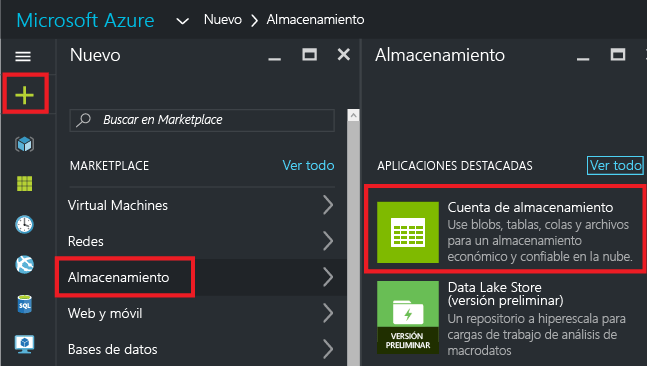
2. Cree una cuenta de almacenamiento con el nombre **storage**, sus iniciales y la fecha. El nombre de la cuenta de almacenamiento debe ser único en Azure. Si el nombre ya está en uso, aparecerá un mensaje de error indicándoselo. Pruebe con otro nombre. Para un grupo de recursos, cree un nuevo grupo de recursos y asígnele el nombre **ExportGroup**. Puede usar los valores predeterminados para los demás campos. Seleccione **Crear**.
   
      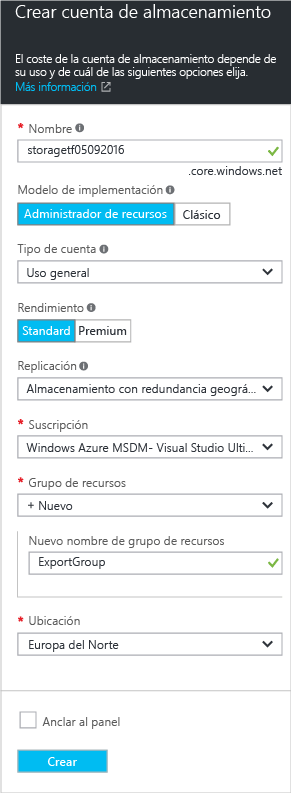

La implementación puede tardar un momento. Una vez finalizada la implementación, la suscripción contiene la cuenta de almacenamiento.

## <a name="view-a-template-from-deployment-history"></a>Visualización de una plantilla desde el historial de implementación
1. Vaya a la hoja del grupo de recursos que ha creado. Observe que la hoja muestra el resultado de la última implementación. Seleccione este vínculo.
   
      
2. Se ve un historial de implementaciones para el grupo. En su caso, es probable que la hoja solo muestre una implementación. Selecciónela.
   
     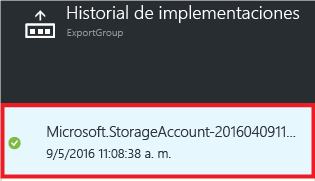
3. La hoja muestra un resumen de la implementación. El resumen incluye el estado de la implementación y sus operaciones, además de los valores que proporcionó para los parámetros. Para ver la plantilla que se usó para la implementación, seleccione **Ver plantilla**.
   
     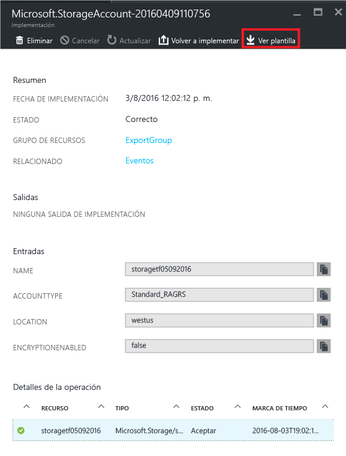
4. Resource Manager recupera los seis archivos siguientes:
   
   1. **Plantilla** : la plantilla que define la infraestructura de la solución. Cuando creó la cuenta de almacenamiento por medio del portal, Resource Manager usó una plantilla para implementarla y la guardó para futura referencia.
   2. **Parámetros** : un archivo de parámetros que puede usar para pasar valores durante la implementación. Contiene los valores que proporcionó durante la primera implementación, pero puede cambiar cualquiera de ellos al volver a implementar la plantilla.
   3. **CLI** : un archivo de script de la interfaz de la línea de comandos (CLI) de Azure que puede usar para implementar la plantilla.
   4. **PowerShell** : un archivo de script de Azure PowerShell que puede usar para implementar la plantilla.
   5. **.NET** : una clase .NET que puede utilizar para implementar la plantilla.
   6. **Ruby** : una clase Ruby que puede utilizar para implementar la plantilla.
      
      Los archivos están disponibles mediante vínculos en la hoja. De forma predeterminada, la hoja muestra la plantilla.
      
       
      
      Preste especial atención a la plantilla. Su plantilla debería parecerse a esta:
      
        {
      
          "$schema": "https://schema.management.azure.com/schemas/2015-01-01/deploymentTemplate.json#",
          "contentVersion": "1.0.0.0",
          "parameters": {
            "name": {
              "type": "String"
            },
            "accountType": {
              "type": "String"
            },
            "location": {
              "type": "String"
            },
            "encryptionEnabled": {
              "defaultValue": false,
              "type": "Bool"
            }
          },
          "resources": [
            {
              "type": "Microsoft.Storage/storageAccounts",
              "sku": {
                "name": "[parameters('accountType')]"
              },
              "kind": "Storage",
              "name": "[parameters('name')]",
              "apiVersion": "2016-01-01",
              "location": "[parameters('location')]",
              "properties": {
                "encryption": {
                  "services": {
                    "blob": {
                      "enabled": "[parameters('encryptionEnabled')]"
                    }
                  },
                  "keySource": "Microsoft.Storage"
                }
              }
            }
          ]
        }

Esta plantilla es la que se usó para crear la cuenta de almacenamiento. Observe que contiene parámetros que le permiten implementar distintos tipos de cuentas de almacenamiento. Para aprender más sobre la estructura de una plantilla, consulte [Creación de plantillas de Azure Resource Manager](resource-group-authoring-templates.md). Para ver la lista completa de funciones que puede usar en una plantilla, consulte [Funciones de plantilla de Azure Resource Manager](resource-group-template-functions.md).

## <a name="add-a-virtual-network"></a>Incorporación de una red virtual
La plantilla que descargó en la sección anterior representa la infraestructura para esa implementación original. Sin embargo, no reflejará ningún cambio que realice después de la implementación.
Para ilustrar este problema, vamos a modificar el grupo de recursos agregando una red virtual por medio del portal.

1. En la hoja del grupo de recursos, seleccione **Agregar**.
   
      
2. Seleccione **Red virtual** en los recursos disponibles.
   
      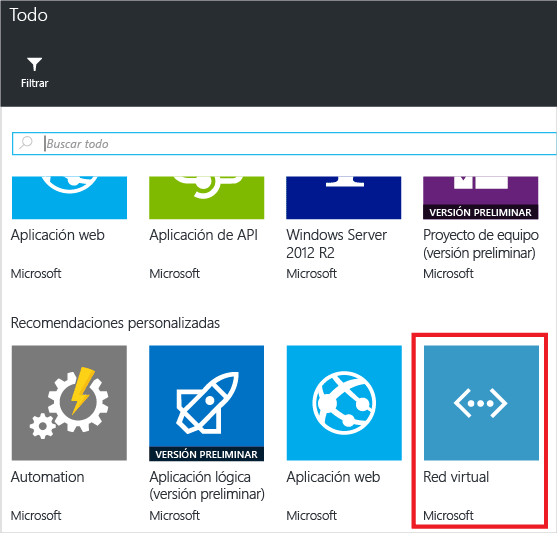
3. Asigne **VNET**como nombre de la red virtual y use los valores predeterminados para las demás propiedades. Seleccione **Crear**.
   
      
4. Una vez implementada la red virtual correctamente en el grupo de recursos, vuelva a consultar el historial de implementación. Ahora se ven dos implementaciones. Si no ve la segunda, puede que deba cerrar la hoja del grupo de recursos y abrirla de nuevo. Seleccione la más reciente.
   
      
5. Vea la plantilla para esa implementación. Observe que define únicamente la red virtual. No incluye la cuenta de almacenamiento que implementó anteriormente. Ya no tiene una plantilla que representa todos los recursos del grupo de recursos.

## <a name="export-the-template-from-resource-group"></a>Exportación de la plantilla desde el grupo de recursos
Para obtener el estado actual de su grupo de recursos, exporte una plantilla que muestre una instantánea del grupo de recursos.  

> [!NOTE]
> No se puede exportar una plantilla a un grupo de recursos que tenga más de doscientos recursos.
> 
> 

1. Para ver la plantilla de un grupo de recursos, seleccione **Script de automatización**.
   
      
   
     No todos los tipos de recursos admiten la función de exportación de plantilla. Si el grupo de recursos solo contiene la cuenta de almacenamiento y la red virtual mostradas en este artículo, no verá ningún error. Sin embargo, si ha creado otros tipos de recursos, verá un error que indica que hay un problema con la exportación. Puede aprender más sobre cómo resolver estos problemas en la sección [Solución de problemas de exportación](#fix-export-issues) .
2. Se vuelven a ver los seis archivos que puede usar para volver a implementar la solución, pero esta vez la plantilla es algo diferente. Esta plantilla solo contiene dos parámetros (uno para el nombre de la cuenta de almacenamiento y otro para el nombre de la red virtual).
   
        "parameters": {
          "virtualNetworks_VNET_name": {
            "defaultValue": "VNET",
            "type": "String"
          },
          "storageAccounts_storagetf05092016_name": {
            "defaultValue": "storagetf05092016",
            "type": "String"
          }
        },
   
     Resource Manager no recuperó las plantillas usadas durante la implementación. En su lugar, generó una nueva plantilla basada en la configuración actual de los recursos. Por ejemplo, la plantilla establece los valores de ubicación de la cuenta de almacenamiento y replicación en:
   
        "location": "northeurope",
        "tags": {},
        "properties": {
            "accountType": "Standard_RAGRS"
        },
3. Tiene dos opciones para continuar trabajando con esta plantilla. Puede descargar la plantilla y trabajar en ella localmente con un editor de JSON. O bien, puede guardar la plantilla en la biblioteca y trabajar en ella a través del portal.
   
     Si está familiarizado con el uso de un editor de JSON como [VS Code](resource-manager-vs-code.md) o [Visual Studio](vs-azure-tools-resource-groups-deployment-projects-create-deploy.md), es posible que prefiera descargar la plantilla localmente y usar ese editor. Si no lo está, es preferible editar la plantilla a través del portal. En el resto de este tema se supone que ha guardado la plantilla en la biblioteca en el portal. No obstante, tendrá que realizar los mismos cambios de sintaxis en la plantilla tanto si trabaja localmente con un editor de JSON o a través del portal.
   
     Para trabajar de forma local, seleccione **Descargar**.
   
      
   
     Para trabajar a través del portal, seleccione **Agregar a la biblioteca**.
   
      
   
     Al agregar una plantilla a la biblioteca, asigne a la plantilla un nombre y una descripción. Después, seleccione **Guardar**.
   
     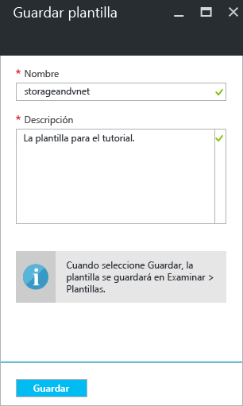
4. Para ver una plantilla guardada en la biblioteca, seleccione **Más servicios**, escriba **Plantillas** para filtrar los resultados y seleccione **Plantillas**.
   
      
5. Seleccione la plantilla con el nombre que se guardó.
   
      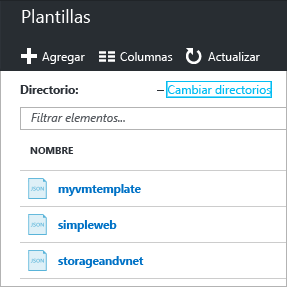

## <a name="customize-the-template"></a>Personalización de la plantilla
La plantilla exportada funciona bien si desea crear la misma cuenta de almacenamiento y red virtual para cada implementación. No obstante, Resource Manager proporciona opciones para que pueda implementar plantillas con mucha más flexibilidad. Por ejemplo, durante la implementación, puede especificar el tipo de cuenta de almacenamiento que desea crear o los valores que prefiere para el prefijo de la dirección de red virtual y de la subred.

En esta sección, agregará parámetros a la plantilla exportada para poder reutilizarla en la implementación de estos recursos en otros entornos. También agregará algunas características a la plantilla para reducir la probabilidad de que se produzca un error al implementarla. Ya no tendrá que adivinar un nombre único para la cuenta de almacenamiento. En su lugar, la plantilla lo crea. Limitará los valores que se pueden especificar para el tipo de cuenta de almacenamiento solamente a opciones válidas.

1. Seleccione **Editar** para personalizar la plantilla.
   
     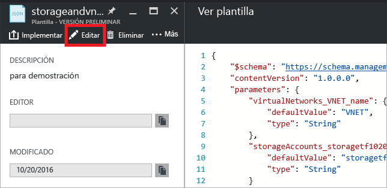
2. Seleccione la plantilla.
   
     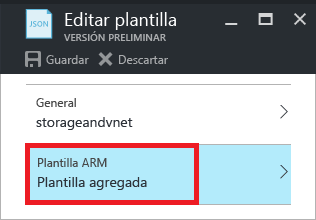
3. Para poder pasar los valores que desee especificar durante la implementación, reemplace la sección **parámetros** por las nuevas definiciones de parámetro. Observe los valores de **allowedValues** para **storageAccount_accountType**. Si proporciona accidentalmente un valor no válido, se reconoce ese error antes de que se inicie la implementación. Además, observe que solo va a proporcionar un prefijo para el nombre de la cuenta de almacenamiento y que está limitado a 11 caracteres. Al limitarlo a 11 caracteres, se asegura de que el nombre completo no supere el número máximo de caracteres para una cuenta de almacenamiento. El prefijo permite aplicar una convención de nomenclatura a las cuentas de almacenamiento. Verá cómo crear un nombre único en el paso siguiente.
   
        "parameters": {
          "storageAccount_prefix": {
            "type": "string",
            "maxLength": 11
          },
          "storageAccount_accountType": {
            "defaultValue": "Standard_RAGRS",
            "type": "string",
            "allowedValues": [
              "Standard_LRS",
              "Standard_ZRS",
              "Standard_GRS",
              "Standard_RAGRS",
              "Premium_LRS"
            ]
          },
          "virtualNetwork_name": {
            "type": "string"
          },
          "addressPrefix": {
            "defaultValue": "10.0.0.0/16",
            "type": "string"
          },
          "subnetName": {
            "defaultValue": "subnet-1",
            "type": "string"
          },
          "subnetAddressPrefix": {
            "defaultValue": "10.0.0.0/24",
            "type": "string"
          }
        },
4. La sección **variables** de la plantilla está vacía actualmente. En la sección **variables** puede crear valores que simplifican la sintaxis para el resto de la plantilla. Reemplace esta sección con una nueva definición de variable. La variable **storageAccount_name** concatena el prefijo del parámetro con una cadena única que se genera basándose en el identificador del grupo de recursos. Ya no tiene que adivinar un nombre único al proporcionar un valor de parámetro.
   
        "variables": {
          "storageAccount_name": "[concat(parameters('storageAccount_prefix'), uniqueString(resourceGroup().id))]"
        },
5. Para usar los parámetros y la variable en las definiciones de recursos, reemplace la sección **recursos** por las nuevas definiciones de recursos. Observe que se ha cambiado muy poco en las definiciones de recursos, aparte del valor que se asigna a la propiedad de recurso. Las propiedades son iguales que las de la plantilla exportada. Simplemente va a asignar propiedades a los valores de parámetro, en lugar de valores codificados de forma rígida. La ubicación de los recursos se establece en la misma que la del grupo de recursos por medio de la expresión **resourceGroup().location** . Se hace referencia a la variable que creó para el nombre de la cuenta de almacenamiento mediante la expresión **variables** .
   
        "resources": [
          {
            "type": "Microsoft.Network/virtualNetworks",
            "name": "[parameters('virtualNetwork_name')]",
            "apiVersion": "2015-06-15",
            "location": "[resourceGroup().location]",
            "properties": {
              "addressSpace": {
                "addressPrefixes": [
                  "[parameters('addressPrefix')]"
                ]
              },
              "subnets": [
                {
                  "name": "[parameters('subnetName')]",
                  "properties": {
                    "addressPrefix": "[parameters('subnetAddressPrefix')]"
                  }
                }
              ]
            },
            "dependsOn": []
          },
          {
            "type": "Microsoft.Storage/storageAccounts",
            "name": "[variables('storageAccount_name')]",
            "apiVersion": "2015-06-15",
            "location": "[resourceGroup().location]",
            "tags": {},
            "properties": {
                "accountType": "[parameters('storageAccount_accountType')]"
            },
            "dependsOn": []
          }
        ]
6. Seleccione **Aceptar** cuando haya terminado la edición de la plantilla.
7. Seleccione **Guardar** para guardar los cambios en la plantilla.
   
     
8. Para implementar la plantilla actualizada, seleccione **Implementar**.
   
     
9. Proporcione valores de parámetro y seleccione un nuevo grupo de recursos en el que implementar los recursos.

## <a name="update-the-downloaded-parameters-file"></a>Actualización del archivo de parámetros descargado
Si está trabajando con los archivos descargados (en lugar de con la biblioteca del portal), deberá actualizar el archivo de parámetros descargado. El archivo de parámetros descargado ya no coincide con los parámetros de su plantilla. No es necesario utilizar un archivo de parámetros, aunque puede simplificar el proceso al volver a implementar un entorno. Use los valores predeterminados definidos en la plantilla para muchos de los parámetros, por lo que el archivo de parámetros solo necesita dos valores.

Reemplace el contenido del archivo parameters.json por:

```
{
  "$schema": "https://schema.management.azure.com/schemas/2015-01-01/deploymentParameters.json#",
  "contentVersion": "1.0.0.0",
  "parameters": {
    "storageAccount_prefix": {
      "value": "storage"
    },
    "virtualNetwork_name": {
      "value": "VNET"
    }
  }
}
```

El archivo de parámetros actualizado solamente proporciona valores para los parámetros que carecen de valor predeterminado. Puede proporcionar valores para los demás parámetros cuando desee un valor diferente al predeterminado.

## <a name="fix-export-issues"></a>Solución de problemas de exportación
No todos los tipos de recursos admiten la función de exportación de plantilla. Específicamente, Resource Manager no exporta algunos tipos de recursos para evitar que se exponga información confidencial. Por ejemplo, si tiene una cadena de conexión en la configuración del sitio, probablemente no querrá que se muestre explícitamente en una plantilla exportada. Puede evitar este problema si agrega manualmente los recursos que faltan a la plantilla.

> [!NOTE]
> Solo se encuentran problemas de exportación si se exporta desde un grupo de recursos en lugar de desde el historial de implementación. Si su última implementación representa con precisión el estado actual del grupo de recursos, debe exportar la plantilla desde el historial de implementación en lugar de desde el grupo de recursos. Exporte solo desde un grupo de recursos si ha realizado cambios en el grupo de recursos que no están definidos en una única plantilla.
> 
> 

Por ejemplo, si exporta una plantilla para un grupo de recursos que contiene una aplicación web, una base de datos SQL y una cadena de conexión en la configuración del sitio, verá el mensaje siguiente:

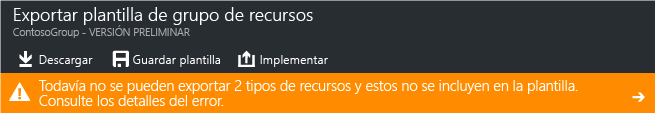

Al seleccionar el mensaje, se muestra exactamente qué tipos de recursos no se han exportado. 

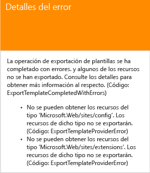

Este tema muestra las correcciones más comunes.

### <a name="connection-string"></a>Cadena de conexión
En el recurso de sitios web, agregue una definición para la cadena de conexión a la base de datos:

```
{
  "type": "Microsoft.Web/sites",
  ...
  "resources": [
    {
      "apiVersion": "2015-08-01",
      "type": "config",
      "name": "connectionstrings",
      "dependsOn": [
          "[concat('Microsoft.Web/Sites/', parameters('<site-name>'))]"
      ],
      "properties": {
          "DefaultConnection": {
            "value": "[concat('Data Source=tcp:', reference(concat('Microsoft.Sql/servers/', parameters('<database-server-name>'))).fullyQualifiedDomainName, ',1433;Initial Catalog=', parameters('<database-name>'), ';User Id=', parameters('<admin-login>'), '@', parameters('<database-server-name>'), ';Password=', parameters('<admin-password>'), ';')]",
              "type": "SQLServer"
          }
      }
    }
  ]
}
```    

### <a name="web-site-extension"></a>Extensión de sitio web
En el recurso de sitio web, agregue una definición para el código que se instalará:

```
{
  "type": "Microsoft.Web/sites",
  ...
  "resources": [
    {
      "name": "MSDeploy",
      "type": "extensions",
      "location": "[resourceGroup().location]",
      "apiVersion": "2015-08-01",
      "dependsOn": [
        "[concat('Microsoft.Web/sites/', parameters('<site-name>'))]"
      ],
      "properties": {
        "packageUri": "[concat(parameters('<artifacts-location>'), '/', parameters('<package-folder>'), '/', parameters('<package-file-name>'), parameters('<sas-token>'))]",
        "dbType": "None",
        "connectionString": "",
        "setParameters": {
          "IIS Web Application Name": "[parameters('<site-name>')]"
        }
      }
    }
  ]
}
```

### <a name="virtual-machine-extension"></a>Extensión de máquina virtual
Para ver ejemplos de extensiones de máquina virtual, consulte [Ejemplos de configuración de la extensión de máquina virtual de Windows de Azure](../virtual-machines/virtual-machines-windows-extensions-configuration-samples.md?toc=%2fazure%2fvirtual-machines%2fwindows%2ftoc.json).

### <a name="virtual-network-gateway"></a>Puerta de enlace de red virtual
Agregue un tipo de recurso de puerta de enlace de red virtual.

```
{
  "type": "Microsoft.Network/virtualNetworkGateways",
  "name": "[parameters('<gateway-name>')]",
  "apiVersion": "2015-06-15",
  "location": "[resourceGroup().location]",
  "properties": {
    "gatewayType": "[parameters('<gateway-type>')]",
    "ipConfigurations": [
      {
        "name": "default",
        "properties": {
          "privateIPAllocationMethod": "Dynamic",
          "subnet": {
            "id": "[resourceId('Microsoft.Network/virtualNetworks/subnets', parameters('<vnet-name>'), parameters('<new-subnet-name>'))]"
          },
          "publicIpAddress": {
            "id": "[resourceId('Microsoft.Network/publicIPAddresses', parameters('<new-public-ip-address-Name>'))]"
          }
        }
      }
    ],
    "enableBgp": false,
    "vpnType": "[parameters('<vpn-type>')]"
  },
  "dependsOn": [
    "Microsoft.Network/virtualNetworks/codegroup4/subnets/GatewaySubnet",
    "[concat('Microsoft.Network/publicIPAddresses/', parameters('<new-public-ip-address-Name>'))]"
  ]
},
```

### <a name="local-network-gateway"></a>Puerta de enlace de red local
Agregue un tipo de recurso de puerta de enlace de red local.

```
{
    "type": "Microsoft.Network/localNetworkGateways",
    "name": "[parameters('<local-network-gateway-name>')]",
    "apiVersion": "2015-06-15",
    "location": "[resourceGroup().location]",
    "properties": {
      "localNetworkAddressSpace": {
        "addressPrefixes": "[parameters('<address-prefixes>')]"
      }
    }
}
```

### <a name="connection"></a>Conexión
Agregue un tipo de recurso de conexión.

```
{
    "apiVersion": "2015-06-15",
    "name": "[parameters('<connection-name>')]",
    "type": "Microsoft.Network/connections",
    "location": "[resourceGroup().location]",
    "properties": {
        "virtualNetworkGateway1": {
        "id": "[resourceId('Microsoft.Network/virtualNetworkGateways', parameters('<gateway-name>'))]"
      },
      "localNetworkGateway2": {
        "id": "[resourceId('Microsoft.Network/localNetworkGateways', parameters('<local-gateway-name>'))]"
      },
      "connectionType": "IPsec",
      "routingWeight": 10,
      "sharedKey": "[parameters('<shared-key>')]"
    }
},
```


## <a name="next-steps"></a>Pasos siguientes
¡Enhorabuena! Ha aprendido a exportar una plantilla desde recursos creados en el portal.

* Puede implementar una plantilla mediante [PowerShell](resource-group-template-deploy.md), [CLI de Azure](resource-group-template-deploy-cli.md), o [API de REST](resource-group-template-deploy-rest.md).
* Para ver cómo exportar una plantilla mediante PowerShell, consulte [Uso de Azure PowerShell con Azure Resource Manager](powershell-azure-resource-manager.md).
* Para ver cómo exportar una plantilla mediante la CLI de Azure, consulte [Uso de la CLI de Azure para Mac, Linux y Windows con Azure Resource Manager](xplat-cli-azure-resource-manager.md).


<!--HONumber=Nov16_HO3-->


