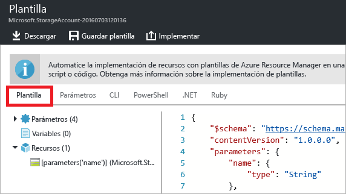
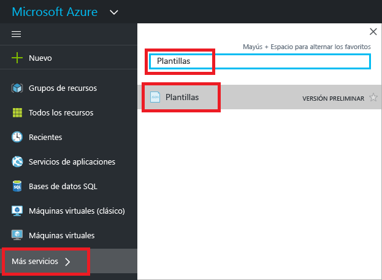
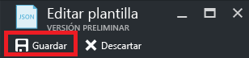

# <a name="export-an-azure-resource-manager-template-from-existing-resources"></a>Exportación de plantillas de Azure Resource Manager desde recursos existentes
En este artículo, aprenderá a exportar una plantilla de Resource Manager desde los recursos existentes en la suscripción. Puede usar la plantilla generada para conocer mejor de la sintaxis de la plantilla.

Hay dos maneras de exportar una plantilla:

* Se puede exportar la **plantilla real que se usó para una implementación**. La plantilla exportada incluye todos los parámetros y variables exactamente como aparecían en la plantilla original. Este enfoque es útil cuando se implementan recursos a través del portal y se desea ver la plantilla para crearlos. Esta plantilla es fácil de usar. 
* Puede exportar una **plantilla generada que representa el estado actual del grupo de recursos**. La plantilla exportada no se basa en ninguna plantilla que usara para la implementación. Al contrario, crea una plantilla que es una instantánea del grupo de recursos. La plantilla exportada tiene muchos valores codificados de forma rígida y es probable que no tenga tantos parámetros como normalmente se definirían. Este enfoque resulta útil si el grupo de recursos se ha modificado después de la implementación. Para poder usar esta plantilla, normalmente es preciso realizar ciertas modificaciones en ella.

En este tema se muestran ambos métodos a través del portal.

## <a name="deploy-resources"></a>Implementación de recursos
Para empezar, vamos a implementar en Azure recursos que se pueden utilizar para exportarlos como una plantilla. Si en la suscripción ya tiene un grupo de recursos que desee exportar a una plantilla, puede omitir esta sección. En el resto de este artículo se da por supuesto que se ha implementado la aplicación web y la solución de base de datos SQL que se muestran en esta sección. Si utiliza otra solución, puede que el conjunto del proceso sea un poco diferente, pero los pasos para exportar una plantilla son los mismos. 

1. En [Azure Portal](https://portal.azure.com), seleccione **Nuevo**.
   
      
2. Busque **Aplicación web + SQL** y selecciónelo.
   
      

3. Seleccione **Crear**.

      

4. Proporcione los valores requeridos para la aplicación web y la base de datos SQL. Seleccione **Crear**.

      

La implementación puede tardar un momento. Una vez que finaliza la implementación, la suscripción contiene la solución.

## <a name="view-template-from-deployment-history"></a>Visualización de una plantilla desde el historial de implementaciones
1. Vaya a la hoja del grupo de recursos que ha creado. Observe que la hoja muestra el resultado de la última implementación. Seleccione este vínculo.
   
      
2. Se ve un historial de implementaciones para el grupo. En su caso, es probable que la hoja solo muestre una implementación. Selecciónela.
   
     
3. La hoja muestra un resumen de la implementación. El resumen incluye el estado de la implementación y sus operaciones, además de los valores que proporcionó para los parámetros. Para ver la plantilla que se usó para la implementación, seleccione **Ver plantilla**.
   
     
4. Resource Manager recupera los siete archivos siguientes:
   
   1. **Plantilla** : la plantilla que define la infraestructura de la solución. Cuando creó la cuenta de almacenamiento por medio del portal, Resource Manager usó una plantilla para implementarla y la guardó para futura referencia.
   2. **Parámetros**: un archivo de parámetros que puede usar para pasar valores durante la implementación. Contiene los valores que proporcionó en la primera implementación. Todos estos valores se pueden cambiar al volver a implementar la plantilla.
   3. **CLI**: un archivo de script de la interfaz de la línea de comandos (CLI) de Azure que puede usar para implementar la plantilla.
   3. **CLI 2.0**: archivo de script de la interfaz de línea de comandos (CLI) de Azure que puede usar para implementar la plantilla.
   4. **PowerShell** : un archivo de script de Azure PowerShell que puede usar para implementar la plantilla.
   5. **.NET** : una clase .NET que puede utilizar para implementar la plantilla.
   6. **Ruby** : una clase Ruby que puede utilizar para implementar la plantilla.
      
      Los archivos están disponibles mediante vínculos en la hoja. De forma predeterminada, la hoja muestra la plantilla.
      
       
      
Esta plantilla es la que se usó para crear la aplicación web y la base de datos SQL. Observe que contiene parámetros que le permiten proporcionar distintos valores en la implementación. Para aprender más sobre la estructura de una plantilla, consulte [Creación de plantillas de Azure Resource Manager](resource-group-authoring-templates.md).

## <a name="export-the-template-from-resource-group"></a>Exportación de la plantilla desde el grupo de recursos
Si ha cambiado los recursos o ha agregado recursos en varias implementaciones manualmente, la recuperación de una plantilla desde el historial de implementaciones no refleja el estado actual del grupo de recursos. En esta sección se muestra cómo exportar una plantilla que refleja el estado actual del grupo de recursos. 

> [!NOTE]
> No se puede exportar una plantilla a un grupo de recursos que tenga más de doscientos recursos.
> 
> 

1. Para ver la plantilla de un grupo de recursos, seleccione **Script de automatización**.
   
      
   
     Resource Manager evalúa los recursos del grupo de recursos y genera una plantilla para ellos. No todos los tipos de recursos admiten la función de exportación de plantilla. Puede ver un error que indica que hay un problema con la exportación. Puede aprender más sobre cómo resolver estos problemas en la sección [Solución de problemas de exportación](#fix-export-issues) .
2. De nuevo ve los seis archivos que puede usar para volver a implementar la solución. Sin embargo, esta vez la plantilla es algo diferente. Observe que la plantilla generada contiene menos parámetros que la plantilla de la sección anterior. Además, muchos de los valores (como los de ubicación y SKU) se codifican de forma rígida en esta plantilla, en lugar de aceptar un valor de parámetro. Antes de volver a usar esta plantilla, puede editarla para hacer un mejor uso de los parámetros. 
   
3. Tiene dos opciones para continuar trabajando con esta plantilla. Puede descargar la plantilla y trabajar en ella localmente con un editor de JSON. O bien, puede guardar la plantilla en la biblioteca y trabajar en ella a través del portal.
   
     Si está familiarizado con el uso de un editor de JSON como [VS Code](https://code.visualstudio.com/) o [Visual Studio](vs-azure-tools-resource-groups-deployment-projects-create-deploy.md), es posible que prefiera descargar la plantilla localmente y usar ese editor. Para trabajar de forma local, seleccione **Descargar**.
   
      
   
     Si no lo está, es preferible editar la plantilla a través del portal. En el resto de este tema se supone que ha guardado la plantilla en la biblioteca en el portal. No obstante, tendrá que realizar los mismos cambios de sintaxis en la plantilla tanto si trabaja localmente con un editor de JSON o a través del portal. Para trabajar a través del portal, seleccione **Agregar a la biblioteca**.
   
      
   
     Al agregar una plantilla a la biblioteca, asigne a la plantilla un nombre y una descripción. Después, seleccione **Guardar**.
   
     
4. Para ver una plantilla guardada en la biblioteca, seleccione **Más servicios**, escriba **Plantillas** para filtrar los resultados y seleccione **Plantillas**.
   
      
5. Seleccione la plantilla con el nombre que se guardó.
   
      

## <a name="customize-the-template"></a>Personalización de la plantilla
La plantilla exportada funciona bien si desea crear la misma aplicación web y base de datos cuenta SQL en todas las implementaciones. No obstante, Resource Manager proporciona opciones para que pueda implementar plantillas con mucha más flexibilidad. En este artículo se muestra cómo agregar parámetros para el nombre y la contraseña del administrador de base de datos. Este mismo método se puede usar para dar más flexibilidad a otros valores de la plantilla.

1. Seleccione **Editar** para personalizar la plantilla.
   
     
2. Seleccione la plantilla.
   
     
3. Para poder pasar los valores que desea especificar durante la implementación, agregue los dos parámetros siguientes a la sección **parameters** de la plantilla:

   ```json
   "administratorLogin": {
       "type": "String"
   },
   "administratorLoginPassword": {
       "type": "SecureString"
   },
   ```

4. Para usar los nuevos parámetros, reemplace la definición del servidor de SQL Server en la sección **resources**. Tenga en cuenta que **administratorLogin** y **administratorLoginPassword** ahora usan los valores de los parámetros.

   ```json
   {
       "comments": "Generalized from resource: '/subscriptions/{subscription-id}/resourceGroups/exportsite/providers/Microsoft.Sql/servers/tfserverexport'.",
       "type": "Microsoft.Sql/servers",
       "kind": "v12.0",
       "name": "[parameters('servers_tfserverexport_name')]",
       "apiVersion": "2014-04-01-preview",
       "location": "South Central US",
       "scale": null,
       "properties": {
           "administratorLogin": "[parameters('administratorLogin')]",
           "administratorLoginPassword": "[parameters('administratorLoginPassword')]",
           "version": "12.0"
       },
       "dependsOn": []
   },
   ```

6. Seleccione **Aceptar** cuando haya terminado la edición de la plantilla.
7. Seleccione **Guardar** para guardar los cambios en la plantilla.
   
     
8. Para volver a implementar la plantilla actualizada, seleccione **Implementar**.
   
     
9. Proporcione valores de parámetro y seleccione el grupo de recursos en el que se van a implementar los recursos.


## <a name="fix-export-issues"></a>Solución de problemas de exportación
No todos los tipos de recursos admiten la función de exportación de plantilla. Para evitar este problema, agregue manualmente los recursos que faltan a la plantilla. El mensaje de error incluye los tipos de recursos que no se puede exportar. Busque el tipo de recurso en [Referencia de plantilla](/azure/templates/). Por ejemplo, para agregar manualmente una puerta de enlace de red virtual, consulte [Microsoft.Network/virtualNetworkGateways template reference](/azure/templates/microsoft.network/virtualnetworkgateways) (Referencia de plantilla Microsoft.Network/virtualNetworkGateways).

> [!NOTE]
> Solo se encuentran problemas de exportación si se exporta desde un grupo de recursos en lugar de desde el historial de implementación. Si su última implementación representa con precisión el estado actual del grupo de recursos, debe exportar la plantilla desde el historial de implementación en lugar de desde el grupo de recursos. Exporte solo desde un grupo de recursos si ha realizado cambios en el grupo de recursos que no están definidos en una única plantilla.
> 
> 

## <a name="next-steps"></a>Pasos siguientes
Ha aprendido a exportar una plantilla desde recursos creados en el portal.

* Puede implementar una plantilla mediante [PowerShell](resource-group-template-deploy.md), [CLI de Azure](resource-group-template-deploy-cli.md), o [API de REST](resource-group-template-deploy-rest.md).
* Para ver cómo exportar una plantilla mediante PowerShell, consulte [Uso de Azure PowerShell con Azure Resource Manager](powershell-azure-resource-manager.md).
* Para ver cómo exportar una plantilla mediante la CLI de Azure, consulte [Uso de la CLI de Azure para Mac, Linux y Windows con Azure Resource Manager](xplat-cli-azure-resource-manager.md).

