# <a name="creating-and-deploying-azure-resource-groups-through-visual-studio"></a>Creación e implementación de grupos de recursos de Azure mediante Visual Studio
Con Visual Studio y [Azure SDK](https://azure.microsoft.com/downloads/), puede crear un proyecto que implementa su infraestructura y código en Azure. Por ejemplo, puede definir el host de web, el sitio web y la base de datos para una aplicación, e implementar esa infraestructura junto con el código. O bien, puede definir una máquina virtual, una red virtual y una cuenta de almacenamiento e implementar esa infraestructura junto con un script que se ejecuta en la máquina virtual. El proyecto de implementación del **grupo de recursos de Azure** permite implementar todos los recursos necesarios en una sola operación que se puede repetir. Para más información sobre la implementación y administración de recursos, consulte [Información general de Azure Resource Manager](resource-group-overview.md).

Los proyectos del grupo de recursos de Azure contienen plantillas JSON de Azure Resource Manager que definen los recursos que implementa en Azure. Para más información sobre los elementos de la plantilla del Administrador de recursos, consulte [Creación de plantillas del Administrador de recursos de Azure](resource-group-authoring-templates.md). Visual Studio permite modificar estas plantillas y proporciona herramientas que simplifican el trabajo con plantillas.

En este artículo se implementa una aplicación web y SQL Database. Sin embargo, los pasos son prácticamente los mismos para cualquier tipo de recurso. Puede implementar fácilmente una máquina virtual y sus recursos relacionados. Visual Studio proporciona muchas plantillas de inicio diferentes para la implementación de escenarios comunes.

Este artículo muestra Visual Studio 2017. Si usa Visual Studio 2015 Update 2 y Microsoft Azure SDK para .NET 2.9 o Visual Studio 2013 con Azure SDK 2.9, los procedimientos son prácticamente los mismos. Puede usar Azure SDK 2.6 o versiones posteriores; sin embargo, es posible que vea que la interfaz de usuario no coincida con la que se describe en este artículo. Le recomendamos encarecidamente que instale la versión más reciente de [Azure SDK](https://azure.microsoft.com/downloads/) antes de iniciar el procedimiento. 

## <a name="create-azure-resource-group-project"></a>Creación de un proyecto de grupo de recursos de Azure
En este procedimiento, va a crear un proyecto de grupo de recursos de Azure con la plantilla **Aplicación web + SQL** .

1. En Visual Studio, elija **Archivo**, **Nuevo proyecto** y **C#** o **Visual Basic** (el idioma que elija no tiene ningún efecto en las fases posteriores ya que estos proyectos incluyen solo contenido JSON y PowerShell). Luego, elija **Nube** y el proyecto **Grupo de recursos de Azure**.
   
    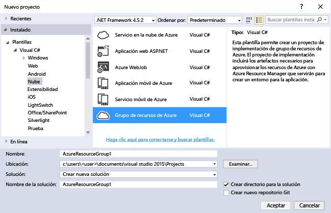
2. Elija la plantilla que desea implementar en el Administrador de recursos de Azure. Observe que hay muchas opciones diferentes basados en el tipo de proyecto que desee implementar. Para este artículo, elija la plantilla **Aplicación web + SQL**.
   
    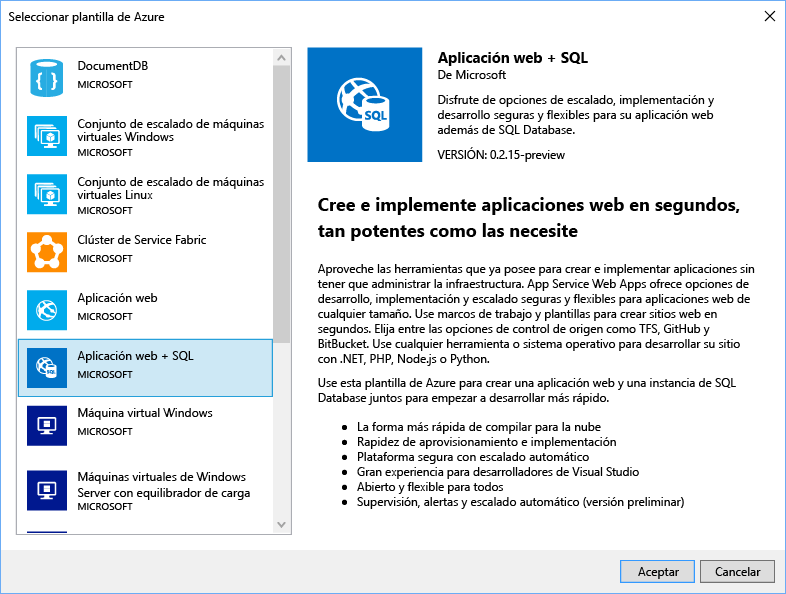
   
    La plantilla que elija es simplemente un punto de partida, puede agregar y quitar recursos para adaptarse a su escenario específico.
   
   > [!NOTE]
   > Visual Studio recupera una lista de las plantillas disponibles en línea. La lista puede cambiar.
   > 
   > 
   
    Visual Studio crea un proyecto de implementación de grupo de recursos de Azure para la aplicación web y Base de datos SQL.
3. Para ver lo que ha creado, examine el nodo del proyecto de implementación.
   
    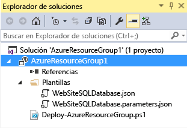
   
    Dado que elegimos la plantilla de aplicación web + SQL para este ejemplo, verá los archivos a continuación: 
   
   | Nombre de archivo | Description |
   | --- | --- |
   | Deploy-AzureResourceGroup.ps1 |Un script de PowerShell que invoca los comandos de PowerShell que se implementarán en Azure Resource Manager.<br />**Nota** Visual Studio utiliza este script de PowerShell para implementar su plantilla. Los cambios que realice a este script también afectan a la implementación en Visual Studio; por tanto, tenga cuidado. |
   | WebSiteSQLDatabase.json |La plantilla de Resource Manager que define la infraestructura que desea implementar en Azure, y los parámetros que puede proporcionar durante la implementación. También define las dependencias entre los recursos, de modo que Resource Manager implemente los recursos en el orden correcto. |
   | WebSiteSQLDatabase.parameters.json |Un archivo de parámetros que contiene valores necesarios para la plantilla. Transferirá los valores de los parámetros para personalizar cada implementación. |
   
    Todos los proyectos de implementación del grupo de recursos contienen estos archivos básicos. Otros proyectos pueden contener archivos adicionales para admitir otras funcionalidades.

## <a name="customize-the-resource-manager-template"></a>Personalización de la plantilla del Administrador de recursos
Puede personalizar un proyecto de implementación mediante la modificación de las plantillas JSON que describen los recursos que desea implementar. JSON significa JavaScript Object Notation y es un formato de datos serializados con el que resulta sencillo trabajar. Los archivos JSON usan un esquema al que se hace referencia en la parte superior de cada archivo. Si quiere comprender el esquema, puede descargarlo y analizarlo. El esquema define qué elementos son válidos, los tipos y los formatos de los campos, los valores posibles de los valores enumerados, etc. Para más información sobre los elementos de la plantilla del Administrador de recursos, consulte [Creación de plantillas del Administrador de recursos de Azure](resource-group-authoring-templates.md).

Para trabajar en la plantilla, abra **WebSiteSQLDatabase.json**.

El editor de Visual Studio proporciona herramientas para ayudarle con la edición de la plantilla de Resource Manager. La ventana **Esquema JSON** facilita la visualización de los elementos definidos en la plantilla.

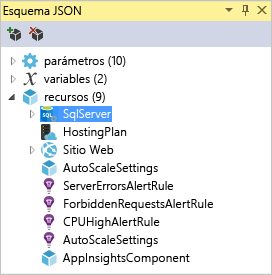

La selección de cualquiera de los elementos del esquema le llevará a la parte de la plantilla y resaltará el JSON correspondiente.

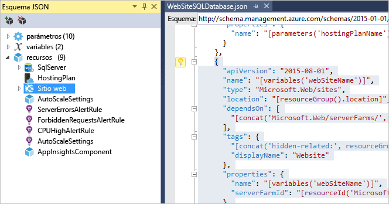

Para agregar un recurso, haga clic en el botón **Agregar recurso** de la parte superior de la ventana Esquema JSON, o haga clic con el botón derecho en **recursos** y seleccione **Agregar nuevo recurso**.


Para este tutorial, seleccione **Cuenta de almacenamiento** y asígnele un nombre. Proporcione un nombre que no tenga más de 11 caracteres y que solo contenga números y letras minúsculas.

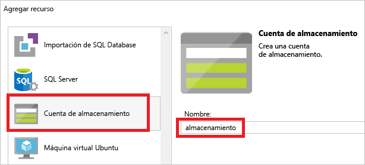

Tenga en cuenta que no solo se agregó el recurso, sino que también se agregó un parámetro para la cuenta de almacenamiento de tipo y una variable para el nombre de la cuenta de almacenamiento.

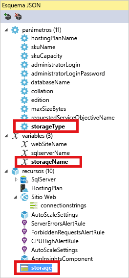

El parámetro **storageType** está predefinido con los tipos permitidos y un tipo predeterminado. Puede dejar estos valores o modificarlos para su escenario específico. Si no desea que cualquiera pueda implementar una cuenta de almacenamiento **Premium_LRS** a través de esta plantilla, quítela de los tipos permitidos. 

```json
"storageType": {
  "type": "string",
  "defaultValue": "Standard_LRS",
  "allowedValues": [
    "Standard_LRS",
    "Standard_ZRS",
    "Standard_GRS",
    "Standard_RAGRS"
  ]
}
```

Visual Studio también proporciona IntelliSense para ayudarle a entender qué propiedades están disponibles al editar la plantilla. Por ejemplo, para editar las propiedades de su plan de App Service, navegue al recurso **HostingPlan** y agregue un valor a las **propiedades**. Observe que IntelliSense muestra los valores disponibles y proporciona una descripción de cada valor.


Puede establecer **numberOfWorkers** en 1.

```json
"properties": {
  "name": "[parameters('hostingPlanName')]",
  "numberOfWorkers": 1
}
```

## <a name="deploy-the-resource-group-project-to-azure"></a>Implementación del proyecto de grupo de recursos en Azure
Ahora está preparado para implementar el proyecto. Cuando implementa un proyecto de grupo de recursos de Azure, lo implementa en un grupo de recursos de Azure. El grupo de recursos es una agrupación lógica de recursos que comparten un ciclo de vida común.

1. En el menú contextual del nodo del proyecto de implementación, elija **Implementar** > **Nueva**.
   
    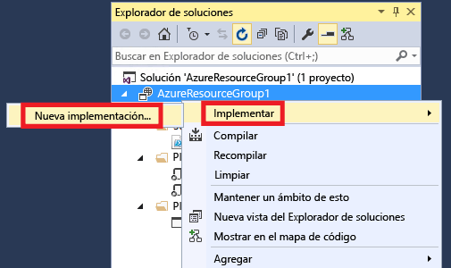
   
    Aparece el cuadro de diálogo **Implementar en grupo de recursos**.
   
    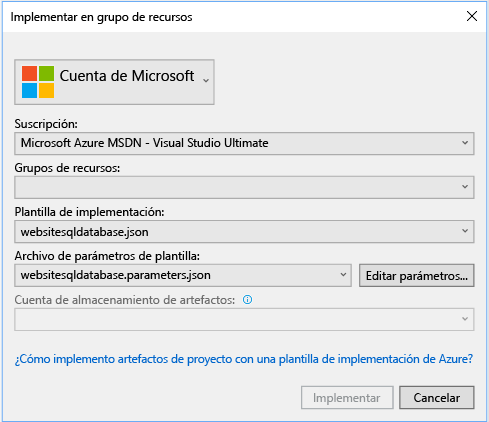
2. En el cuadro de lista desplegable **Grupo de recursos** , elija un grupo de recursos existente o cree uno nuevo. Para crear un grupo de recursos, abra el cuadro desplegable **Grupo de recursos** y elija **Crear nuevo**.
   
    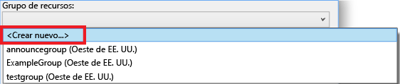
   
    Aparece el cuadro de diálogo **Crear grupo de recursos** . Asigne al grupo un nombre y una ubicación y seleccione el botón **Crear**.
   
    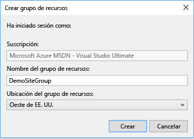
3. Edite los parámetros para la implementación seleccionando el botón **Editar parámetros**.
   
    
4. Proporcione valores para los parámetros vacíos y seleccione el botón **Guardar**. Los parámetros vacíos son **hostingPlanName**, **administratorLogin**, **administratorLoginPassword** y **databaseName**.
   
    **hostingPlanName** especifica el nombre del [plan de App Service](../app-service/azure-web-sites-web-hosting-plans-in-depth-overview.md) que se creará. 
   
    **administratorLogin** especifica el nombre de usuario del administrador de SQL Server. No utilice nombres de administrador comunes como **sa** o **admin**. 
   
    **administratorLoginPassword** especifica una contraseña para el administrador de SQL Server. La opción **Guardar contraseñas como texto sin formato en el archivo de parámetros** no es segura, por lo que no es aconsejable que la seleccione. Dado que la contraseña no se guardará como texto sin formato, deberá proporcionar esta contraseña nuevamente durante la implementación. 
   
    **databaseName** especifica un nombre para la base de datos que va a crear. 
   
    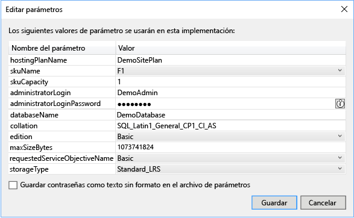
5. Elija el botón **Implementar** para implementar el proyecto en Azure. Se abre una consola de PowerShell fuera de la instancia de Visual Studio. Cuando se lo pidan, escriba la contraseña del administrador de SQL Server en la consola de PowerShell. **Puede que la consola de PowerShell esté oculta detrás de otros elementos o minimizada en la barra de tareas.** Busque esta consola y selecciónela para proporcionar la contraseña.
   
   > [!NOTE]
   > Visual Studio puede pedirle que instale los cmdlets de Azure PowerShell. Necesita los cmdlets de Azure PowerShell para implementar correctamente los grupos de recursos. Si se le solicita, instálelos.
   > 
   > 
6. La implementación puede tardar unos minutos. En la ventana **Salida** puede ver el estado de la implementación. Cuando se termina la implementación, el último mensaje indica una implementación satisfactoria de una forma parecida a esta:
   
        ... 
        18:00:58 - Successfully deployed template 'websitesqldatabase.json' to resource group 'DemoSiteGroup'.
7. En un explorador, abra [Azure Portal](https://portal.azure.com/) e inicie sesión en su cuenta. Para ver el grupo de recursos, seleccione **Grupos de recursos** y el grupo de recursos que implementó.
   
    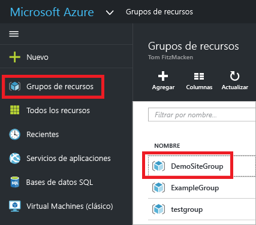
8. Verá todos los recursos implementados. Observe que el nombre de la cuenta de almacenamiento no es exactamente el que especificó al agregar ese recurso. La cuenta de almacenamiento debe ser única. La plantilla agregará automáticamente una cadena de caracteres al nombre único que proporcionó. 
   
    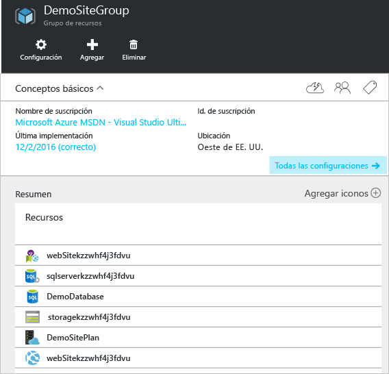
9. Si realiza cambios y desea volver a implementar el proyecto, elija el grupo de recursos existente en el menú contextual del proyecto de grupo de recursos de Azure. En el menú contextual, elija **Implementar**y después el grupo de recursos que acaba de implementar.
   
    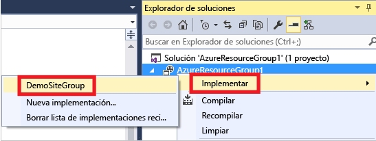

## <a name="deploy-code-with-your-infrastructure"></a>Implementación de código con la infraestructura
A estas alturas ha implementado la infraestructura de la aplicación, pero no hay ningún código real que se haya implementado con el proyecto. En este artículo se muestra cómo implementar una aplicación web y las tablas de SQL Database durante la implementación. Si está implementando una máquina virtual en lugar de una aplicación web, tiene que ejecutar algún código en el equipo como parte de la implementación. El proceso para implementar el código para una aplicación web o para configurar una máquina virtual es prácticamente el mismo.

1. Agregue un proyecto a la solución de Visual Studio. Haga clic con el botón derecho en la solución y seleccione **Agregar** > **Nuevo proyecto**.
   
    
2. Agregue una **aplicación web ASP.NET**. 
   
    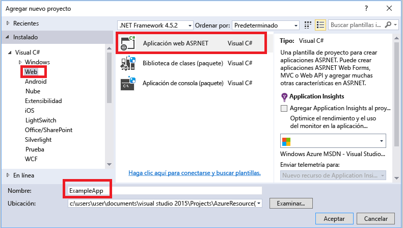
3. Seleccione **MVC**.
   
    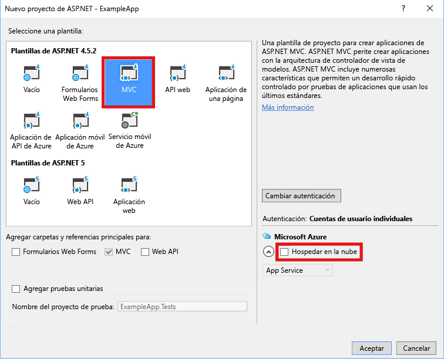
4. Después de que Visual Studio cree la aplicación web, podrá ver ambos proyectos en la solución.
   
    
5. Ahora, debe asegurarse de que el proyecto del grupo de recursos reconoce el nuevo proyecto. Vuelva al proyecto del grupo de recursos (AzureResourceGroup1). Haga clic con el botón derecho en **Referencias** y seleccione **Agregar referencia**.
   
    
6. Seleccione el proyecto de la aplicación web que ha creado.
   
    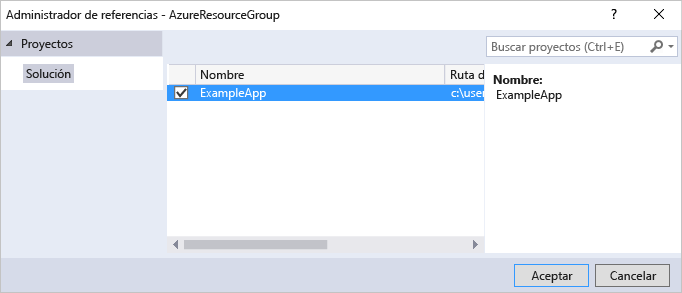
   
    Al agregar una referencia, se vincula el proyecto de aplicación web con el proyecto del grupo de recursos y automáticamente se establecen tres propiedades clave. Puede ver estas propiedades en la ventana **Propiedades** de la referencia.
   
      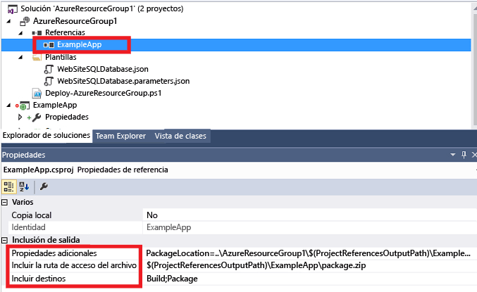
   
    Las propiedades son:
   
   * **Additional Properties** (Propiedades adicionales) contiene la ubicación de almacenamiento provisional del paquete de implementación web que se inserta en Azure Storage. Observe la carpeta (ExampleApp) y el archivo (package.zip). Debe conocer estos valores porque los proporcionará como parámetros al implementar la aplicación. 
   * **Include File Path** (Incluir ruta del archivo) contiene la ruta de acceso donde se crea el paquete. **Include Targets** (Incluir destinos) contiene el comando que la implementación ejecuta. 
   * El valor predeterminado **Build;Package** permite a la implementación generar y crear un paquete de implementación web (package.zip).  
     
     No se necesita un perfil de publicación ya que la implementación obtiene la información necesaria de las propiedades para crear el paquete.
7. Vuelva a WebSiteSQLDatabase.json y agregue un recurso a la plantilla.
   
    
8. En esta ocasión, seleccione **Web Deploy para Web Apps**. 
   
    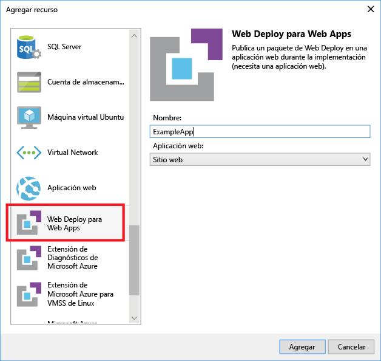
9. Vuelva a implementar el proyecto del grupo de recursos en el grupo de recursos. Esta vez, hay algunos parámetros nuevos. No es necesario especificar valores en **_artifactsLocation** o **_artifactsLocationSasToken**, ya que Visual Studio los genera automáticamente. Sin embargo, es preciso establecer los nombres del archivo y de la carpeta en la ruta de acceso que contiene el paquete de implementación (que se muestran como **ExampleAppPackageFolder** y **ExampleAppPackageFileName** en la imagen siguiente). Especifique los valores que ha visto anteriormente en las propiedades de referencia (**ExampleApp** y **package.zip**).
   
    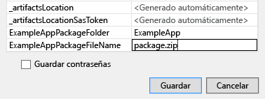
   
    En **Cuenta de almacenamiento de artefactos**, seleccione la cuenta implementada con este grupo de recursos.
10. Una vez finalizada la implementación, seleccione la aplicación web en el portal. Seleccione la dirección URL para navegar al sitio.
    
     
11. Observe que ha implementado correctamente la aplicación ASP.NET predeterminada.
    
     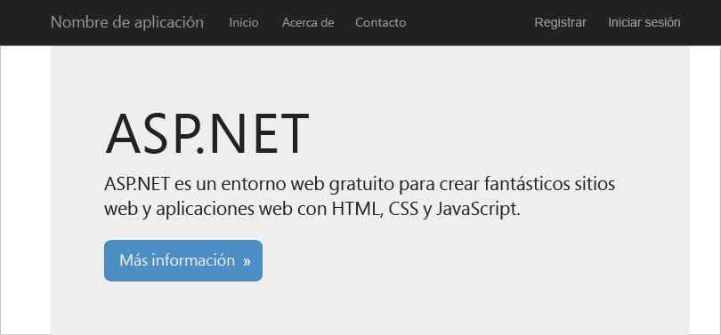

## <a name="next-steps"></a>Pasos siguientes
* Para más información sobre la administración de recursos en el portal, consulte [Administración de los recursos de Azure a través del portal](resource-group-portal.md).
* Para más información sobre las plantillas, consulte [Creación de plantillas de Azure Resource Manager](resource-group-authoring-templates.md).

