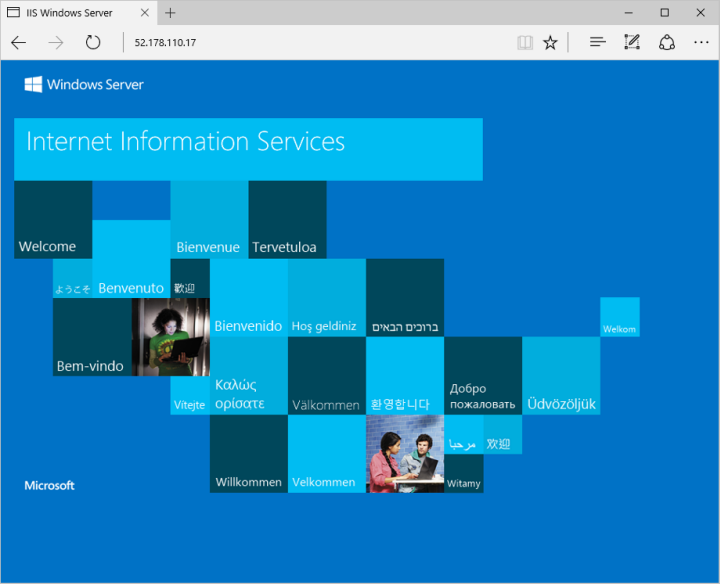

# <a name="create-a-windows-virtual-machine-on-azure-stack-using-azure-cli"></a>Creación de una máquina virtual Windows en Azure Stack con la CLI de Azure

La CLI de Azure se usa para crear y administrar recursos de Azure Stack desde la línea de comandos. En esta guía se detalla cómo usar la CLI de Azure para crear una máquina virtual Windows Server 2016 en Azure Stack. Después de crear la máquina virtual, se conectará con Escritorio remoto, instalará IIS y luego verá el sitio web predeterminado. 

## <a name="prerequisites"></a>Requisitos previos 

* Asegúrese de que el operador de Azure Stack haya agregado la imagen "Windows Server 2016" a Marketplace de Azure Stack.  

* Azure Stack requiere una versión específica de la CLI de Azure para crear y administrar los recursos. Si no tiene la CLI de Azure configurada para Azure Stack, siga los pasos que se indican para [instalarla y configurarla](azure-stack-connect-cli.md).

## <a name="create-a-resource-group"></a>Crear un grupo de recursos

Un grupo de recursos es un contenedor lógico en el que se implementan y se administran los recursos de Azure Stack. Desde el kit de desarrollo o el sistema integrado de Azure Stack, ejecute el comando [az group create](/cli/azure/group#create) para crear un grupo de recursos. Hemos asignado los valores para todas las variables en este documento, puede usarlas tal cual o asignar un valor diferente. En el ejemplo siguiente, se crea un grupo de recursos denominado myResourceGroup en la ubicación local.

```cli
az group create --name myResourceGroup --location local
```

## <a name="create-a-virtual-machine"></a>de una máquina virtual

Cree una máquina virtual con el comando [az vm create](/cli/azure/vm#create). En el ejemplo siguiente se crea una máquina virtual denominada myVM. En este ejemplo se usa Demouser como el nombre de usuario administrativo y Demouser@123 como la contraseña. Actualice estos valores a un valor apropiado para su entorno. Estos valores son necesarios al conectarse a la máquina virtual.

```cli
az vm create \
  --resource-group "myResourceGroup" \
  --name "myVM" \
  --image "Win2016Datacenter" \
  --admin-username "Demouser" \
  --admin-password "Demouser@123" \
  --use-unmanaged-disk \
  --location local
```

Una vez creada la máquina virtual, anote el parámetro *PublicIPAddress* que se genera, ya que lo usará para acceder a ella.
 
## <a name="open-port-80-for-web-traffic"></a>Apertura del puerto 80 para el tráfico web

De forma predeterminada, solo se permiten conexiones RDP con las máquinas virtuales Windows implementadas en Azure Stack. Si esta máquina virtual va a ser un servidor web, debe abrir el puerto 80 desde Internet. Use el comando [az vm open-port](/cli/azure/vm#open-port) para abrir el puerto deseado.

```cli
az vm open-port --port 80 --resource-group myResourceGroup --name myVM
```

## <a name="connect-to-the-virtual-machine"></a>Conexión a la máquina virtual

Ejecute el comando siguiente para crear una sesión del Escritorio remoto con la máquina virtual. Reemplace la dirección IP con la dirección IP pública de la máquina virtual. Cuando se le solicite, escriba las credenciales usadas al crear la máquina virtual.

```
mstsc /v <Public IP Address>
```

## <a name="install-iis-using-powershell"></a>Instalación de IIS mediante PowerShell

Ahora que ha iniciado sesión en la máquina virtual de Azure, puede usar una sola línea de PowerShell para instalar IIS y habilitar la regla de firewall local para permitir el tráfico web. Abra una ventana de PowerShell y ejecute el siguiente comando:

```powershell
Install-WindowsFeature -name Web-Server -IncludeManagementTools
```

## <a name="view-the-iis-welcome-page"></a>Página principal de IIS

Con IIS instalado y el puerto 80 abierto en la máquina virtual desde Internet, puede usar el explorador web que elija para ver la página principal de IIS. Asegúrese de utilizar la dirección IP pública que ha anotado antes para visitar la página predeterminada. 

 

## <a name="clean-up-resources"></a>Limpieza de recursos

Cuando ya no se necesiten, puede usar el comando [az group delete](/cli/azure/group#delete) para quitar el grupo de recursos, la máquina virtual y todos los recursos relacionados.

```cli
az group delete --name myResourceGroup
```

## <a name="next-steps"></a>Pasos siguientes

En esta guía rápida, ha implementado una máquina virtual Windows sencilla. Para aprender más sobre las máquina virtuales de Azure Stack, continúe con el artículo [Considerations for Virtual Machines in Azure Stack](azure-stack-vm-considerations.md) (Consideraciones sobre Virtual Machines en Azure Stack).
