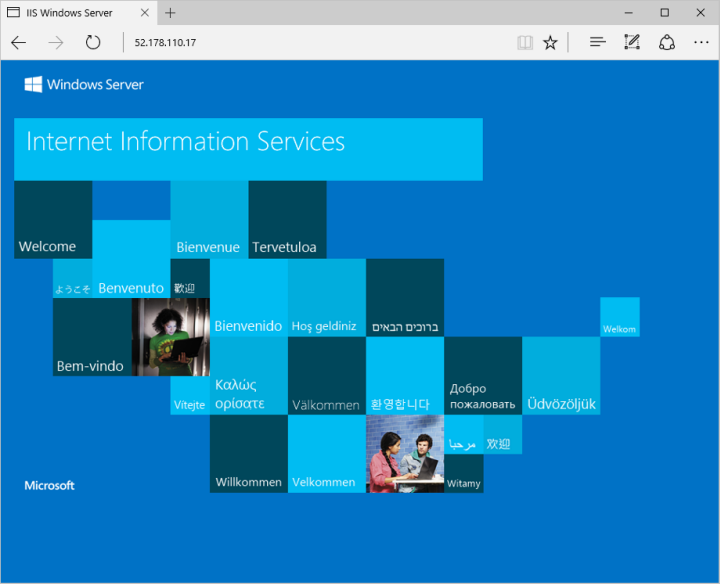

# <a name="create-a-windows-virtual-machine-by-using-powershell-in-azure-stack"></a>Creación de una máquina virtual Windows con PowerShell en Azure Stack

*Se aplica a: sistemas integrados de Azure Stack*

Esta guía detalla cómo usar PowerShell para crear y ejecutar una máquina virtual Windows Server 2016 en Azure Stack. Puede seguir los pasos descritos en este artículo ya sea desde Azure Stack Development Kit o desde un cliente externo basado en Windows, si se conecta a través de VPN. 

## <a name="prerequisites"></a>Requisitos previos 

* Asegúrese de que el operador de Azure Stack haya agregado la imagen "Windows Server 2016" a Marketplace de Azure Stack.  

* Azure Stack necesita una versión específica de Azure PowerShell para crear y administrar los recursos. Si no tiene PowerShell configurado para Azure Stack, siga estos pasos para [instalar](azure-stack-powershell-install.md) y [configurar](azure-stack-powershell-configure-user.md) PowerShell.    

## <a name="create-a-resource-group"></a>Crear un grupo de recursos

Un grupo de recursos es un contenedor lógico en el que se implementan y se administran los recursos de Azure Stack. Desde el kit de desarrollo o el sistema integrado de Azure Stack, ejecute el siguiente bloque de código para crear un grupo de recursos. Hemos asignado los valores para todas las variables en este documento, puede usarlas tal cual o asignar un valor diferente.  

```powershell
# Create variables to store the location and resource group names.
$location = "local"
$ResourceGroupName = "myResourceGroup"

New-AzureRmResourceGroup `
  -Name $ResourceGroupName `
  -Location $location
```

## <a name="create-storage-resources"></a>Creación de recursos de almacenamiento 

Cree una cuenta de almacenamiento y un contenedor de almacenamiento para almacenar la imagen de Windows Server 2016.

```powershell
# Create variables to store the storage account name and the storage account SKU information
$StorageAccountName = "mystorageaccount"
$SkuName = "Standard_LRS"

# Create a new storage account
$StorageAccount = New-AzureRMStorageAccount `
  -Location $location `
  -ResourceGroupName $ResourceGroupName `
  -Type $SkuName `
  -Name $StorageAccountName

Set-AzureRmCurrentStorageAccount `
  -StorageAccountName $storageAccountName `
  -ResourceGroupName $resourceGroupName

# Create a storage container to store the virtual machine image
$containerName = 'osdisks'
$container = New-AzureStorageContainer `
  -Name $containerName `
  -Permission Blob
```

## <a name="create-networking-resources"></a>Creación de los recursos de red principales

Cree una red virtual, una subred, una dirección IP pública. Estos recursos se utilizan para proporcionar conectividad de red a la máquina virtual.  

```powershell
# Create a subnet configuration
$subnetConfig = New-AzureRmVirtualNetworkSubnetConfig `
  -Name mySubnet `
  -AddressPrefix 192.168.1.0/24

# Create a virtual network
$vnet = New-AzureRmVirtualNetwork `
  -ResourceGroupName $ResourceGroupName `
  -Location $location `
  -Name MyVnet `
  -AddressPrefix 192.168.0.0/16 `
  -Subnet $subnetConfig

# Create a public IP address and specify a DNS name
$pip = New-AzureRmPublicIpAddress `
  -ResourceGroupName $ResourceGroupName `
  -Location $location `
  -AllocationMethod Static `
  -IdleTimeoutInMinutes 4 `
  -Name "mypublicdns$(Get-Random)"
```

### <a name="create-a-network-security-group-and-a-network-security-group-rule"></a>Creación de un grupo de seguridad de red y una regla de grupo de seguridad de red

El grupo de seguridad de red protege la máquina virtual con reglas de entrada y de salida. Permite crear una regla de entrada para el puerto 3389 para permitir las conexiones entrantes de Escritorio remoto y una regla de entrada para el puerto 80 que permita el tráfico web entrante.

```powershell
# Create an inbound network security group rule for port 3389
$nsgRuleRDP = New-AzureRmNetworkSecurityRuleConfig `
  -Name myNetworkSecurityGroupRuleRDP `
  -Protocol Tcp `
  -Direction Inbound `
  -Priority 1000 `
  -SourceAddressPrefix * `
  -SourcePortRange * `
  -DestinationAddressPrefix * `
  -DestinationPortRange 3389 `
  -Access Allow

# Create an inbound network security group rule for port 80
$nsgRuleWeb = New-AzureRmNetworkSecurityRuleConfig `
  -Name myNetworkSecurityGroupRuleWWW `
  -Protocol Tcp `
  -Direction Inbound `
  -Priority 1001 `
  -SourceAddressPrefix * `
  -SourcePortRange * `
  -DestinationAddressPrefix * `
  -DestinationPortRange 80 `
  -Access Allow

# Create a network security group
$nsg = New-AzureRmNetworkSecurityGroup `
  -ResourceGroupName $ResourceGroupName `
  -Location $location `
  -Name myNetworkSecurityGroup `
  -SecurityRules $nsgRuleRDP,$nsgRuleWeb 
```
 
### <a name="create-a-network-card-for-the-virtual-machine"></a>Creación de una tarjeta de red para la máquina virtual

Esta conecta la máquina virtual a una subred, un grupo de seguridad de red y una dirección IP pública.

```powershell
# Create a virtual network card and associate it with public IP address and NSG
$nic = New-AzureRmNetworkInterface `
  -Name myNic `
  -ResourceGroupName $ResourceGroupName `
  -Location $location `
  -SubnetId $vnet.Subnets[0].Id `
  -PublicIpAddressId $pip.Id `
  -NetworkSecurityGroupId $nsg.Id 
```

## <a name="create-a-virtual-machine"></a>de una máquina virtual

Cree una configuración de máquina virtual. La configuración incluye las opciones que se usan al implementar la máquina virtual como son la imagen de una máquina virtual, el tamaño y las credenciales.

```powershell
# Define a credential object to store the username and password for the virtual machine
$UserName='demouser'
$Password='Password@123'| ConvertTo-SecureString -Force -AsPlainText
$Credential=New-Object PSCredential($UserName,$Password)

# Create the virtual machine configuration object
$VmName = "VirtualMachinelatest"
$VmSize = "Standard_A1"
$VirtualMachine = New-AzureRmVMConfig `
  -VMName $VmName `
  -VMSize $VmSize 

$VirtualMachine = Set-AzureRmVMOperatingSystem `
  -VM $VirtualMachine `
  -Windows `
  -ComputerName "MainComputer" `
  -Credential $Credential 

$VirtualMachine = Set-AzureRmVMSourceImage `
  -VM $VirtualMachine `
  -PublisherName "MicrosoftWindowsServer" `
  -Offer "WindowsServer" `
  -Skus "2016-Datacenter" `
  -Version "latest"

$osDiskName = "OsDisk"
$osDiskUri = '{0}vhds/{1}-{2}.vhd' -f `
  $StorageAccount.PrimaryEndpoints.Blob.ToString(),`
  $vmName.ToLower(), `
  $osDiskName

# Sets the operating system disk properties on a virtual machine. 
$VirtualMachine = Set-AzureRmVMOSDisk `
  -VM $VirtualMachine `
  -Name $osDiskName `
  -VhdUri $OsDiskUri `
  -CreateOption FromImage | `
  Add-AzureRmVMNetworkInterface -Id $nic.Id 

#Create the virtual machine.
New-AzureRmVM `
  -ResourceGroupName $ResourceGroupName `
  -Location $location `
  -VM $VirtualMachine
```

## <a name="connect-to-the-virtual-machine"></a>Conexión a la máquina virtual

Para conectar de forma remota con la máquina virtual que creó en el paso anterior, necesita su dirección IP pública. Ejecute el comando siguiente para obtenerla: 

```powershell
Get-AzureRmPublicIpAddress `
  -ResourceGroupName $ResourceGroupName | Select IpAddress
```
 
Ejecute el comando siguiente para crear una sesión de Escritorio remoto con la máquina virtual. Reemplace la dirección IP con el valor de publicIPAddress de la máquina virtual. Cuando se le pida, especifique el nombre de usuario y la contraseña que proporcionó cuando creó la máquina virtual.

```powershell
mstsc /v <publicIpAddress>
```

## <a name="install-iis-via-powershell"></a>Instalación de IIS mediante PowerShell

Ahora que ha iniciado sesión en la máquina virtual de Azure, puede usar una sola línea de PowerShell para instalar IIS y habilitar la regla de firewall local para permitir el tráfico web. Abra una ventana de PowerShell y ejecute el siguiente comando:

```powershell
Install-WindowsFeature -name Web-Server -IncludeManagementTools
```

## <a name="view-the-iis-welcome-page"></a>Página principal de IIS

Con IIS instalado y el puerto 80 abierto en la máquina virtual desde Internet, puede usar el explorador web que elija para ver la página principal de IIS. Asegúrese de utilizar el valor de *publicIpAddress* que ha anotado antes para visitar la página predeterminada. 

 


## <a name="delete-the-virtual-machine"></a>Eliminación de la máquina virtual

Cuando ya no sea necesario, use el siguiente comando para quitar el grupo de recursos que contiene la máquina virtual y sus recursos relacionados:

```powershell
Remove-AzureRmResourceGroup `
  -Name $ResourceGroupName
```

## <a name="next-steps"></a>Pasos siguientes

En esta guía rápida, ha implementado una máquina virtual Windows sencilla. Para aprender más sobre las máquina virtuales de Azure Stack, continúe con el artículo [Considerations for Virtual Machines in Azure Stack](azure-stack-vm-considerations.md) (Consideraciones sobre Virtual Machines en Azure Stack).

