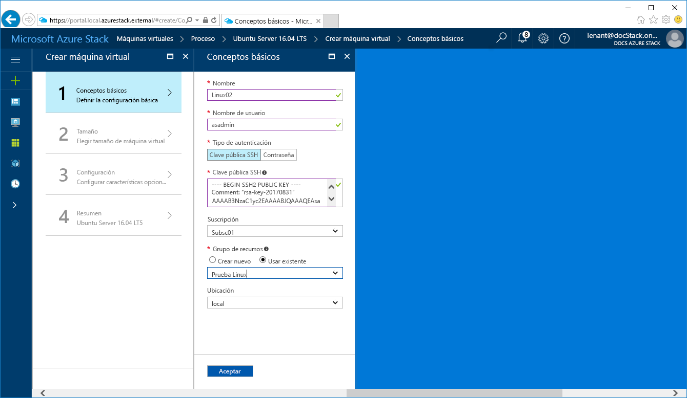
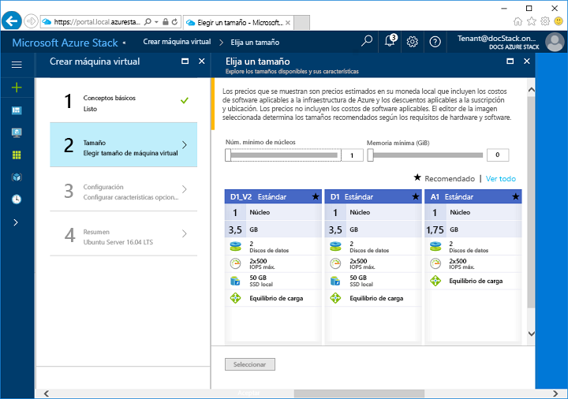
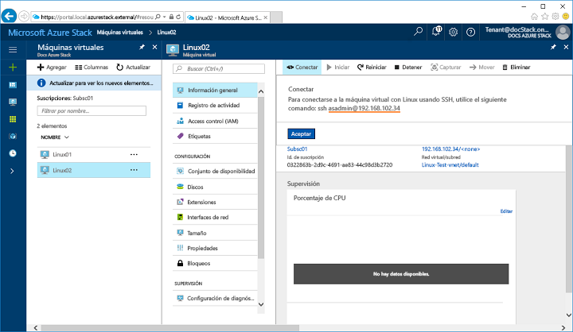

# <a name="create-a-linux-virtual-machine-with-the-azure-stack-portal"></a>Creación de una máquina virtual con Linux desde el portal de Azure Stack

*Se aplica a: Sistemas integrados de Azure Stack y Azure Stack Development Kit*

Las máquinas virtuales de Azure Stack pueden crearse a través del portal de Azure Stack. Este método proporciona una interfaz de usuario basada en el explorador para crear y configurar una máquina virtual y todos los recursos asociados. En esta guía de inicio rápido se muestra cómo crear rápidamente una máquina virtual con Linux e instalar un servidor web en ella.

## <a name="prerequisites"></a>Requisitos previos

* **Una imagen de Linux en el marketplace de Azure Stack**

   El marketplace de Azure Stack no contiene la imagen de Linux de forma predeterminada. Por lo tanto, para poder crear una máquina virtual de Linux, asegúrese de que el operador de Azure Stack ha descargado la imagen de **Ubuntu Server 16.04 LT** mediante los pasos descritos en el tema [Descarga de elementos de Marketplace desde Azure a Azure Stack](../azure-stack-download-azure-marketplace-item.md).

* **Acceso a un cliente SSH**

   Si está usando el Azure Stack Development Kit (ASDK), es posible que no tenga acceso a un cliente SSH en su entorno. Si este es el caso, puede elegir entre varios paquetes que incluyen a un cliente SSH. Por ejemplo, puede instalar PuTTY que incluye un cliente SSH y el generador de claves SSH (puttygen.exe). Para obtener más información acerca de las opciones posibles, consulte el siguiente artículo de Azure relacionado: [Uso de SSH con Windows en Azure](https://docs.microsoft.com/en-us/azure/virtual-machines/linux/ssh-from-windows#windows-packages-and-ssh-clients).

   Este tutorial rápido usa PuTTY para generar claves SSH y para conectarse a la máquina virtual con Linux. Para descargar e instalar PuTTY, vaya a [http://www.putty.org/](http://www.putty.org).

## <a name="create-an-ssh-key-pair"></a>Creación de un par de claves SSH

Necesita un par de claves SSH para completar este inicio rápido. Si ya tiene un par de claves SSH, puede omitir este paso.

1. Navegue hasta la carpeta de instalación de PuTTY (la ubicación predeterminada es ```C:\Program Files\PuTTY```) y ejecute ```puttygen.exe```.
2. En la ventana del generador de claves de PuTTY, asegúrese de que **Type of key to generate** (Tipo de clave que se va a generar) esté establecido en **RSA** y de que **Number of bits in a generated key** (Número de bits de una clave generada) esté establecido en **2048**. Cuando esté listo, haga clic en **Seleccionar**.

   

3. Para completar el proceso de generación de claves, mueva el cursor del mouse dentro de la ventana del generador de claves de PuTTY.
4. Cuando se complete la generación de claves, haga clic en **Save public key** (Guardar clave pública) y en **Save private key** (Guardar clave privada) para guardar las claves públicas y privadas en archivos.

   


## <a name="sign-in-to-the-azure-stack-portal"></a>Inicio de sesión en el portal de Azure Stack

Inicie sesión en el portal de Azure Stack. La dirección del portal de Azure Stack depende del producto de Azure Stack al que se vaya a conectar:

* Para Azure Stack Development Kit (ASDK), vaya a https://portal.local.azurestack.external.
* Para un sistema integrado de Azure Stack, vaya a la dirección URL que proporciona su operador de Azure Stack.

## <a name="create-the-virtual-machine"></a>Creación de la máquina virtual

1. Haga clic en el botón **Nuevo** de la esquina superior izquierda del portal de Azure Stack.

2. Seleccione **Compute**y, después, seleccione **Ubuntu Server 16.04 LTS**.
3. Haga clic en **Crear**.

4. Escriba la información de la máquina virtual. En **Tipo de autenticación**, seleccione **Clave pública SSH**. Al pegar la clave pública SSH (que guardó anteriormente en un archivo), tenga cuidado de quitar los espacios en blanco iniciales y finales. Cuando haya terminado, haga clic en **Aceptar**.

   

5. Seleccione **D1_V2** para la máquina virtual.

   

6. En la página **Configuración**, conserve los valores predeterminados y haga clic en **Aceptar**.

7. En la página **Resumen**, haga clic en **Aceptar** para iniciar la implementación de la máquina virtual.


## <a name="connect-to-the-virtual-machine"></a>Conexión a la máquina virtual

1. En la página de la máquina virtual, haga clic en **Conectar**. Se mostrará una cadena de conexión SSH que se puede usar para conectarse a la máquina virtual.

   

2. Abra PuTTY.
3. En la pantalla **Configuración de PuTTY**, en **Categoría**, expanda **SSH** y, después, haga clic en **Autenticación**. Haga clic en **Examinar** y seleccione el archivo de clave privada que guardó anteriormente.

   
4. En **Categoría**, desplácese hacia arriba y haga clic en **Sesión**.
5. En el cuadro **Nombre de host (o dirección IP)**, pegue la cadena de conexión del portal de Azure Stack que vio anteriormente. En este ejemplo, la cadena es ```asadmin@192.168.102.34```.
 
   
6. Haga clic en **Abrir** para abrir una sesión en la máquina virtual.

   

## <a name="install-nginx"></a>Instalación de NGINX

Use la siguiente secuencia de comandos de bash para actualizar los orígenes de paquetes e instalar el paquete NGINX más reciente en la máquina virtual. 

```bash 
#!/bin/bash

# update package source
sudo apt-get -y update

# install NGINX
sudo apt-get -y install nginx
```

Cuando haya finalizado, salga de la sesión SSH y vuelva a la página de introducción de la máquina virtual del portal de Azure Stack.


## <a name="open-port-80-for-web-traffic"></a>Apertura del puerto 80 para el tráfico web 

Los grupos de seguridad de red (NSG) protegen el tráfico entrante y saliente. Cuando se crea una máquina virtual desde el portal de Azure Stack, se crea una regla de entrada en el puerto 22 para las conexiones SSH. Dado que esta máquina virtual hospeda un servidor web, es preciso crear una regla de NSG para el puerto 80.

1. En la página **Introducción** de la máquina virtual, haga clic en el nombre del **Grupo de recursos**.
2. Seleccione el **grupo de seguridad de red** de la máquina virtual. Los NSG pueden identificarse mediante la columna **Tipo**. 
3. En el menú de la izquierda, en **Configuración**, haga clic en **Reglas de seguridad de entrada**.
4. Haga clic en **Agregar**.
5. En **Nombre**, escriba **http**. Asegúrese de que **Intervalo de puertos** esté establecido en 80 y **Acción** esté establecido en **Permitir**. 
6. Haga clic en **Aceptar**.


## <a name="view-the-nginx-welcome-page"></a>Visualización de la página de bienvenida de NGINX

Con NGINX instalado y el puerto 80 abierto en la máquina virtual, ya se puede obtener acceso al servidor web a través de la dirección IP pública de la máquina virtual. La dirección IP pública se puede encontrar en la página de información general de la máquina virtual del portal de Azure Stack.

Abra un explorador web y vaya a ```http://<public IP address>```.


## <a name="clean-up-resources"></a>Limpieza de recursos

Cuando ya no los necesite, elimine el grupo de recursos, la máquina virtual y todos los recursos relacionados. Para ello, seleccione el grupo de recursos de la página de la máquina virtual y haga clic en **Eliminar**.

## <a name="next-steps"></a>Pasos siguientes

En esta guía de inicio rápido, ha implementado una máquina virtual con Linux sencilla y una regla de grupo de seguridad de red, y ha instalado un servidor web. Para aprender más sobre las máquina virtuales de Azure Stack, continúe con el artículo [Considerations for Virtual Machines in Azure Stack](azure-stack-vm-considerations.md) (Consideraciones acerca de máquinas virtuales de Azure Stack).

