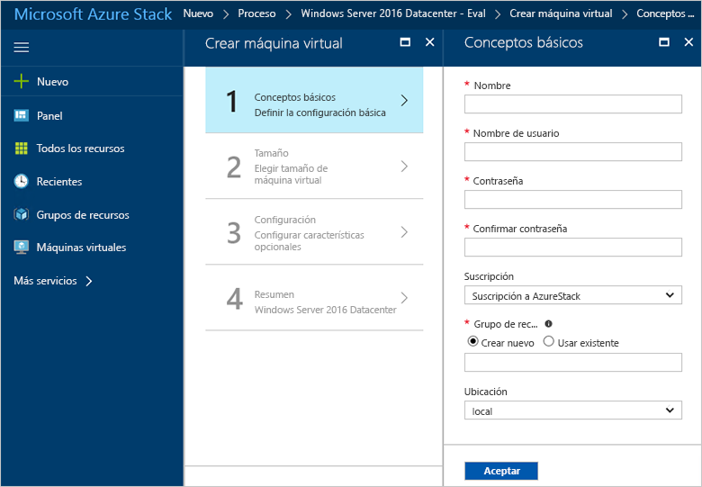
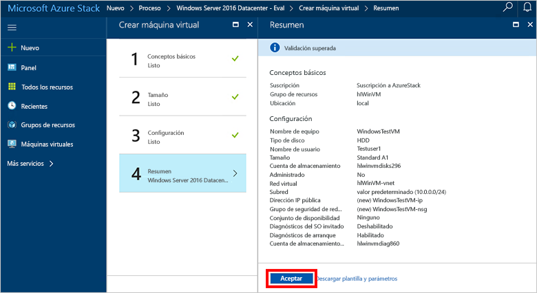

# Creación de una máquina virtual Windows con el portal de Azure Stack

Puede crear una máquina virtual Windows mediante el portal de Azure Stack. El portal es una interfaz de usuario basada en explorador donde puede crear, configurar y administrar los recursos.

## Inicio de sesión en el portal de Azure Stack

Inicie sesión en el portal de Azure Stack. La dirección del portal de Azure Stack depende del producto de Azure Stack al que se vaya a conectar:

* Para Azure Stack Development Kit (ASDK), vaya a https://portal.local.azurestack.external.
* Para un sistema integrado de Azure Stack, vaya a la dirección URL que proporciona su operador de Azure Stack.

## de una máquina virtual

1. Haga clic en **Nuevo** > **Proceso** > **Windows Server 2016 Datacenter Eval** > **Crear**. Si no se muestra la entrada **Windows Server 2016 Datacenter Eval**, póngase en contacto con el operador de Azure Stack. Pídale que la agregue a Marketplace como se explica en el artículo [Add the Windows Server 2016 VM image to the Azure Stack marketplace](../azure-stack-add-default-image.md) (Adición de la imagen de máquina virtual Windows Server 2016 a Azure Stack Marketplace). 
    
2. En **Aspectos básicos**, escriba un **nombre**, un **nombre de usuario** y una **contraseña**. Elija una **suscripción**. Cree un **grupo de recursos**, o seleccione uno ya existente, seleccione una **ubicación** y luego haga clic en **Aceptar**.

    
3. En **Elegir un tamaño**, haga clic en **D1 Standard** > **Seleccionar**.
    
4. En **Configuración**, aceote los valores predeterminados y haga clic en **Aceptar**.
    
5. En **Resumen**, haga clic en **Aceptar** para crear la máquina virtual. 
    
6. Para ver la nueva máquina virtual, haga clic en **Todos los recursos** y, a continuación, busque la máquina virtual y haga clic en su nombre.
    

## Limpieza de recursos

Cuando ya no necesite la máquina virtual, elimine el grupo de recursos, la máquina virtual y todos los recursos relacionados. Para ello, seleccione el grupo de recursos de la página de la máquina virtual y haga clic en **Eliminar**.

## Pasos siguientes
En esta guía rápida, ha implementado una máquina virtual Windows sencilla. Para aprender más sobre las máquina virtuales de Azure Stack, continúe con el artículo [Considerations for Virtual Machines in Azure Stack](azure-stack-vm-considerations.md) (Consideraciones sobre Virtual Machines en Azure Stack).
