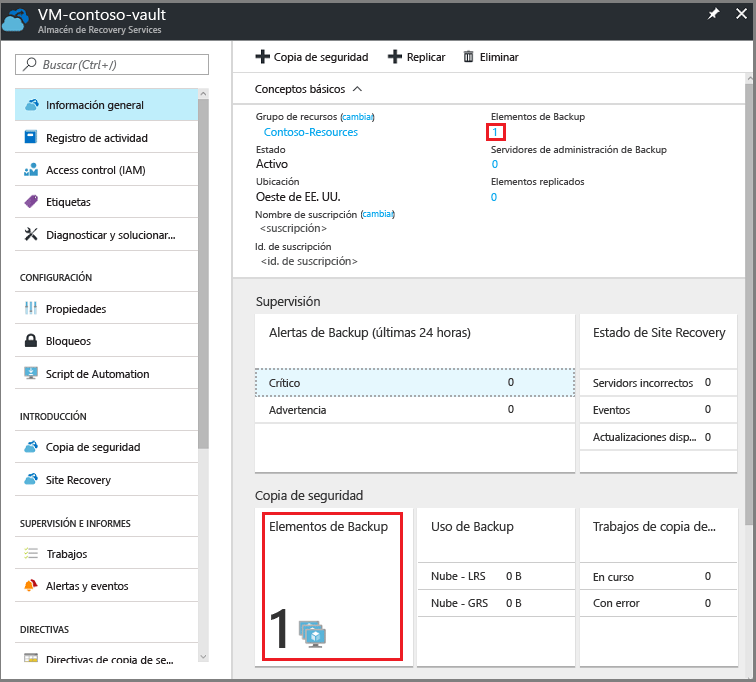
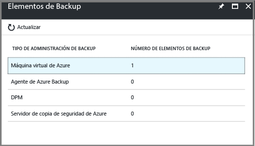
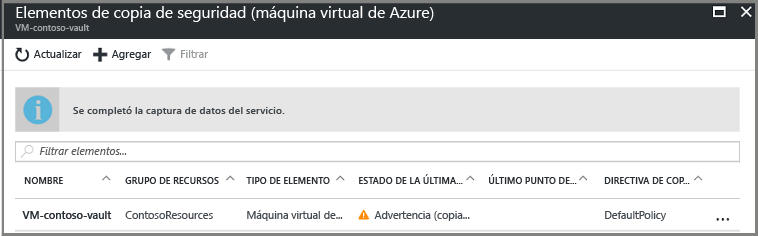
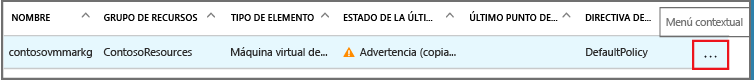
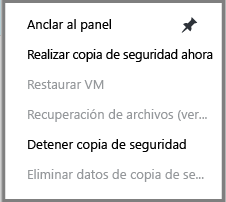
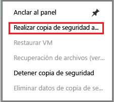
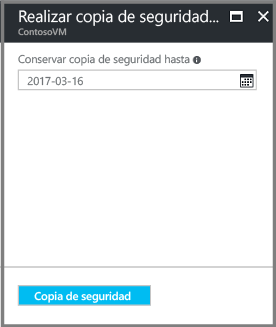
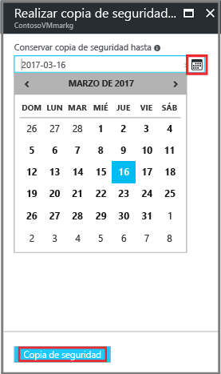
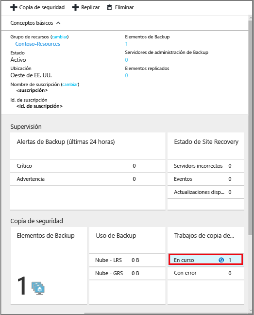
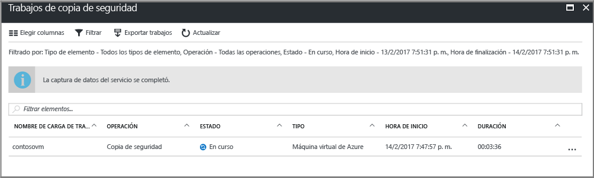

# Copia de seguridad de máquinas virtuales de Azure en un almacén de Recovery Services

En este artículo se proporcionan detalles para realizar una copia de seguridad de VM de Azure (con el modelo de implementación de Resource Manager y el modelo clásico) en un almacén de Recovery Services. La mayoría del trabajo de la copia de seguridad de máquinas virtuales se basa en la preparación. Antes de poder realizar una copia de seguridad de una máquina virtual, o protegerla, es necesario realizar una serie de tareas que son [requisito previo](backup-azure-arm-vms-prepare.md) con el fin de preparar el entorno para la protección de las máquinas virtuales. Cuando haya realizado estas tareas, puede iniciar la operación de copia de seguridad para tomar instantáneas de la máquina virtual.

[!INCLUDE [learn about backup deployment models](../../includes/backup-deployment-models.md)]

Para más información, vea los artículos sobre cómo [planear la infraestructura de copia de seguridad de máquinas virtuales en Azure](backup-azure-vms-introduction.md) y sobre [Azure Virtual Machines](https://azure.microsoft.com/documentation/services/virtual-machines/).

## Desencadenamiento del trabajo de copia de seguridad
La directiva asociada con el almacén de Recovery Services define con qué frecuencia y cuándo se ejecuta la operación de copia de seguridad. De forma predeterminada, la primera copia de seguridad programada es la copia de seguridad inicial. Hasta que se realice la copia de seguridad inicial, el estado de la última copia aparecerá como **Advertencia (copia de seguridad inicial pendiente)** en la hoja **Trabajos de copia de seguridad**.

A menos que la copia de seguridad inicial vaya a comenzar pronto, se recomienda ejecutar **Hacer ahora una copia de seguridad**. El procedimiento siguiente se inicia desde el panel del almacén. Este procedimiento sirve para ejecutar el trabajo de copia de seguridad inicial después de haber completado todos los requisitos previos. Si ya se ha ejecutado el trabajo de copia de seguridad inicial, este procedimiento no está disponible. La directiva de copia de seguridad asociada determina el siguiente trabajo de copia de seguridad.  

Para ejecutar el trabajo de copia de seguridad inicial:

1. En el panel del almacén, haga clic en el número situado bajo **Elementos de copia de seguridad** o haga clic en el icono **Elementos de copia de seguridad**.  
  

  Se abrirá la hoja **Elementos de copia de seguridad** .

  

2. En la hoja **Elementos de copia de seguridad**, seleccione el elemento.

  

  Se abrirá la lista **Elementos de copia de seguridad**.  

  

3. En la lista **Elementos de copia de seguridad**, haga clic en el botón de puntos suspensivos **...** para abrir el menú contextual.

  

  Aparece el menú contextual.

  

4. En el menú contextual, haga clic en **Realizar copia de seguridad ahora**.

  

  Se abre la hoja Realizar copia de seguridad ahora.

  

5. En la hoja Realizar copia de seguridad ahora, haga clic en el icono del calendario, use el control del calendario para seleccionar el último día en el que se mantendrá este punto de recuperación y haga clic en **Copia de seguridad**.

  

  Las notificaciones de implementación le permiten saber si se ha desencadenado el trabajo de copia de seguridad y que puede supervisar el progreso del trabajo en la página de trabajos de copia de seguridad. Según el tamaño de la máquina virtual, la creación de la copia de seguridad inicial puede tardar un tiempo.

6. Para ver o realizar el seguimiento del estado de la copia de seguridad inicial, en el panel del almacén, en el icono **Trabajos de Backup**, haga clic en **En curso**.

  

  Se abrirá la hoja Trabajos de copia de seguridad.

  

  En la hoja **Trabajos de copia de seguridad** , puede ver el estado de todos los trabajos. Compruebe si el trabajo de copia de seguridad para la máquina virtual aún está en curso o si se ha terminado. Cuando finalice un trabajo de copia de seguridad, el estado será *Completado*.

  > [!NOTE]
  > Como parte de la operación de copia de seguridad, el servicio Azure Backup emite un comando a la extensión de copia de seguridad en cada máquina virtual para vaciar toda la escritura y tomar una instantánea coherente.
  >
  >

## Solución de errores
Si se encuentra con problemas mientras realiza la copia de seguridad de la máquina virtual, vea el [artículo sobre cómo solucionar problemas de máquinas virtuales](backup-azure-vms-troubleshoot.md) para obtener ayuda.

## Pasos siguientes
Ahora que ha protegido su máquina virtual, vea los siguientes artículos para obtener información sobre las tareas de administración de las máquinas virtuales y cómo restaurarlas.

* [Administración y supervisión de las máquinas virtuales](backup-azure-manage-vms.md)
* [Restauración de máquinas virtuales](backup-azure-arm-restore-vms.md)
