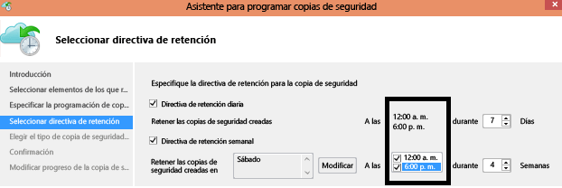

# Preguntas sobre el servicio Azure Backup
En este artículo se responden a preguntas habituales sobre los componentes de Azure Backup. En algunas de las respuestas, hay vínculos a artículos que tienen información completa. Para realizar cualquier pregunta acerca de Azure Backup, haga clic en **Comentarios** (a la derecha). Los comentarios aparecen en la parte inferior de este artículo. Para poder escribir comentarios se requiere una cuenta de Livefyre. También se pueden publicar preguntas sobre el servicio Azure Backup en el [foro de debate](https://social.msdn.microsoft.com/forums/azure/home?forum=windowsazureonlinebackup).

Para examinar rápidamente las secciones de este artículo, use los vínculos de la derecha que aparecen debajo de **En este artículo**.

## Almacén de Recovery Services

### ¿Hay algún límite del número de almacenes que se pueden crear en cada suscripción de Azure?  
Sí. A partir de septiembre de 2016, puede crear 25 almacenes de Recovery Services por suscripción. Se pueden crear hasta 25 almacenes de Recovery Services por cada región admitida de Azure Backup por suscripción. Si necesita más almacenes, cree otra suscripción.

### ¿Hay algún límite en el número de servidores o máquinas que se pueden registrar en cada almacén?  
Sí, se pueden registrar un máximo de 50 máquinas por almacén. Para las máquinas virtuales de IaaS de Azure, el límite es de 200 máquinas virtuales por almacén. Si necesita registrar más máquinas, cree otro almacén.

### Si la organización tiene un almacén, ¿cómo se pueden aislar los datos de un servidor desde otro servidor al restaurar los datos? 
Los servidores registrados en el mismo almacén podrán recuperar los datos cuya copia de seguridad hayan realizado otros servidores *que usen la misma frase de contraseña*. Si tiene servidores cuyos datos de copia de seguridad desee aislar de otros servidores de la organización, utilice una frase de contraseña específica para dichos servidores. Por ejemplo, los servidores de recursos humanos podrían usar una frase de contraseña de cifrado, los servidores de contabilidad, otra y los servidores de almacenamiento, otra distinta.

### ¿Puedo "migrar" mi almacén o datos de copia de seguridad de una suscripción a otra?  
Nº El almacén se crea en un nivel de suscripción y no se puede reasignar a otra suscripción una vez que se crea.

### Los almacenes de Recovery Services se basan en Resource Manager. ¿Son todavía compatibles los almacenes de Backup?  
Los almacenes de Backup se han convertido en almacenes de Recovery Services. Si no ha convertido el almacén Backup en un almacén de Recovery Services, esto se hizo automáticamente. 

### ¿Se puede migrar un almacén de Copia de seguridad a un almacén de Recovery Services?  
Todos los almacenes de Backup se han convertido en almacenes de Recovery Services. Si no ha convertido el almacén Backup en un almacén de Recovery Services, esto se hizo automáticamente.

## Agente de Azure Backup
Se puede encontrar una lista detallada de preguntas en las [P+F sobre la copia de seguridad de archivos y carpetas de Azure](backup-azure-file-folder-backup-faq.md).

## Copia de seguridad de máquina virtual de Azure
Se puede encontrar una lista detallada de preguntas en las [P+F sobre la copia de seguridad de máquinas virtuales de Azure](backup-azure-vm-backup-faq.md).

## Copias de seguridad de servidores VMware

### ¿Puedo hacer copias de seguridad de servidores de VMware vCenter en Azure?

Sí. Se puede usar Azure Backup Server para realizar una copia de seguridad de VMware vCenter y ESXi en Azure. Para más información sobre la versión admitida de VMware, consulte el artículo [Matriz de protección de Azure Backup Server](backup-mabs-protection-matrix.md). Para obtener instrucciones detalladas, consulte [Uso de Azure Backup Server para hacer copia de seguridad de un servidor de VMware](backup-azure-backup-server-vmware.md).

## Azure Backup Server y System Center Data Protection Manager
### ¿Puedo usar el Azure Backup Server para crear una copia de seguridad de reconstrucción completa (BMR) para un servidor físico?  
Sí.

### ¿Puedo registrar mi servidor DPM en varios almacenes?  
Nº Un servidor DPM o MABS solo se puede registrar en un único almacén.

### ¿Qué versión de System Center Data Protection Manager se admite?  
Se recomienda que instale el agente de Azure Backup [más reciente](http://aka.ms/azurebackup_agent) en el último paquete acumulativo (UR) de actualizaciones para System Center Data Protection Manager (DPM). A partir de agosto de 2016, el paquete acumulativo de actualizaciones 11 es la actualización más reciente.

### He instalado el agente de Azure Backup para proteger archivos y carpetas. ¿Puedo instalar ahora System Center DPM para que funcione con el agente de Azure Backup con el fin de proteger las cargas de trabajo locales de aplicaciones o de máquinas virtuales para Azure?  
Para usar Azure Backup con System Center Data Protection Manager (DPM), instale DPM en primer lugar e instale el agente de Azure Backup. Instalar los componentes de Azure Backup en este orden garantiza que el agente funcione con DPM. No se recomienda o no se admite la instalación de Azure Backup.

## Cómo funciona Azure Backup
### Si se cancela un trabajo de copia de seguridad una vez que se ha iniciado, ¿se eliminan los datos de copia de seguridad transferidos?  
Nº Todos los datos transferidos al almacén, antes de que se cancelara el trabajo de copia de seguridad, permanecen en el almacén. Azure Backup usa un mecanismo para agregar ocasionalmente agregar puntos de control a los datos de copia de seguridad durante la copia de seguridad. Debido a que hay puntos de control en los datos de copia de seguridad, el siguiente proceso de copia de seguridad puede validar la integridad de los archivos. El siguiente trabajo de copia de seguridad será incremental a los datos que ya están en la copia de seguridad. Las copias de seguridad incrementales solo transfieren los datos nuevos o modificados, lo que equivale a una mejor utilización del ancho de banda.

Si cancela un trabajo de copia de seguridad para una máquina virtual de Azure, se omiten los datos transferidos. El siguiente trabajo de copia de seguridad transfiere los datos incrementales desde el último trabajo de copia de seguridad correcto.

### ¿Existen límites sobre cuándo y cuántas veces se puede programar un trabajo de copia de seguridad? 
Sí. Sí, en estaciones de trabajo de Windows o Windows Server los trabajos de copia de seguridad se pueden ejecutar un máximo de tres veces al día. Sin embargo, en System Center DPM, los trabajos de copia de seguridad se pueden ejecutar un máximo de dos veces al día. Por último, en las máquinas virtuales de IaaS solo se puede ejecutar un trabajo de copia de seguridad al día. Puede usar la directiva de programación para estaciones de trabajo de Windows o Windows Server para especificar programaciones diarias o semanales. Mediante System Center DPM, puede especificar programaciones diarias, semanales, mensuales y anuales.

### ¿Por qué el tamaño de los datos transferidos al almacén de Recovery Services es más pequeño que los datos de los que he hecho copia de seguridad? 
 Todos los datos de los que se realiza una copia de seguridad desde el agente de Azure Backup o SCDPM o de Azure Backup Server se comprimen y se cifran antes de ser transferidos. Una vez que se aplica la compresión y el cifrado, el tamaño de los datos del almacén de Recovery Services se reduce entre un 30 % y un 40 %.

## ¿De qué puedo hacer copia de seguridad?
### ¿Qué sistemas operativos admite Azure Backup?  
Azure Backup admite la siguiente lista de sistemas operativos para la copia de seguridad de archivos y carpetas y aplicaciones de carga de trabajo protegidas con el Azure Backup Server y System Center Data Protection Manager (DPM).

| Sistema operativo | Plataforma | SKU |
|:--- | --- |:--- |
| Windows 8 y SP más recientes |64 bits |Enterprise, Pro |
| Windows 7 y SP más recientes |64 bits |Ultimate, Enterprise, Professional, Home Premium, Home Basic, Starter |
| Windows 8.1 y SP más recientes |64 bits |Enterprise, Pro |
| Windows 10 |64 bits |Enterprise, Pro, Home |
| Windows Server 2016 |64 bits |Standard, Datacenter, Essentials |
| Windows Server 2012 R2 y SP más recientes |64 bits |Standard, Datacenter, Foundation |
| Windows Server 2012 y SP más recientes |64 bits |Datacenter, Foundation, Standard |
| Windows Storage Server 2016 y SP más recientes |64 bits |Standard, Workgroup | 
| Windows Storage Server 2012 R2 y SP más recientes |64 bits |Standard, Workgroup |
| Windows Storage Server 2012 y SP más recientes |64 bits |Standard, Workgroup |
| Windows Server 2012 R2 y SP más recientes |64 bits |Essential |
| Windows Server 2008 R2 SP1 |64 bits |Standard, Enterprise, Datacenter, Foundation |

**Para la copia de seguridad de máquinas virtuales de Azure:**

* **Linux**: Azure Backup admite [una lista de distribuciones aprobadas por Azure](../virtual-machines/linux/endorsed-distros.md) , con la excepción de CoreOS Linux.  Otras distribuciones con la iniciativa "traiga su propio Linux" también podrían funcionar, siempre que el agente de máquina virtual esté disponible en la máquina virtual y haya compatibilidad con Python.
* **Windows Server**: no se admiten las versiones anteriores a Windows Server 2008 R2.

### ¿Hay algún límite en el tamaño de cada origen de datos del que se realiza una copia de seguridad?  
No hay ningún límite en la cantidad de datos de los que se puede hacer una copia de seguridad en un almacén de datos. Azure Backup limita el tamaño máximo del origen de datos; sin embargo, estos límites son grandes. A partir de agosto de 2015, el tamaño máximo del origen de datos del sistema operativo compatible es:

| S.No | Sistema operativo | Tamaño máximo del origen de datos |
|:---:|:--- |:--- |
| 1 |Windows Server 2012 o superior |54 400 GB |
| 2 |Windows 8 o posterior |54 400 GB |
| 3 |Windows Server 2008, Windows Server 2008 R2 |1700 GB |
| 4 |Windows 7 |1700 GB |

La tabla siguiente explica cómo se determina el tamaño de cada origen de datos.

| Origen de datos | Detalles |
|:---:|:--- |
| Volumen |La cantidad de datos de los que se realiza copia de seguridad de un volumen individual de un equipo servidor o cliente. |
| Máquina virtual de Hyper-V |Suma de los datos de todos los discos duros virtuales de la máquina virtual de los que se hace copia de seguridad |
| Base de datos de Microsoft SQL Server |Tamaño de una sola base de datos SQL de la que se hace copia de seguridad |
| Microsoft SharePoint |Suma de las bases de datos de contenido y configuración de la granja de SharePoint de las que se hace copia de seguridad |
| Microsoft Exchange |Suma de todas las bases de datos de un servidor de Exchange de las que se hace copia de seguridad |
| Estado del sistema y BMR |Cada copia individual del estado del sistema o BMR del equipo del que se hace copia de seguridad |

Para la copia de seguridad de máquinas virtuales de Azure, cada máquina virtual puede tener hasta 16 discos de datos con un tamaño cada uno de 1023 GB o inferior. 

## Puntos de recuperación y directiva de retención
### ¿Hay alguna diferencia entre las directiva de retención de DPM y Windows Server o cliente de Windows (es decir, en Windows Server sin DPM)? 
No, tanto DPM como Windows Server o el cliente Windows tienen directivas de retención diarias, semanales, mensuales y anuales.

### ¿Puedo configurar de forma selectiva mis directivas de retención (es decir, configurar semanal y diariamente, pero no anual y mensualmente)? 
Sí, la estructura de retención de Azure Backup permite tener una flexibilidad completa en la definición de la directiva de retención según sus requisitos.

### ¿Puedo programar una copia de seguridad a las 6 p.m. y establecer las directivas de retención a una hora diferente? 
Nº Las directivas de retención solo pueden aplicarse a puntos de copia de seguridad. En la siguiente ilustración, la directiva de retención se ha especificado para las copias de seguridad de las 12 a.m. y las 6 p.m.  

 

### Si se conserva una copia de seguridad durante un período prolongado, ¿se tarda más tiempo en recuperar un punto de datos más antiguo?  
No: el tiempo de recuperación del punto de datos más antiguo o más reciente es el mismo. Cada punto de recuperación se comporta como un punto completo.

### Si cada punto de recuperación es como un punto completo, ¿afecta esto al almacenamiento de copia de seguridad facturable total? 
Los productos con un punto de retención a largo plazo típicos almacenan los datos de copia de seguridad como puntos completos. Los puntos completos *no son eficientes* para el almacenamiento, pero resultan más fáciles y rápidos de restaurar. Las copias incrementales son *eficientes* para el almacenamiento, pero requieren que se restaure una cadena de datos, lo que afecta al tiempo de recuperación. La arquitectura de almacenamiento de Azure Backup le ofrece lo mejor de ambos mundos ya que permite almacenar de forma óptima datos para conseguir restauraciones más rápidas e incurrir en pocos costos de almacenamiento. Este enfoque del almacenamiento de datos garantiza que el ancho de banda de entrada y salida se utiliza de manera eficiente. Tanto la cantidad de almacenamiento de datos como el tiempo necesario para recuperar los datos se reducen al mínimo. Aprenda más sobre la eficacia de las [copias de seguridad incrementales](https://azure.microsoft.com/blog/microsoft-azure-backup-save-on-long-term-storage/).

### ¿Hay un límite en el número de puntos de recuperación que se pueden crear? 
Puede crear hasta 9999 puntos de recuperación por instancia protegida. Una instancia protegida es un equipo, un servidor (físico o virtual) o una carga de trabajo configurada para realizar copias de seguridad en Azure. Para más información, consulte las explicaciones de [Copia de seguridad y retención](./backup-introduction-to-azure-backup.md#backup-and-retention) y [Descripción de una instancia protegida](./backup-introduction-to-azure-backup.md#what-is-a-protected-instance).

### ¿Cuántas recuperaciones puedo realizar en los datos cuya copia de seguridad se crea en Azure? 
No hay ningún límite en cuanto al número de recuperaciones de Azure Backup.

### Al restaurar los datos, ¿tengo que pagar por el tráfico de salida de Azure?  
Nº Sus recuperaciones son gratuitas y no se cobra por el tráfico de salida.

## Cifrado de Azure Backup
### ¿Se cifran los datos que se envían a Azure?  
Sí. Los datos se cifran en la máquina cliente/servidor/SCDPM local mediante AES256 y se envían a través de un vínculo HTTPS seguro.

### ¿También se cifran los datos de copia de seguridad en Azure? 
Sí. Los datos que se envían a Azure permanecen cifrados (en reposo). Microsoft no descifra los datos de copia de seguridad en ningún momento. Al realizar una copia de seguridad de una máquina virtual de Azure, Azure Backup se basa en el cifrado de la máquina virtual. Por ejemplo, si la máquina virtual utiliza Azure Disk Encryption o alguna otra tecnología de cifrado, Azure Backup usa dicho cifrado para proteger los datos.

### ¿Cuál es la longitud mínima de la clave de cifrado utilizada para cifrar los datos de copia de seguridad?  
La clave de cifrado debe tener al menos 16 caracteres cuando se usa Azure Backup Agent. Para máquinas virtuales de Azure, no hay ningún límite de longitud para las claves usadas por Azure KeyVault. 

### ¿Qué sucede si pierdo la clave de cifrado? ¿Puedo recuperar los datos (o) puede Microsoft recuperar los datos?  
La clave utilizada para cifrar los datos de copia de seguridad está presente en las instalaciones del cliente. Microsoft no mantiene una copia en Azure y no tiene acceso a la clave. Si el cliente pierde la clave, Microsoft no puede recuperar los datos de copia de seguridad.
