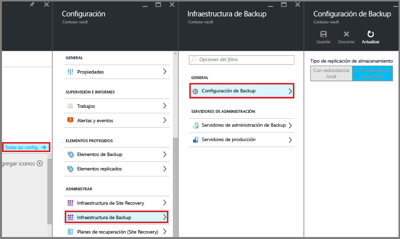

# <a name="preparing-to-back-up-workloads-using-azure-backup-server"></a>Preparación para la copia de seguridad de cargas de trabajo en Microsoft Azure
> [!div class="op_single_selector"]
> * [Azure Backup Server](backup-azure-microsoft-azure-backup.md)
> * [SCDPM](backup-azure-dpm-introduction.md)
>
>

En este artículo se explica cómo preparar el entorno para la copia de seguridad de las cargas de trabajo mediante el servidor de Copia de seguridad de Azure. Con Azure Backup Server, puede proteger cargas de trabajo de aplicaciones como máquinas virtuales de Hyper-V, Microsoft SQL Server, SharePoint Server, Microsoft Exchange y clientes Windows desde una única consola.

> [!NOTE]
> El servidor de copia de seguridad de Azure ahora puede proteger máquinas virtuales de VMware y proporciona mejores funcionalidades de seguridad. Instale el producto tal y como se explica en las secciones de debajo y aplique la actualización 1 y el agente de copia de seguridad de Azure más reciente. Para obtener más información sobre la copia de seguridad de servidores VMware con Azure Backup Server, vea el artículo [Uso de Azure Backup Server para hacer copia de seguridad de un servidor de VMware](backup-azure-backup-server-vmware.md). Para obtener información sobre las funcionalidades de seguridad, consulte la [documentación de características de seguridad de copia de seguridad de Azure](backup-azure-security-feature.md).
>
>

También puede proteger las cargas de trabajo de Infraestructura como servicio (IaaS), como es el caso de las máquinas virtuales de Azure.

> [!NOTE]
> Azure cuenta con dos modelos de implementación para crear recursos y trabajar con ellos: [Resource Manager y el modelo clásico](../azure-resource-manager/resource-manager-deployment-model.md). En este artículo se proporcionan información y procedimientos para restaurar las máquinas virtuales implementadas mediante el modelo de Resource Manager.
>
>

El servidor de Copia de seguridad de Azure hereda gran parte de la funcionalidad de copia de seguridad de las cargas de trabajo de Data Protection Manager (DPM). Este artículo incluye vínculos a documentación de DPM para explicar algunas de las funcionalidades compartidas. Si bien, el servidor de Copia de seguridad de Azure comparte gran parte de la misma funcionalidad que DPM. El servidor de Copia de seguridad de Azure no realiza copias de seguridad en cinta, ni se integra con System Center.

## <a name="1-choose-an-installation-platform"></a>1. Elección de una plataforma de instalación
El primer paso para que funcione el servidor de Copia de seguridad de Azure es configurar un equipo con Windows Server. El servidor puede estar en Azure o en el entorno local.

### <a name="using-a-server-in-azure"></a>Uso de un servidor en Azure
Al elegir un servidor para ejecutar el servidor de Copia de seguridad de Azure, se recomienda comenzar con una imagen de la galería de Windows Server 2012 R2 Datacenter. En el artículo [Creación de la primera máquina virtual de Windows en el Portal de Azure](../virtual-machines/virtual-machines-windows-hero-tutorial.md?toc=%2fazure%2fvirtual-machines%2fwindows%2ftoc.json), se proporciona un tutorial de introducción a la máquina virtual recomendada en Azure, incluso si nunca ha usado Azure antes. Los requisitos mínimos recomendados para la máquina virtual (VM) servidor deben ser: A2 estándar con dos núcleos y 3,5 GB de RAM.

La protección de cargas de trabajo con el servidor de Copia de seguridad de Azure tiene muchos matices. El artículo [Instalación de DPM como una máquina virtual de Azure](https://technet.microsoft.com/library/jj852163.aspx)le ayudará a comprender estos matices. Lea este artículo completamente antes de implementar la máquina.

### <a name="using-an-on-premises-server"></a>Uso de un servidor local
Si no desea ejecutar el servidor de base de Azure, puede ejecutar el servidor en una máquina virtual de Hyper-V, una máquina virtual de VMware o un host físico. Los requisitos mínimos recomendados para el hardware de servidor son dos núcleos y 4 GB de RAM. En la tabla siguiente se muestran los sistemas operativos compatibles:

| Sistema operativo | Plataforma | SKU |
|:--- | --- |:--- |
| Windows Server 2012 R2 y SP más recientes |64 bits |Standard, Datacenter, Foundation |
| Windows Server 2012 y SP más recientes |64 bits |Datacenter, Foundation, Standard |
| Windows Storage Server 2012 R2 y SP más recientes |64 bits |Standard, Workgroup |
| Windows Storage Server 2012 y SP más recientes |64 bits |Standard, Workgroup |

Puede desduplicar el almacenamiento de DPM con la desduplicación de Windows Server. Más información sobre cómo funcionan juntos [DPM y la desduplicación](https://technet.microsoft.com/library/dn891438.aspx) al implementarlos en máquinas virtuales de Hyper-V.

> [!NOTE]
> Azure Backup Server está diseñado para ejecutarse en un servidor dedicado de objetivo único. No se puede instalar Azure Backup Server en:
> - Un equipo que se ejecuta como controlador de dominio
> - Un equipo en el que está instalado el rol del servidor de aplicaciones
> - Un equipo que sea un grupo de administración de System Center Operations Manager
> - Un equipo en el que se ejecute Exchange Server
> - Un equipo que sea un nodo de un clúster

Siempre una Azure Backup Server a un dominio. Si piensa mover el servidor a un dominio diferente, se recomienda unir el servidor al nuevo dominio antes de instalar el servidor de copia de seguridad de Azure. *No se permite*mover una máquina servidor de Copia de seguridad de Azure existente a un dominio nuevo después de la implementación.

## <a name="2-recovery-services-vault"></a>2. Almacén de Servicios de recuperación
Tanto si envía datos de copia de seguridad a Azure como si los mantiene localmente, el software debe estar conectado a Azure. Más concretamente, la máquina del Servidor de Copia de seguridad de Azure debe estar registrada en un almacén de Servicios de recuperación.

Para crear un almacén de Servicios de recuperación:

1. Inicie sesión en el [Portal de Azure](https://portal.azure.com/).
2. En el menú del centro, haga clic en **Examinar** y, en la lista de recursos, escriba **Recovery Services**. Cuando comience a escribir, la lista se filtrará en función de la entrada. Haga clic en **Almacén de Servicios de recuperación**.

     <br/>

    Se muestra la lista de almacenes de Servicios de recuperación.
3. En el menú **Almacenes de servicios de recuperación**, haga clic en **Agregar**.

    

    Se abre la hoja del almacén de Recovery Services, donde se le pide que especifique los valores de **Nombre**, **Suscripción**, **Grupo de recursos** y **Ubicación**.

    
4. En **Nombre**, escriba un nombre descriptivo que identifique el almacén. El nombre debe ser único para la suscripción de Azure. Escriba un nombre que tenga entre 2 y 50 caracteres. Debe comenzar por una letra y solo puede contener letras, números y guiones.
5. Haga clic en **Suscripción** para ver la lista de suscripciones disponibles. Si no está seguro de la suscripción que desea utilizar, use la suscripción predeterminada (o sugerida). Solo hay varias opciones si la cuenta de su organización está asociada a más de una suscripción de Azure.
6. Haga clic en **Grupo de recursos** para ver la lista de grupos de recursos disponibles o haga clic en **Nuevo** para crear uno. Para más información sobre los grupos de recursos, consulte [Información general de Azure Resource Manager](../azure-resource-manager/resource-group-overview.md).
7. Haga clic en **Ubicación** para seleccionar la región geográfica del almacén.
8. Haga clic en **Crear**. La creación del almacén de Servicios de recuperación puede tardar unos minutos. Supervise las notificaciones de estado en la parte superior derecha del portal.
   Una vez creado el almacén, se abre en el portal.

### <a name="set-storage-replication"></a>Configuración de la replicación de almacenamiento
La opción de replicación de almacenamiento permite elegir entre almacenamiento con redundancia geográfica y almacenamiento con redundancia local. De forma predeterminada, el almacén tiene almacenamiento con redundancia geográfica. Si este almacén es su almacén principal, deje la opción de almacenamiento establecida en almacenamiento con redundancia geográfica. Elija el almacenamiento con redundancia local si desea una opción más económica que no sea tan duradera. Para más información sobre las opciones de almacenamiento [con redundancia geográfica](../storage/common/storage-redundancy.md#geo-redundant-storage) y [con redundancia local](../storage/common/storage-redundancy.md#locally-redundant-storage), consulte [Replicación de Azure Storage](../storage/common/storage-redundancy.md).

Para editar la configuración de replicación de almacenamiento:

1. Seleccione el almacén para abrir su panel y la hoja de configuración. Si la hoja **Configuración** no se abre, haga clic en la opción **Toda la configuración** del panel del almacén.
2. En la hoja **Configuración**, haga clic en **Infraestructura de copia de seguridad** > **Configuración de copia de seguridad** para abrir la hoja **Configuración de copia de seguridad**. En la hoja **Configuración de copia de seguridad** , elija la opción de replicación de almacenamiento para su almacén.

    

    Tras elegir la opción de almacenamiento del almacén, está listo para asociar la máquina virtual con el almacén. Para comenzar la asociación, es preciso detectar y registrar las máquinas virtuales de Azure.

## <a name="3-software-package"></a>3. Paquete de software
### <a name="downloading-the-software-package"></a>Descarga del paquete de software
1. Inicie sesión en el [Portal de Azure](https://portal.azure.com/).
2. Si ya tiene abierto un almacén de Servicios de recuperación, vaya al paso 3. Si no tiene abierto un almacén de Servicios de recuperación, pero está en el Portal de Azure, en el menú del concentrador, haga clic en **Examinar**.

   * En la lista de recursos, escriba **Servicios de recuperación**.
   * Cuando comience a escribir, la lista se filtrará en función de la entrada. Haga clic en **Almacenes de Servicios de recuperación**cuando lo vea.

     

     Aparece la lista de almacenes de Recovery Services.
   * En la lista de almacenes de Recovery Services, seleccione un almacén.

     Se abre el panel del almacén seleccionado.

     
3. La hoja **Configuración** se abre de forma predeterminada. Si está cerrada, haga clic en **Configuración** para abrirla.

    
4. Haga clic en **Copia de seguridad** para abrir el Asistente para introducción.

    

    En la hoja **Introducción a Backup** que se abre, **Backup Goals** (Objetivos de Backup) se selecciona automáticamente.

    

5. En la hoja **Backup Goals**, en el menú desplegable **¿Dónde se ejecuta su carga de trabajo?**, seleccione **Local**.

    

    En el menú desplegable **What do you want to backup?** (¿De qué desea realizar copias de seguridad), seleccione las cargas de trabajo que quiere proteger con el servidor de copia de seguridad de Azure y, después, haga clic en **Aceptar**.

    El asistente **Introducción a Backup** cambia la opción **Preparar infraestructura** para realizar copias de seguridad de las cargas de trabajo en Azure.

   > [!NOTE]
   > Si solo desea hacer copia de seguridad de archivos y carpetas, se recomienda utilizar el agente de Azure Backup y seguir las instrucciones del artículo [Primer análisis: Copia de seguridad de archivos y carpetas](backup-try-azure-backup-in-10-mins.md). Si va a proteger más que archivos y carpetas o tiene pensado expandir las necesidades de protección en un futuro, seleccione esas cargas de trabajo.
   >
   >

    

6. En la hoja **Preparar la infraestructura** que se abre, haga clic en los vínculos de **Descarga** para instalar el servidor de Copia de seguridad de Azure y descargar las credenciales del almacén. Utilice las credenciales del almacén durante el registro del servidor de Copia de seguridad de Azure en el almacén de Servicios de recuperación. Los vínculos le llevan al Centro de descarga donde se puede descargar el paquete de software.

    

7. Seleccione todos los archivos y haga clic en **Siguiente**. Descargue todos los archivos procedentes de la página de descarga de Copia de seguridad de Microsoft Azure y colóquelos en la misma carpeta.

    

    Puesto que el tamaño de descarga de todos los archivos juntos es de más de 3 GB, con un vínculo de descarga a 10 Mbps, se puede tardar hasta 60 minutos en completarla.

### <a name="extracting-the-software-package"></a>Extracción del paquete de software
Después de descargar todos los archivos, haga clic en **MicrosoftAzureBackupInstaller.exe**. Se inicia el **Asistente para instalación de Microsoft Azure Backup**, que extraerá los archivos de instalación en una ubicación especificada por el usuario. Siga con el asistente y haga clic en el botón **Extraer** para comenzar el proceso de extracción.

> [!WARNING]
> Se requieren al menos 4 GB de espacio libre para extraer los archivos de instalación.
>
>


Después de completar el proceso de extracción, active la casilla para iniciar el archivo *setup.exe* recién extraído y empezar a instalar el servidor de Microsoft Azure Backup. Luego, haga clic en el botón **Finalizar**.

### <a name="installing-the-software-package"></a>Instalación del paquete de software
1. Haga clic en **Microsoft Azure Backup** para iniciar el asistente para la instalación.

    
2. En la pantalla de bienvenida, haga clic en **Siguiente** . Irá a la sección *Prerequisite Checks* (Comprobaciones de requisitos previos). En esta pantalla, haga clic en **Comprobar** para determinar si se cumplieron los requisitos previos de hardware y software para Azure Backup Server. Si se cumplieron correctamente todos los requisitos previos, verá un mensaje que indica que la máquina los cumple. Haga clic en el botón **Siguiente** .

    
3. Microsoft Azure Backup Server requiere SQL Server Standard y en el paquete de instalación de Azure Backup Server se incluyen los correspondientes archivos binarios de SQL Server necesarios. Cuando comience una nueva instalación de Azure Backup Server, debe elegir la opción **Install new Instance of SQL Server with this Setup** (Instalar nueva instancia de SQL Server con esta configuración) y hacer clic en el botón **Comprobar e instalar**. Una vez que los requisitos previos se instalen correctamente, haga clic en **Next**(Siguiente).

    

    Si se produce un error con una recomendación para reiniciar el equipo, proceda a reiniciar y haga clic en **Check Again**(Comprobar de nuevo).

   > [!NOTE]
   > Azure Backup Server no funcionará con una instancia remota de SQL Server. La instancia que se utiliza en Azure Backup Server debe ser local.
   >
   >
4. Proporcione una ubicación donde instalar los archivos del servidor de Microsoft Azure Backup y haga clic en **Next**(Siguiente).

    

    La ubicación temporal es un requisito para hacer copias de seguridad en Azure. Asegúrese de que la ubicación temporal sea al menos el 5% de los datos cuya copia de seguridad se planea hacer en la nube. Para la protección de disco, deben configurarse discos independientes una vez completada la instalación. Para obtener más información acerca de los grupos de almacenamiento, consulte [Configuración de bloques de almacenamiento y almacenamiento en disco](https://technet.microsoft.com/library/hh758075.aspx).
5. Proporcione una contraseña segura para las cuentas de usuario locales con permisos restringidos y haga clic en **Next**(Siguiente).

    
6. Seleccione si desea usar *Microsoft Update* para comprobar si hay actualizaciones y haga clic en **Next**(Siguiente).

   > [!NOTE]
   > Se recomienda que Windows Update se redirija a Microsoft Update, que ofrece actualizaciones importantes y de seguridad para Windows y otros productos como Microsoft Azure Backup Server.
   >
   >

    
7. Revise *Summary of Settings* (Resumen de la configuración) y haga clic en **Install**(Instalar).

    
8. La instalación se realiza en fases. En la primera fase, se instala el agente de Servicios de recuperación de Microsoft Azure en el servidor. El asistente comprueba igualmente la conectividad a Internet. Si la conectividad a Internet está disponible, puede continuar con la instalación; de lo contrario, debe proporcionar los detalles del proxy para conectarse a Internet.

    El siguiente paso es configurar el agente de Servicios de recuperación de Microsoft Azure. Como parte de la configuración, tendrá que proporcionar las credenciales del almacén para registrar la máquina en el almacén de Servicios de recuperación. También proporcionará una frase de contraseña para cifrar y descifrar los datos enviados entre Azure y sus instalaciones. Puede generar una frase de contraseña automáticamente o proporcionar la suya propia, con un mínimo de 16 caracteres. Continúe con el asistente hasta que se haya configurado el agente.

    
9. Una vez que se complete correctamente el registro de Microsoft Azure Backup Server, el asistente para instalación global prosigue con la instalación y configuración de los componentes de SQL Server y de Microsoft Azure Backup Server. Tras completarse la instalación de los componentes de SQL Server, se instalan los componentes de Azure Backup Server.

    

Cuando el paso de instalación haya finalizado, se habrán creado también los iconos de escritorio del producto. Haga doble clic en el icono para iniciar el producto.

### <a name="add-backup-storage"></a>Incorporación de almacenamiento de copia de seguridad
La primera copia de seguridad se mantiene en el almacenamiento conectado a la máquina de Azure Backup Server. Para obtener más información acerca de los discos, consulte [Configuración de bloques de almacenamiento y almacenamiento en disco](https://technet.microsoft.com/library/hh758075.aspx).

> [!NOTE]
> Debe agregar el almacenamiento de copia de seguridad incluso si tiene pensado enviar los datos a Azure. En la arquitectura actual de Azure Backup Server, el almacén de Azure Backup contiene la *segunda* copia de los datos, mientras que el almacenamiento local contiene la primera (y obligatoria) copia de seguridad.
>
>

## <a name="4-network-connectivity"></a>4. Conectividad de red
El servidor de Copia de seguridad de Azure requiere conectividad al servicio de Copia de seguridad de Azure para que el producto funcione correctamente. Para validar si la máquina tiene conectividad a Azure, use el cmdlet ```Get-DPMCloudConnection``` en la consola de PowerShell del servidor de Copia de seguridad de Azure. Si la salida del cmdlet es TRUE, entonces existe conectividad, de lo contrario, no hay conectividad.

Además, la suscripción de Azure debe encontrarse en un estado correcto. Para averiguar el estado de la suscripción y administrarla, inicie sesión en el [portal de suscripción](https://account.windowsazure.com/Subscriptions).

Una vez que conozca el estado de la conectividad y suscripción de Azure, puede usar la tabla siguiente para saber el impacto en la funcionalidad de copia de seguridad y restauración que se ofrece.

| Estado de conectividad | Suscripción de Azure | Copia de seguridad en Azure | Copia de seguridad en disco | Restauración desde Azure | Restauración desde disco |
| --- | --- | --- | --- | --- | --- |
| Conectado |Active |Permitida |Permitida |Permitida |Permitida |
| Conectado |Expirada |Stopped |Stopped |Permitida |Permitida |
| Conectado |Desaprovisionada |Stopped |Stopped |Detenida y puntos de recuperación de Azure eliminados |Stopped |
| Pérdida de conectividad > 15 días |Active |Stopped |Stopped |Permitida |Permitida |
| Pérdida de conectividad > 15 días |Expirada |Stopped |Stopped |Permitida |Permitida |
| Pérdida de conectividad > 15 días |Desaprovisionada |Stopped |Stopped |Detenida y puntos de recuperación de Azure eliminados |Stopped |

### <a name="recovering-from-loss-of-connectivity"></a>Recuperación de una pérdida de conectividad
Si tiene un firewall o un proxy que impide el acceso a Azure, deberá permitir primero las siguientes direcciones de dominio en el perfil del firewall/proxy:

* www.msftncsi.com
* \*.Microsoft.com
* \*.WindowsAzure.com
* \*.microsoftonline.com
* \*.windows.net

Una vez restaurada la conectividad a Azure en la máquina de Azure Backup Server, las operaciones que pueden realizarse dependen del estado de la suscripción de Azure. La tabla anterior incluye detalles acerca de las operaciones permitidas una vez que la máquina esté "Conectada".

### <a name="handling-subscription-states"></a>Control de los estados de la suscripción
Es posible llevar una suscripción de Azure desde un estado *Expirado* o *Desaprovisionado* hasta un estado *Activo*. Sin embargo, esto tiene algunos efectos sobre el comportamiento del producto mientras el estado no sea *Activo*:

* Una suscripción con estado *Desaprovisionado* pierde la funcionalidad durante el período en que está desaprovisionada. Al pasar a *Activo*, se reactiva la funcionalidad del producto de copia de seguridad y restauración. Los datos de copia de seguridad del disco local también pueden recuperarse en caso de que se haya mantenido con un período de retención lo suficientemente amplio. No obstante, los datos de copia de seguridad de Azure se pierden irremediablemente una vez que la suscripción pasa al estado *Desaprovisionado* .
* Una suscripción con estado *Expirado* solo pierde la funcionalidad hasta que pase de nuevo al estado *Activo*. Las copias de seguridad programadas para el período en el que la suscripción tenía el estado *Expirado* no se ejecutarán.

## <a name="troubleshooting"></a>Solución de problemas
Si el servidor de Microsoft Azure Backup produce un error durante la fase de instalación (o copia de seguridad o restauración), consulte este [documento de códigos de error](https://support.microsoft.com/kb/3041338) para más información.
También puede consultar [Azure Backup - Preguntas más frecuentes](backup-azure-backup-faq.md)

## <a name="next-steps"></a>Pasos siguientes
Para más información sobre la [preparación del entorno para DPM](https://technet.microsoft.com/library/hh758176.aspx) , visite el sitio de Microsoft TechNet. También contiene información sobre las configuraciones admitidas en las que se puede implementar y usar Azure Backup Server.

Puede usar estos artículos para mejorar la comprensión sobre la protección de cargas de trabajo mediante el servidor Microsoft Azure Backup Server.

* [Copia de seguridad de SQL Server](backup-azure-backup-sql.md)
* [Copia de seguridad de una granja de SharePoint](backup-azure-backup-sharepoint.md)
* [Copia de seguridad de otro servidor](backup-azure-alternate-dpm-server.md)
