# Copias de seguridad del estado del sistema de Windows en la implementación de Resource Manager
En este artículo se explica cómo realizar copias de seguridad del estado del sistema de Windows Server en Azure. Es un tutorial diseñado para guiarle por los aspectos básicos.

Si desea más información acerca de Azure Backup, lea esta [introducción](backup-introduction-to-azure-backup.md).

Si no tiene una suscripción de Azure, cree una [cuenta gratuita](https://azure.microsoft.com/free/) que le permita acceder a todos los servicios de Azure.

## Creación de un almacén de Servicios de recuperación
Para hacer una copia de seguridad del estado del sistema de Windows Server, debe crear un almacén de Recovery Services en la región en la que quiere almacenar los datos. También debe determinar cómo desea que se replique el almacenamiento.

### Creación de un almacén de Recovery Services
1. Si aún no lo ha hecho, inicie sesión en [Azure Portal](https://portal.azure.com/) mediante su suscripción.
2. En el menú central, haga clic en **Más servicios** y, en la lista de recursos, escriba **Recovery Services** y haga clic en **Almacenes de Recovery Services**.

      

    Si hay almacenes de Recovery Services en la suscripción, estos aparecerán en una lista.
3. En el menú **Almacenes de Recovery Services**, haga clic en **Agregar**.

    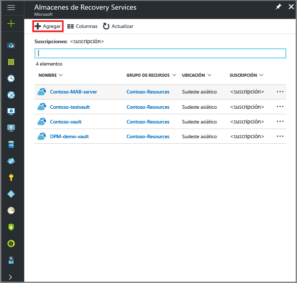

    Se abre la hoja del almacén de Recovery Services, donde se le pide que especifique los valores de **Nombre**, **Suscripción**, **Grupo de recursos** y **Ubicación**.

    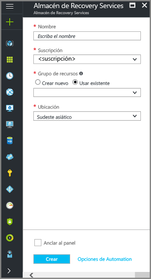

4. En **Nombre**, escriba un nombre descriptivo que identifique el almacén. El nombre debe ser único para la suscripción de Azure. Escriba un nombre que tenga entre 2 y 50 caracteres. Debe comenzar por una letra y solo puede contener letras, números y guiones.

5. En la sección **Suscripción**, utilice el menú desplegable para elegir la suscripción de Azure. Si utiliza una sola suscripción, esta aparece y puede pasar al paso siguiente. Si no está seguro de la suscripción que desea utilizar, use la suscripción predeterminada (o sugerida). Solo hay varias opciones si la cuenta de su organización está asociada a más de una suscripción de Azure.

6. En la sección **Grupo de recursos**:

    * Si desea crear un nuevo grupo de recursos, seleccione **Crear nuevo**.
    O
    * Seleccione **Use existing** (Usar existente) y haga clic en el menú desplegable para ver la lista de grupos de recursos disponibles.

  Para más información sobre los grupos de recursos, consulte [Introducción a Azure Resource Manager](../azure-resource-manager/resource-group-overview.md).

7. Haga clic en **Ubicación** para seleccionar la región geográfica del almacén. Esta elección determina la región geográfica a la que se envían los datos de copia de seguridad.

8. En la parte inferior de la hoja de almacén de recovery Services, haga clic en **Create** (Crear).

    La creación del almacén de Recovery Services puede tardar unos minutos. Supervise las notificaciones de estado de la parte superior derecha del portal. Una vez creado el almacén, aparece en la lista de almacenes de Recovery Services. Si no ve el almacén pasados unos minutos, haga clic en **Refresh** (Actualizar).

    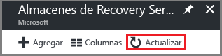 

    Cuando vea el almacén en la lista de almacenes de Recovery Services, estará listo para configurar la redundancia de almacenamiento.

### Establecimiento de la redundancia de almacenamiento para el almacén
Cuando cree un almacén de Recovery Services, asegúrese de que la configuración de la redundancia de almacenamiento sea la que quiere.

1. En la hoja **Almacenes de Recovery Services**, haga clic en el almacén nuevo.

    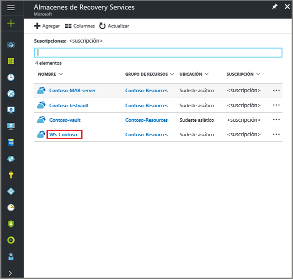

    Al seleccionar el almacén, la hoja **Almacén de Recovery Services** se delimita, y la hoja de configuración (*con el nombre del almacén en la parte superior*) y la hoja de detalles del almacén se abren.

    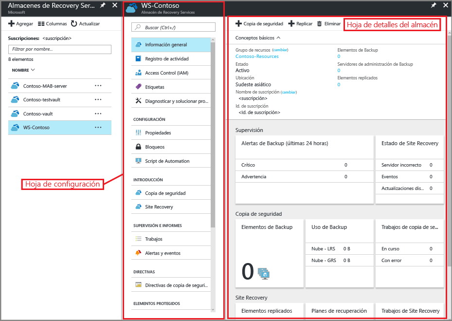
2. En la hoja de configuración del nuevo almacén, desplácese con el control deslizante vertical hasta la sección Manage (Administrar) y haga clic en **Backup Infrastructure** (Infraestructura de copia de seguridad).
    Con ello, se abrirá esta hoja.
3. En la hoja Infraestructura de copia de seguridad, haga clic en **Configuración de copia de seguridad** para abrir la hoja **Configuración de copia de seguridad**.

    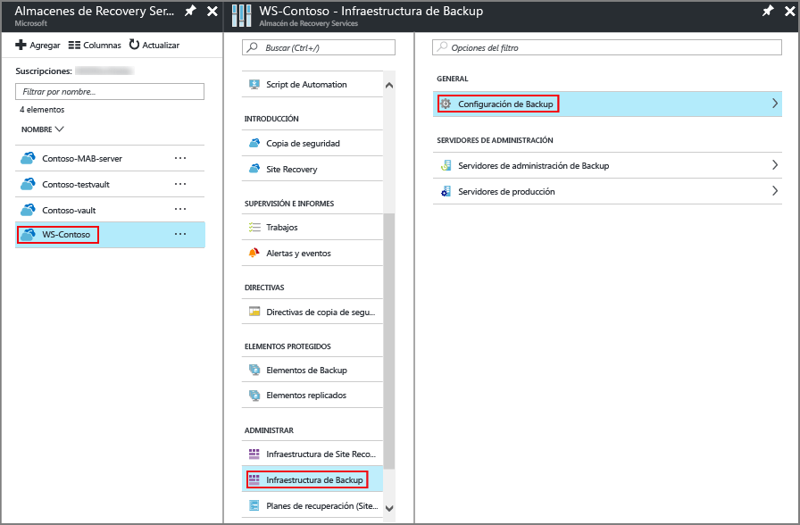
4. Elija la opción de replicación del almacenamiento apropiada para su almacén.

    

    De forma predeterminada, el almacén tiene almacenamiento con redundancia geográfica. Si usa Azure como punto de conexión de almacenamiento de copia de seguridad principal, siga utilizando **Redundancia geográfica**. Si no utiliza Azure como punto de conexión de almacenamiento de copia de seguridad principal, elija **Redundancia local** para reducir los costes de almacenamiento de Azure. En esta página de [información general sobre la redundancia del almacenamiento](../storage/common/storage-redundancy.md) encontrará más información sobre las opciones de almacenamiento con [redundancia geográfica](../storage/common/storage-redundancy.md#geo-redundant-storage) y [redundancia local](../storage/common/storage-redundancy.md#locally-redundant-storage).

Ahora que ha creado un almacén, configúrelo para realizar copias de seguridad del estado del sistema de Windows.

## Configuración del almacén
1. En la hoja del almacén de Recovery Services (el almacén que acaba de crear), en la sección de introducción, haga clic en **Copia de seguridad** y, a continuación, en la hoja **Introducción a la copia de seguridad**, seleccione **Objetivo de copia de seguridad**.

    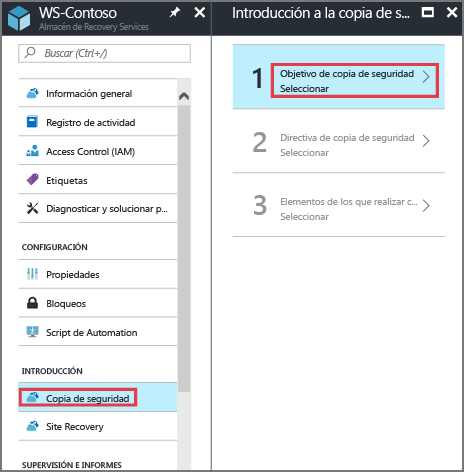

    Se abrirá la hoja **Objetivo de copia de seguridad**.

    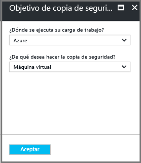

2. En el menú desplegable **¿Dónde se ejecuta su carga de trabajo?**, seleccione **Local**.

    Elija **Local** ya que su equipo Windows o Windows Server es una máquina física que no está en Azure.

3. En el menú **What do you want to backup?** (¿De qué quiere realizar una copia de seguridad?), seleccione **Estado del sistema** y haga clic en **Aceptar**.

    

    Después de hacer clic en Aceptar, aparecerá una marca de verificación junto a **Objetivo de copia de seguridad**y se abrirá la hoja **Preparar infraestructura**.

    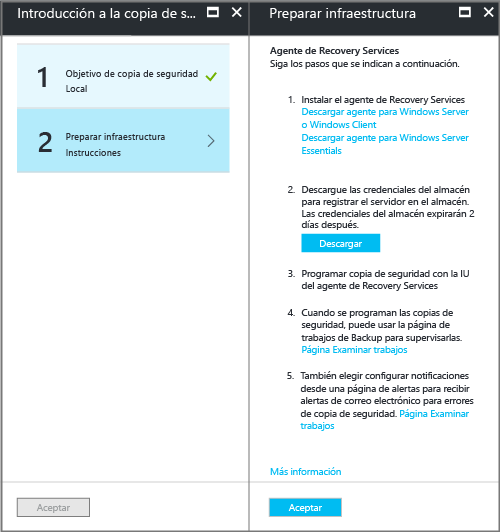

4. En la hoja **Preparar infraestructura**, haga clic en **Descargar agente para Windows Server o cliente de Windows**.

    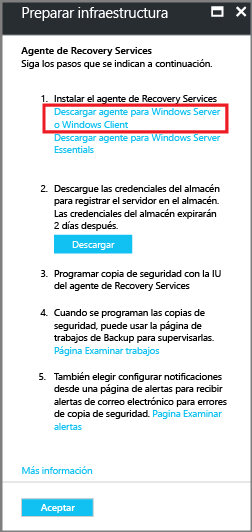

    Si usa Windows Server Essential, elija descargar el agente de Windows Server Essential. Un menú emergente le preguntará si desea ejecutar o guardar MARSAgentInstaller.exe.

    

5. Haga clic en **Guardar** en el menú emergente de descarga.

    De forma predeterminada, se guarda el archivo **MARSagentinstaller.exe** en la carpeta de descargas. Cuando haya finalizado el instalador, verá un menú emergente que le preguntará si desea ejecutar el instalador o abrir la carpeta.

    

    No es necesario instalar el agente todavía. Puede instalar el agente una vez descargadas las credenciales del almacén.

6. En la hoja **Preparar infraestructura**, haga clic en **Descargar**.

    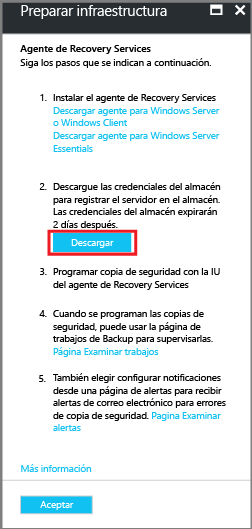

    Descargue las credenciales de almacén en la carpeta Descargas. Una vez que haya terminado de descargar las credenciales del almacén, aparecerá una ventana emergente en la que se le preguntará si desea abrirlas o guardarlas. Haga clic en **Guardar**. Si, accidentalmente, hace clic en **Abrir**, deje que el cuadro de diálogo intente abrir las credenciales de almacén. Se producirá un error. No se pueden abrir las credenciales de almacén. Siga con el paso siguiente. Las credenciales del almacén están en la carpeta de descargas.   

    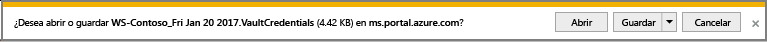
> [!NOTE]
> Las credenciales del almacén deben guardarse únicamente en una ubicación que sea local en Windows Server en la que vaya a usar el agente. 
>

## Instalación y registro del agente

> [!NOTE]
> La habilitación de la copia de seguridad a través de Azure Portal todavía no está disponible. Use el agente de Microsoft Azure Recovery Services para hacer la copia de seguridad del estado del sistema de Windows Server.
>

1. Busque y haga doble clic en **MARSagentinstaller.exe** en la carpeta de descargas (u otra ubicación guardada).

    El instalador proporciona una serie de mensajes ya que este extrae, instala y registra el agente de Recovery Services.

    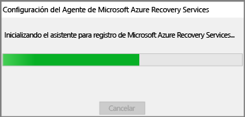

2. Complete el asistente para la instalación del agente de Microsoft Azure Recovery Services. Para completar al asistente, tendrá que hacer lo siguiente:

   * Elija una ubicación para la instalación y la carpeta de caché.
   * Proporcione la información del servidor proxy si usa un servidor proxy para conectarse a Internet.
   * Si usa un servidor proxy autenticado, escriba los detalles de nombre y contraseña del usuario.
   * Proporcione las credenciales del almacén descargado
   * Guarde la frase de contraseña en una ubicación segura.

     > [!NOTE]
     > Si pierde u olvida la frase de contraseña, Microsoft no puede ayudarle a recuperar los datos de copia de seguridad. Guarde el archivo en una ubicación segura. Es necesario restaurar una copia de seguridad.
     >
     >

Ahora está instalado el agente y el equipo está registrado en el almacén. Está listo para configurar y programar la copia de seguridad.

## Copia de seguridad del estado del sistema de Windows Server 
La copia de seguridad inicial incluye dos tareas:

* Programación de la copia de seguridad
* Hacer una copia de seguridad del estado del sistema por primera vez

Para realizar la copia de seguridad inicial use el agente de Microsoft Azure Recovery Services.

### Programación de la copia de seguridad

1. Abra el agente de Microsoft Azure Recovery Services. Para encontrarlo, busque **Microsoft Azure Backup**en la máquina.

    

2. En el agente de Recovery Services, haga clic en **Programar copia de seguridad**.

    

3. En la página de introducción del Asistente para programar copias de seguridad, haga clic en **Siguiente**.

4. En la página Seleccionar elementos de los que realizar copia de seguridad, haga clic en **Agregar elementos**.

5. Seleccione **Estado del sistema** y haga clic en **Aceptar**.

6. Haga clic en **Siguiente**.

7. Seleccione la frecuencia de copia de seguridad necesaria y la directiva de retención para las copias de seguridad de estado del sistema en las páginas siguientes. 

8. En la página Confirmación, revise la información y, luego, haga clic en **Finalizar**.

9. Cuando el asistente termine de crear la programación de copia de seguridad, haga clic en **Cerrar**.

### Para hacer una copia de seguridad del estado del sistema de Windows Server por primera vez

1. Asegúrese de que no hay actualizaciones pendientes para Windows Server que requieran un reinicio.

2. En el agente de Recovery Services, haga clic en **Back Up Now** (Iniciar copia de seguridad) para completar la propagación inicial a través de la red.

    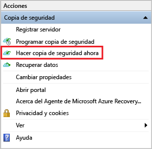

3. Seleccione **Estado del sistema** en la pantalla **Seleccionar el elemento de copia de seguridad** que aparece y haga clic en **Siguiente**.

4. En la página Confirmación, revise la configuración que el asistente para iniciar copia de seguridad usará para crear la copia de seguridad de la máquina. Luego, haga clic en **Crear copia de seguridad**.

4. Haga clic en **Cerrar** para cerrar el asistente. Si lo hace antes de que finalice la copia de seguridad, el asistente se sigue ejecutando en segundo plano.

Una vez que finalice la copia de seguridad inicial, el estado **Trabajo completado** se refleja en la consola de Copia de seguridad.

  

## ¿Tiene preguntas?
Si tiene alguna pregunta o hay alguna característica que le gustaría que se incluyera, [envíenos sus comentarios](http://aka.ms/azurebackup_feedback).

## Pasos siguientes
* Obtenga más información acerca de cómo [realizar copias de seguridad de máquinas Windows](backup-configure-vault.md).
* Ahora que ha realizado una copia de seguridad del estado del sistema de Windows Server, puede [administrar los almacenes y servidores](backup-azure-manage-windows-server.md).
* Si necesita restaurar una copia de seguridad, use este artículo: [Restaurar archivos en una máquina de Windows Server o del Cliente de Windows](backup-azure-restore-windows-server.md).
