# Copia de seguridad de máquinas virtuales de Azure en almacenes de Recovery Services

Este tutorial le guiará por los pasos necesarios para crear un almacén de Servicios de recuperación y realizar copias de seguridad de una máquina virtual (VM) de Azure. Los almacenes de Servicios de recuperación protegen:

* Máquinas virtuales implementadas en Azure Resource Manager
* Máquinas virtuales clásicas
* Máquinas virtuales de almacenamiento estándar
* Máquinas virtuales de almacenamiento premium
* Máquinas virtuales en ejecución en instancias de Managed Disks
* Máquinas virtuales cifradas mediante Azure Disk Encryption
* Copia de seguridad coherente con la aplicación de máquinas virtuales Windows mediante VSS y máquinas virtuales Linux con scripts personalizados previos a la instantánea y posteriores a la instantánea

Para más información sobre la protección de máquinas virtuales de Premium Storage, consulte el artículo sobre la [copia de seguridad y la restauración de máquinas virtuales de Premium Storage](backup-introduction-to-azure-backup.md#using-premium-storage-vms-with-azure-backup). Para más información sobre la compatibilidad con máquinas virtuales de disco administrado, consulte el artículo sobre la [copia de seguridad y la restauración de máquinas virtuales en discos administrados](backup-introduction-to-azure-backup.md#using-managed-disk-vms-with-azure-backup). Para más información sobre el marco previo y posterior al script para copias de seguridad de máquinas virtuales Linux, consulte [Copia de seguridad coherente con la aplicación de máquinas virtuales Linux con scripts previos y posteriores] (https://docs.microsoft.com/azure/backup/backup-azure-linux-app-consistent).

Para más información sobre lo que puede hacer una copia de seguridad y sobre lo que no, consulte [aquí](backup-azure-arm-vms-prepare.md#limitations-when-backing-up-and-restoring-a-vm)

> [!NOTE]
> En este tutorial se asume que tiene una máquina virtual en su suscripción de Azure y que ha tomado las medidas necesarias para que el servicio de copia de seguridad pueda acceder a dicha máquina virtual.
>
>

Dependiendo del número de máquinas virtuales que quiera proteger, puede usar diferentes puntos de partida. Si quiere hacer una copia de seguridad de varias máquinas virtuales en una operación, vaya al almacén de Recovery Services e [inicie el trabajo de copia de seguridad desde el panel del almacén](backup-azure-vms-first-look-arm.md#configure-the-backup-job-from-the-recovery-services-vault). Si quiere realizar una copia de seguridad de una sola máquina virtual, puede iniciar el trabajo de copia de seguridad desde la hoja de administración de máquinas virtuales.

## Configuración del trabajo de copia de seguridad desde la hoja de administración de máquinas virtuales

Use los pasos siguientes para configurar el trabajo de copia de seguridad desde la hoja de administración de máquinas virtuales de Azure Portal. Los pasos siguientes se aplican únicamente a máquinas virtuales de Azure Portal.

1. Inicie sesión en el [Azure Portal](https://portal.azure.com/).
2. En el menú central, haga clic en **Todos los servicios** y, en el cuadro de diálogo Filtrar, escriba **Máquinas virtuales**. A medida que escribe, se filtra la lista de recursos. Cuando vea Máquinas virtuales, selecciónelo.

  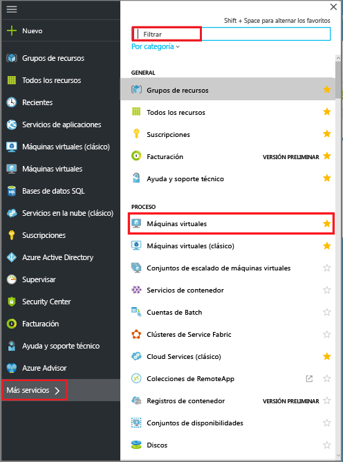

  Aparece la lista de máquinas virtuales (VM) de la suscripción.

  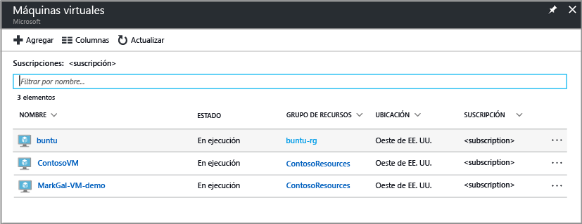

3. En la lista, seleccione la máquina virtual de la que quiere realizar una copia de seguridad.

  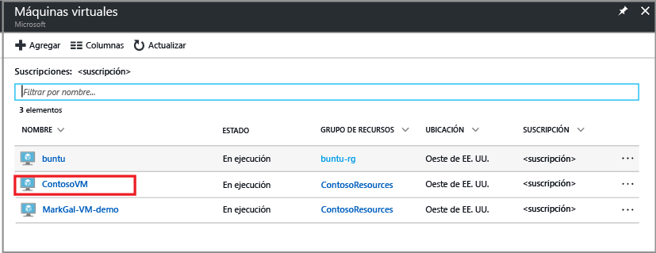

  Cuando se selecciona la máquina virtual, la lista de máquinas virtuales cambia a la izquierda y se abren la hoja de administración de máquinas virtuales y el panel de máquinas virtuales.  
 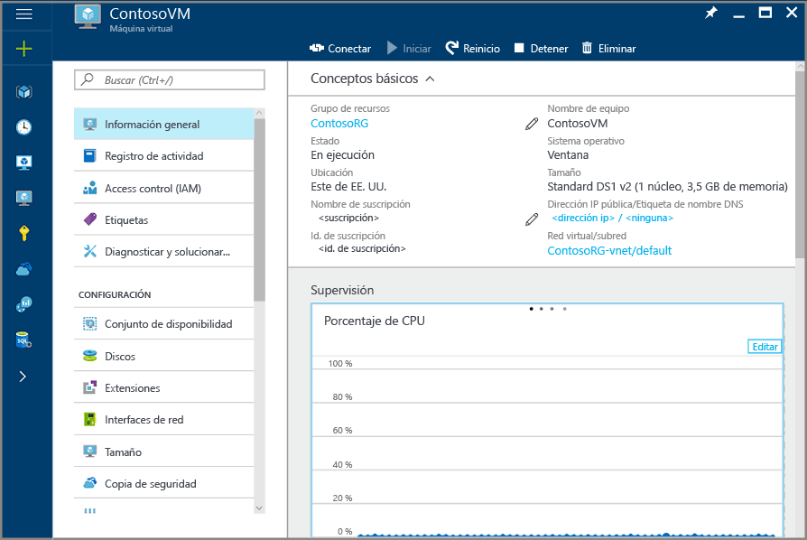

4. En la hoja de administración de máquinas virtuales, en la sección **Configuración**, haga clic en **Copia de seguridad**.  

  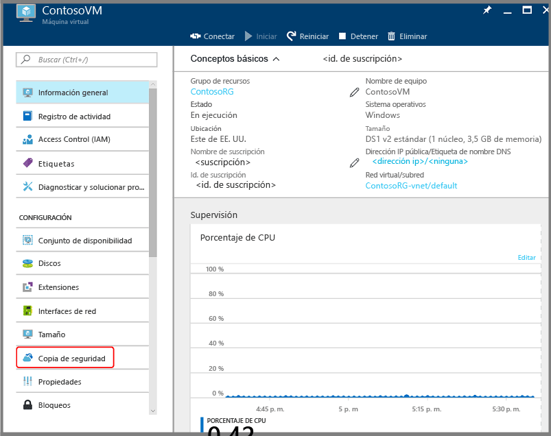

  La hoja Habilitar copia de seguridad se abre.

  

5. Para el almacén de Recovery Services, haga clic en **Seleccionar existente** y elija el almacén de la lista desplegable.

  

  Si no hay ningún almacén de Recovery Services o quiere usar uno nuevo, haga clic en **Create new** (Crear nuevo) y proporcione el nombre del nuevo almacén. Se crea un nuevo almacén en el mismo grupo de recursos y en la misma región que la máquina virtual. Si quiere crear un almacén de Recovery Services con valores diferentes, consulte la sección sobre cómo [crear un directorio de Recovery Services](backup-azure-vms-first-look-arm.md#create-a-recovery-services-vault-for-a-vm).

6. Para ver los detalles de la directiva de copia de seguridad, haga clic en **Directiva de copia de seguridad**.

  Se abre la hoja **Directiva de copia de seguridad** con los detalles de la directiva seleccionada. Si existen otras directivas, use el menú desplegable para elegir una directiva de copia de seguridad diferente. Si desea crear una directiva, seleccione **Crear nuevo** en el menú desplegable. Si quiere instrucciones para definir una directiva de copia de seguridad, consulte [Definición de una directiva de copia de seguridad](backup-azure-vms-first-look-arm.md#defining-a-backup-policy). Para guardar los cambios en la directiva de copia de seguridad y volver a la hoja Enable backup (Habilitar la copia de seguridad), haga clic en **Aceptar**.

  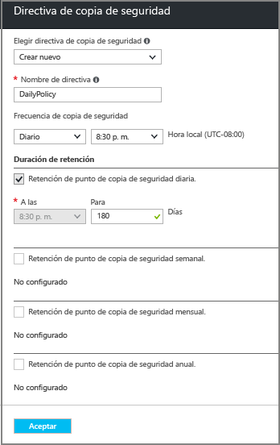

7. En la hoja Habilitar copia de seguridad, haga clic en **Habilitar copia de seguridad** para implementar la directiva. La implementación de la directiva la asocia con el almacén y las máquinas virtuales.

  

8. Puede realizar el seguimiento del progreso de la configuración mediante la notificación que aparece en el portal. En el ejemplo siguiente se muestra que se ha iniciado la implementación.

  

9. Cuando el progreso de la configuración haya finalizado, en la hoja de administración de máquinas virtuales, haga clic en **Copia de seguridad** para abrir la hoja Elemento de copia de seguridad y ver los detalles.

  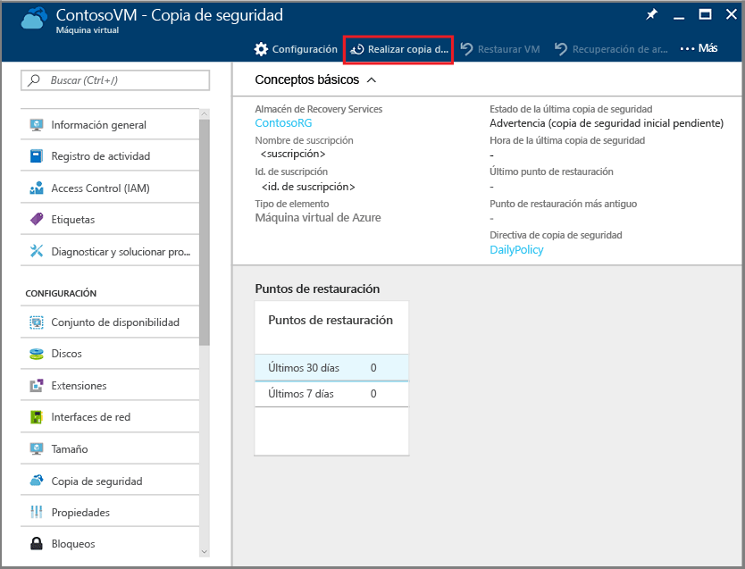

  Hasta que se haya completado la copia de seguridad inicial, el **estado de la última copia de seguridad** se muestra como **Advertencia (copia de seguridad inicial pendiente)**. Para ver cuándo se produce el siguiente trabajo de copia de seguridad programado, en **Directiva de copia de seguridad**, haga clic en el nombre de la directiva. Se abre la hoja Directiva de copia de seguridad con la hora de la copia de seguridad programada.

10. Para ejecutar un trabajo de Backup y crear el punto de recuperación inicial, en la hoja Almacén de Backup, haga clic en **Realizar copia de seguridad ahora**.

  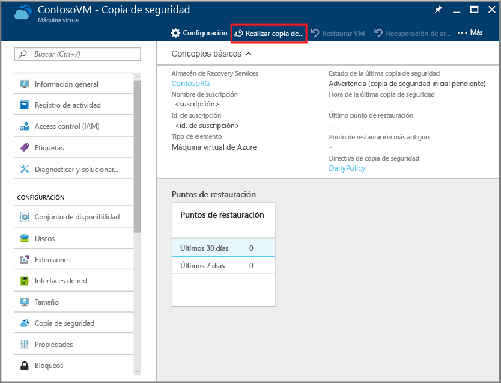

  Se abre la hoja Realizar copia de seguridad ahora.

  

11. En la hoja Realizar copia de seguridad ahora, haga clic en el icono del calendario, use el control del calendario para seleccionar el último día en el que se mantendrá este punto de recuperación y haga clic en **Copia de seguridad**.

  

  Las notificaciones de implementación le permiten saber si se ha desencadenado el trabajo de copia de seguridad y que puede supervisar el progreso del trabajo en la página de trabajos de copia de seguridad.

## Configuración del trabajo de copia de seguridad desde el almacén de Recovery Services
Para configurar el trabajo de copia de seguridad, complete los pasos siguientes.  

1. Cree un almacén de Recovery Services para una máquina virtual.
2. Use Azure Portal para seleccionar un escenario, establecer directivas de copia de seguridad e identificar los elementos que desea proteger.
3. Realizar la copia de seguridad inicial.

## Creación de un almacén de Servicios de recuperación para una máquina virtual
Un almacén de Recovery Services es una entidad que almacena todas las copias de seguridad y los puntos de recuperación creados con el tiempo. El almacén de Recovery Services contiene también la directiva de copia de seguridad que se aplica a las máquinas virtuales protegidas.

> [!NOTE]
> La copia de seguridad de máquinas virtuales es un proceso local. No se pueden hacer copias de seguridad de máquinas virtuales de una región en un almacén de Recovery Services de otra. Por lo tanto, en todas las regiones de Azure que tenga máquinas virtuales de las que se vayan a realizar copias de seguridad, debe existir al menos un almacén de Recovery Services.
>
>

Para crear un almacén de Recovery Services:

1. Si aún no lo ha hecho, inicie sesión en [Azure Portal](https://portal.azure.com/) mediante su suscripción de Azure.
2. En el menú central, haga clic en **Todos los servicios** y, en el cuadro de diálogo Filtro, escriba **Recovery Services**. A medida que escribe, se filtra la lista de recursos. Cuando vea almacenes de Recovery Services en la lista, haga clic en ellos.

      

    Si hay almacenes de Recovery Services en la suscripción, estos aparecerán en una lista.

    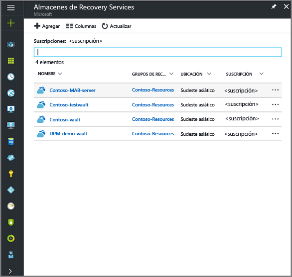
3. En el menú **Almacenes de Recovery Services**, haga clic en **Agregar**.

    

    Se abre la hoja del almacén de Recovery Services, donde se le pide que especifique los valores de **Nombre**, **Suscripción**, **Grupo de recursos** y **Ubicación**.

    

4. En **Nombre**, escriba un nombre descriptivo que identifique el almacén. El nombre debe ser único para la suscripción de Azure. Escriba un nombre que tenga entre 2 y 50 caracteres. Debe comenzar por una letra y solo puede contener letras, números y guiones.

5. En la sección **Suscripción**, utilice el menú desplegable para elegir la suscripción de Azure. Si utiliza una sola suscripción, esta aparece y puede pasar al paso siguiente. Si no está seguro de la suscripción que desea utilizar, use la suscripción predeterminada (o sugerida). Solo hay varias opciones si la cuenta de su organización está asociada a más de una suscripción de Azure.

6. En la sección **Grupo de recursos**:

    * Si desea crear un nuevo grupo de recursos, seleccione **Crear nuevo**.
    o
    * Seleccione **Use existing** (Usar existente) y haga clic en el menú desplegable para ver la lista de grupos de recursos disponibles.

  Para más información sobre los grupos de recursos, consulte [Introducción a Azure Resource Manager](../azure-resource-manager/resource-group-overview.md).

7. Haga clic en **Ubicación** para seleccionar la región geográfica del almacén. Esta elección determina la región geográfica a la que se envían los datos de copia de seguridad.

  > [!IMPORTANT]
  > Si no está seguro de la región en que se encuentra la máquina virtual, cierre el cuadro de diálogo de creación del almacén y vaya a la lista de máquinas virtuales del portal. Si tiene máquinas virtuales en varias regiones, cree un almacén de Recovery Services en cada una de ellas. Cree el almacén en la primera región antes de pasar a la siguiente. No es necesario especificar las cuentas de almacenamiento usadas para almacenar los datos de copia de seguridad (el almacén de Recovery Services y el servicio Azure Backup controlarán automáticamente el almacenamiento).
  >

8. En la parte inferior de la hoja de almacén de recovery Services, haga clic en **Create** (Crear).

    La creación del almacén de Recovery Services puede tardar unos minutos. Supervise las notificaciones de estado de la parte superior derecha del portal. Una vez creado el almacén, aparece en la lista de almacenes de Recovery Services. Si no ve el almacén pasados unos minutos, haga clic en **Refresh** (Actualizar).

     

    Cuando vea el almacén en la lista de almacenes de Recovery Services, estará listo para configurar la redundancia de almacenamiento.

Ahora que ha creado el almacén, aprenda a configurar la replicación de almacenamiento.

### Configuración de la replicación de almacenamiento
La opción de replicación de almacenamiento permite elegir entre almacenamiento con redundancia geográfica y almacenamiento con redundancia local. De forma predeterminada, el almacén tiene almacenamiento con redundancia geográfica. Si el almacén de Recovery Services es la copia de seguridad principal, deje la opción de replicación de almacenamiento establecida en almacenamiento con redundancia geográfica. Elija un almacenamiento con redundancia local si desea una opción más económica que no sea tan duradera. Para más información sobre las opciones de almacenamiento [con redundancia geográfica](../storage/common/storage-redundancy.md#geo-redundant-storage) y [con redundancia local](../storage/common/storage-redundancy.md#locally-redundant-storage), consulte [Replicación de Azure Storage](../storage/common/storage-redundancy.md).

Para editar la configuración de replicación de almacenamiento:

1. En la hoja **Almacenes de Recovery Services**, seleccione un almacén nuevo.

  

  Al seleccionar el almacén, la hoja Configuración (*con el nombre del almacén en la parte superior*) y la hoja de detalles del almacén se abren.

  

2. En la hoja de configuración del nuevo almacén, desplácese con el control deslizante vertical hasta la sección Manage (Administrar) y haga clic en **Backup Infrastructure** (Infraestructura de copia de seguridad).
    Con ello, se abrirá esta hoja.
3. En la hoja Infraestructura de copia de seguridad, haga clic en **Configuración de copia de seguridad** para abrir la hoja **Configuración de copia de seguridad**.

    
4. Elija la opción de replicación del almacenamiento apropiada para su almacén.

    

    De forma predeterminada, el almacén tiene almacenamiento con redundancia geográfica. Si usa Azure como punto de conexión de almacenamiento de copia de seguridad principal, siga utilizando **Redundancia geográfica**. Si no utiliza Azure como punto de conexión de almacenamiento de copia de seguridad principal, elija **Redundancia local** para reducir los costes de almacenamiento de Azure. En esta página de [información general sobre la redundancia del almacenamiento](../storage/common/storage-redundancy.md) encontrará más información sobre las opciones de almacenamiento con [redundancia geográfica](../storage/common/storage-redundancy.md#geo-redundant-storage) y [redundancia local](../storage/common/storage-redundancy.md#locally-redundant-storage).

## Selección de un objetivo de copia de seguridad, establecimiento de la directiva y definición de los elementos para proteger
Antes de registrar una máquina virtual en un almacén, ejecute el proceso de detección para asegurarse de que se identifican todas las nuevas máquinas virtuales que se hayan agregado a la suscripción. El proceso consulta a Azure para recibir la lista de máquinas virtuales incluidas en la suscripción, junto con información adicional, como el nombre del servicio en la nube y la región. En el Portal de Azure, el escenario se refiere a lo que va a colocar en el almacén de servicios de recuperación. Directiva es la programación de la frecuencia y de cuándo se eligen los puntos de recuperación. La directiva también incluye el intervalo de retención de los puntos de recuperación.

1. Si ya tiene abierto un almacén de Servicios de recuperación, vaya al paso 2. En caso contrario, haga clic en **Todos los servicios**. Escriba **Recovery Services** y haga clic en **Almacenes de Recovery Services**.

      

    Aparece la lista de almacenes de Servicios de recuperación.

    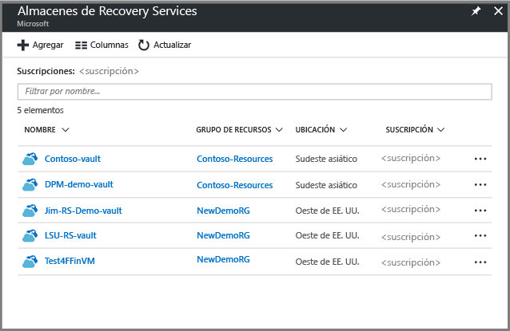

    En la lista de almacenes de Recovery Services, seleccione un almacén para abrir su panel.

     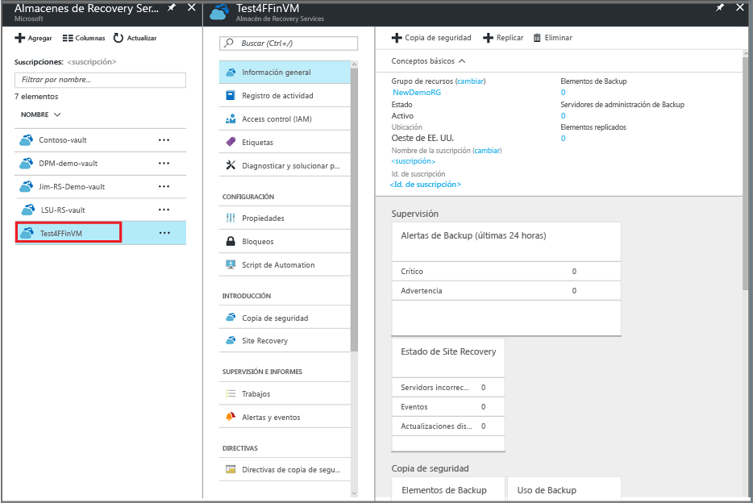

2. En el menú del panel del almacén, haga clic en **Copia de seguridad** para abrir la hoja Copia de seguridad.

    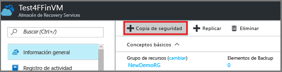

    Se abren las hojas Copia de seguridad y Objetivo de copia de seguridad.

    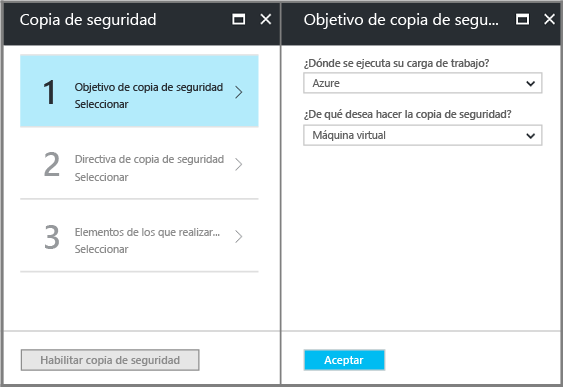
3. En la hoja Objetivo de copia de seguridad, en el menú desplegable **¿Dónde se ejecuta su carga de trabajo?**, elija Azure. En la lista desplegable **What do you want to backup** (¿De qué quiere realizar una copia de seguridad?), elija Máquina virtual y luego haga clic en **Aceptar**.

    Estas acciones permiten registrar la extensión de la máquina virtual con el almacén. La hoja Objetivo de copia de seguridad se cierra y se abre la hoja **Directiva de copia de seguridad**.

    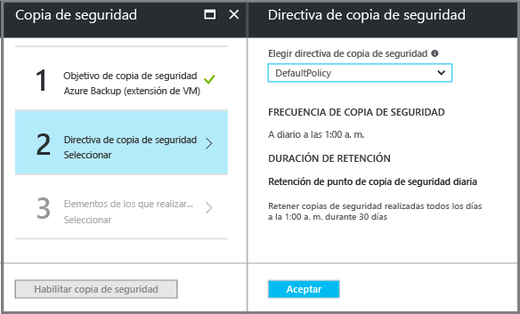

4. En la hoja Directiva de copia de seguridad, seleccione la que quiera aplicar al almacén.

    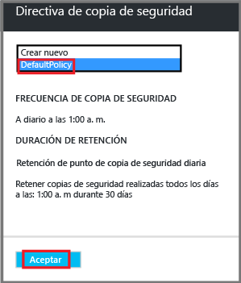

    Los detalles de la directiva predeterminada se muestran en el menú desplegable. Si desea crear una directiva, seleccione **Crear nuevo** en el menú desplegable. Si quiere instrucciones para definir una directiva de copia de seguridad, consulte [Definición de una directiva de copia de seguridad](backup-azure-vms-first-look-arm.md#defining-a-backup-policy).
    Haga clic en **Aceptar** para asociar la directiva de copia de seguridad con el almacén.

    La hoja Objetivo de copia de seguridad se cierra y se abre la hoja **Seleccionar máquinas virtuales**.
5. En la hoja **Seleccionar máquinas virtuales**, elija las máquinas virtuales que se asociarán con la directiva especificada y haga clic en **Aceptar**.

    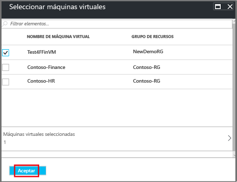

    Se valida la máquina virtual seleccionada. Si no ve las máquinas virtuales que espera ver, compruebe que existen en la misma ubicación de Azure que el almacén de Recovery Services y que no estén ya protegidas. La ubicación del almacén de Recovery Services se muestra en el panel del almacén.

6. Ahora que ha definido toda la configuración del almacén, en la hoja Copia de seguridad, haga clic en **Habilitar copia de seguridad** para implementar la directiva en el almacén y en las máquinas virtuales. La implementación de la directiva de copia de seguridad no crea el punto de recuperación inicial para la máquina virtual.

    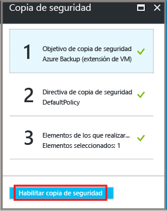

Después de habilitar correctamente la copia de seguridad, la directiva de copia de seguridad se ejecutará en la programación. Sin embargo, proceda a iniciar el primer trabajo de copia de seguridad.

## Copia de seguridad inicial
Una vez que se ha implementado una directiva de copia de seguridad en la máquina virtual, no significa que se copiarán los datos. De forma predeterminada, la primera copia de seguridad programada (tal y como se define en la directiva de copia de seguridad) es la copia de seguridad inicial. Hasta que se realice la copia de seguridad inicial, el estado de la última copia aparecerá como **Advertencia (copia de seguridad inicial pendiente)** en la hoja **Trabajos de copia de seguridad**.

A menos que la copia de seguridad inicial vaya a comenzar pronto, se recomienda ejecutar **Hacer ahora una copia de seguridad**.

Para ejecutar el trabajo de copia de seguridad inicial:

1. En el panel del almacén, haga clic en el número situado bajo **Elementos de copia de seguridad** o haga clic en el icono **Elementos de copia de seguridad**.  
  

  Se abrirá la hoja **Elementos de copia de seguridad** .

  

2. En la hoja **Elementos de copia de seguridad**, seleccione el elemento.

  

  Se abrirá la lista **Elementos de copia de seguridad**.  

  

3. En la lista **Elementos de copia de seguridad**, haga clic en el botón de puntos suspensivos **...** para abrir el menú contextual.

  

  Aparece el menú contextual.

  

4. En el menú contextual, haga clic en **Realizar copia de seguridad ahora**.

  

  Se abre la hoja Realizar copia de seguridad ahora.

  

5. En la hoja Realizar copia de seguridad ahora, haga clic en el icono del calendario, use el control del calendario para seleccionar el último día en el que se mantendrá este punto de recuperación y haga clic en **Copia de seguridad**.

  

  Las notificaciones de implementación le permiten saber si se ha desencadenado el trabajo de copia de seguridad y que puede supervisar el progreso del trabajo en la página de trabajos de copia de seguridad. Según el tamaño de la máquina virtual, la creación de la copia de seguridad inicial puede tardar un tiempo.

6. Para ver o realizar el seguimiento del estado de la copia de seguridad inicial, en el panel del almacén, en el icono **Trabajos de Backup**, haga clic en **En curso**.

  

  Se abrirá la hoja Trabajos de copia de seguridad.

  

  En la hoja **Trabajos de copia de seguridad** , puede ver el estado de todos los trabajos. Compruebe si el trabajo de copia de seguridad para la máquina virtual aún está en curso o si se ha terminado. Cuando finalice un trabajo de copia de seguridad, el estado será *Completado*.

  > [!NOTE]
  > Como parte de la operación de copia de seguridad, el servicio Azure Backup emite un comando a la extensión de copia de seguridad en cada máquina virtual para vaciar toda la escritura y tomar una instantánea coherente.
  >
  >

[!INCLUDE [backup-create-backup-policy-for-vm](../../includes/backup-create-backup-policy-for-vm.md)]

## Instale el agente de máquina virtual en la máquina virtual.
Esta información se proporciona en caso de que sea necesaria. El agente de máquina virtual de Azure se debe instalar en la máquina virtual de Azure para que funcione la extensión de copia de seguridad. Sin embargo, si la máquina virtual se creó desde la galería de Azure, el agente de máquina virtual ya está presente en la máquina virtual. Las máquinas virtuales que se migran desde centros de datos locales no tienen instalado el agente de máquina virtual. En ese caso, el agente de máquina virtual debe instalarse explícitamente. Si tiene problemas para realizar una copia de seguridad de la máquina virtual de Azure, asegúrese de que el agente de máquina virtual de Azure está instalado correctamente en la máquina virtual (consulte la tabla siguiente). Si crea una máquina virtual personalizada, instale el agente de máquina virtual antes de aprovisionarla.

Obtenga información acerca del [agente de máquina virtual](https://go.microsoft.com/fwLink/?LinkID=390493&clcid=0x409) y [cómo instalarlo](../virtual-machines/windows/classic/manage-extensions.md?toc=%2fazure%2fvirtual-machines%2fwindows%2fclassic%2ftoc.json).

La tabla siguiente proporciona información adicional acerca del agente de máquina virtual para las máquinas virtuales de Windows y Linux.

| **operación** | **Windows** | **Linux** |
| --- | --- | --- |
| Instalación del agente de la máquina virtual |<li>Descargue e instale el [MSI del agente](http://go.microsoft.com/fwlink/?LinkID=394789&clcid=0x409). Para completar la instalación, necesita privilegios de administrador. <li>[Actualice la propiedad de la máquina virtual](http://blogs.msdn.com/b/mast/archive/2014/04/08/install-the-vm-agent-on-an-existing-azure-vm.aspx) para indicar que el agente está instalado. |<li> Instale el [agente de Linux](https://github.com/Azure/WALinuxAgent) más reciente desde GitHub. Para completar la instalación, necesita privilegios de administrador. <li> [Actualice la propiedad de la máquina virtual](http://blogs.msdn.com/b/mast/archive/2014/04/08/install-the-vm-agent-on-an-existing-azure-vm.aspx) para indicar que el agente está instalado. |
| Actualización del agente de la máquina virtual |Actualizar el agente de la máquina virtual es tan sencillo como volver a instalar los [archivos binarios del agente de la máquina virtual](http://go.microsoft.com/fwlink/?LinkID=394789&clcid=0x409).  Asegúrese de que no se está ejecutando ninguna operación de copia de seguridad mientras se actualiza el agente de la máquina virtual. |Siga las instrucciones para [actualizar el agente de máquina virtual Linux](../virtual-machines/linux/update-agent.md?toc=%2fazure%2fvirtual-machines%2flinux%2ftoc.json).  Asegúrese de que no se está ejecutando ninguna operación de copia de seguridad mientras se actualiza el agente de la máquina virtual. |
| Validación de la instalación del agente de máquina virtual |<li>Acceda a la carpeta *C:\WindowsAzure\Packages* de la máquina virtual de Azure. <li>El archivo WaAppAgent.exe debe estar ahí.<li> Haga clic con el botón derecho en el archivo, desplácese hasta **Propiedades** y seleccione la pestaña **Detalles**. En el campo de versión del producto, debe aparecer el valor 2.6.1198.718 o uno superior. |N/D |

### Extensión de Backup
Una vez que el agente de máquina virtual está instalado en la máquina virtual, el servicio Azure Backup instala la extensión de copia de seguridad en el agente de máquina virtual. El servicio Azure Backup actualiza y aplica revisiones perfectamente a la extensión de copia de seguridad sin la intervención del usuario.

El servicio Backup instalará la extensión de la copia de seguridad, incluso si no se está ejecutando la máquina virtual. Una máquina virtual en ejecución ofrece más probabilidad de obtener un punto de recuperación coherente con la aplicación. Sin embargo, el servicio Azure Backup sigue realizando la copia de seguridad de la máquina virtual aunque esté apagada y no haya sido posible instalar la extensión. Este tipo de copia de seguridad se conoce como máquina virtual sin conexión y el punto de recuperación es *coherente frente a bloqueos*.

## Información para solución de problemas
Si tiene problemas para realizar cualquiera de las tareas de este artículo, consulte la [guía de solución de problemas](backup-azure-vms-troubleshoot.md).

## Precios
El costo de la copia de seguridad de máquinas virtuales de Azure se basa en el número de instancias protegidas. Para obtener una definición de una instancia protegida, consulte [Descripción de una instancia protegida](backup-introduction-to-azure-backup.md#what-is-a-protected-instance). Para obtener un ejemplo de cálculo del costo de copia de seguridad de una máquina virtual, consulte [¿Cómo se calculan las instancias protegidas?](backup-azure-vms-introduction.md#calculating-the-cost-of-protected-instances). Consulte la página de precios de Azure Backup para obtener información acerca de los [precios de Backup](https://azure.microsoft.com/pricing/details/backup/).

## ¿Tiene preguntas?
Si tiene alguna pregunta o hay alguna característica que le gustaría que se incluyera, [envíenos sus comentarios](http://aka.ms/azurebackup_feedback).
