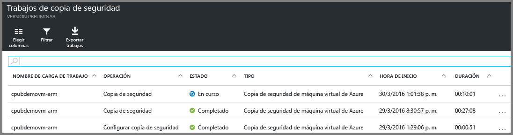

<properties
	pageTitle="Primer análisis: copia de seguridad de máquinas virtuales de Azure con ARM en un almacén de Servicios de recuperación | Microsoft Azure"
	description="Copia de seguridad de máquinas virtuales de Azure con ARM en un almacén de Servicios de recuperación. Use copias de seguridad de máquinas virtuales implementadas con Resource Manager, máquinas virtuales implementadas con el modelo clásico y máquinas virtuales con Almacenamiento premium para proteger los datos. Cree y registre un almacén de Servicios de recuperación. Registre máquinas virtuales, cree directivas y proteja máquinas virtuales en Azure."
	services="backup"
	documentationCenter=""
	authors="markgalioto"
	manager="cfreeman"
	editor=""
	keyword="backups; vm backup"/>

<tags
	ms.service="backup"
	ms.workload="storage-backup-recovery"
	ms.tgt_pltfrm="na"
	ms.devlang="na"
	ms.topic="hero-article"
	ms.date="09/15/2016"
	ms.author="markgal; jimpark"/>

# Primer análisis: protección de máquinas virtuales con un almacén de Recovery Services

> [AZURE.SELECTOR]
- [Protección de máquinas virtuales con un almacén de Recovery Services](backup-azure-vms-first-look-arm.md)
- [Protección de máquinas virtuales con un almacén de copia de seguridad](backup-azure-vms-first-look.md)

Este tutorial le guiará por los pasos necesarios para crear un almacén de Servicios de recuperación y realizar copias de seguridad de una máquina virtual (VM) de Azure. Los almacenes de Servicios de recuperación protegen:

- Máquinas virtuales implementadas en Azure Resource Manager
- Máquinas virtuales clásicas
- Máquinas virtuales de almacenamiento estándar
- Máquinas virtuales de almacenamiento premium
- Máquinas virtuales cifradas mediante Cifrado de discos de Azure, con BEK y KEK (compatible con PowerShell)

Para más información acerca de las máquinas virtuales de Premium Storage, consulte [Copia de seguridad y restauración de máquinas virtuales de Premium Storage](backup-introduction-to-azure-backup.md#back-up-and-restore-premium-storage-vms)

>[AZURE.NOTE] En este tutorial se asume que tiene una máquina virtual en su suscripción de Azure y que ha tomado las medidas necesarias para que el servicio de copia de seguridad pueda acceder a dicha máquina virtual.

[AZURE.INCLUDE [learn-about-Azure-Backup-deployment-models](../../includes/backup-deployment-models.md)]

A un nivel alto, estos son los pasos que debe completar.

1. Creación de un almacén de Servicios de recuperación para una máquina virtual.
2. Usar el Portal de Azure para seleccionar un escenario, establecer directivas e identificar los elementos para proteger.
3. Realizar la copia de seguridad inicial.

## Creación de un almacén de Servicios de recuperación para una máquina virtual

Un almacén de Servicios de recuperación es una entidad que almacena todas las copias de seguridad y los puntos de recuperación creados con el tiempo. El almacén de Servicios de recuperación también contiene la directiva de copia de seguridad que se aplica a las máquinas virtuales protegidas.

>[AZURE.NOTE] La copia de seguridad de máquinas virtuales es un proceso local. No se pueden hacer copias de seguridad de máquinas virtuales de una ubicación en un almacén de Servicios de recuperación que esté en otra ubicación. Por lo tanto, en cada ubicación de Azure que tenga máquinas virtuales de las que se va a realizar copias de seguridad debe existir al menos un almacén de Servicios de recuperación.

Para crear un almacén de Servicios de recuperación:

1. Inicie sesión en el [Portal de Azure](https://portal.azure.com/).

2. En el menú del centro, haga clic en **Examinar** y, en la lista de recursos, escriba **Servicios de recuperación**. Cuando comience a escribir, la lista se filtrará en función de la entrada. Haga clic en **Almacén de Servicios de recuperación**.

      

    Se muestra la lista de almacenes de Servicios de recuperación.

3. En el menú **Almacenes de Servicios de recuperación**, haga clic en **Agregar**.

    

    Se abre la hoja del almacén de Servicios de recuperación, donde se le pide que proporcione los valores de **Nombre**, **Suscripción**, **Grupo de recursos** y **Ubicación**.

    

4. En **Nombre**, escriba un nombre descriptivo que identifique el almacén. El nombre debe ser único para la suscripción de Azure. Escriba un nombre que tenga entre 2 y 50 caracteres. Debe comenzar por una letra y solo puede contener letras, números y guiones.

5. Haga clic en **Suscripción** para ver la lista de suscripciones disponibles. Si no está seguro de la suscripción que desea utilizar, use la suscripción predeterminada (o sugerida). Solo hay varias opciones si la cuenta de su organización está asociada a más de una suscripción de Azure.

6. Haga clic en **Grupo de recursos** para ver la lista de grupos de recursos disponibles, o bien haga clic en **Nuevo** para crear uno. Para una información completa sobre los grupos de recursos, consulte [Información general de Azure Resource Manager](../resource-group-overview.md).

7. Haga clic en **Ubicación** para seleccionar la región geográfica del almacén. El almacén **debe** estar en la misma región que las máquinas virtuales que desea proteger.

    >[AZURE.IMPORTANT] Si no está seguro de en qué ubicación existe la máquina virtual, cierre el cuadro de diálogo de creación del almacén y vaya a la lista de máquinas virtuales del portal. Si tiene máquinas virtuales en varias regiones, cree un almacén de Recovery Services en cada una de ellas. Cree el almacén en la primera ubicación antes de pasar a la siguiente ubicación. No es necesario especificar cuentas de almacenamiento para almacenar los datos de copia de seguridad (el almacén de Servicios de recuperación y el servicio Copia de seguridad de Azure lo controlarán automáticamente).

8. Haga clic en **Crear**. La creación del almacén de Servicios de recuperación puede tardar unos minutos. Supervise las notificaciones de estado en la parte superior derecha del portal. Una vez creado el almacén, aparece en la lista de almacenes de Servicios de recuperación.

    

Ahora que ha creado el almacén, aprenda a configurar la replicación de almacenamiento.

### Configuración de la replicación de almacenamiento

La opción de replicación de almacenamiento permite elegir entre almacenamiento con redundancia geográfica y almacenamiento con redundancia local. De forma predeterminada, el almacén tiene almacenamiento con redundancia geográfica. Si esta es su copia de seguridad principal, elija el almacenamiento con redundancia geográfica. Elija un almacenamiento con redundancia local si desea una opción más económica que no sea tan duradera. Para más información sobre las opciones de almacenamiento con [redundancia geográfica](../storage/storage-redundancy.md#geo-redundant-storage) y [local](../storage/storage-redundancy.md#locally-redundant-storage) consulte la [información general de replicación de Almacenamiento de Azure](../storage/storage-redundancy.md).

Para editar la configuración de replicación de almacenamiento:

1. Seleccione el almacén para abrir su panel y la hoja de configuración. Si la hoja **Configuración** no se abre, haga clic en **Toda la configuración** en el panel del almacén.

2. En la hoja **Configuración**, haga clic en **Infraestructura de copia de seguridad** > **Configuración de copia de seguridad** para abrir la hoja **Configuración de copia de seguridad**. En la hoja **Configuración de copia de seguridad**, elija la opción de replicación de almacenamiento para su almacén.

    

    Tras elegir la opción de almacenamiento del almacén, está listo para asociar la máquina virtual con el almacén. Para comenzar la asociación, es preciso detectar y registrar las máquinas virtuales de Azure.

## Selección de un objetivo de copia de seguridad, establecimiento de la directiva y definición de los elementos para proteger

Antes de registrar una máquina virtual en un almacén, ejecute el proceso de detección para asegurarse de que se identifican todas las nuevas máquinas virtuales que se hayan agregado a la suscripción. El proceso consulta a Azure para recibir la lista de máquinas virtuales incluidas en la suscripción, junto con información adicional, como el nombre del servicio en la nube y la región. En el Portal de Azure, el escenario se refiere a lo que va a colocar en el almacén de servicios de recuperación. Directiva es la programación de la frecuencia y de cuándo se eligen los puntos de recuperación. La directiva también incluye el intervalo de retención de los puntos de recuperación.

1. Si ya tiene abierto un almacén de Servicios de recuperación, vaya al paso 2. Si no tiene abierto un almacén de Servicios de recuperación, pero está en el Portal de Azure, en el menú central, haga clic en **Examinar**.

  - En la lista de recursos, escriba **Servicios de recuperación**.
  - Cuando comience a escribir, la lista se filtrará en función de la entrada. Haga clic en **Almacenes de servicios de recuperación** cuando lo vea.

      

    Aparece la lista de almacenes de Servicios de recuperación.
  - En la lista de almacenes de Servicios de recuperación, seleccione uno de ellos.

    Se abre el panel del almacén seleccionado.

    

2. En el menú del panel del almacén, haga clic en **Copia de seguridad** para abrir la hoja Copia de seguridad.

    

    Cuando se abre la hoja, el servicio Copia de seguridad busca las máquinas virtuales nuevas en la suscripción.

    

3. En la hoja Copia de seguridad, haga clic en **Objetivo de copia de seguridad** para abrir la hoja del mismo nombre.

    

4. En la hoja Objetivo de copia de seguridad, establezca **¿Dónde se ejecuta su carga de trabajo?** en Azure y **¿De qué quiere realizar una copia de seguridad?** en Máquina virtual, y haga clic en **Aceptar**.

    La hoja Backup Goal (Objetivo de la copia de seguridad) se cierra y se abre la hoja Directiva de copia de seguridad.

    

5. En la hoja Directiva de copia de seguridad, seleccione la que quiera aplicar al almacén y haga clic en **Aceptar**.

    

    En los detalles se muestran los datos de la directiva predeterminada. Si desea crear una directiva, seleccione **Crear nuevo** en el menú desplegable. El menú desplegable también proporciona una opción para cambiar la hora a la que se tomó la instantánea, a las 19:00. Si quiere instrucciones para definir una directiva de copia de seguridad, consulte [Definición de una directiva de copia de seguridad](backup-azure-vms-first-look-arm.md#defining-a-backup-policy). Al hacer clic en **Aceptar**, la directiva de copia de seguridad se asocia con el almacén.

    A continuación, elija las máquinas virtuales que se asociarán con el almacén.

6. Elija las máquinas virtuales que se asociarán con la directiva especificada y haga clic en **Seleccionar**.

    

    Si aún no ve la máquina virtual, compruebe que existe en la misma ubicación de Azure que el almacén de Servicios de recuperación.

7. Ahora que ha definido toda la configuración del almacén, en la hoja Copia de seguridad, haga clic en **Habilitar copia de seguridad** en la parte inferior de la página. La directiva se implementa en el almacén y en las máquinas virtuales.

    

## Copia de seguridad inicial

Una vez que se ha implementado una directiva de copia de seguridad en la máquina virtual, no significa que se copiarán los datos. De forma predeterminada, la primera copia de seguridad programada (tal y como se define en la directiva de copia de seguridad) es la copia de seguridad inicial. Hasta que se realice la copia de seguridad inicial, el estado de la última copia de seguridad en la hoja **Trabajos de copia de seguridad** se muestra como **Advertencia (copia de seguridad inicial pendiente)**.

A menos que la copia de seguridad inicial vaya a comenzar pronto, se recomienda ejecutar **Hacer ahora una copia de seguridad **.

Para ejecutar **Realizar copia de seguridad ahora**:

1. En el panel del almacén, en el icono **Copia de seguridad**, haga clic en **Máquinas virtuales de Azure**.   

    Se abrirá la hoja **Elementos de copia de seguridad**.

2. En la hoja **Elementos de copia de seguridad**, haga clic con el botón derecho en el almacén del que quiera realizar la copia de seguridad y haga clic en **Realizar copia de seguridad ahora**.

    

    Se desencadena el trabajo de copia de seguridad.  

    

3. Para ver si la copia de seguridad inicial se ha completado, en el panel del almacén, en el icono **Trabajos de copia de seguridad**, haga clic en **Máquinas virtuales de Azure**.

    

    Se abrirá la hoja Trabajos de copia de seguridad.

4. En la hoja Trabajos de copia de seguridad, puede ver el estado de todos los trabajos.

    

    >[AZURE.NOTE] Como parte de la operación de copia de seguridad, el servicio Azure Backup emite un comando a la extensión de copia de seguridad en cada máquina virtual para vaciar toda la escritura y tomar una instantánea coherente.

    Cuando finalice el trabajo de copia de seguridad, el estado será *Completado*.

[AZURE.INCLUDE [backup-create-backup-policy-for-vm](../../includes/backup-create-backup-policy-for-vm.md)]

## Instale el agente de máquina virtual en la máquina virtual.

Esta información se proporciona en caso de que sea necesaria. El agente de máquina virtual de Azure se debe instalar en la máquina virtual de Azure para que funcione la extensión de copia de seguridad. Sin embargo, si la máquina virtual se creó desde la galería de Azure, el agente de máquina virtual ya está presente en la máquina virtual. Las máquinas virtuales que se migran desde centros de datos locales no tienen instalado el agente de máquina virtual. En ese caso, el agente de máquina virtual debe instalarse explícitamente. Si tiene problemas para realizar una copia de seguridad de la máquina virtual de Azure, asegúrese de que el agente de máquina virtual de Azure está instalado correctamente en la máquina virtual (consulte la tabla siguiente). Si crea una máquina virtual personalizada, [asegúrese de que la casilla **Instalar el agente de máquina virtual** esté activada](../virtual-machines/virtual-machines-windows-classic-agents-and-extensions.md) antes de aprovisionar la máquina virtual.

Obtenga información acerca del [Agente de máquina virtual](https://go.microsoft.com/fwLink/?LinkID=390493&clcid=0x409) y de [cómo instalarlo](../virtual-machines/virtual-machines-windows-classic-manage-extensions.md).

La tabla siguiente proporciona información adicional acerca del agente de máquina virtual para las máquinas virtuales de Windows y Linux.

| **Operación** | **Windows** | **Linux** |
| --- | --- | --- |
| Instalación del agente de la máquina virtual | <li>Descargue e instale el [MSI del agente](http://go.microsoft.com/fwlink/?LinkID=394789&clcid=0x409). Para completar la instalación, necesita privilegios de administrador. <li>[Actualice la propiedad de la máquina virtual](http://blogs.msdn.com/b/mast/archive/2014/04/08/install-the-vm-agent-on-an-existing-azure-vm.aspx) para indicar que el agente está instalado. | <li> Instale el [agente de Linux](https://github.com/Azure/WALinuxAgent) más reciente desde GitHub. Para completar la instalación, necesita privilegios de administrador. <li> [Actualice la propiedad de la máquina virtual](http://blogs.msdn.com/b/mast/archive/2014/04/08/install-the-vm-agent-on-an-existing-azure-vm.aspx) para indicar que el agente está instalado. |
| Actualización del agente de la máquina virtual | Actualizar el agente de la máquina virtual es tan sencillo como volver a instalar los [archivos binarios del agente de la máquina virtual](http://go.microsoft.com/fwlink/?LinkID=394789&clcid=0x409).  Asegúrese de que no se está ejecutando ninguna operación de copia de seguridad mientras se actualiza el agente de la máquina virtual. | Siga las instrucciones para [actualizar el agente de máquina virtual Linux](../virtual-machines-linux-update-agent.md).  Asegúrese de que no se está ejecutando ninguna operación de copia de seguridad mientras se actualiza el agente de la máquina virtual. |
| Validación de la instalación del agente de máquina virtual | <li>Vaya a la carpeta *C:\\WindowsAzure\\Packages* de la máquina virtual de Azure. <li>El archivo WaAppAgent.exe debe estar ahí.<li> Haga clic con el botón derecho en el archivo, vaya a **Propiedades** y, luego, seleccione la pestaña **Detalles**. En el campo de versión del producto, debe aparecer el valor 2.6.1198.718 o uno superior. | N/D |

### Extensión de copia de seguridad

Una vez que el agente de máquina virtual está instalado en la máquina virtual, el servicio Copia de seguridad de Azure instala la extensión de copia de seguridad en el agente de máquina virtual. El servicio Copia de seguridad de Azure actualiza y aplica revisiones perfectamente a la extensión de copia de seguridad sin la intervención del usuario.

El servicio Backup instala la extensión de copia de seguridad si la máquina virtual está en ejecución. Una máquina virtual en ejecución ofrece más probabilidad de obtener un punto de recuperación coherente con la aplicación. Sin embargo, el servicio Copia de seguridad de Azure sigue realizando la copia de seguridad de la máquina virtual aunque esté apagada y no haya sido posible instalar la extensión. Esto se conoce como máquina virtual sin conexión. En este caso, el punto de recuperación será *coherente frente a bloqueos*.

## Información para solución de problemas
Si tiene problemas para realizar cualquiera de las tareas de este artículo, consulte la [guía de solución de problemas](backup-azure-vms-troubleshoot.md).

## ¿Tiene preguntas?
Si tiene alguna pregunta o hay alguna característica que le gustaría que se incluyera, [envíenos sus comentarios](http://aka.ms/azurebackup_feedback).

<!---HONumber=AcomDC_0921_2016-->