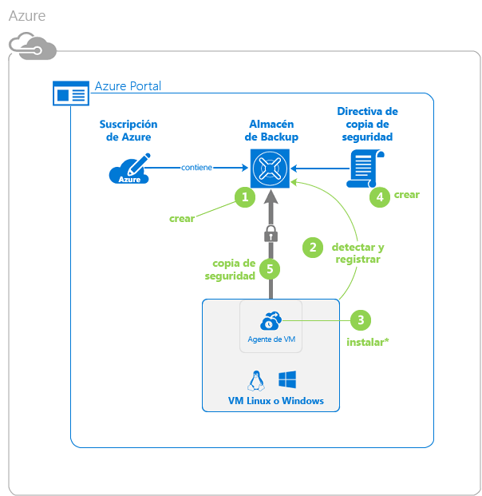
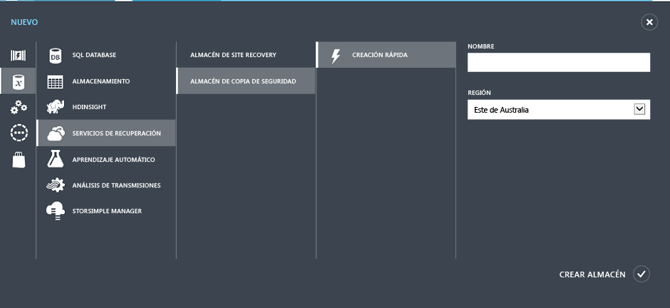
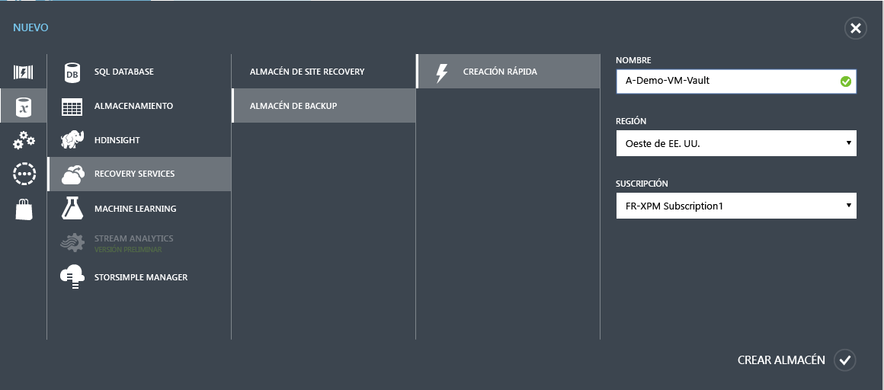
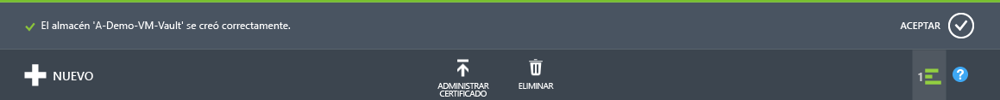
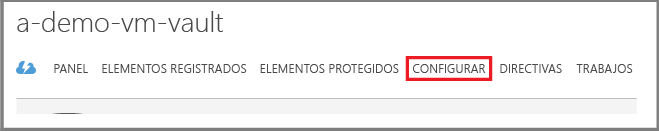
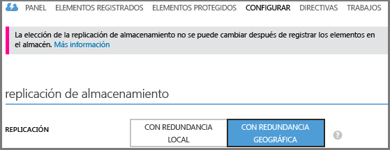
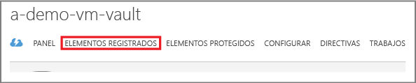
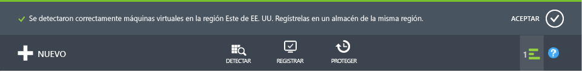

<properties
	pageTitle="Primer contacto: protección de máquinas virtuales con un almacén de copia de seguridad | Microsoft Azure"
	description="Copia de seguridad de máquinas virtuales de Azure. El tutorial explica la creación de un almacén, el registro de máquinas virtuales, la creación de directivas y la protección de máquinas virtuales en Azure."
	services="backup"
	documentationCenter=""
	authors="markgalioto"
	manager="cfreeman"
	editor=""/>

<tags
	ms.service="backup"
	ms.workload="storage-backup-recovery"
	ms.tgt_pltfrm="na"
	ms.devlang="na"
	ms.topic="hero-article"
	ms.date="07/29/2016"
	ms.author="markgal; jimpark"/>

# Primer contacto: copia de seguridad de máquinas virtuales de Azure

> [AZURE.SELECTOR]
- [Primer análisis: copia de seguridad de máquinas virtuales con ARM en un almacén de Servicios de recuperación](backup-azure-vms-first-look-arm.md)
- [Primer contacto: protección de máquinas virtuales con un almacén de copia de seguridad](backup-azure-vms-first-look.md)

Este tutorial le guiará por los pasos para crear copias de seguridad de una máquina virtual de Azure en un almacén de copia de seguridad de Azure. Este artículo describe el modelo de implementación clásica o el de Service Manager, para la creación de copias de seguridad de máquinas virtuales. Si está interesado en la realización de una copia de seguridad de una máquina virtual en un almacén de Servicios de recuperación que pertenece a un grupo de recursos, consulte [Primer análisis: copia de seguridad de máquinas virtuales con ARM en un almacén de Servicios de recuperación](backup-azure-vms-first-look-arm.md). Para completar correctamente este tutorial, deben existir estos requisitos previos:

- Ha creado una máquina virtual en su suscripción de Azure.
- La máquina virtual tiene conectividad a las direcciones IP públicas de Azure. Para más información, consulte [Conectividad de red](./backup-azure-vms-prepare.md#network-connectivity).

Para realizar una copia de seguridad de una máquina virtual, hay cinco pasos principales:

 Crear un almacén de copia de seguridad o identificar uno existente.    Usar el Portal de Azure clásico para detectar y registrar las máquinas virtuales.    Instalar el agente de máquina virtual.    Crear la directiva para proteger las máquinas virtuales.    Ejecutar la copia de seguridad.

>[AZURE.NOTE] Azure cuenta con dos modelos de implementación para crear recursos y trabajar con ellos: [Resource Manager y el modelo clásico](../resource-manager-deployment-model.md). Este tutorial es para su uso con las máquinas virtuales que se pueden crear en el Portal de Azure clásico. El servicio Copia de seguridad de Azure es compatible con las máquinas virtuales basadas en Resource Manager. Para más información sobre la realización de copias de seguridad de máquinas virtuales en un almacén de Servicios de recuperación, consulte [Primer análisis: copia de seguridad de máquinas virtuales con ARM en un almacén de Servicios de recuperación](backup-azure-vms-first-look-arm.md).

## Paso 1: creación de un almacén de copia seguridad para una máquina virtual

Un almacén de copia de seguridad es una entidad que almacena todas las copias de seguridad y los puntos de recuperación creados con el tiempo. El almacén de copia de seguridad contiene también las directivas de copia de seguridad que se aplican a las máquinas virtuales cuya copia de seguridad se está realizando.

1. Inicie sesión en el [Portal de Azure clásico](http://manage.windowsazure.com/).

2. En la esquina inferior izquierda del Portal de Azure, haga clic en **Nuevo**

    

3. En el Asistente para creación rápida, haga clic en **Servicios de datos** > **Servicios de recuperación** > **Almacén de copia de seguridad** > **Creación rápida**.

    

    El asistente solicita el **nombre** y la **región**. Si administra más de una suscripción, aparecerá un cuadro de diálogo para elegir la suscripción.

4. En **Nombre**, escriba un nombre descriptivo que identifique el almacén. El nombre debe ser único para la suscripción de Azure.

5. En **Región**, seleccione la región geográfica del almacén. El almacén **debe** estar en la misma región que las máquinas virtuales a las que protege.

    Si no sabe en qué región está la máquina virtual, cierre el asistente y haga clic en **Máquinas virtuales** en la lista de servicios de Azure. La columna ubicación proporciona el nombre de la región. Si tiene máquinas virtuales en varias regiones, cree un almacén de copia de seguridad en cada una de ellas.

6. Si no hay ningún cuadro de diálogo **Suscripción** en el asistente, vaya al paso siguiente. Si trabaja con varias suscripciones, seleccione una de ellas para asociarla con el nuevo almacén de copia de seguridad.

    

7. Haga clic en **Crear almacén**. La creación del almacén de credenciales de copia de seguridad puede tardar unos minutos. Supervise las notificaciones de estado en la parte inferior del portal.

    

    Un mensaje confirma que el almacén se creó correctamente. Se muestra en la página **Servicios de recuperación** como **Activo**.

    

8. En la lista de almacenes de la página **Servicios de recuperación**, seleccione el almacén que ha creado para iniciar la página **Inicio rápido**.

    

9. En la página **Inicio rápido**, haga clic en **Configurar** para abrir la opción de replicación del almacenamiento. 

10. En la opción de **replicación del almacenamiento**, elija la opción de replicación de su almacén.

    

    De forma predeterminada, el almacén tiene almacenamiento con redundancia geográfica. Si esta es su copia de seguridad principal, elija el almacenamiento con redundancia geográfica. Elija el almacenamiento con redundancia local si desea una opción más económica que no sea tan duradera. Para más información sobre las opciones de almacenamiento con redundancia geográfica y con redundancia local, consulte [Replicación de almacenamiento de Azure](../storage/storage-redundancy.md).

Tras elegir la opción de almacenamiento del almacén, está listo para asociar la máquina virtual con el almacén. Para comenzar la asociación, es preciso detectar y registrar las máquinas virtuales de Azure.

## Paso 2: detección y registro de máquinas virtuales de Azure
Antes de registrar la máquina virtual con un almacén, ejecute el proceso de detección para identificar nuevas máquinas virtuales. Este proceso devuelve una lista de las máquinas virtuales incluidas en la suscripción, junto con información adicional; por ejemplo, el nombre del servicio en la nube y la región.

1. Inicie sesión en el [Portal de Azure clásico](http://manage.windowsazure.com/)

2. En el Portal de Azure clásico, haga clic en **Servicios de recuperación** para abrir la lista de almacenes de Servicios de recuperación. 

3. En la lista de almacenes de copia de seguridad, seleccione el almacén de copia de una máquina virtual.

    Cuando seleccione el almacén, este se abrirá en la página **Inicio rápido**

4. En el menú del almacén, haga clic en **Elementos registrados**.

    

5. En el menú **Tipo**, seleccione **Máquina virtual de Azure**.

    

6. Haga clic en **DETECTAR** en la parte inferior de la página. 

    El proceso de detección puede tardar unos minutos mientras se tabulan las máquinas virtuales. Hay una notificación en la parte inferior de la pantalla que informa de que el proceso se está ejecutando.

    

    La notificación cambia cuando el proceso se completa.

    

7. Haga clic en **REGISTRAR** en la parte inferior de la página. 

8. En el menú contextual **Elementos registrados**, seleccione las máquinas virtuales que desea registrar.

    >[AZURE.TIP] Se pueden registrar varias máquinas virtuales al mismo tiempo.

    Se crea un trabajo para cada máquina virtual que ha seleccionado.

9. Haga clic en **Ver trabajo** en la notificación para ir a la página **Trabajos**.

    

    La máquina virtual también aparece en la lista de elementos registrados junto con el estado de la operación de registro.

    

    Una vez que la operación se completa, el estado cambia para reflejar los *registrados*.

    

## Paso 3: instalación del agente de máquina virtual en la máquina virtual

El agente de máquina virtual de Azure se debe instalar en la máquina virtual de Azure para que funcione la extensión de copia de seguridad. Si la máquina virtual se creó desde la galería de Azure, el agente de máquina virtual ya está presente en la máquina virtual. Puede ir directamente a la sección sobre [protección de máquinas virtuales](backup-azure-vms-first-look.md#step-4-protect-azure-virtual-machines).

Si la máquina virtual se migra desde un centro de datos local, es probable que no tenga instalado el agente de máquina virtual. Debe instalar al agente de máquina virtual en la máquina virtual antes de continuar con su protección. Para más información sobre cómo instalar el agente de máquina virtual, consulte la [sección Agente de máquina virtual del artículo Copia de seguridad de máquinas virtuales](backup-azure-vms-prepare.md#vm-agent).

## Paso 4: Creación de la directiva de copia de seguridad
Antes de desencadenar el trabajo de copia de seguridad inicial, establezca la programación de cuándo se van a realizar las instantáneas de copia de seguridad. La programación de cuándo se realizan las instantáneas de copia de seguridad y el período de tiempo durante el que se conservan dichas instantáneas, forman la directiva de copia de seguridad. La información de retención se basa en un esquema de rotación abuelo-padre-hijo (GFS) para las copias de seguridad.

1. Navegue al almacén de copia de seguridad en **Servicios de recuperación** en el Portal de Azure clásico y haga clic en **Elementos registrados**.
2. Seleccione **Máquina virtual de Azure** en el menú desplegable.

    

3. Haga clic en **PROTEGER**, en la parte inferior de la página. 

    Aparece el **Asistente para la protección de elementos**, que enumera *solo* las máquinas virtuales que están registradas y no protegidas.

    

4. Seleccione las máquinas virtuales que desee proteger.

    Si hay dos o más máquinas virtuales con el mismo nombre, use el servicio en la nube para distinguirlas.

5. En el menú **Configurar la protección**, seleccione una directiva existente o cree una nueva para proteger las máquinas virtuales que ha identificado.

    Los nuevos almacenes de copia de seguridad tienen una directiva predeterminada asociada con el almacén. Esta directiva realiza una instantáneas diaria cada noche que se conserva durante 30 días. Cada directiva de copia de seguridad puede tener asociadas varias máquinas virtuales. Sin embargo, la máquina virtual solo se puede asociar con una directiva cada vez.

    

    >[AZURE.NOTE] Una directiva de copia de seguridad incluye un esquema de retención de las copias de seguridad programadas. Si selecciona una directiva de copia de seguridad existente, no podrá modificar las opciones de retención en el paso siguiente.

6. En **Duración de retención**, defina el ámbito diario, semanal, mensual y anual de los puntos de copia de seguridad específicos.

    

    La directiva de retención especifica el período de tiempo que se almacena una copia de seguridad. Puede especificar directivas de retención diferentes en función de cuándo se realizó la copia de seguridad.

7. Haga clic en **Trabajos** para ver la lista de trabajos de **Configurar la protección**.

    

    Ahora que ha establecido la directiva, vaya al paso siguiente y ejecute la copia de seguridad inicial.

## Paso 5: copia de seguridad inicial

Una vez que una máquina virtual se ha protegido con una directiva, dicha relación se puede ver en la pestaña **Elementos protegidos**. Hasta que se realiza la copia de seguridad inicial, en **Estado de protección** se muestra el valor **Protegido (copia de seguridad inicial pendiente)**. De forma predeterminada, la primera copia de seguridad programada es la *copia de seguridad inicial*.

Para empezar con la copia de seguridad inicial de forma inmediata:

1. En la página **Elementos protegidos**, haga clic en **Realizar copia de seguridad ahora** en la parte inferior de la página. 

    El servicio Copia de seguridad de Azure crea un trabajo de copia de seguridad para la operación de copia de seguridad inicial.

2. Haga clic en la pestaña **Trabajos** para ver la lista de los trabajos.

    

    Una vez completada la copia de seguridad inicial, el estado de la máquina virtual en la pestaña **Elementos protegidos** es *Protegido*.

    

    >[AZURE.NOTE] La copia de seguridad de máquinas virtuales es un proceso local. No puede realizar copias de seguridad de máquinas virtuales desde una región hasta un almacén de copia de seguridad de otra región. Por lo tanto, para cada región de Azure que tiene máquinas virtuales que necesiten una copia de seguridad, debe crearse al menos un almacén de copia de seguridad en esa región.

## Pasos siguientes
Una vez que se ha copiado correctamente una máquina virtual, hay varios pasos que pueden ser de interés. El paso más lógico sería familiarizarse con la restauración de datos en una máquina virtual. Sin embargo, hay tareas de administración que le ayudarán a entender cómo mantener seguros los datos y minimizar los costos.

- [Administración y supervisión de las máquinas virtuales](backup-azure-manage-vms.md)
- [Restauración de máquinas virtuales](backup-azure-restore-vms.md)
- [Guía de solución de problemas](backup-azure-vms-troubleshoot.md)

## ¿Tiene preguntas?
Si tiene alguna pregunta o hay alguna característica que le gustaría que se incluyera, [envíenos sus comentarios](http://aka.ms/azurebackup_feedback).

<!---HONumber=AcomDC_0817_2016-->