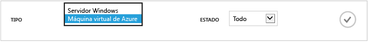
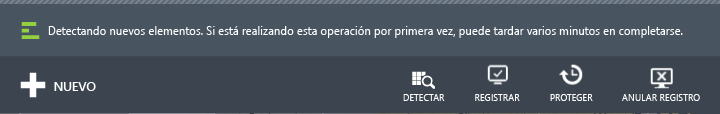
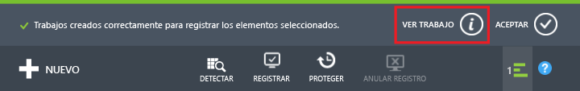
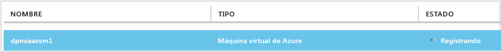
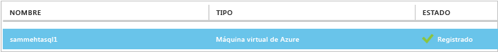
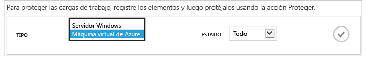
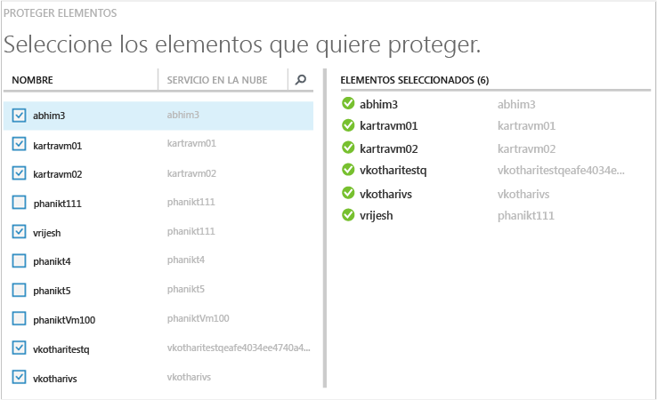
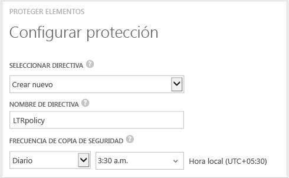
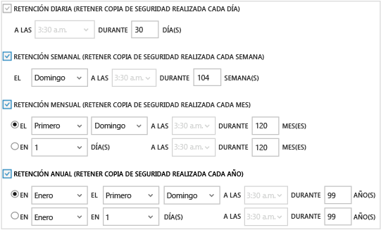
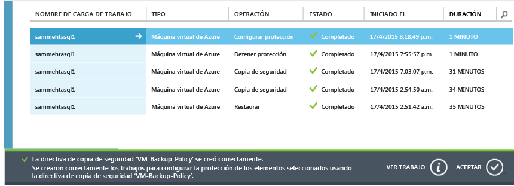

# Copia de seguridad de máquinas virtuales de Azure (Portal clásico)
> [!div class="op_single_selector"]
> * [Copia de seguridad de VM en el almacén de servicios de recuperación](backup-azure-arm-vms.md)
> * [Copia de seguridad de VM en el almacén de Copia de seguridad](backup-azure-vms.md)
>
>

Este artículo proporciona los procedimientos para realizar una copia de seguridad de una máquina virtual de Azure con implementación clásica en un almacén de Copia de seguridad. Hay algunas tareas que es necesario tener en cuenta antes de poder realizar una copia de seguridad de una máquina virtual de Azure. Si aún no lo ha hecho, complete los [requisitos previos](backup-azure-vms-prepare.md) para preparar el entorno para realizar copias de seguridad de las máquinas virtuales.

Para más información, consulte los artículos acerca de cómo [planear la infraestructura de copia de seguridad de máquinas virtuales en Azure](backup-azure-vms-introduction.md) y acerca de [Azure Virtual Machines](https://azure.microsoft.com/documentation/services/virtual-machines/).

> [!NOTE]
> Azure cuenta con dos modelos de implementación para crear recursos y trabajar con ellos: [Resource Manager y el modelo clásico](../azure-resource-manager/resource-manager-deployment-model.md). Un almacén de Copia de seguridad solo puede proteger máquinas virtuales con implementación clásica. No puede proteger máquinas virtuales con implementación mediante Resource Manager con un almacén de Copia de seguridad. Consulte [Copia de seguridad de VM en el almacén de servicios de recuperación](backup-azure-arm-vms.md) para más información sobre cómo trabajar con almacenes de Servicios de recuperación.
>
>

La realización de copias de seguridad de máquinas virtuales de Azure consta tres pasos principales:

> [!NOTE]
> La copia de seguridad de máquinas virtuales es un proceso local. No puede realizar copias de seguridad de máquinas virtuales de una región en un almacén de copia de seguridad de otra región. Por lo tanto, debe crear un almacén de copia de seguridad en cada región de Azure donde estén las máquinas virtuales de las que se realizará una copia de seguridad.
>
> [!IMPORTANT]
> A partir de marzo de 2017, ya no podrá usar el portal clásico para crear almacenes de Backup.
> Ahora puede actualizar los almacenes de Backup a almacenes de Recovery Services. Para más información, consulte el artículo [Actualización de un almacén de Backup a un almacén de Recovery Services](backup-azure-upgrade-backup-to-recovery-services.md). Microsoft anima a actualizar los almacenes de Backup a almacenes de Recovery Services.  A partir del 15 de octubre de 2017, no podrá usar PowerShell para crear almacenes de Backup. **El 1 de noviembre de 2017**:
>- Todos los almacenes de Backup restantes se actualizarán automáticamente a almacenes de Recovery Services.
>- No podrá acceder a los datos de copia de seguridad en el portal clásico. En su lugar, utilice Azure Portal para tener acceso a los datos de copia de seguridad en los almacenes de Recovery Services.
>

## Paso 1: Detección de máquinas virtuales de Azure
Para asegurarse de identificar antes del registro todas las máquinas virtuales nuevas agregadas a la suscripción, ejecute el proceso de detección. El proceso consulta a Azure la lista de máquinas virtuales incluidas en la suscripción, junto con información adicional, por ejemplo, el nombre del servicio en la nube y la región.

1. Inicie sesión en el [Portal clásico](http://manage.windowsazure.com/)
2. En la lista de servicios de Azure, haga clic en **Recovery Services** para abrir la lista de almacenes de Backup y Site Recovery.
    
3. En la lista de almacenes de copia de seguridad, seleccione el almacén de copia de una máquina virtual.

    Si se trata de un nuevo almacén, el portal se abre en la página **Inicio rápido** .

    

    Si el almacén se ha configurado previamente, el portal se abrirá en el último menú usado.
4. En el menú del almacén (en la parte superior de la página), haga clic en **Elementos registrados**.

    
5. En el menú **Tipo**, seleccione **Máquina virtual de Azure**.

    
6. Haga clic en **DETECTAR** en la parte inferior de la página.
    

    El proceso de detección puede tardar unos minutos mientras se tabulan las máquinas virtuales. Hay una notificación en la parte inferior de la pantalla que informa de que el proceso se está ejecutando.

    

    La notificación cambia cuando el proceso se completa. Si el proceso de detección no encontró las máquinas virtuales, primero asegúrese de que existan las máquinas virtuales. Si efectivamente es así, asegúrese de que las máquinas virtuales están en la misma región que el almacén de copia de seguridad. Si las máquinas virtuales existen y están en la misma región, asegúrese de que no están registradas en un almacén de copia de seguridad. Si se asigna una máquina virtual a un almacén de copia de seguridad, no será posible asignarla a otros almacenes de copia de seguridad.

    

    Una vez que haya encontrado los nuevos elementos, vaya al paso 2 y registre las máquinas virtuales.

## Paso 2: Registro de máquinas virtuales de Azure
Se registra una máquina virtual de Azure para asociarla con el servicio Copia de seguridad de Azure. El registro suele ser una actividad que solo se realiza una vez.

1. Navegue al almacén de copia de seguridad de **Recovery Services** en Azure Portal y haga clic en **Elementos registrados**.
2. Seleccione **Máquina virtual de Azure** en el menú desplegable.

    
3. Haga clic en **REGISTRAR** en la parte inferior de la página.
    
4. En el menú contextual **Elementos registrados** , seleccione las máquinas virtuales que desea registrar. Si hay dos o más máquinas virtuales con el mismo nombre, use el servicio en la nube para distinguirlas.

   > [!TIP]
   > Se pueden registrar varias máquinas virtuales al mismo tiempo.
   >
   >

    Se crea un trabajo para cada máquina virtual que ha seleccionado.
5. Haga clic en **Ver trabajo** en la notificación para ir a la página **Trabajos**.

    

    La máquina virtual también aparece en la lista de elementos registrados junto con el estado de la operación de registro.

    

    Una vez completada la operación, el estado cambia a *registrado* .

    

## Paso 3: Protección de las máquinas virtuales de Azure
Ahora puede configurar una directiva de retención y copia de seguridad para la máquina virtual. Se pueden proteger varias máquinas virtuales en una sola acción de protección.

Los almacenes de Copia de seguridad de Azure creados después de mayo de 2015 incluyen una directiva predeterminada integrada en el almacén. Esta directiva predeterminada viene con un período de retención predeterminado de 30 días y una programación de copia de seguridad diaria.

1. Navegue al almacén de copia de seguridad de **Recovery Services** en Azure Portal y haga clic en **Elementos registrados**.
2. Seleccione **Máquina virtual de Azure** en el menú desplegable.

    
3. Haga clic en **PROTEGER** , en la parte inferior de la página.

    Se abrirá el **Asistente para protección de elementos** . El asistente solo muestra las máquinas virtuales que están registradas y que no están protegidas. Seleccione las máquinas virtuales que desee proteger.

    Si hay dos o más máquinas virtuales con el mismo nombre, use el servicio en la nube para distinguir las máquinas virtuales.

   > [!TIP]
   > Puede proteger varias máquinas virtuales al mismo tiempo.
   >
   >

    

4. Elija una **programación de copia de seguridad** para hacer una copia de seguridad de las máquinas virtuales que seleccionó. Puede seleccionar una directiva de un conjunto existente o definir una nueva.

    Cada directiva de copia de seguridad puede tener asociadas varias máquinas virtuales. Sin embargo, la máquina virtual solo se puede asociar con una directiva en un momento determinado.

    

   > [!NOTE]
   > Una directiva de copia de seguridad incluye un esquema de retención de las copias de seguridad programadas. Si selecciona una directiva de copia de seguridad existente, no podrá modificar las opciones de retención en el paso siguiente.
   >
   >

5. Elija un **intervalo de retención** para asociarlo a las copias de seguridad.

    

    La directiva de retención especifica el período de tiempo que se almacena una copia de seguridad. Puede especificar directivas de retención diferentes en función de cuándo se realizó la copia de seguridad. Por ejemplo, un punto de copia de seguridad diario (que sirve como punto de recuperación operativo) podría conservarse durante 90 días. En comparación, un punto de copia de seguridad realizado al final de cada trimestre (con fines de auditoría) podría tener que conservarse durante muchos meses o años.

    

    En esta imagen de ejemplo:

   * **Directiva de retención diaria**: las copias de seguridad realizadas diariamente se almacenan durante 30 días.
   * **Directiva de retención semanal**: las copias de seguridad realizadas cada domingo se conservan durante 104 semanas.
   * **Directiva de retención mensual**: las copias de seguridad realizadas el último domingo de cada mes se conservan durante 120 meses.
   * **Directiva de retención anual**: las copias de seguridad realizadas el primer domingo de cada mes de enero se conservan durante 99 años.

     Se crea un trabajo para configurar la directiva de protección y asociar a esa directiva cada máquina virtual que ha seleccionado.
6. Para ver la lista de los trabajos de **Configurar la protección**, en el menú de almacenes, haga clic en **Trabajos** y seleccione **Configurar la protección** en el filtro **Operación**.

    

## Copia de seguridad inicial
Una vez que la máquina virtual está protegida con una directiva, aparecerá en la pestaña **Elementos protegidos** y tendrá un estado *Protegido (copia de seguridad inicial pendiente)*. De forma predeterminada, la primera copia de seguridad programada es la *copia de seguridad inicial*.

Para desencadenar la copia de seguridad inicial inmediatamente después de configurar la protección:

1. En la parte inferior de la página **Elementos protegidos**, haga clic en **Realizar copia de seguridad ahora**.

    El servicio Copia de seguridad de Azure crea un trabajo de copia de seguridad para la operación de copia de seguridad inicial.
2. Haga clic en la pestaña **Trabajos** para ver la lista de los trabajos.

    

> [!NOTE]
> Durante la operación de copia de seguridad, el servicio Copia de seguridad de Azure emite un comando a la extensión de copia de seguridad en cada máquina virtual para vaciar todos los trabajos de escritura y tomar una instantánea coherente.
>
>

Cuando finalice la copia de seguridad inicial, el estado de la máquina virtual en la pestaña **Elementos protegidos** será *Protegido*.

## Visualización de los detalles y el estado de la copia de seguridad
Una vez protegidas, el recuento de máquinas virtuales también aumenta en el resumen de la página **Panel** . La página **Panel** también muestra el número de trabajos de las últimas 24 horas que se realizaron *correctamente*, los que causaron un *error* y los que están *en curso*. En la página **Trabajos**, use los menús **Estado**, **Operación** o **Desde** y **Hasta** para filtrar los trabajos.

Los valores indicados en el panel se actualizan cada 24 horas.

## Solución de errores
Si surgen problemas al realizar la copia de seguridad de la máquina virtual, consulte el artículo [Solución de problemas de copia de seguridad de máquinas virtuales de Azure](backup-azure-vms-troubleshoot.md) para obtener ayuda.

## Pasos siguientes
* [Administración y supervisión de las máquinas virtuales](backup-azure-manage-vms.md)
* [Restauración de máquinas virtuales](backup-azure-restore-vms.md)
