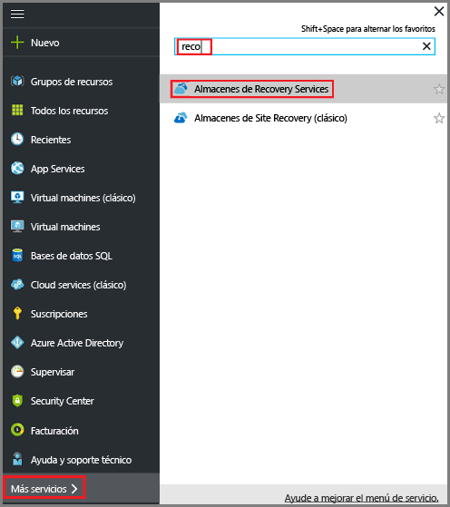
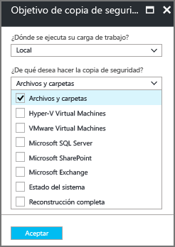

# Copia de seguridad desde Windows Server o un cliente de Windows en Azure mediante el modelo de implementación de Resource Manager
En este artículo se explica cómo realizar una copia de seguridad de los archivos y carpetas de Windows Server (o del cliente de Windows) en Azure con Azure Backup usando el modelo de implementación de Resource Manager.

## Antes de comenzar
Si desea crear una copia de seguridad de un servidor o cliente en Azure, necesita una cuenta de Azure. En caso de no tener ninguna, puede crear una [cuenta gratuita](https://azure.microsoft.com/free/) en tan solo unos minutos.

## Creación de un almacén de Recovery Services
Un almacén de Recovery Services es una entidad que almacena todas las copias de seguridad y todos los puntos de recuperación creados con el tiempo. El almacén de Recovery Services contiene también la directiva de copia de seguridad que se aplica a los archivos y las carpetas protegidos. Cuando se crea un almacén de Recovery Services, también se debe seleccionar la opción de redundancia de almacenamiento adecuada.

### Creación de un almacén de Recovery Services
1. Si aún no lo ha hecho, inicie sesión en el [Portal de Azure](https://portal.azure.com/) mediante su suscripción.
2. En el menú central, haga clic en **Más servicios** y, en la lista de recursos, escriba **Recovery Services** y haga clic en **Almacenes de Recovery Services**.

      

    Si hay almacenes de Recovery Services en la suscripción, estos aparecerán en una lista.

3. En el menú **Almacenes de servicios de recuperación**, haga clic en **Agregar**.

    

    Se abre la hoja del almacén de Recovery Services, donde se le pide que especifique los valores de **Nombre**, **Suscripción**, **Grupo de recursos** y **Ubicación**.

    

4. En **Nombre**, escriba un nombre descriptivo que identifique el almacén. El nombre debe ser único para la suscripción de Azure. Escriba un nombre que tenga entre 2 y 50 caracteres. Debe comenzar por una letra y solo puede contener letras, números y guiones.

5. En la sección **Suscripción**, utilice el menú desplegable para elegir la suscripción de Azure. Si utiliza una sola suscripción, esta aparece y puede pasar al paso siguiente. Si no está seguro de la suscripción que desea utilizar, use la suscripción predeterminada (o sugerida). Solo hay varias opciones si la cuenta de su organización está asociada a más de una suscripción de Azure.

6. En la sección **Grupo de recursos**:

    * Si desea crear un nuevo grupo de recursos, seleccione **Create new** (Crear nuevo).
    o
    * Seleccione **Use existing** (Usar existente) y haga clic en el menú desplegable para ver la lista de grupos de recursos disponibles.

  Para más información sobre los grupos de recursos, consulte [Introducción a Azure Resource Manager](../azure-resource-manager/resource-group-overview.md).

7. Haga clic en **Ubicación** para seleccionar la región geográfica del almacén. Esta elección determina la región geográfica a la que se envían los datos de copia de seguridad.

8. En la parte inferior de la hoja de almacén de recovery Services, haga clic en **Create** (Crear).

  La creación del almacén de Recovery Services puede tardar unos minutos. Supervise las notificaciones de estado de la parte superior derecha del portal. Una vez creado el almacén, aparece en la lista de almacenes de Recovery Services. Si no ve el almacén pasados unos minutos, haga clic en **Refresh** (Actualizar).

   

  Cuando vea el almacén en la lista de almacenes de Recovery Services, estará listo para configurar la redundancia de almacenamiento.

### Establecimiento de la redundancia de almacenamiento
Al crear un almacén de Recovery Services se determina cómo se replica el almacenamiento.

1. En la hoja **Almacenes de Recovery Services**, haga clic en el almacén nuevo.

    

    Al seleccionar el almacén, la hoja **Almacén de Recovery Services** se delimita, y la hoja de configuración (*con el nombre del almacén en la parte superior*) y la hoja de detalles del almacén se abren.

    

2. En la hoja de configuración del nuevo almacén, desplácese con el control deslizante vertical hasta la sección Manage (Administrar) y haga clic en **Backup Infrastructure** (Infraestructura de copia de seguridad).

  Con ello, se abrirá esta hoja.

3. En la hoja Infraestructura de copia de seguridad, haga clic en **Configuración de copia de seguridad** para abrir la hoja **Configuración de copia de seguridad**.

  

4. Elija la opción de replicación del almacenamiento apropiada para su almacén.

  

  De forma predeterminada, el almacén tiene almacenamiento con redundancia geográfica. Si usa Azure como punto de conexión de almacenamiento de copia de seguridad principal, siga utilizando **Redundancia geográfica**. Si no utiliza Azure como punto de conexión de almacenamiento de copia de seguridad principal, elija **Redundancia local** para reducir los costes de almacenamiento de Azure. En esta página de [información general sobre la redundancia del almacenamiento](../storage/common/storage-redundancy.md) encontrará más información sobre las opciones de almacenamiento con [redundancia geográfica](../storage/common/storage-redundancy.md#geo-redundant-storage) y [redundancia local](../storage/common/storage-redundancy.md#locally-redundant-storage).

Ahora que ha creado un almacén, prepare la infraestructura para realizar una copia de seguridad de los archivos y las carpetas; para ello, descargue e instale el agente de Microsoft Azure Recovery Services, descargue las credenciales del almacén y luego use esas credenciales para registrar el agente en el almacén.

## Configuración del almacén

1. En la hoja del almacén de Recovery Services (el almacén que acaba de crear), en la sección de introducción, haga clic en **Copia de seguridad** y, a continuación, en la hoja **Introducción a la copia de seguridad**, seleccione **Objetivo de copia de seguridad**.

  

  Se abrirá la hoja **Objetivo de copia de seguridad**. Si el almacén de Recovery Services se ha configurado previamente, la hoja **Objetivo de Backup** se abre al hacer clic en **Backup** en la hoja del almacén de Recovery Services.

  

2. En el menú desplegable **¿Dónde se ejecuta su carga de trabajo?**, seleccione **Local**.

  Elija **Local** ya que su equipo Windows o Windows Server es una máquina física que no está en Azure.

3. En el menú **What do you want to backup?** (¿De qué quiere realizar una copia de seguridad?), seleccione **Archivos y carpetas** (Archivos y carpetas) y haga clic en **OK** (Aceptar).

  

  Después de hacer clic en Aceptar, aparecerá una marca de verificación junto a **Objetivo de copia de seguridad**y se abrirá la hoja **Preparar infraestructura**.

  

4. En la hoja **Preparar infraestructura**, haga clic en **Descargar agente para Windows Server o cliente de Windows**.

  

  Si usa Windows Server Essential, elija descargar el agente de Windows Server Essential. Un menú emergente le preguntará si desea ejecutar o guardar MARSAgentInstaller.exe.

  

5. Haga clic en **Guardar** en el menú emergente de descarga.

  De forma predeterminada, se guarda el archivo **MARSagentinstaller.exe** en la carpeta de descargas. Cuando haya finalizado el instalador, verá un menú emergente que le preguntará si desea ejecutar el instalador o abrir la carpeta.

  

  No es necesario instalar el agente todavía. Puede instalar el agente una vez descargadas las credenciales del almacén.

6. En la hoja **Preparar infraestructura**, haga clic en **Descargar**.

  

  Descargue las credenciales de almacén en la carpeta Descargas. Una vez que haya terminado de descargar las credenciales del almacén, aparecerá una ventana emergente en la que se le preguntará si desea abrirlas o guardarlas. Haga clic en **Save**(Guardar). Si, accidentalmente, hace clic en **Abrir**, deje que el cuadro de diálogo intente abrir las credenciales de almacén. Se producirá un error. No se pueden abrir las credenciales de almacén. Siga con el paso siguiente. Las credenciales del almacén están en la carpeta de descargas.   

  

## Instalación y registro del agente

> [!NOTE]
> La habilitación de la copia de seguridad a través de Azure Portal todavía no está disponible. Use el agente de Microsoft Azure Recovery Services para hacer la copia de seguridad de archivos y carpetas.
>

1. Busque y haga doble clic en **MARSagentinstaller.exe** en la carpeta de descargas (u otra ubicación guardada).

  El instalador proporciona una serie de mensajes ya que este extrae, instala y registra el agente de Recovery Services.

  

2. Complete el asistente para la instalación del agente de Microsoft Azure Recovery Services. Para completar al asistente, tendrá que hacer lo siguiente:

  * Elija una ubicación para la instalación y la carpeta de caché.
  * Proporcione la información del servidor proxy si usa un servidor proxy para conectarse a Internet.
  * Si usa un servidor proxy autenticado, escriba los detalles de nombre y contraseña del usuario.
  * Proporcione las credenciales del almacén descargado
  * Guarde la frase de contraseña en una ubicación segura.

  > [!NOTE]
  > Si pierde u olvida la frase de contraseña, Microsoft no puede ayudarle a recuperar los datos de copia de seguridad. Guarde el archivo en una ubicación segura. Es necesario restaurar una copia de seguridad.
  >
  >

Ahora está instalado el agente y el equipo está registrado en el almacén. Está listo para configurar y programar la copia de seguridad.

## Requisitos de conectividad y de red

Si la máquina o proxy tienen limitado el acceso a Internet, asegúrese de que su configuración de firewall esté establecida para permitir las direcciones URL siguientes:  
    1. www.msftncsi.com
    2. *.Microsoft.com
    3. *.WindowsAzure.com
    4. *.microsoftonline.com
    5. * .windows.net

## Creación de la directiva de copia de seguridad
La directiva de copia de seguridad constituye la programación del momento en que se establecen los puntos de recuperación y del período de retención de dichos puntos. Use el agente de Microsoft Azure Backup para crear la directiva de copia de seguridad de archivos y carpetas.

### Para crear una programación de copia de seguridad
1. Abra el agente de Microsoft Azure Backup. Para encontrarlo, busque **Microsoft Azure Backup**en la máquina.

    
2. En el panel **Acciones** del agente de Backup, haga clic en **Programar copia de seguridad** para iniciar el Asistente para programar copias de seguridad.

    

3. En la página de **introducción** del Asistente para programar copias de seguridad, haga clic en **Siguiente**.
4. En la página **Seleccionar elementos de los que realizar copia de seguridad**, haga clic en **Agregar elementos**.

  Se abre el cuadro de diálogo Seleccionar elementos.

5. Seleccione los archivos y carpetas que desea proteger y luego haga clic en **Aceptar**.
6. En la página **Seleccionar elementos de los que realizar copia de seguridad**, haga clic en **Siguiente**.
7. En la página **Especifique la programación de copia de seguridad**, indique la programación de copia de seguridad y haga clic en **Siguiente**.

    Puede programar copias de seguridad diarias (con una frecuencia máxima de tres veces al día) o semanales.

    

   > [!NOTE]
   > Si desea más información sobre cómo especificar la programación de las copias de seguridad, consulte el artículo [Usar Azure Backup para cambiar su infraestructura de cintas](backup-azure-backup-cloud-as-tape.md).
   >
   >

8. En la página **Seleccione la directiva de retención**, elija las directivas de retención específicas para la copia de seguridad y haga clic en **Siguiente**.

    La directiva de retención especifica el período durante el cual se almacena la copia de seguridad. En vez de especificar solo una directiva para todos los puntos de copia de seguridad, puede especificar directivas de retención distintas en función de cuándo se realice la copia de seguridad. Puede modificar las directivas de retención diarias, semanales, mensuales y anuales según sus necesidades.
9. En la página Elija el tipo de copia de seguridad inicial, elija el tipo de copia de seguridad inicial. Deje activada la opción **Automáticamente a través de la red** y, luego, haga clic en **Siguiente**.

    Puede hacer una copia de seguridad automáticamente en la red, o puede realizar una copia sin conexión. En el resto de este artículo, se describe el proceso para crear automáticamente una copia de seguridad. Si prefiere crear una copia de seguridad sin conexión, consulte el artículo [Flujo de trabajo de copia de seguridad sin conexión en Azure Backup](backup-azure-backup-import-export.md) para más información.
10. En la página Confirmación, revise la información y, luego, haga clic en **Finalizar**.
11. Cuando el asistente termine de crear la programación de copia de seguridad, haga clic en **Cerrar**.

### Habilitación de la limitación de la red
El agente de Microsoft Azure Backup proporciona limitación de red. Esta limitación controla cómo se utiliza el ancho de banda de red durante la transferencia de datos. Este control puede resultar útil si necesita realizar una copia de seguridad durante las horas de trabajo, pero no quiere que el proceso interfiera con otro tráfico de Internet. La limitación se aplica a las actividades de copia de seguridad y restauración.

> [!NOTE]
> La limitación de la red no está disponible en Windows Server 2008 R2 SP1, Windows Server 2008 SP2 ni en Windows 7 (con Service Packs). La característica de limitación de la red de Azure Backup participa en la Calidad del servicio (QoS) del sistema operativo local. Aunque Azure Backup puede proteger estos sistemas operativos, la versión de QoS disponible en estas plataformas no funciona con la limitación de la red de Azure Backup. La limitación de la red puede usarse en todos los demás [sistemas operativos admitidos](backup-azure-backup-faq.md).
>
>

**Para habilitar la limitación de red**

1. En el agente de Microsoft Azure Backup, haga clic en **Cambiar propiedades**.

    
2. En la pestaña **Limitación**, active la casilla **Habilitar el límite de uso del ancho de banda de Internet para operaciones de copia de seguridad**.

    
3. Una vez que se ha habilitado la limitación, especifique el ancho de banda permitido para la transferencia de datos de copia de seguridad durante la **jornada laboral** y las **horas de descanso**.

    Los valores de ancho de banda comienzan en 512 kilobytes por segundo (Kbps) y pueden subir hasta 1023 megabytes por segundo (Mbps). También puede designar el inicio y el final de la **jornada laboral**, así como qué días de la semana se consideran laborables. Las horas que se encuentran fuera de las horas laborables designadas se consideran como no laborables.
4. Haga clic en **OK**.

### Creación de copias de seguridad de archivos y carpetas por primera vez
1. En el agente de Copia de seguridad, haga clic en **Iniciar copia de seguridad** para completar la propagación inicial a través de la red.

    
2. En la página Confirmación, revise la configuración que el asistente para iniciar copia de seguridad usará para crear la copia de seguridad de la máquina. Luego, haga clic en **Crear copia de seguridad**.
3. Haga clic en **Cerrar** para cerrar el asistente. Si lo hace antes de que finalice el proceso de copia de seguridad, el asistente se sigue ejecutando en segundo plano.

Una vez que finalice la copia de seguridad inicial, el estado **Trabajo completado** se refleja en la consola de Copia de seguridad.

## ¿Tiene preguntas?
Si tiene alguna pregunta o hay alguna característica que le gustaría que se incluyera, [envíenos sus comentarios](http://aka.ms/azurebackup_feedback).

## pasos siguientes
Para más información sobre la copia de seguridad de máquinas virtuales u otras cargas de trabajo, consulte:

* Ahora que ha realizado una copia de seguridad de los archivos y las carpetas, puede [administrar los almacenes y servidores](backup-azure-manage-windows-server.md).
* Si necesita restaurar una copia de seguridad, use este artículo: [Restaurar archivos en una máquina de Windows Server o del Cliente de Windows](backup-azure-restore-windows-server.md).
