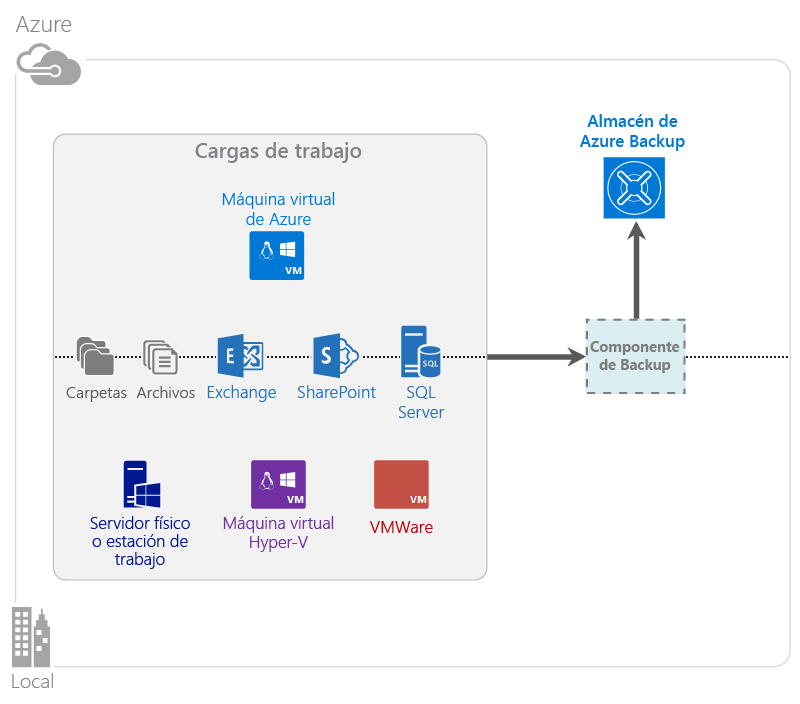

<properties
	pageTitle="¿Qué es Copia de seguridad de Azure? | Microsoft Azure"
	description="Con los servicios de recuperación y Copia de seguridad de Azure puede realizar una copia de seguridad y restaurar los datos y aplicaciones de servidores Windows, equipos cliente de Windows, servidores de System Center DPM y máquinas virtuales de Azure."
	services="backup"
	documentationCenter=""
	authors="Jim-Parker"
	manager="jwhit"
	editor="tysonn"
	keywords="copia de seguridad y restauración; servicios de recuperación; soluciones de copia de seguridad"/>

<tags
	ms.service="backup"
	ms.workload="storage-backup-recovery"
	ms.tgt_pltfrm="na"
	ms.devlang="na"
	ms.topic="get-started-article"
	ms.date="04/13/2016"
	ms.author="jimpark; trinadhk"/>

# ¿Qué es la Copia de seguridad de Azure?
Copia de seguridad de Azure es el servicio usado para hacer copias de seguridad y restauraciones de los datos en la nube de Microsoft. Reemplaza su solución de copia de seguridad local o remota existente por una solución confiable, segura y rentable basada en la nube. También ayuda a proteger los activos que se ejecutan en la nube. Copia de seguridad de Azure proporciona servicios de recuperación basados en una infraestructura de clase mundial escalable, duradera y de alta disponibilidad.

[Ver un vídeo de información general de Copia de seguridad de Azure](https://azure.microsoft.com/documentation/videos/what-is-azure-backup/)

## ¿Por qué usar Copia de seguridad de Azure?
Las soluciones de copia de seguridad tradicionales han evolucionado para tratar la nube como un punto de conexión similar al disco o la cinta. Aunque este enfoque es sencillo, también es limitado. No saca el máximo provecho de una plataforma de nube subyacente, lo que se traduce en una solución ineficaz y costosa. En cambio, Copia de seguridad de Azure ofrece todas las ventajas de una solución de copia de seguridad en la nube eficaz y asequible. A continuación se mencionan algunas de las ventajas clave que ofrece Copia de seguridad de Azure.

| Característica | Ventaja |
| ------- | ------- |
| Administración automática del almacenamiento | No se necesita inversión de capital para los dispositivos de almacenamiento locales. Copia de seguridad de Azure asigna y administra almacenamiento de copia de seguridad automáticamente y usa un modelo de consumo de pago por uso. |
| Escalado ilimitado | Beneficiarse de las garantías de alta disponibilidad sin la sobrecarga de mantenimiento y supervisión. Copia de seguridad de Azure utiliza la eficacia y escala subyacentes de la nube de Azure, con funcionalidades de escalado automático no intrusivo. |
| Varias opciones de almacenamiento | Elija el almacenamiento de copia de seguridad según las necesidades: <li>Un blob en bloques de almacenamiento con redundancia local resulta adecuado para los clientes a los que les preocupa el precio y, al mismo tiempo, ayuda a proteger los datos contra errores de hardware locales. <li>Un blob en bloques de almacenamiento con replicación geográfica proporciona tres copias más en un centro de datos emparejado. Esto ayuda a garantizar la alta disponibilidad de los datos de copia de seguridad incluso en el caso de un desastre en el nivel de sitio de Azure. |
| Transferencia de datos ilimitada | No se aplica ningún cargo por transferencia de datos de salida (saliente) durante una operación de restauración desde el almacén de Copia de seguridad. La entrada de datos a Azure también es gratis. Funciona con el servicio de importación, en aquellos lugares en que está disponible. |
| Cifrado de datos | El cifrado de datos permite la transmisión y el almacenamiento seguros de los datos del cliente en la nube pública. La frase de contraseña de cifrado se almacena en el origen y nunca se transmite o se almacena en Azure. La clave de cifrado es necesaria para restaurar datos, y solo el cliente tiene acceso completo a los datos en el servicio. |  
| Copia de seguridad coherente con la aplicación | En Windows, las copias de seguridad coherentes con la aplicación, ayudan a garantizar que no se necesitarán correcciones en el momento de la restauración, lo que reduce el tiempo de recuperación de forma palpable. Esto permite a los clientes volver a un estado de ejecución de forma más rápida. |
| Retención a largo plazo | En lugar de pagar por soluciones de copia de seguridad en cinta fuera del sitio, los clientes pueden realizar copias de seguridad en Azure, lo que proporciona una atractiva solución similar a la cinta a un bajo costo. |

## Componentes de Copia de seguridad de Azure
Dado que Copia de seguridad es una solución de copia de seguridad híbrida, consta de varios componentes que trabajan conjuntamente para habilitar los flujos de trabajo de copia de seguridad y restauración integrales.

### Escenarios de implementación

| Componente | ¿Se puede implementar en Azure? | ¿Se puede implementar de forma local? | Almacenamiento de destino admitido|
| --- | --- | --- | --- |
| Agente de copia de seguridad de Azure | 
**Sí**
 
El agente de Copia de seguridad de Azure se puede implementar en cualquier VM de Windows Server que se ejecute en Azure.
 | 
**Sí**
 
El agente de Copia de seguridad se puede implementar en cualquier máquina física o virtual de Windows Server.
 | 
Almacén de Copia de seguridad de Azure
 |
| System Center Data Protection Manager (DPM) | 
**Sí**

Más información sobre [cómo proteger las cargas de trabajo en Azure con System Center DPM](http://blogs.technet.com/b/dpm/archive/2014/09/02/azure-iaas-workload-protection-using-data-protection-manager.aspx).
 | 
**Sí**
 
Más información sobre la [protección de cargas de trabajo y VM en su centro de datos](https://technet.microsoft.com/library/hh758173.aspx).
 | 
Disco conectado localmente
 
Almacén de Copia de seguridad de Azure
 
Cinta (solo local)
 |
| Servidor de Copia de seguridad de Azure | 
**Sí**

Más información sobre [cómo proteger las cargas de trabajo en Azure con el servidor de Copia de seguridad de Azure](backup-azure-microsoft-azure-backup.md).
 | 
**Sí**
 
Más información sobre [cómo proteger las cargas de trabajo en Azure con el servidor de Copia de seguridad de Azure](backup-azure-microsoft-azure-backup.md).
 | 
Disco conectado localmente
 
Almacén de Copia de seguridad de Azure
 |
| Copia de seguridad de Azure (extensión de máquina virtual) | 
**Sí**

Parte del tejido de Azure

Especializado en la [copia de seguridad de máquinas virtuales de infraestructura como servicio (IaaS) de Azure](backup-azure-vms-introduction.md).
 | 
**No**
 
Use System Center DPM para hacer copias de seguridad de máquinas virtuales en su centro de datos.
 | 
Almacén de copia de seguridad de Azure
 |

### Ventajas y limitaciones del nivel de componente

| Componente | Ventajas | Limitaciones | Granularidad de recuperación |
| --- | --- | --- | --- |
| Agente de Copia de seguridad de Azure (MARS) | <li>Puede hacer copias de seguridad de los archivos y carpetas de una máquina con el sistema operativo Windows, ya sea física o virtual (las máquinas virtuales pueden estar en cualquier lugar local o en Azure)<li>No se requiere ningún servidor de copia de seguridad independiente<li>Utiliza el almacén de Copia de seguridad de Azure | <li>Copia de seguridad tres veces al día/restauración a nivel de archivo<li>Restauración solo a nivel de archivo, carpeta o volumen, sin reconocimiento de aplicaciones<li>No es compatible con Linux | archivos, carpetas y volúmenes |
| System Center Data Protection Manager | <li>Instantáneas con reconocimiento de aplicaciones (VSS)<li>Total flexibilidad con respecto al momento de realizar copias de seguridad<li>Granularidad de recuperación (todos)<li>Puede usar el almacén de Copia de seguridad de Azure<li>Compatibilidad con Linux (si se hospeda en Hyper-V) | <li>Falta de soporte heterogéneo (copia de seguridad de máquina virtual de VMware, copia de seguridad de carga de trabajo de Oracle). | archivos, carpetas, volúmenes, máquinas virtuales y aplicaciones |
| Servidor de Copia de seguridad de Microsoft Azure | <li>Instantáneas con reconocimiento de aplicaciones (VSS)<li>Total flexibilidad con respecto al momento de realizar copias de seguridad<li>Granularidad de recuperación (todos)<li>Puede usar el almacén de Copia de seguridad de Azure<li>Compatibilidad con Linux (si se hospeda en Hyper-V)<li>No requiere licencia de System Center | <li>Falta de soporte heterogéneo (copia de seguridad de máquina virtual de VMware, copia de seguridad de carga de trabajo de Oracle).<li>Siempre se requiere una suscripción de Azure activa<li>No se admite la copia de seguridad en cinta | archivos, carpetas, volúmenes, máquinas virtuales y aplicaciones |
| Copia de seguridad de máquina virtual de IaaS de Azure | <li>Copias de seguridad nativas de Windows/Linux<li>No se requiere la instalación de ningún agente específico<li>Copia de seguridad de nivel de tejido sin necesidad de ninguna infraestructura de copia de seguridad | <li>Copia de seguridad o restauración en el nivel de disco una vez al día<li>No puede realizar copias de seguridad locales | Máquinas virtuales Todos los discos (con PowerShell) |

## ¿De qué aplicaciones y cargas de trabajo puedo hacer copias de seguridad?

| Carga de trabajo | Máquina de origen | Solución de Copia de seguridad de Azure |
| --- | --- |---|
| Archivos y carpetas | Windows Server | 
[Agente de Copia de seguridad de Azure](backup-configure-vault.md),
 
[System Center DPM](backup-azure-dpm-introduction.md) (+ el agente de Copia de seguridad de Azure),
 
[servidor de Copia de seguridad de Azure](backup-azure-microsoft-azure-backup.md) (incluye el agente de Copia de seguridad de Azure)
 |
| Archivos y carpetas | Cliente Windows | 
[Agente de Copia de seguridad de Azure](backup-configure-vault.md),
 
[System Center DPM](backup-azure-dpm-introduction.md) (+ el agente de Copia de seguridad de Azure),
 
[servidor de Copia de seguridad de Azure](backup-azure-microsoft-azure-backup.md) (incluye el agente de Copia de seguridad de Azure)
 |
| Máquina virtual de Hyper-V (Windows) | Windows Server | 
[System Center DPM](backup-azure-backup-sql.md) (+ el agente de Copia de seguridad de Azure),
 
[servidor de Copia de seguridad de Azure](backup-azure-microsoft-azure-backup.md) (incluye el agente de Copia de seguridad de Azure)
 |
| Máquina virtual de Hyper-V (Linux) | Windows Server | 
[System Center DPM](backup-azure-backup-sql.md) (+ el agente de Copia de seguridad de Azure),
 
[servidor de Copia de seguridad de Azure](backup-azure-microsoft-azure-backup.md) (incluye el agente de Copia de seguridad de Azure)
 |
| Microsoft SQL Server | Windows Server | 
[System Center DPM](backup-azure-backup-sql.md) (+ el agente de Copia de seguridad de Azure),
 
[servidor de Copia de seguridad de Azure](backup-azure-microsoft-azure-backup.md) (incluye el agente de Copia de seguridad de Azure)
 |
| Microsoft SharePoint | Windows Server | 
[System Center DPM](backup-azure-backup-sql.md) (+ el agente de Copia de seguridad de Azure),
 
[servidor de Copia de seguridad de Azure](backup-azure-microsoft-azure-backup.md) (incluye el agente de Copia de seguridad de Azure)
 |
| Microsoft Exchange | Windows Server | 
[System Center DPM](backup-azure-backup-sql.md) (+ el agente de Copia de seguridad de Azure),
 
[servidor de Copia de seguridad de Azure](backup-azure-microsoft-azure-backup.md) (incluye el agente de Copia de seguridad de Azure)
 |
| Máquinas virtuales de IaaS de Azure (Windows)| - | [Copia de seguridad de Azure (extensión de máquina virtual)](backup-azure-vms-introduction.md) | 
| Máquinas virtuales de IaaS de Azure (Linux) | - | [Copia de seguridad de Azure (extensión de máquina virtual)](backup-azure-vms-introduction.md) |

## Compatibilidad con ARM y Linux

| Componente | Compatibilidad con ARM | Compatibilidad con Linux (reconocido por Azure) |
| --- | --- | --- |
| Agente de Copia de seguridad de Azure (MARS) | Sí | No (solo agente basado en Windows) |
| System Center Data Protection Manager | Sí (agente en invitado) | Solo Hyper-V (no máquina virtual de Azure), solo es posible la copia de seguridad coherente con archivo |
| Servidor de Copia de seguridad de Azure (MABS) | Sí (agente en invitado) | Solo Hyper-V (no máquina virtual de Azure), solo es posible la copia de seguridad coherente con archivo (igual que DPM) |
| Copia de seguridad de máquina virtual de IaaS de Azure | En vista previa pública | En vista previa pública: máquinas virtuales Linux en el modelo de implementación de Resource Manager  (Coherencia de nivel de sistema de archivos)  Sí para máquinas virtuales Linux en el modelo de implementación clásica |

[AZURE.INCLUDE [learn-about-deployment-models](../../includes/learn-about-deployment-models-include.md)]

## Copia de seguridad y restauración de máquinas virtuales de almacenamiento premium

El servicio de copia de seguridad de Azure protege las máquinas virtuales de almacenamiento premium.

### Copia de seguridad de máquinas virtuales de almacenamiento premium

Durante la copia de seguridad de máquinas virtuales de almacenamiento premium, el servicio de copia de seguridad crea una ubicación de ensayo temporal en la cuenta de almacenamiento premium. La ubicación de ensayo, denominada "AzureBackup-" es igual al tamaño total de los datos de los discos premium conectados a la máquina virtual.

>[AZURE.NOTE] No modifique ni edite la ubicación de ensayo.

Una vez finalizado el trabajo de copia de seguridad, se elimina la ubicación de ensayo. El precio del almacenamiento utilizado para la ubicación de ensayo es coherente con todos los [precios de almacenamiento premium](../storage/storage-premium-storage.md#pricing-and-billing).

### Restauración de máquinas virtuales de almacenamiento premium

El proceso habitual de restauración consiste en restaurar un punto de recuperación de la máquina virtual de almacenamiento premium a almacenamiento premium. Sin embargo, puede ser más rentable restaurar un punto de recuperación de la máquina virtual de almacenamiento premium a almacenamiento estándar. Este tipo de restauración se puede utilizar si necesita un subconjunto de archivos de la máquina virtual.

Los pasos para restaurar un punto de recuperación de la máquina virtual de almacenamiento premium a almacenamiento premium son:

1. [Restaure el punto de recuperación de la máquina virtual a almacenamiento estándar.](backup-azure-restore-vms.md)
2. [Copie los discos en el almacenamiento premium.](../storage/storage-use-azcopy.md)
3. [Cree la máquina virtual IaaS de Azure.](../virtual-machines/virtual-machines-windows-hero-tutorial.md)

## Funcionalidad
Estas cinco tablas resumen cómo se controla la funcionalidad de copia de seguridad en cada componente.

### Almacenamiento

| Característica | Agente de copia de seguridad de Azure | System Center DPM | Servidor de Copia de seguridad de Azure | Copia de seguridad de Azure (extensión de máquina virtual) |
| ------- | --- | --- | --- | ---- |
| Almacén de copia de seguridad de Azure | ![Sí][green] | ![Sí][green] | ![Sí][green] | ![Sí][green] |
| Almacenamiento en disco | | ![Sí][green] | ![Sí][green] | |
| Almacenamiento en cinta | | ![Sí][green] | | |
| Compresión (en almacén de copia de seguridad) | ![Sí][green] | ![Sí][green]| ![Sí][green] | |
| Copia de seguridad incremental | ![Sí][green] | ![Sí][green] | ![Sí][green] | ![Sí][green] |
| Desduplicación de disco | | ![Parcialmente][yellow] | ![Parcialmente][yellow]| | |

El almacén de Copia de seguridad es el destino de almacenamiento preferido en todos los componentes. System Center DPM y el servidor de Copia de seguridad también proporcionan la opción de tener una copia en el disco local. Sin embargo, solo System Center DPM ofrece la opción de escribir datos en un dispositivo de almacenamiento en cinta.

#### Copia de seguridad incremental
Cada componente admite la copia de seguridad incremental independientemente del tipo de almacenamiento de destino (disco, cinta, almacén de copia de seguridad). La copia de seguridad incremental garantiza que las copias de seguridad sean eficaces desde el punto de vista del almacenamiento y del tiempo, transfiriendo solo los cambios realizados desde la última copia de seguridad.

#### Compresión
Las copias de seguridad se comprimen para reducir el espacio de almacenamiento necesario. El único componente que no utiliza compresión es la extensión de VM. Con la extensión de VM, todos los datos de copia de seguridad se copian desde la cuenta de almacenamiento del cliente hasta el almacén de copia de seguridad en la misma región sin comprimirlos. Aunque la falta de compresión aumenta ligeramente el almacenamiento consumido, permite tiempos de restauración más rápidos.

#### Desduplicación
La desduplicación es compatible con System Center DPM y con el servidor de Copia de seguridad cuando se [implementa en una máquina virtual de Hyper-V](http://blogs.technet.com/b/dpm/archive/2015/01/06/deduplication-of-dpm-storage-reduce-dpm-storage-consumption.aspx). La desduplicación se realiza en el nivel de host mediante la desduplicación de Windows Server en discos duros virtuales (VHD) que están conectados a la máquina virtual como almacenamiento de copia de seguridad.

>[AZURE.WARNING] La desduplicación no está disponible en Azure para ninguno de los componentes de Copia de seguridad. Cuando System Center DPM y el Servidor de Copia de seguridad se implementan en Azure, los discos de almacenamiento conectados a la VM no se pueden desduplicar.

### Seguridad

| Característica | Agente de copia de seguridad de Azure | System Center DPM | Servidor de Copia de seguridad de Azure | Copia de seguridad de Azure (extensión de máquina virtual) |
| ------- | --- | --- | --- | ---- |
| Seguridad de red (para Azure) | ![Sí][green] |![Sí][green] | ![Sí][green] | ![Parcialmente][yellow]|
| Seguridad de red (en Azure) | ![Sí][green] |![Sí][green] | ![Sí][green] | ![Parcialmente][yellow]|

Todo el tráfico de copia de seguridad de los servidores al almacén de Copia de seguridad se cifra mediante el Estándar de cifrado avanzado 256. Los datos se envían a través de un vínculo HTTPS seguro. Los datos de copia de seguridad también se almacenan en el almacén de Copia de seguridad en su forma cifrada. Solo el cliente contiene la frase de contraseña para desbloquear estos datos. Microsoft no puede descifrar los datos de copia de seguridad en ningún momento.

>[AZURE.WARNING] La clave usada para cifrar los datos de copia de seguridad solo está presente con el cliente. Microsoft no mantiene una copia en Azure y no tiene acceso a la clave. Si la clave se pierde, Microsoft no puede recuperar los datos de copia de seguridad.

La realización de copias de seguridad de máquinas virtuales de Azure requiere la configuración del cifrado *en* la máquina virtual. Use BitLocker en máquinas virtuales Windows y **dm-crypt** en máquinas virtuales Linux. Copia de seguridad de Azure no cifra automáticamente los datos de copia de seguridad que circulan a través de esta ruta.

### Cargas de trabajo compatibles

| Característica | Agente de copia de seguridad de Azure | System Center DPM | Servidor de Copia de seguridad de Azure | Copia de seguridad de Azure (extensión de máquina virtual) |
| ------- | --- | --- | --- | ---- |
| Equipo de Windows Server: archivos y carpetas | ![Sí][green] | ![Sí][green] | ![Sí][green] | |
| Equipo cliente de Windows: archivos y carpetas | ![Sí][green] | ![Sí][green] | ![Sí][green] | |
| Máquina virtual de Hyper-V (Windows) | | ![Sí][green] | ![Sí][green] | |
| Máquina virtual de Hyper-V (Linux) | | ![Sí][green] | ![Sí][green] | |
| Microsoft SQL Server | | ![Sí][green] | ![Sí][green] | |
| Microsoft SharePoint | | ![Sí][green] | ![Sí][green] | |
| Microsoft Exchange | | ![Sí][green] | ![Sí][green] | |
| Máquina virtual de Azure (Windows) | | | | ![Sí][green] |
| Máquina virtual de Azure (Linux) | | | | ![Sí][green] |

### Red

| Característica | Agente de copia de seguridad de Azure | System Center DPM | Servidor de Copia de seguridad de Azure | Copia de seguridad de Azure (extensión de máquina virtual) |
| ------- | --- | --- | --- | ---- |
| Compresión de red (en el servidor de copia de seguridad) | | ![Sí][green] | ![Sí][green] | |
| Compresión de red (en el almacén de copia de seguridad) | ![Sí][green] | ![Sí][green] | ![Sí][green] | |
| Protocolo de red (en el servidor de copia de seguridad) | | TCP | TCP | |
| Protocolo de red (en el almacén de copia de seguridad) | HTTPS | HTTPS | HTTPS | HTTPS |

Dado que la extensión de VM lee directamente los datos de la cuenta de Almacenamiento de Azure a través de la red de almacenamiento, no es necesario optimizar este tráfico. Dado que el tráfico fluye a través de la red de almacenamiento local en el centro de datos de Azure, existe una mínima necesidad de compresión debido a consideraciones de ancho de banda.

Si está realizando una copia de seguridad de los datos en un servidor de copia de seguridad (DPM o servidor de copia de seguridad), se puede comprimir el tráfico desde el servidor principal al servidor de copia de seguridad para ahorrar ancho de banda.

#### Limitación de la red
El agente de Copia de seguridad de Azure proporciona la funcionalidad de limitación, que le permite controlar cómo se utiliza el ancho de banda de red durante la transferencia de datos. La limitación puede resultar útil si necesita realizar una copia de seguridad de datos durante horas de trabajo, pero no desea que el proceso de copia de seguridad interfiera con otro tráfico de Internet. La limitación en la transferencia de datos se aplica a actividades de copia de seguridad y restauración.

### Copia de seguridad y retención

| | Agente de copia de seguridad de Azure | System Center DPM | Servidor de Copia de seguridad de Azure | Copia de seguridad de Azure (extensión de máquina virtual) |
| --- | --- | --- | --- | --- |
| Frecuencia de copia de seguridad (en el almacén de copia de seguridad) | Tres copias de seguridad por día | Dos copias de seguridad por día |Dos copias de seguridad por día | Una copia de seguridad por día |
| Frecuencia de copia de seguridad (para el disco) | No aplicable | 
Cada 15 minutos en el caso de SQL Server
 
Cada hora en el caso de otras cargas de trabajo
 | 
Cada 15 minutos en el caso de SQL Server
 
Cada hora en el caso de otras cargas de trabajo
 |No aplicable |
| Opciones de retención | Diariamente, semanalmente, mensualmente y anualmente | Diariamente, semanalmente, mensualmente y anualmente | Diariamente, semanalmente, mensualmente y anualmente |Diariamente, semanalmente, mensualmente y anualmente |
| Período de retención | Hasta 99 años | Hasta 99 años | Hasta 99 años | Hasta 99 años |
| Puntos de recuperación en el almacén de Copia de seguridad | Sin límite | Sin límite | Sin límite | Sin límite |
| Puntos de recuperación en disco local | No aplicable | 64 en el caso de servidores de archivos,  448 en el caso de servidores de aplicaciones | 64 en el caso de servidores de archivos,  448 en el caso de servidores de aplicaciones |No aplicable |
| Puntos de recuperación en cinta | No aplicable | Sin límite | No aplicable | No aplicable |

## ¿Qué es el archivo de credenciales de almacén?

El archivo de credenciales de almacén es un certificado generado por el portal para cada almacén de copia de seguridad. Luego el portal carga la clave pública en el Servicio de control de acceso (ACS). La clave privada se proporciona al usuario al descargar las credenciales, y luego se escribe durante el registro de la máquina. De esta forma se autentica la máquina para enviar datos de copia de seguridad a un almacén identificado en el servicio Copia de seguridad de Azure.

El archivo de credenciales de almacén se usa solo durante el flujo de trabajo de registro. Es responsabilidad suya asegurarse de que el archivo de credenciales del almacén no se vea comprometido. Si cae en manos de un usuario no autorizado, el archivo de credenciales de almacén puede utilizarse para registrar otras máquinas en el mismo almacén. Sin embargo, como los datos de copia de seguridad se cifran mediante una frase de contraseña que solo pertenece al cliente, los datos de copia de seguridad existentes no se pueden comprometer. Para resolver este problema, las credenciales de almacén se definen para que caduquen en 48 horas. Aunque puede descargar las credenciales de almacén de un almacén de copia de seguridad las veces que quiera, solo el último archivo es aplicable durante el flujo de trabajo de registro.

## ¿Qué diferencias hay entre Copia de seguridad de Azure y Azure Site Recovery?
Muchos clientes confunden la recuperación de copias de seguridad y la recuperación ante desastres. Ambas capturan datos y proporcionan la semántica de restauración, pero la propuesta de valor principal es diferente.

Copia de seguridad de Azure realiza una copia de seguridad de datos local y en la nube. Azure Site Recovery coordina la replicación de la máquina virtual y el servidor físico, la conmutación por error y la conmutación por recuperación. Ambos servicios son importantes porque la solución de recuperación ante desastres debe mantener los datos seguros y recuperables (Copia de seguridad) *y* mantener las cargas de trabajo disponibles (Site Recovery) cuando se producen interrupciones.

Los siguientes conceptos le ayudarán a tomar decisiones importantes en torno a la copia de seguridad y la recuperación ante desastres.

| Concepto | Detalles | Copia de seguridad | Recuperación ante desastres (DR) |
| ------- | ------- | ------ | ----------------- |
| Objetivo de punto de recuperación (RPO) | La cantidad aceptable de pérdida de datos si debe realizarse una recuperación. | Las soluciones de copia de seguridad tienen una gran variabilidad en su RPO aceptable. Las copias de seguridad de máquina virtual normalmente tienen un RPO de un día, mientras que las copias de seguridad de base de datos tienen RPO bajos, de hasta 15 minutos. | Las soluciones de recuperación ante desastres tienen RPO bajos. La copia de DR puede estar detrás de algunos segundos o minutos. |
| Objetivo de tiempo de recuperación (RTO) | La cantidad de tiempo que se tarda en completar una recuperación o restauración. | Debido a un RPO mayor, la cantidad de datos que una solución de copia de seguridad debe procesar es normalmente mucho mayor, lo que da lugar a RTO más largos. Por ejemplo, la restauración de datos de cintas puede tardar días, dependiendo del tiempo necesario para transportar la cinta desde una ubicación externa. | Las soluciones de recuperación ante desastres tienen RTO más pequeños, ya que están más en sincronización con el origen. Además, se necesita procesar menos cambios. |
| Retención | ¿Cuánto tiempo necesitan almacenarse los datos? | En escenarios que requieren recuperación de operaciones (daños en los datos, eliminación involuntaria de archivos o errores del SO), los datos de copia de seguridad normalmente se conservan durante 30 días, o menos.  Desde el punto de vista del cumplimiento normativo los datos deben almacenarse durante meses o incluso años. Los datos de copia de seguridad son perfectos para el archivado en tales casos. | La recuperación ante desastres solo necesita datos de recuperación operativos, lo que normalmente tarda unas pocas horas o hasta un día. Debido a la captura de datos específicos que se usa en soluciones de recuperación ante desastres, la retención a largo plazo no se recomienda si se usan datos de recuperación ante desastres. |

## Pasos siguientes

Probar Copia de seguridad de Azure. Si desea obtener instrucciones, consulte uno de los tutoriales siguientes:

- [Probar Copia de seguridad de Azure](backup-try-azure-backup-in-10-mins.md)
- [Probar copia de seguridad de máquina virtual de Azure](backup-azure-vms-first-look.md)

Dado que estos tutoriales le ayudan a hacer copias de seguridad rápidamente, le muestran solo la ruta de acceso más directa para la realización de copias de seguridad de los datos. Para más información sobre el tipo de copia de seguridad que desea realizar, consulte:

- [Copia de seguridad de máquina con Windows](backup-configure-vault.md)
- [Copia de seguridad de cargas de trabajo de aplicaciones](backup-azure-microsoft-azure-backup.md)
- [Copia de seguridad de máquinas virtuales de IaaS de Azure](backup-azure-vms-prepare.md)

[green]: ./media/backup-introduction-to-azure-backup/green.png
[yellow]: ./media/backup-introduction-to-azure-backup/yellow.png
[red]: ./media/backup-introduction-to-azure-backup/red.png

<!---HONumber=AcomDC_0420_2016-->