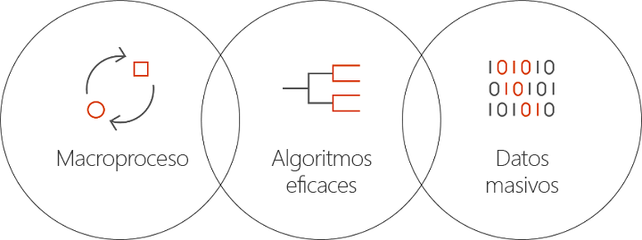

# ¿En qué consiste Batch AI en Azure?
Batch AI es un servicio administrado que permite a los científicos de datos y a los investigadores de la AI entrenar la inteligencia artificial y otros modelos de aprendizaje automático en clústeres de máquinas virtuales de Azure, incluidas máquinas virtuales con compatibilidad con GPU. Puede describir los requisitos de su trabajo, dónde encontrar las entradas y almacenar las salidas, y Batch AI se encarga del resto.  
 
## ¿Por qué Batch AI? 
El desarrollo de eficaces algoritmos de inteligencia artificial es un proceso iterativo e intensivo. Los científicos de datos y los investigadores de AI trabajan con conjuntos de datos cada vez mayores. Están desarrollando modelos con más capas y lo hacen con más experimentación en el diseño de la red en la optimización de hiperparámetros. Para hacerlo de forma eficiente, se necesitan varias CPU o GPU por modelo, ejecutar experimentos en paralelo y disponer de almacenamiento compartido para los datos de aprendizaje, los registros y las salidas del modelo.   
 

Los científicos de datos y los investigadores de la IA son expertos en su campo, sin embargo, la administración de la infraestructura a gran escala puede ser un obstáculo. Desarrollar la inteligencia artificial a escala requiere muchas tareas de infraestructura: aprovisionamiento de clústeres de máquinas virtuales, instalación de software y contenedores, puesta en cola de trabajo, establecimiento de prioridades y programación de trabajos, tratamiento de errores, distribución de datos, uso compartido de resultados, escalado de recursos para administrar costos e integración con herramientas y flujos de trabajo. Batch AI controla estas tareas. 
 
## ¿Qué es Batch AI? 

Batch AI proporciona administración de recursos y programación de trabajos especializados para el aprendizaje y pruebas de AI. Entre las funcionalidades clave se incluyen: 

* Ejecución de trabajos por lotes de larga duración, experimentación iterativa y entrenamiento interactivo 
* Escalado automático o manual de clústeres de máquinas virtuales mediante GPU o CPU 
* Configuración de la comunicación SSH entre máquinas virtuales y para el acceso remoto 
* Compatibilidad con cualquier plataforma de aprendizaje profundo o de aprendizaje automático, con configuración optimizada para conjuntos de herramientas populares como [Microsoft Cognitive Toolkit](https://github.com/Microsoft/CNTK) (CNTK), [TensorFlow](https://www.tensorflow.org/) y [Chainer](https://chainer.org/) 
* Cola de trabajo basado en prioridades para compartir clústeres y aprovechar las ventajas de las instancias reservadas y de las máquinas virtuales de prioridad baja  
* Opciones de almacenamiento flexibles, entre ellas Azure Files y un servidor NFS administrado 
* Montaje de recursos compartidos de archivos remotos en la máquina virtual y el contenedor opcional 
* Aportación del estado del trabajo y reinicio en caso de errores de la máquina virtual 
* Acceso a registros de salida, stdout, stderr y modelos, incluido streaming desde Azure Storage 
* [Interfaz de la línea de comandos](/cli/azure) (CLI) de Azure, SDK para [Python](https://github.com/Azure/azure-sdk-for-python), [C#](https://www.nuget.org/packages/Microsoft.Azure.Management.BatchAI/1.0.0-preview), y Java, supervisión en Azure Portal e integración con herramientas de inteligencia artificial de Microsoft 

El SDK de Batch AI es compatible con la escritura de scripts o aplicaciones para administrar las canalizaciones de aprendizaje e integrarse con las herramientas. El SDK proporciona actualmente API de Python, C#, Java y REST.  
 

Batch AI utiliza Azure Resource Manager para las operaciones de plano de control (crear, enumerar, obtener, eliminar). Azure Active Directory se utiliza para la autenticación y el control de acceso basado en rol.  
 
## Cómo usar Batch AI 

Para usar Batch AI, hay que definir y administrar *clústeres* y *trabajos*. 

 
Los **clústeres** describen los requisitos de proceso: 
* Región de Azure en la que se desea realizar la ejecución 
* La familia y el tamaño de máquina virtual que se va usar, por ejemplo, una máquina virtual NC24, que contiene 4 GPU NVIDIA K80 
* El número de máquinas virtuales o el número mínimo y máximo para el escalado automático 
* La imagen de la máquina virtual, por ejemplo, Ubuntu 16.04 LTS o [Microsoft Deep Learning Virtual Machine](https://azuremarketplace.microsoft.com/marketplace/apps/microsoft-ads.dsvm-deep-learning)
* Cualquier volumen de recursos compartidos de archivos remotos para montar, por ejemplo, desde Azure Files o un servidor NFS administrado por Batch AI 
* Nombre de usuario y clave SSH o la contraseña para configurar en las máquinas virtuales para habilitar el inicio de sesión interactivo para la depuración  
 

Los **trabajos** describen: 
* El clúster y la región que se va a utilizar 
* El número de máquinas virtuales que se necesitan para el trabajo 
* Los directorios de entrada y salida que se pasan al trabajo al iniciarse. Normalmente utiliza el sistema de archivos compartidos montado durante la configuración del clúster 
* Un contenedor opcional para ejecutar el software o el script de instalación 
* La configuración específica de la plataforma de AI o la línea de comandos, así como los parámetros para iniciar el trabajo 
 

Comience a usar Batch AI con la [CLI de Azure](/cli/azure) y los archivos de configuración para los clústeres y trabajos. Utilice este enfoque para crear rápidamente el clúster cuando sea necesario y ejecute trabajos para experimentar con el diseño de red o los hiperparámetros.  
 

Batch AI facilita el trabajo en paralelo con varias GPU. Cuando los trabajos deben escalarse en varias GPU, Batch AI establece una conectividad de red segura entre las máquinas virtuales. Cuando se utiliza InfiniBand, Batch AI configura los controladores e inicia MPI en los nodos de un trabajo.  

## Administración de datos
Batch AI proporciona opciones flexibles para los scripts, los datos y las salidas del aprendizaje:
  
* Utilice el **disco local** para la experimentación temprana y conjuntos de datos más pequeños. Para este escenario, es posible que desee conectarse a la máquina virtual a través de SSH para editar scripts y leer registros. 

* Use **Azure Files** para compartir datos de aprendizaje a través de varios trabajos y almacenar los modelos y registros de salida en una sola ubicación 

* Configure un **servidor NFS** para admitir una escala de datos mayor y máquinas virtuales para el aprendizaje. Batch AI puede configurar un servidor NFS automáticamente como un tipo especial de clúster con discos de seguridad en Azure Storage. 
 
* Un **sistema de archivos paralelo** ofrece más escalabilidad para los datos y el aprendizaje paralelo. Aunque Batch AI no administra sistemas de archivos paralelos, están disponibles plantillas de implementación de ejemplo para Lustre, Gluster y BeeGFS.  

## Pasos siguientes

* Empiece a crear su primer trabajo de aprendizaje de Batch AI mediante la [CLI de Azure](quickstart-cli.md) o [Python](quickstart-python.md).
* Consulte el ejemplo de [recetas de aprendizaje](https://github.com/Azure/BatchAI) para diferentes plataformas.

