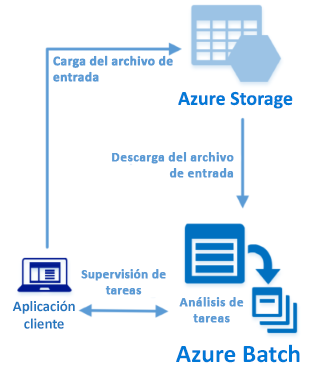

# <a name="quickstart-run-your-first-azure-batch-job-with-the-net-api"></a>Inicio rápido: ejecute su primer trabajo de Azure Batch con la API de .NET

En esta guía de inicio rápido se ejecuta un trabajo de Azure Batch desde una aplicación de C# compilada en la API de .NET de Azure Batch. La aplicación carga varios archivos de datos de entrada en Azure Storage y, después, crea un *grupo* de nodos de proceso de Batch (máquinas virtuales). A continuación, crea un *trabajo* de ejemplo que ejecuta *tareas* para procesar todos los archivo de entrada del grupo mediante un comando básico. Tras completar esta guía de inicio rápido, entenderá los conceptos clave del servicio Batch y estará listo para probar dicho servicio con cargas de trabajo más realistas y a mayor escala.



[!INCLUDE [quickstarts-free-trial-note.md](../../includes/quickstarts-free-trial-note.md)]

## <a name="prerequisites"></a>requisitos previos

* [IDE de Visual Studio](https://www.visualstudio.com/vs) (Visual Studio 2015 o una versión más reciente). 

* Una cuenta de Batch y una de Storage de uso general vinculada. Para crear estas cuentas, consulte las guías de inicio rápido de Batch con [Azure Portal](quick-create-portal.md) o la [CLI de Azure](quick-create-cli.md). 

## <a name="sign-in-to-azure"></a>Inicio de sesión en Azure

Inicie sesión en Azure Portal en [https://portal.azure.com](https://portal.azure.com).

[!INCLUDE [batch-common-credentials](../../includes/batch-common-credentials.md)]

## <a name="download-the-sample"></a>Descarga del ejemplo

[Descargue o clone la aplicación de ejemplo](https://github.com/Azure-Samples/batch-dotnet-quickstart) desde GitHub. Para clonar el repositorio de la aplicación de ejemplo con un cliente de Git, use el siguiente comando:

```
git clone https://github.com/Azure-Samples/batch-dotnet-quickstart.git
```

Vaya al directorio que contiene el archivo `BatchDotNetQuickstart.sln` de la solución de Visual Studio.

Abra el archivo de la solución en Visual Studio y actualice las cadenas de credenciales de `program.cs` con los valores obtenidos para las cuentas. Por ejemplo: 

```csharp
// Batch account credentials
private const string BatchAccountName = "mybatchaccount";
private const string BatchAccountKey  = "xxxxxxxxxxxxxxxxE+yXrRvJAqT9BlXwwo1CwF+SwAYOxxxxxxxxxxxxxxxx43pXi/gdiATkvbpLRl3x14pcEQ==";
private const string BatchAccountUrl  = "https://mybatchaccount.mybatchregion.batch.azure.com";

// Storage account credentials
private const string StorageAccountName = "mystorageaccount";
private const string StorageAccountKey  = "xxxxxxxxxxxxxxxxy4/xxxxxxxxxxxxxxxxfwpbIC5aAWA8wDu+AFXZB827Mt9lybZB1nUcQbQiUrkPtilK5BQ==";
```

## <a name="build-and-run-the-app"></a>Compilación y ejecución de la aplicación

Para ver el flujo de trabajo de Batch en acción, compile y ejecute la aplicación. Después de ejecutar la aplicación, examine el código para ver qué es lo que hace cada parte de la aplicación. 

* Haga clic con el botón derecho en la solución en el Explorador de soluciones y en **Compilar solución**. 

* Si se le solicita, confirme la restauración de los paquetes NuGet. Si necesita descargar los paquetes que faltan, asegúrese de que el [Administrador de paquetes NuGet](https://docs.nuget.org/consume/installing-nuget) está instalado.

A continuación, ejecútelo. Al ejecutar la aplicación de ejemplo, la salida de la consola es similar a la siguiente. Durante la ejecución, se experimenta una pausa en `Monitoring all tasks for 'Completed' state, timeout in 00:30:00...` mientras se inician los nodos de proceso del grupo. Las tareas se ponen en cola para ejecutarse en cuanto lo haga el primer nodo de proceso. Vaya a la cuenta de Batch de [Azure Portal](https://portal.azure.com) para supervisar el grupo, los nodos de proceso, el trabajo y las tareas.

```
Sample start: 12/4/2017 4:02:54 PM

Container [input] created.
Uploading file taskdata0.txt to container [input]...
Uploading file taskdata1.txt to container [input]...
Uploading file taskdata2.txt to container [input]...
Creating pool [DotNetQuickstartPool]...
Creating job [DotNetQuickstartJob]...
Adding 3 tasks to job [DotNetQuickstartJob]...
Monitoring all tasks for 'Completed' state, timeout in 00:30:00...
```

Cuando finalicen las tareas, verá una salida similar a la siguiente en cada tarea:

```
Printing task output.
Task: Task0
Node: tvm-2850684224_3-20171205t000401z
Standard out:
Batch processing began with mainframe computers and punch cards. Today it still plays a central role in business, engineering, science, and other pursuits that require running lots of automated tasks....
stderr:
...
```

El tiempo de ejecución habitual es de aproximadamente 5 minutos cuando se ejecuta la aplicación con su configuración predeterminada. La mayor parte del tiempo lo ocupa la configuración inicial del grupo. Para volver a ejecutar el trabajo, elimínelo de la ejecución anterior y no elimine el grupo. En un grupo preconfigurado, el trabajo se completa en pocos segundos.


## <a name="review-the-code"></a>Revisión del código

En esta guía de inicio rápido, la aplicación .NET realiza las siguientes operaciones:

* Carga tres archivos de texto pequeños en un contenedor de blobs de su cuenta de Azure Storage. Estos archivos son entradas que Batch procesa.
* Crea un grupo de nodos de proceso que ejecutan Windows Server.
* Crea un trabajo y tres tareas que se ejecutan en los nodos. Cada tarea procesa uno de los archivos de entrada mediante una línea de comandos de Windows. 
* Muestra los archivos devueltos por las tareas.

Para más información, consulte las secciones siguientes y vea el archivo `Program.cs`. 

### <a name="preliminaries"></a>Pasos preliminares

Para interactuar con la cuenta de almacenamiento, la aplicación utiliza la biblioteca de clientes de Azure Storage para .NET. Crea una referencia a la cuenta con [CloudStorageAccount](/dotnet/api/microsoft.windowsazure.storage.cloudstorageaccount) y, desde ella, crea un objeto [CloudBlobClient](/dotnet/api/microsoft.windowsazure.storage.blob.cloudblobclient).

```csharp
CloudBlobClient blobClient = storageAccount.CreateCloudBlobClient();
```

La aplicación usa la referencia `blobClient` para crear un contenedor en la cuenta de almacenamiento y cargar archivos de datos en el contenedor. Los archivos de almacenamiento se definen como objetos [ResourceFile](/dotnet/api/microsoft.azure.batch.resourcefile) de Batch para que el servicio los descargue después en nodos de proceso.

```csharp
List<string> inputFilePaths = new List<string>
{
    @"..\..\taskdata0.txt",
    @"..\..\taskdata1.txt",
    @"..\..\taskdata2.txt"
};

List<ResourceFile> inputFiles = new List<ResourceFile>();

foreach (string filePath in inputFilePaths)
{
    inputFiles.Add(UploadFileToContainer(blobClient, inputContainerName, filePath));
}
```

La aplicación crea un objeto [BatchClient](/dotnet/api/microsoft.azure.batch.batchclient) para crear y administrar los grupos, los trabajos y las tareas en el servicio Batch. El cliente de Batch del ejemplo utiliza la autenticación de clave compartida. (Batch también admite la autenticación de Azure Active Directory.)

```csharp
BatchSharedKeyCredentials cred = new BatchSharedKeyCredentials(BatchAccountUrl, BatchAccountName, BatchAccountKey);

using (BatchClient batchClient = BatchClient.Open(cred))
...    
```

### <a name="create-a-pool-of-compute-nodes"></a>Creación de un grupo de nodos de proceso

Para crear un grupo de Batch, la aplicación usa el método [BatchClient.PoolOperations.CreatePool](/dotnet/api/microsoft.azure.batch.pooloperations.createpool) para establecer el número de nodos, el tamaño de la máquina virtual y la configuración del grupo. En este caso, un objeto [VirtualMachineConfiguration](/dotnet/api/microsoft.azure.batch.virtualmachineconfiguration) especifica un valor de [ImageReference](/dotnet/api/microsoft.azure.batch.imagereference) en una imagen de Windows Server publicada en Azure Marketplace. Batch es compatible con una amplia gama de imágenes de Linux y Windows Server de Azure Marketplace, así como con las imágenes de máquina virtual personalizadas.

El número de nodos (`PoolNodeCount`) y el tamaño de la máquina virtual (`PoolVMSize`) son constantes definidas. De forma predeterminada el ejemplo crea un grupo de dos nodos de tamaño *Standard_A1_v2*. El tamaño que se sugiere ofrece un buen equilibrio entre rendimiento y costo para este ejemplo rápido. 

El método [Commit](/dotnet/api/microsoft.azure.batch.cloudpool.commit) envía el grupo al servicio Batch.

```csharp
ImageReference imageReference = new ImageReference(
    publisher: "MicrosoftWindowsServer",
    offer: "WindowsServer",
    sku: "2012-R2-Datacenter-smalldisk",
    version: "latest");

VirtualMachineConfiguration virtualMachineConfiguration =
new VirtualMachineConfiguration(
   imageReference: imageReference,
   nodeAgentSkuId: "batch.node.windows amd64");

try
{
    CloudPool pool = batchClient.PoolOperations.CreatePool(
    poolId: PoolId,
    targetDedicatedComputeNodes: PoolNodeCount,
    virtualMachineSize: PoolVMSize,
    virtualMachineConfiguration: virtualMachineConfiguration);

    pool.Commit();
}
...

```
### <a name="create-a-batch-job"></a>Creación de un trabajo de Batch

Un trabajo de Batch es una agrupación lógica de una o varias tareas. Un trabajo incluye valores comunes para las tareas, como la prioridad y el grupo en el que se ejecutan las tareas. La aplicación usa el método [BatchClient.JobOperations.CreateJob](/dotnet/api/microsoft.azure.batch.joboperations.createjob) para crear un trabajo en el grupo. 

El método [Commit](/dotnet/api/microsoft.azure.batch.cloudjob.commit) envía el trabajo al servicio Batch. Inicialmente, el trabajo no tiene tareas.

```csharp
try
{
    CloudJob job = batchClient.JobOperations.CreateJob();
    job.Id = JobId;
    job.PoolInformation = new PoolInformation { PoolId = PoolId };

    job.Commit(); 
}
...       
```

### <a name="create-tasks"></a>Creación de tareas
La aplicación crea una lista de objetos [CloudTask](/dotnet/api/microsoft.azure.batch.cloudtask). Cada tarea procesa un objeto `ResourceFile` de entrada mediante una propiedad [CommandLine](/dotnet/api/microsoft.azure.batch.cloudtask.commandline). En el ejemplo, la línea de comandos ejecuta el comando `type` de Windows para mostrar el archivo de entrada. Este comando es un ejemplo sencillo para fines de demostración. Cuando se usa Batch, la línea de comandos es el lugar en el que se especifica la aplicación o el script. Batch proporciona varias formas de implementar aplicaciones y scripts en nodos de proceso.

A continuación, la aplicación agrega tareas al trabajo con el método [AddTask](/dotnet/api/microsoft.azure.batch.joboperations.addtask), que las pone en cola para que se ejecuten en los nodos de proceso. 

```csharp
for (int i = 0; i < inputFiles.Count; i++)
{
    string taskId = String.Format("Task{0}", i);
    string inputFilename = inputFiles[i].FilePath;
    string taskCommandLine = String.Format("cmd /c type {0}", inputFilename);

    CloudTask task = new CloudTask(taskId, taskCommandLine);
    task.ResourceFiles = new List<ResourceFile> { inputFiles[i] };
    tasks.Add(task);
}

batchClient.JobOperations.AddTask(JobId, tasks);
```
 
### <a name="view-task-output"></a>Visualización de la salida de la tarea

La aplicación crea un objeto [TaskStateMonitor](/dotnet/api/microsoft.azure.batch.taskstatemonitor) que supervisa las tareas para asegurarse de que se completan. Luego, la aplicación usa la propiedad [CloudTask.ComputeNodeInformation](/dotnet/api/microsoft.azure.batch.cloudtask.computenodeinformation) para mostrar el archivo `stdout.txt` que genera cada tarea que se completa. Cuando la tarea se ejecuta correctamente, la salida del comando de la tarea se escribe en `stdout.txt`:

```csharp
foreach (CloudTask task in completedtasks)
{
    string nodeId = String.Format(task.ComputeNodeInformation.ComputeNodeId);
    Console.WriteLine("Task: {0}", task.Id);
    Console.WriteLine("Node: {0}", nodeId);
    Console.WriteLine("Standard out:");
    Console.WriteLine(task.GetNodeFile(Constants.StandardOutFileName).ReadAsString());
}
```

## <a name="clean-up-resources"></a>Limpieza de recursos

La aplicación elimina automáticamente el contenedor de almacenamiento que crea y ofrece la opción de eliminar el grupo y el trabajo de Batch. Se cobran el grupo mientras que los nodos estén en ejecución, aunque no haya trabajos programados. Cuando no necesite el grupo, elimínelo. Al eliminar el grupo, las salidas de tarea de los nodos también se eliminan.

Cuando ya no los necesite, elimine el grupo de recursos, la cuenta de Batch y la de Storage. Para hacerlo desde Azure Portal, seleccione el grupo de recursos de la cuenta de Batch y haga clic en **Eliminar grupo de recursos**.

## <a name="next-steps"></a>pasos siguientes

En esta guía de inicio rápido, se ha ejecutado una aplicación pequeña compilada mediante la API de .NET de Batch para crear un grupo de Batch y un trabajo de Batch. El trabajo ha ejecutado tareas de ejemplo y ha descargado la salida que se ha creado en los nodos. Ahora que conoce los conceptos clave del servicio Batch, ya esta listo para probar dicho servicio con cargas de trabajo más realistas y a mayor escala. Para más información acerca de Azure Batch y examinar una carga de trabajo en paralelo con una aplicación real, diríjase al tutorial de .NET de Batch.


> [!div class="nextstepaction"]
> [Proceso de una carga de trabajo en paralelo con .NET](tutorial-parallel-dotnet.md)
