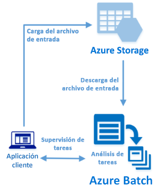

# <a name="quickstart-run-your-first-batch-job-with-the-python-api"></a>Inicio rápido: ejecute su primer trabajo de Batch con la API de Python

En esta guía de inicio rápido se ejecuta un trabajo de Azure Batch desde una aplicación compilada en la API de Python de Azure Batch. La aplicación carga varios archivos de datos de entrada en Azure Storage y, después, crea un *grupo* de nodos de proceso de Batch (máquinas virtuales). A continuación, crea un *trabajo* de ejemplo que ejecuta *tareas* para procesar todos los archivo de entrada del grupo mediante un comando básico. Tras completar esta guía de inicio rápido, entenderá los conceptos clave del servicio Batch y estará listo para probar dicho servicio con cargas de trabajo más realistas y a mayor escala.
 


[!INCLUDE [quickstarts-free-trial-note.md](../../includes/quickstarts-free-trial-note.md)]

## <a name="prerequisites"></a>Requisitos previos

* [Python 2.7 o 3.3, o cualquier versión posterior](https://www.python.org/downloads/)

* Administrador de paquetes [pip](https://pip.pypa.io/en/stable/installing/)

* Una cuenta de Azure Batch y una cuenta de Azure Storage de uso general vinculada. Para crear estas cuentas, consulte las guías de inicio rápido de Batch con [Azure Portal](quick-create-portal.md) o la [CLI de Azure](quick-create-cli.md). 

## <a name="sign-in-to-azure"></a>Inicio de sesión en Azure

Inicie sesión en Azure Portal en [https://portal.azure.com](https://portal.azure.com).

[!INCLUDE [batch-common-credentials](../../includes/batch-common-credentials.md)]

## <a name="download-the-sample"></a>Descarga del ejemplo

[Descargue o clone la aplicación de ejemplo](https://github.com/Azure-Samples/batch-python-quickstart) desde GitHub. Para clonar el repositorio de la aplicación de ejemplo con un cliente de Git, use el siguiente comando:

```
git clone https://github.com/Azure-Samples/batch-python-quickstart.git
```

Vaya al directorio que contiene el script de Python`python_quickstart_client.py`.

En el entorno de desarrollo de Python, instale los paquetes necesarios mediante `pip`.

```bash
pip install -r requirements.txt
```

Abra el archivo `python_quickstart_client.py`. Actualice las cadenas de credenciales tanto de Batch como de la cuenta de almacenamiento con los valores obtenidos para sus cuentas. Por ejemplo: 


```Python
_BATCH_ACCOUNT_NAME = 'mybatchaccount'
_BATCH_ACCOUNT_KEY = 'xxxxxxxxxxxxxxxxE+yXrRvJAqT9BlXwwo1CwF+SwAYOxxxxxxxxxxxxxxxx43pXi/gdiATkvbpLRl3x14pcEQ=='
_BATCH_ACCOUNT_URL = 'https://mybatchaccount.mybatchregion.batch.azure.com'
_STORAGE_ACCOUNT_NAME = 'mystorageaccount'
_STORAGE_ACCOUNT_KEY = 'xxxxxxxxxxxxxxxxy4/xxxxxxxxxxxxxxxxfwpbIC5aAWA8wDu+AFXZB827Mt9lybZB1nUcQbQiUrkPtilK5BQ=='
```

## <a name="run-the-app"></a>Ejecución de la aplicación

Para ver el flujo de trabajo de Batch en acción, ejecute el script:

```
python python_quickstart_client.py
```

Después de ejecutar el script, examine el código para ver qué es lo que hace cada parte de la aplicación. 

Al ejecutar la aplicación de ejemplo, la salida de la consola es similar a la siguiente. Durante la ejecución, se experimenta una pausa en `Monitoring all tasks for 'Completed' state, timeout in 00:30:00...` mientras se inician los nodos de proceso del grupo. Las tareas se ponen en cola para ejecutarse en cuanto lo haga el primer nodo de proceso. Vaya a la cuenta de Batch en [Azure Portal](https://portal.azure.com) para supervisar el grupo, los nodos de proceso, el trabajo y las tareas en su cuenta de Batch.

```
Sample start: 12/4/2017 4:02:54 PM

Container [input] created.
Uploading file taskdata0.txt to container [input]...
Uploading file taskdata1.txt to container [input]...
Uploading file taskdata2.txt to container [input]...
Creating pool [PythonQuickstartPool]...
Creating job [PythonQuickstartJob]...
Adding 3 tasks to job [PythonQuickstartJob]...
Monitoring all tasks for 'Completed' state, timeout in 00:30:00...
```

Cuando finalicen las tareas, verá una salida similar a la siguiente en cada tarea:

```
Printing task output...
Task: Task0
Node: tvm-2850684224_3-20171205t000401z
Standard out:
Batch processing began with mainframe computers and punch cards. Today it still plays a central role in business, engineering, science, and other pursuits that require running lots of automated tasks....
...
```

Habitualmente, el tiempo de ejecución es de, aproximadamente, 3 minutos cuando la aplicación se ejecuta con su configuración predeterminada. La mayor parte del tiempo lo ocupa la configuración inicial del grupo.

## <a name="review-the-code"></a>Revisión del código

En esta guía de inicio rápido, la aplicación de Python realiza las siguientes operaciones:

* Carga tres archivos de texto pequeños en un contenedor de blobs de su cuenta de Azure Storage. Estos archivos son entradas que las tareas de Batch procesan.
* Crea un grupo de dos nodos de proceso que ejecutan Ubuntu 16.04 LTS.
* Crea un trabajo y tres tareas que se ejecutan en los nodos. Cada tarea procesa uno de los archivos de entrada mediante una línea de comandos del shell de Bash.
* Muestra los archivos devueltos por las tareas.

Para más información, consulte las secciones siguientes y vea el archivo `python_quickstart_client.py`. 

### <a name="preliminaries"></a>Pasos preliminares

Para interactuar con una cuenta de almacenamiento, la aplicación usa el paquete [azure-storage-blob](https://pypi.python.org/pypi/azure-storage-blob) para crear un objeto [BlockBlobService](/python/api/azure.storage.blob.blockblobservice.blockblobservice).

```python
blob_client = azureblob.BlockBlobService(
    account_name=_STORAGE_ACCOUNT_NAME,
    account_key=_STORAGE_ACCOUNT_KEY)
```

La aplicación usa la referencia `blob_client` para crear un contenedor en la cuenta de almacenamiento y cargar archivos de datos en el contenedor. Los archivos de almacenamiento se definen como objetos [ResourceFile](/python/api/azure.batch.models.resourcefile) de Batch para que el servicio los descargue después en nodos de proceso.

```python
input_file_paths = [os.path.realpath('./data/taskdata0.txt'),
                    os.path.realpath('./data/taskdata1.txt'),
                    os.path.realpath('./data/taskdata2.txt')]
input_files = [
    upload_file_to_container(blob_client, input_container_name, file_path)
    for file_path in input_file_paths]
```

La aplicación crea un objeto [BatchServiceClient](/python/api/azure.batch.batchserviceclient) para crear y administrar los grupos, los trabajos y las tareas en el servicio Batch. El cliente de Batch del ejemplo utiliza la autenticación de clave compartida. Batch también admite la autenticación de Azure Active Directory.

```python
credentials = batchauth.SharedKeyCredentials(_BATCH_ACCOUNT_NAME,
    BATCH_ACCOUNT_KEY)

batch_client = batch.BatchServiceClient(
    credentials,
    base_url=_BATCH_ACCOUNT_URL)
```


### <a name="create-a-pool-of-compute-nodes"></a>Creación de un grupo de nodos de proceso

Para crear un grupo de Batch, la aplicación usa la clase [PoolAddParameter](/python/api/azure.batch.models.pooladdparameter) para establecer el número de nodos, el tamaño de la máquina virtual y una configuración de grupo. En este caso, un objeto [VirtualMachineConfiguration](/python/api/azure.batch.models.virtualmachineconfiguration) especifica un valor de [ImageReference](/python/api/azure.batch.models.imagereference) en una imagen de Ubuntu Server 16.04 LTS publicada en Azure Marketplace. Batch es compatible con una amplia gama de imágenes de Linux y Windows Server de Azure Marketplace, así como con las imágenes de máquina virtual personalizadas.

El número de nodos (`_POOL_NODE_COUNT`) y el tamaño de la máquina virtual (`_POOL_VM_SIZE`) son constantes definidas. De forma predeterminada el ejemplo crea un grupo de dos nodos de tamaño *Standard_A1_v2*. El tamaño que se sugiere ofrece un buen equilibrio entre rendimiento y costo para este ejemplo rápido.

El método [pool.add](/python/api/azure.batch.operations.pooloperations#azure_batch_operations_PoolOperations_add) envía el grupo al servicio Batch.

```python
new_pool = batch.models.PoolAddParameter(
    id=pool_id,
    virtual_machine_configuration=batchmodels.VirtualMachineConfiguration(
        image_reference=batchmodels.ImageReference(
            publisher="Canonical",
            offer="UbuntuServer",
            sku="16.04.0-LTS",
            version="latest"
            ),
        node_agent_sku_id="batch.node.ubuntu 16.04"),
    vm_size=_POOL_VM_SIZE,
    target_dedicated_nodes=_POOL_NODE_COUNT
)
batch_service_client.pool.add(new_pool)
```

### <a name="create-a-batch-job"></a>Creación de un trabajo de Batch

Un trabajo de Batch es una agrupación lógica de una o varias tareas. Un trabajo incluye valores comunes para las tareas, como la prioridad y el grupo en el que se ejecutan las tareas. La aplicación usa la clase [JobAddParameter](/python/api/azure.batch.models.jobaddparameter) para crear un trabajo en el grupo. El método [job.add](/python/api/azure.batch.operations.joboperations#azure_batch_operations_JobOperations_add) envía el grupo al servicio Batch. Inicialmente, el trabajo no tiene tareas.

```python
job = batch.models.JobAddParameter(
    job_id,
    batch.models.PoolInformation(pool_id=pool_id))
batch_service_client.job.add(job)
```

### <a name="create-tasks"></a>Creación de tareas

La aplicación crea una lista de objetos de tarea mediante la clase [TaskAddParameter](/python/api/azure.batch.models.taskaddparameter). Cada tarea procesa un objeto `resource_files` de entrada mediante un parámetro `command_line`. En el ejemplo, la línea de comandos ejecuta el comando `cat` del shell de Bash para mostrar el archivo de texto. Este comando es un ejemplo sencillo para fines de demostración. Cuando se usa Batch, la línea de comandos es el lugar en el que se especifica la aplicación o el script. Batch proporciona varias formas de implementar aplicaciones y scripts en nodos de proceso.

A continuación, la aplicación agrega tareas al trabajo con el método [task.add_collection](/python/api/azure.batch.operations.taskoperations#azure_batch_operations_TaskOperations_add_collection), que las pone en cola para que se ejecuten en los nodos de proceso. 

```python
tasks = list()

for idx, input_file in enumerate(input_files): 
    command = "/bin/bash -c \"cat {}\"".format(input_file.file_path)
    tasks.append(batch.models.TaskAddParameter(
        id='Task{}'.format(idx),
        command_line=command,
        resource_files=[input_file]
    )
)
batch_service_client.task.add_collection(job_id, tasks)
```

### <a name="view-task-output"></a>Visualización de la salida de la tarea

La aplicación supervisa el estado de la tarea para asegurarse de que completan las tareas. Luego, la aplicación muestra el archivo `stdout.txt` que ha generado cada una de las tareas que se completa. Cuando la tarea se ejecuta correctamente, la salida del comando de la tarea se escribe en `stdout.txt`:

```python
tasks = batch_service_client.task.list(job_id)

for task in tasks:
    
    node_id = batch_service_client.task.get(job_id, task.id).node_info.node_id
    print("Task: {}".format(task.id))
    print("Node: {}".format(node_id))

    stream = batch_service_client.file.get_from_task(job_id, task.id, _STANDARD_OUT_FILE_NAME)

    file_text = _read_stream_as_string(
        stream,
        encoding)
    print("Standard output:")
    print(file_text)
```

## <a name="clean-up-resources"></a>Limpieza de recursos

La aplicación elimina automáticamente el contenedor de almacenamiento que crea y ofrece la opción de eliminar el grupo y el trabajo de Batch. Se cobran el grupo mientras que los nodos estén en ejecución, aunque no haya trabajos programados. Cuando no necesite el grupo, elimínelo. Al eliminar el grupo, las salidas de tarea de los nodos también se eliminan. 

Cuando ya no los necesite, elimine el grupo de recursos, la cuenta de Batch y la de Storage. Para hacerlo desde Azure Portal, seleccione el grupo de recursos de la cuenta de Batch y haga clic en **Eliminar grupo de recursos**.

## <a name="next-steps"></a>Pasos siguientes

En esta guía de inicio rápido, se ha ejecutado una aplicación pequeña compilada mediante la API de Python de Batch para crear un grupo de Batch y un trabajo de Batch. El trabajo ha ejecutado tareas de ejemplo y ha descargado la salida que se ha creado en los nodos. Ahora que conoce los conceptos clave del servicio Batch, ya esta listo para probar dicho servicio con cargas de trabajo más realistas y a mayor escala. Para más información acerca de Azure Batch y examinar una carga de trabajo en paralelo con una aplicación real, diríjase al tutorial de Python de Batch.

> [!div class="nextstepaction"]
> [Proceso de una carga de trabajo en paralelo con Python](tutorial-parallel-python.md)
