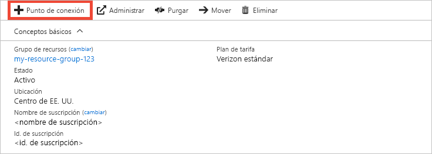
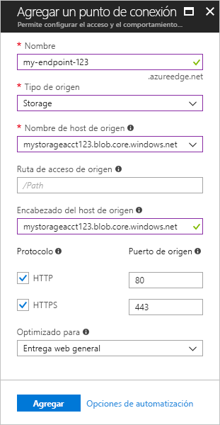
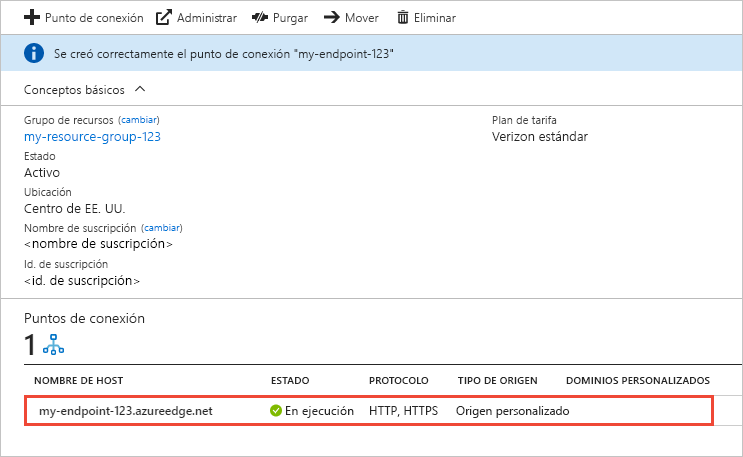

# Guía de inicio rápido: Creación de un perfil y un punto de conexión de Azure CDN
En esta guía de inicio rápido se describe cómo habilitar Azure Content Delivery Network (CDN) mediante la creación de un perfil de CDN y un punto de conexión de CDN nuevos. Una vez haya creado un perfil y un punto de conexión, puede iniciar la entrega de contenido a sus clientes.

[!INCLUDE [quickstarts-free-trial-note](../../includes/quickstarts-free-trial-note.md)]

## requisitos previos
Para los fines de esta quía de inicio rápido, debe haber creado una cuenta de almacenamiento llamada *mystorageacct123* que se utiliza para el nombre de host de origen. Para más información, consulte [Integración de una cuenta de Azure Storage con Azure CDN](cdn-create-a-storage-account-with-cdn.md).

## Iniciar sesión en Azure Portal
Inicie sesión en [Azure Portal](https://portal.azure.com) con su cuenta de Azure.

[!INCLUDE [cdn-create-profile](../../includes/cdn-create-profile.md)]

## Crear un nuevo extremo de CDN

Después de crear un perfil de CDN, puede usarlo para crear un punto de conexión.

1. En Azure Portal, seleccione en el panel el perfil de CDN que creó. Si no lo encuentra, seleccione **Todos los servicios** y, a continuación, seleccione **Perfiles de CDN**. En la página **Perfiles de CDN**, seleccione el perfil que desea utilizar. 
   
    Aparece la página del perfil de CDN.

2. Seleccione el **punto de conexión**.
   
    
   
    Aparecerá la página **Agregar un punto de conexión**.

    Use la configuración especificada en la tabla que aparece después de la imagen.
   
    

    | Configuración | Valor |
    | ------- | ----- |
    | **Name** | Escriba *my-endpoint-123* para el nombre de host del punto de conexión. Este nombre debe ser único globalmente; si ya está en uso, puede especificar otro diferente. Este nombre se usa para acceder a los recursos almacenados en caché en el dominio _&lt;nombre del punto de conexión&gt;_.azureedge.net.|
    | **Tipo de origen** | Seleccione **Storage**. | 
    | **Nombre de host de origen** | Escriba *mystorageacct123.blob.core.windows.net* para el nombre de host. Este nombre debe ser único globalmente; si ya está en uso, puede especificar otro diferente. |
    | **Ruta de acceso de origen** | déjelo en blanco. |
    | **Encabezado del host de origen** | Deje el valor generado de forma predeterminada. |  
    | **Protocolo** | Deje las opciones **HTTP** y **HTTPS** predeterminadas seleccionadas. |
    | **Puerto de origen** | Deje los valores de puerto predeterminados. | 
    | **Optimizado para** | Deje la selección predeterminada **Entrega web general**. |
    
3. Seleccione **Agregar** para crear el nuevo punto de conexión.
   
   Una vez creado el punto de conexión, aparece en la lista de puntos de conexión del perfil.
    
   
    
   Dado que se tarda un tiempo en que el registro se propague, el punto de conexión no estará disponible para su uso de forma inmediata: 
   - En los perfiles **Azure CDN Estándar de Microsoft**, la propagación se completa normalmente en diez minutos. 
   - En los perfiles de **Azure CDN estándar**, la propagación normalmente se completa en un minuto. 
   - En los perfiles **Azure CDN de Verizon estándar** y **Azure CDN de Verizon premium**, la propagación se completa normalmente en 90 minutos. 

## Limpieza de recursos
En los pasos anteriores, ha creado un perfil y un punto de conexión de CDN en un grupo de recursos. Guarde estos recursos si desea continuar con los [Pasos siguientes](#next-steps) y aprender cómo agregar un dominio personalizado al punto de conexión. No obstante, si no cree que vaya a necesitar estos recursos en el futuro, puede eliminarlos mediante la eliminación del grupo de recursos y así evitar cargos adicionales:

1. En el menú izquierdo de Azure Portal, seleccione **Grupos de recursos** y, a continuación, seleccione **my-resource-group-123**.

2. En la página **Grupo de recursos**, seleccione **Eliminar grupo de recursos**, escriba *my-resource-group-123* en el cuadro de texto y, a continuación, seleccione **Eliminar**.

    Esta acción eliminará el grupo de recursos, el perfil y el punto de conexión que creó en esta guía de inicio rápido.

## Pasos siguientes
Para obtener información acerca de cómo agregar un dominio personalizado al punto de conexión de CDN, consulte el tutorial siguiente:

> [!div class="nextstepaction"]
> [Tutorial: Incorporación de Azure CDN a una aplicación web](app-service-web-tutorial-content-delivery-network.md)

