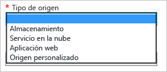

# Introducción a Azure CDN
Este tema le guía a través de la habilitación de la red CDN de Azure mediante la creación de un perfil de red CDN y un punto de conexión nuevo.

> [!IMPORTANT]
> Para una introducción al funcionamiento de la red CDN, así como una lista de las características, consulte la [información general de la red CDN](cdn-overview.md).
> 
> 

## Crear un nuevo perfil de CDN
Un perfil de red de entrega de contenido es una colección de puntos de conexión de red de entrega de contenido.  Cada perfil contiene uno o más de estos puntos de conexión de CDN.  Puede que quiera usar varios perfiles para organizar sus puntos de conexión de la red CDN por dominio de Internet, aplicación web o cualquier otro criterio.

> [!NOTE]
> De manera predeterminada, una sola suscripción de Azure está limitada a ocho perfiles de red CDN. Cada perfil de red CDN está limitado a diez puntos de conexión de red CDN.
> 
> Los precios de red de entrega de contenido se aplican en el nivel de perfil de red de entrega de contenido. Si quiere utilizar una combinación planes de tarifa de Red CDN de Azure, necesitará varios perfiles de red CDN.
> 
> 

[!INCLUDE [cdn-create-profile](../../includes/cdn-create-profile.md)]

## Crear un nuevo punto de conexión de CDN
**Para crear un nuevo punto de conexión de red CDN**

1. En el [Portal de Azure](https://portal.azure.com), vaya su perfil de red CDN.  Puede haberlo anclado al panel en el paso anterior.  Si no lo hace, para encontrarlo, haga clic en **Examinar**, en **Perfiles de CDN** y, luego, haga clic en el perfil al que planea agregar el punto de conexión.
   
    Aparece la hoja del perfil de CDN.
   
    ![Perfil de CDN][cdn-profile-settings]
2. Haga clic en el botón **Agregar extremo** .
   
    ![Botón Agregar punto de conexión][cdn-new-endpoint-button]
   
    Aparecerá la hoja **Agregar un extremo** .
   
    ![Hoja Agregar punto de conexión][cdn-add-endpoint]
3. Escriba un **Nombre** para este punto de conexión de red de entrega de contenido.  Este nombre se usará para obtener acceso a sus recursos almacenados en caché en el dominio `<endpointname>.azureedge.net`.
4. En la lista desplegable **Tipo de origen** , seleccione su tipo de origen.  Seleccione **Almacenamiento** para una cuenta de Azure Storage, **Servicio en la nube** para un servicio en la nube de Azure, **Aplic. web** para una aplic. web de Azure, o bien **Origen personalizado** para cualquier otro origen del servidor web públicamente accesible (hospedado en Azure o en otro lugar).
   
    
5. En la lista desplegable **Nombre de host de origen** , seleccione o escriba su dominio de origen.  En la lista desplegable se muestran todos los orígenes disponibles del tipo especificado en el paso 4.  Si seleccionó *Origen personalizado* como su **Tipo de origen**, tendrá que escribir el dominio de su origen personalizado.
6. En el cuadro de texto **Ruta de acceso de origen** , escriba la ruta de acceso a los recursos que quiera almacenar en caché o déjela en blanco para permitir almacenar en caché cualquier recurso en el dominio especificado en el paso 5.
7. En el **Encabezado del host de origen**, escriba el encabezado de host que quiera que la red CDN envíe con cada solicitud o deje el valor predeterminado.
   
   > [!WARNING]
   > Algunos tipos de orígenes, como Almacenamiento de Azure y Aplicaciones web, requieren que el encabezado del host coincida con el dominio del origen. A menos que tenga un origen que requiera un encabezado de host diferente de su dominio, debe dejar el valor predeterminado.
   > 
   > 
8. Para **Protocolo** y **Puerto de origen**, especifique los protocolos y los puertos que se usan para tener acceso a sus recursos en el origen.  Se debe seleccionar al menos un protocolo (HTTP o HTTPS).
   
   > [!NOTE]
   > El valor de **Puerto de origen** solo afecta al puerto que utiliza el punto de conexión para recuperar información del origen.  El propio punto de conexión solo estará disponible para los clientes finales en los puertos HTTP y HTTPS predeterminados (80 y 443), independencia de cuál sea el **puerto de origen**.  
   > 
   > **red CDN de Azure de Akamai** no permiten el intervalo completo de puertos TCP para los orígenes.  Para obtener una lista de los puertos de origen que no se permiten, consulte [Azure CDN from Akamai Allowed Origin Ports](https://msdn.microsoft.com/library/mt757337.aspx)(Puertos de origen permitidos de la red CDN de Azure de Akamai).  
   > 
   > El acceso al contenido de la red CDN usando HTTPS tiene la siguiente restricciones:
   > 
   > * Debe utilizar el certificado SSL proporcionado por la red CDN. No se admiten certificados de terceros.
   > * Para acceder al contenido HTTPS, tiene que usar el dominio proporcionado por la red CDN (`<endpointname>.azureedge.net`). La compatibilidad con HTTPS no está disponible para nombres de dominio personalizados (CNAME) dado que la red CDN no admite certificados personalizados en este momento.
   > 
   > 
9. Haga clic en el botón **Agregar** para crear el nuevo punto de conexión.
10. Una vez creado el punto de conexión, aparecerá en la lista de puntos de conexión del perfil. La visualización de la lista muestra la URL que se debe utilizar para tener acceso al contenido en caché, así como al dominio de origen.
    
    ![Punto de conexión de CDN][cdn-endpoint-success]
    
    > [!IMPORTANT]
    > El punto de conexión no estará disponible para su uso de forma inmediata; el registro puede tardar en propagarse a través de la red CDN.  Para <b>red CDN de Azure de Akamai</b> , la propagación normalmente se completará en un minuto.  Para los perfiles de la <b>red CDN de Azure de Verizon</b>, la propagación normalmente se completará en 90 minutos, pero en algunos casos puede tardar más tiempo.
    > 
    > Los usuarios que intenten usar el nombre de dominio de la red CDN antes de que la configuración del punto de conexión se haya propagado a los POP recibirán los códigos de respuesta HTTP 404.  Si han pasado varias horas desde que creó el punto de conexión y aún recibe errores 404, consulte [Troubleshooting CDN endpoints returning 404 statuses](cdn-troubleshoot-endpoint.md)(Solución de problemas de puntos de conexión de redes CDN que devuelven errores 404).
    > 
    > 

## Otras referencias
* [Control del comportamiento del almacenamiento en caché de las solicitudes con cadenas de consulta](cdn-query-string.md)
* [Asignación del contenido de la red CDN a un dominio personalizado](cdn-map-content-to-custom-domain.md)
* [Carga previa de activos en un punto de conexión de CDN de Azure](cdn-preload-endpoint.md)
* [Depuración de un punto de conexión de red de entrega de contenido de Azure](cdn-purge-endpoint.md)
* [Solución de problemas de redes CDN que devuelven errores 404](cdn-troubleshoot-endpoint.md)

[cdn-profile-settings]: ./media/cdn-create-new-endpoint/cdn-profile-settings.png
[cdn-new-endpoint-button]: ./media/cdn-create-new-endpoint/cdn-new-endpoint-button.png
[cdn-add-endpoint]: ./media/cdn-create-new-endpoint/cdn-add-endpoint.png
[cdn-endpoint-success]: ./media/cdn-create-new-endpoint/cdn-endpoint-success.png

<!--HONumber=Jan17_HO4-->

