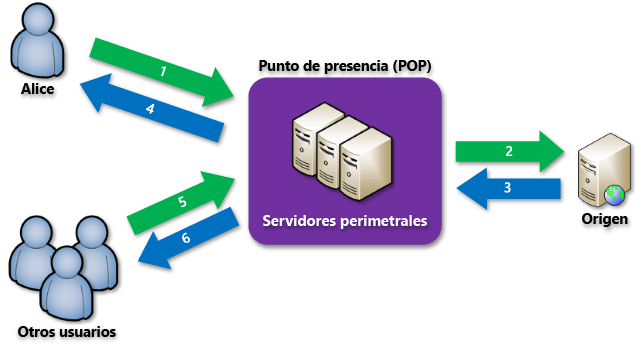

# Introducción a Azure Content Delivery Network

Azure Content Delivery Network (CDN) almacena en caché contenido web estático en ubicaciones colocadas estratégicamente para proporcionar el máximo rendimiento a la hora de proteger la entrega de contenido a los usuarios. CDN ofrece a los desarrolladores una solución global para la entrega rápida de contenido de alto ancho de banda mediante el almacenando en caché de contenido en nodos físicos en todo el mundo. 

> [!NOTE]
> En este artículo se describe Azure CDN, cómo funciona y las características de cada producto de Azure CDN. Para saltarse esta información y ver un tutorial sobre cómo crear un punto de conexión de CDN, consulte [Introducción a Azure CDN](cdn-create-new-endpoint.md). Para ver una lista de ubicaciones actuales de nodos de CDN, consulte [Ubicaciones POP de Azure CDN](cdn-pop-locations.md).

Entre las ventajas de usar una red CDN para almacenar en caché los recursos de sitios web caben destacar las siguientes:

* Mejor rendimiento y experiencia para los usuarios finales, sobre todo a la hora de utilizar aplicaciones donde son necesarios varios recorridos de ida y vuelta para cargar el contenido.
* Gran escalado para mejorar la administración de cargas instantáneas pesadas, por ejemplo, al comienzo de un evento de lanzamiento de un producto.
* Distribución de las solicitudes de usuario y entrega del contenido directamente desde los servidores perimetrales, de forma que se envía menos tráfico al origen.

## Cómo funciona

1. Un usuario (Alice) solicita un archivo (también denominado un recurso) mediante una dirección URL con un nombre de dominio especial, como `<endpointname>.azureedge.net`. DNS enruta la solicitud hasta la ubicación de punto de presencia (POP) con un mejor rendimiento, que normalmente es el servicio POP que se encuentra en estrecha proximidad geográfica al usuario.
2. Si los servidores perimetrales del POP no tienen el archivo en la memoria caché, el servidor perimetral solicitará el archivo desde el origen.  El origen puede ser una aplicación web, servicio en la nube o cuenta de Azure Storage, o cualquier servidor web accesible públicamente.
3. El origen devuelve el archivo al servidor perimetral, incluidos los encabezados HTTP opcionales que describen el período de vida (TTL) del archivo.
4. El servidor perimetral almacena el archivo en caché y devuelve el archivo al solicitante original (Alice).  El archivo permanece en caché en el servidor perimetral hasta que expire el TTL.  Si el origen no ha especificado ningún TTL, el valor predeterminado será de siete días.
5. Después, los usuarios adicionales pueden solicitar el mismo archivo mediante la misma dirección URL y también se les puede dirigir al mismo POP.
6. Si no ha expirado el TTL para el archivo, el servidor perimetral devolverá el archivo desde la memoria caché. Este proceso da lugar a una experiencia de usuario más rápida y una mayor capacidad de respuesta.

## Características de la red CDN de Azure
Hay tres productos del servicio CDN de Azure: **Azure CDN Standard de Akamai**, **Azure CDN Standard de Verizon** y **Azure CDN Premium de Verizon**.  En la tabla siguiente se enumeran las características disponibles con cada producto.

|  | Estándar de Akamai | Estándar de Verizon | Premium de Verizone |
| --- | --- | --- | --- |
| __Características y optimizaciones de rendimiento__ |
| [Aceleración de sitios dinámicos](https://docs.microsoft.com/azure/cdn/cdn-dynamic-site-acceleration) | **&#x2713;**  | **&#x2713;** | **&#x2713;** |
| &nbsp;&nbsp;&nbsp;&nbsp;&nbsp;  [Aceleración de sitio dinámico: compresión de imagen adaptable](https://docs.microsoft.com/azure/cdn/cdn-dynamic-site-acceleration#adaptive-image-compression-akamai-only) | **&#x2713;**  |  |  |
| &nbsp;&nbsp;&nbsp;&nbsp;&nbsp;  [Aceleración de sitio dinámico: precarga de objetos](https://docs.microsoft.com/azure/cdn/cdn-dynamic-site-acceleration#object-prefetch-akamai-only) | **&#x2713;**  |  |  |
| [Optimización de streaming de vídeo](https://docs.microsoft.com/azure/cdn/cdn-media-streaming-optimization) | **&#x2713;**  | \* |  \* |
| [Optimización de archivos grandes](https://docs.microsoft.com/azure/cdn/cdn-large-file-optimization) | **&#x2713;**  | \* |  \* |
| [Equilibrio de carga del servidor global (GSLB)](https://docs.microsoft.com/azure/traffic-manager/traffic-manager-load-balancing-azure) |**&#x2713;** |**&#x2713;** |**&#x2713;** |
| [Purga rápida](cdn-purge-endpoint.md) |**&#x2713;** |**&#x2713;** |**&#x2713;** |
| [Carga previa de activos](cdn-preload-endpoint.md) | |**&#x2713;** |**&#x2713;** |
| Configuración de la memoria caché o del encabezado (mediante [reglas de almacenamiento en caché](cdn-caching-rules.md)) |**&#x2713;** |**&#x2713;** | |
| Configuración de la memoria caché o del encabezado (mediante un [motor de reglas](cdn-rules-engine.md)) | | |**&#x2713;** |
| [Almacenamiento en caché de cadena de consulta](cdn-query-string.md) |**&#x2713;** |**&#x2713;** |**&#x2713;** |
| Pila dual IPv4/IPv6 |**&#x2713;** |**&#x2713;** |**&#x2713;** |
| [Compatibilidad con HTTP/2](cdn-http2.md) |**&#x2713;** |**&#x2713;** |**&#x2713;** |
| __Seguridad__ |
| Compatibilidad con HTTPS con el punto de conexión de red CDN |**&#x2713;** |**&#x2713;** |**&#x2713;** |
| [Dominio personalizado HTTPS](cdn-custom-ssl.md) | |**&#x2713;** |**&#x2713;** |
| [Compatibilidad con nombre de dominio personalizado](cdn-map-content-to-custom-domain.md) |**&#x2713;** |**&#x2713;** |**&#x2713;** |
| [Filtrado geográfico](cdn-restrict-access-by-country.md) |**&#x2713;** |**&#x2713;** |**&#x2713;** |
| [Autenticación de token](cdn-token-auth.md)|  |  |**&#x2713;**| 
| [Protección contra DDOS](https://www.us-cert.gov/ncas/tips/ST04-015) |**&#x2713;** |**&#x2713;** |**&#x2713;** |
| __Análisis e informes__ |
| [Registros de diagnóstico de Azure](cdn-azure-diagnostic-logs.md) | **&#x2713;** |**&#x2713;** |**&#x2713;** |
| [Informes principales de Verizon](cdn-analyze-usage-patterns.md) | |**&#x2713;** |**&#x2713;** |
| [Informes personalizados de Verizon](cdn-verizon-custom-reports.md) | |**&#x2713;** |**&#x2713;** |
| [Informes de HTTP avanzados](cdn-advanced-http-reports.md) | | |**&#x2713;** |
| [Estadísticas en tiempo real](cdn-real-time-stats.md) | | |**&#x2713;** |
| [Rendimiento del nodo perimetral](cdn-edge-performance.md) | | |**&#x2713;** |
| [Alertas en tiempo real](cdn-real-time-alerts.md) | | |**&#x2713;** |
| __Facilidad de uso__ |
| Fácil integración con servicios de Azure, como [Storage](cdn-create-a-storage-account-with-cdn.md), [Cloud Services](cdn-cloud-service-with-cdn.md), [Web Apps](../app-service/app-service-web-tutorial-content-delivery-network.md) y [Media Services](../media-services/media-services-portal-manage-streaming-endpoints.md) |**&#x2713;** |**&#x2713;** |**&#x2713;** |
| Se puede administrar mediante la [API de REST](https://msdn.microsoft.com/library/mt634456.aspx), [.NET](cdn-app-dev-net.md), [Node.js](cdn-app-dev-node.md) o [PowerShell](cdn-manage-powershell.md). |**&#x2713;** |**&#x2713;** |**&#x2713;** |
| [Motor de entrega de contenido personalizable, basado en reglas](cdn-rules-engine.md) | | |**&#x2713;** |
| Redirección/rescritura de direcciones URL (mediante un [motor de reglas](cdn-rules-engine.md)) | | |**&#x2713;** |
| Reglas de dispositivos móviles (mediante un [motor de reglas](cdn-rules-engine.md)) | | |**&#x2713;** |

\* Verizon admite la entrega de archivos de gran tamaño y de elementos multimedia directamente a través de la entrega web general.

> [!TIP]
> ¿Hay una característica que le gustaría ver en CDN de Azure?  [Envíenos sus comentarios](https://feedback.azure.com/forums/169397-cdn). 
> 
> 

## Pasos siguientes
Para empezar a trabajar con CDN, consulte [Introducción a Azure CDN](cdn-create-new-endpoint.md).

Si ya es cliente del servicio CDN, ahora puede administrar los puntos de conexión de CDN utilizando [Microsoft Azure Portal](https://portal.azure.com) o [PowerShell](cdn-manage-powershell.md).

Para ver la red CDN en acción, consulte el [vídeo de la sesión de Build 2016](https://azure.microsoft.com/documentation/videos/build-2016-leveraging-the-new-azure-cdn-apis-to-build-wicked-fast-applications/).

Aprenda a automatizar Azure CDN con [.NET](cdn-app-dev-net.md) o [Node.js](cdn-app-dev-node.md).

Para informarse sobre los precios, consulte [Precios de Content Delivery Network](https://azure.microsoft.com/pricing/details/cdn/).

