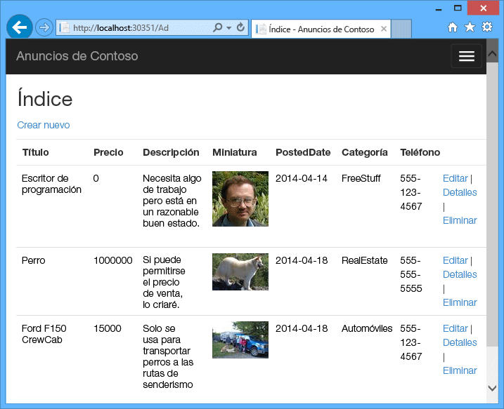
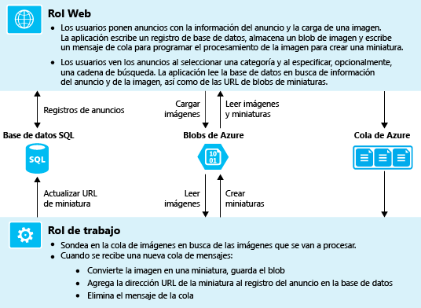
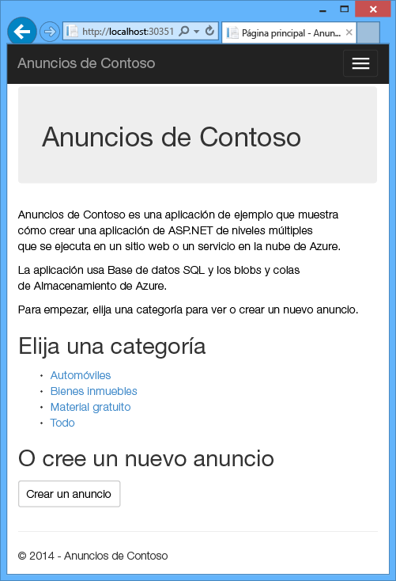
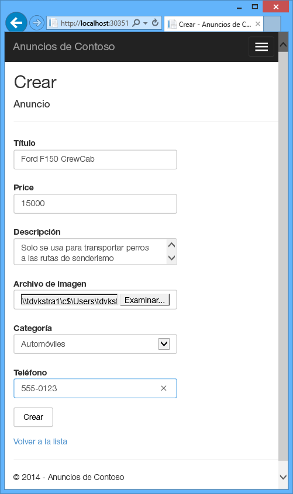
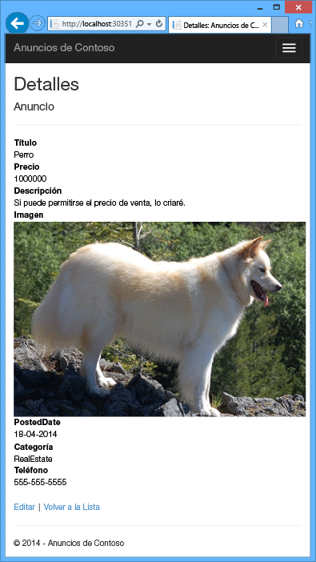
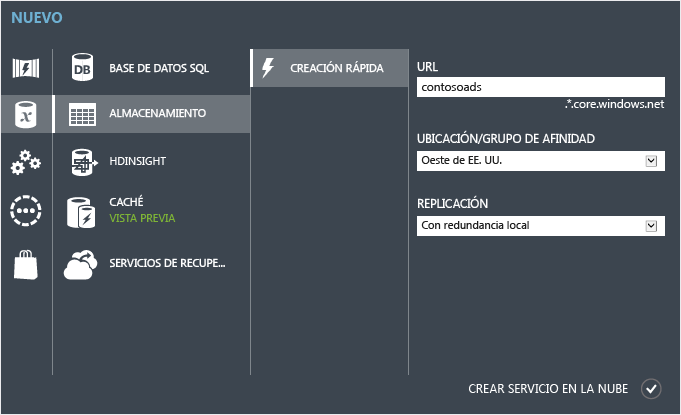
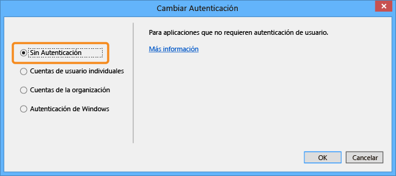

# <a name="get-started-with-azure-cloud-services-and-aspnet"></a>Introducción a Azure Cloud Services y ASP.NET

## <a name="overview"></a>Información general
En este tutorial se muestra cómo crear una aplicación .NET de múltiples niveles con un front-end ASP.NET MVC e implementarla en un [servicio en la nube de Azure](cloud-services-choose-me.md). La aplicación usa [Azure SQL Database](http://msdn.microsoft.com/library/azure/ee336279), el [servicio Azure Blob service](http://www.asp.net/aspnet/overview/developing-apps-with-windows-azure/building-real-world-cloud-apps-with-windows-azure/unstructured-blob-storage) y el [servicio Azure Queue service](http://www.asp.net/aspnet/overview/developing-apps-with-windows-azure/building-real-world-cloud-apps-with-windows-azure/queue-centric-work-pattern). Puede [descargar el proyecto de Visual Studio](http://code.msdn.microsoft.com/Simple-Azure-Cloud-Service-e01df2e4) desde la Galería de código de MSDN.

En el tutorial se muestra cómo crear y ejecutar la aplicación localmente, cómo implementarla en Azure y ejecutarla en la nube y, por último, cómo crearla desde cero. Puede comenzar por crearla desde cero y después llevar a cabo los pasos de prueba e implementación si lo prefiere.

## <a name="contoso-ads-application"></a>Aplicación Contoso Ads
La aplicación es un tablón de anuncios publicitario. Los usuarios crean un anuncio introduciendo texto y cargando una imagen. Pueden ver una lista de anuncios con imágenes en miniatura y ver la imagen a tamaño completo cuando seleccionan un anuncio para ver los detalles.



La aplicación usa el [patrón de trabajo centrado en colas](http://www.asp.net/aspnet/overview/developing-apps-with-windows-azure/building-real-world-cloud-apps-with-windows-azure/queue-centric-work-pattern) para descargar el trabajo de uso intensivo de CPU de creación de miniaturas y pasarlo a un proceso back-end.

## <a name="alternative-architecture-websites-and-webjobs"></a>Arquitectura alternativa: Websites y WebJobs
En este tutorial se muestra cómo ejecutar un front-end y un back-end en un servicio en la nube de Azure. Una alternativa es ejecutar el front-end en un [sitio web de Azure](/services/web-sites/) y usar la característica [WebJobs](http://go.microsoft.com/fwlink/?LinkId=390226) (actualmente en versión preliminar) para el back-end. Para ver un tutorial en el que se utiliza WebJobs, consulte [Introducción al SDK de Azure WebJobs](https://github.com/Azure/azure-webjobs-sdk/wiki). Para obtener información sobre cómo elegir los servicios que mejor se adapten a su escenario, consulte [Comparación entre Azure Websites, Cloud Services y Virtual Machines](../app-service/choose-web-site-cloud-service-vm.md).

## <a name="what-youll-learn"></a>Temas que se abordarán
* Habilitar su equipo para desarrollar contenido de Azure mediante la instalación del SDK de Azure.
* Creación de un proyecto de servicio en la nube de Visual Studio con un rol web de ASP.NET MVC y un rol de trabajo
* Prueba del proyecto de servicio en la nube localmente usando el emulador de almacenamiento de Azure.
* Publicación del proyecto en la nube en un servicio en la nube de Azure y prueba usando una cuenta de almacenamiento de Azure.
* Carga de archivos y almacenamiento de los mismos en Azure Blob service.
* Uso del servicio Cola de Azure para comunicación entre niveles.

## <a name="prerequisites"></a>Requisitos previos
En este tutorial se da por supuesto que comprende los [conceptos básicos sobre Azure Cloud Services](cloud-services-choose-me.md) como, por ejemplo, la terminología *rol web* y *rol de trabajo*.  También se supone que sabe trabajar con proyectos [ASP.NET MVC](http://www.asp.net/mvc/tutorials/mvc-5/introduction/getting-started) o [Web Forms](http://www.asp.net/web-forms/tutorials/aspnet-45/getting-started-with-aspnet-45-web-forms/introduction-and-overview) en Visual Studio. La aplicación de ejemplo usa MVC, pero la mayoría del tutorial también se aplica a Web Forms.

Puede ejecutar la aplicación localmente sin una suscripción de Azure, pero necesitará una para implementar la aplicación en la nube. Si aún no la tiene, puede [activar los beneficios de suscripción a MSDN](https://azure.microsoft.com/pricing/member-offers/msdn-benefits-details/?WT.mc_id=A55E3C668) o [registrarse para obtener una evaluación gratuita](https://azure.microsoft.com/pricing/free-trial/?WT.mc_id=A55E3C668).

Las instrucciones del tutorial funcionan con cualquiera de los productos siguientes:

* Visual Studio 2013
* Visual Studio 2015
* Visual Studio 2017

Si no tiene uno de ellos, Visual Studio se puede instalar automáticamente al instalar el SDK de Azure.

## <a name="application-architecture"></a>Arquitectura de la aplicación
La aplicación almacena anuncios en una base de datos SQL, usando Entity Framework Code First para crear las tablas y acceder a los datos. Por cada anuncio, la base de datos almacena dos direcciones URL, una para la imagen a tamaño completo y otra para la miniatura.


Cuando un usuario carga una imagen, el front-end que se ejecuta en un rol web almacena dicha imagen en un [blob de Azure](http://www.asp.net/aspnet/overview/developing-apps-with-windows-azure/building-real-world-cloud-apps-with-windows-azure/unstructured-blob-storage)y la información del anuncio en la base de datos con una dirección URL que apunta al blob. Al mismo tiempo, escribe mensaje en una cola de Azure. Un proceso back-end que se ejecuta en un rol de trabajo sondea la cola periódicamente para ver si hay nuevos mensajes. Cuando aparece un nuevo mensaje, el rol de trabajo crea una miniatura para la imagen y actualiza el campo de base de datos de la dirección URL de la miniatura para ese anuncio. El siguiente diagrama muestra cómo interactúan las partes de la aplicación:



[!INCLUDE [install-sdk](../../includes/install-sdk-2017-2015-2013.md)]

## <a name="download-and-run-the-completed-solution"></a>Descarga y ejecución de la solución completa
1. Descargue y descomprima la [solución completa](http://code.msdn.microsoft.com/Simple-Azure-Cloud-Service-e01df2e4).
2. Inicie Visual Studio.
3. En el menú **Archivo**, seleccione **Abrir proyecto**, vaya a la ubicación donde descargó la solución y abra el archivo de la solución.
4. Presione CTRL+MAYÚS+B para compilar la solución.

    De forma predeterminada, Visual Studio restaura automáticamente el contenido del paquete NuGet, que no se incluyó en el archivo *.zip* . Si los paquetes no se restauran, para instalarlos manualmente, vaya al cuadro de diálogo **Administrar paquetes NuGet** para la solución y haga clic en el botón **Restaurar** en la parte superior derecha.
5. En el **Explorador de soluciones**, asegúrese de que **ContosoAdsCloudService** se encuentra seleccionado como proyecto de inicio.
6. Si va a usar Visual Studio 2015 o una versión superior, cambie la cadena de conexión del servidor SQL Server en el archivo *Web.config* del proyecto ContosoAdsWeb y en el archivo *ServiceConfiguration.Local.cscfg* del proyecto ContosoAdsCloudService. En cada caso, cambie "(localdb) \v11.0" por "(localdb) \MSSQLLocalDB".
7. Presione CTRL+F5 para ejecutar la aplicación.

    Cuando ejecuta un proyecto de servicio en la nube localmente, Visual Studio invoca automáticamente al *emulador de proceso* y al *emulador de almacenamiento*, ambos de Azure. El emulador de proceso usa los recursos del equipo para simular los entornos de los roles web y de trabajo. El emulador de almacenamiento usa una [base de datos LocalDB de SQL Server Express](http://msdn.microsoft.com/library/hh510202.aspx) para simular el almacenamiento en la nube de Azure.

    La primera vez que ejecuta un proyecto de servicio en la nube, los emuladores tardan alrededor de un minuto en iniciarse. Cuando el inicio del emulador finaliza, se abre el explorador predeterminado en la página de inicio de la aplicación.

    
8. Haga clic en **Crear un anuncio**.
9. Escriba algunos datos de prueba y seleccione una imagen *.jpg* para cargar; a continuación, haga clic en **Crear**.

    

    La aplicación irá a la página Index, pero no mostrará una miniatura para el nuevo anuncio porque ese procesamiento todavía no se ha llevado a cabo.
10. Espere un momento y actualice la página Index para ver la miniatura.

     
11. Haga clic en el vínculo **Detalles** correspondiente a su anuncio para ver la imagen a tamaño completo.

     

Ha estado ejecutando la aplicación completamente en su equipo local, sin conexión a la nube. El emulador de almacenamiento almacena los datos de cola y de blob en una base de datos LocalDB de SQL Server Express y la aplicación hace lo propio con los datos del anuncio almacenándolos en otra base de datos LocalDB. Entity Framework Code First creó automáticamente la base de datos de anuncios la primera vez que la aplicación web intentó acceder a ella.

En la siguiente sección configurará la solución para usar recursos en la nube de Azure para colas, blobs y la base de datos de aplicación cuando se ejecuta en la nube. Podría hacer esto si quisiera seguir trabajando localmente, pero usar recursos de almacenamiento de nube y base de datos. Es simplemente una cuestión de configurar las cadenas de conexión, que ahora verá cómo hacerlo.

## <a name="deploy-the-application-to-azure"></a>Implementación de la aplicación en Azure
Llevará a cabo los pasos siguientes para ejecutar la aplicación en la nube:

* Cree un servicio en la nube de Azure.
* Cree una base de datos SQL de Azure.
* Cree una cuenta de Almacenamiento de Azure.
* Configure la solución para usar la base de datos SQL de Azure cuando se ejecuta en Azure.
* Configure la solución para usar la cuenta de almacenamiento de Azure cuando se ejecuta en Azure.
* Implementar el proyecto en su servicio en la nube de Azure.

### <a name="create-an-azure-cloud-service"></a>Crear un servicio en la nube de Azure
Un servicio en la nube de Azure es el entorno en el que se ejecutará la aplicación.

1. En el explorador, abra [Azure Portal](https://portal.azure.com).
2. Haga clic en **Nuevo > Proceso > Servicio en la nube**.

3. En el cuadro de entrada de nombres DNS, especifique un prefijo de dirección URL para el servicio en la nube.

    Esta dirección URL tiene que ser única.  Se mostrará un mensaje de error si el prefijo que elige ya está en uso.
4. Especifique un nuevo grupo de recursos para el servicio. Haga clic en **Crear nuevo** y luego escriba un nombre en el cuadro de entrada del grupo de recursos, por ejemplo, CS_contososadsRG.

5. Elija la región en la que desea implementar la aplicación.

    Este campo especifica el centro de datos en el que se hospedará el servicio en la nube. Para una aplicación de producción, elegiría la región más cercana a sus clientes. Para este tutorial, elija la región más cercana a usted.
5. Haga clic en **Crear**.

    En la siguiente imagen, se crea un servicio en la nube con la dirección URL CSvccontosoads.cloudapp.net.

    

### <a name="create-an-azure-sql-database"></a>Crear una base de datos SQL de Azure
Cuando la aplicación se ejecute en la nube, usará una base de datos basada en la nube.

1. En [Azure Portal](https://portal.azure.com), haga clic en **Nuevo > Bases de datos > SQL Database**.
2. En el cuadro **Nombre de base de datos** , escriba *contosoads*.
3. En **Grupo de recursos**, haga clic en **Usar existente** y seleccione el grupo de recursos usado para el servicio en la nube.
4. En la imagen siguiente, haga clic en **Servidor - Definir la configuración necesaria** y **Crear un servidor nuevo**.

    

    Asimismo, si su suscripción ya tiene un servidor, puede seleccionarlo en la lista desplegable.
5. En el cuadro **Nombre del servidor**, escriba *csvccontosodbserver*.

6. Complete los campos **Nombre de inicio de sesión** y **Contraseña** con los datos de un administrador.

    Si seleccionó **Crear un servidor nuevo**, no escribirá aquí un nombre y una contraseña existentes. Escribirá un nombre y una contraseña nuevos que definirá ahora para usarlos más adelante cuando acceda a la base de datos. Si seleccionó un servidor creado anteriormente, se le pedirá la contraseña de la cuenta de usuario administrativa que ya creó.
7. Elija la misma **ubicación** que eligió para el servicio en la nube.

    Cuando el servicio en la nube y la base de datos se encuentren en centros de datos diferentes (distintas regiones), la latencia aumentará y se le cobrará el ancho de banda no perteneciente al centro de datos. El ancho de banda del centro de datos es gratuito.
8. Marque la opción **Permitir que los servicios de Azure accedan al servidor**.
9. Haga clic en **Seleccionar** para el nuevo servidor.

    
10. Haga clic en **Crear**.

### <a name="create-an-azure-storage-account"></a>Creación de una cuenta de Azure Storage
Una cuenta de almacenamiento de Azure proporciona recursos para almacenar datos de cola y blob en la nube.

En una aplicación real, normalmente crearía cuentas independientes para los datos de aplicación frente a los datos de registro, y cuentas diferentes para datos de prueba frente a datos de producción. En este tutorial, usará solamente una cuenta.

1. En [Azure Portal](https://portal.azure.com), haga clic en **Nuevo > Almacenamiento > Cuenta de Storage - blob, archivo, tabla, cola**.
2. En el cuadro **Nombre**, escriba un prefijo de dirección URL.

    Este prefijo y el texto que verá debajo de la casilla formarán la dirección URL exclusiva para la cuenta de almacenamiento. Si el prefijo escrito ya lo usa otra persona, tendrá que elegir un prefijo diferente.
3. Establezca **Modelo de implementación** en *Clásica*.

4. Establezca la lista desplegable **Replicación** en **Almacenamiento con redundancia local**.

    Cuando se habilita la replicación geográfica para una cuenta de almacenamiento, el contenido almacenado se replica en un centro de datos secundario para permitir la conmutación por error en caso de que se produzca un desastre importante en la ubicación principal. La replicación geográfica puede suponer costes adicionales. Lo normal es que no quiera pagar por el servicio de replicación geográfica para las cuentas de prueba y desarrollo. Para obtener más información, consulte [Creación, administración o eliminación de una cuenta de almacenamiento](../storage/common/storage-create-storage-account.md).

5. En **Grupo de recursos**, haga clic en **Usar existente** y seleccione el grupo de recursos usado para el servicio en la nube.
6. Establezca la lista desplegable **Ubicación** en la misma región que eligió para el servicio en la nube.

    Cuando la cuenta de almacenamiento y el servicio en la nube se encuentren en centros de datos diferentes (distintas regiones), la latencia aumentará y se le cobrará el ancho de banda no perteneciente al centro de datos. El ancho de banda del centro de datos es gratuito.

    Los grupos de afinidad de Azure proporcionan un mecanismo para minimizar la distancia entre los recursos de un centro de datos, lo que puede reducir la latencia. Este tutorial no usa grupos de afinidad. Para obtener información, consulte [Creación de un grupo de afinidad en Azure](http://msdn.microsoft.com/library/jj156209.aspx).
7. Haga clic en **Crear**.

    

    En la imagen, se crea una cuenta de almacenamiento con la dirección URL `csvccontosoads.core.windows.net`.

### <a name="configure-the-solution-to-use-your-azure-sql-database-when-it-runs-in-azure"></a>Configurar la solución para usar la base de datos SQL de Azure cuando se ejecuta en Azure
El proyecto web y el proyecto de rol de trabajo tienen cada uno su propia cadena de conexión de base de datos y cada uno necesita apuntar a la base de datos SQL de Azure cuando la aplicación se ejecuta en Azure.

Usará una [transformación Web.config](http://www.asp.net/mvc/tutorials/deployment/visual-studio-web-deployment/web-config-transformations) para el rol web y una configuración de entorno de servicio en la nube para el rol de trabajo.

> [!NOTE]
> En esta sección y en la siguiente almacenará credenciales en archivos de proyecto. [No almacene información confidencial en repositorios de código fuente público.](http://www.asp.net/aspnet/overview/developing-apps-with-windows-azure/building-real-world-cloud-apps-with-windows-azure/source-control#secrets)
>
>

1. En el proyecto ContosoAdsWeb, abra el archivo de transformación *Web.Release.config* del archivo *Web.config* de la aplicación, elimine el bloque de comentario que contiene un elemento `<connectionStrings>` y pegue el siguiente código en su lugar.

    ```xml
    <connectionStrings>
        <add name="ContosoAdsContext" connectionString="{connectionstring}"
        providerName="System.Data.SqlClient" xdt:Transform="SetAttributes" xdt:Locator="Match(name)"/>
    </connectionStrings>
    ```

    Deje el archivo abierto para editarlo.
2. En [Azure Portal](https://portal.azure.com), haga clic en **SQL Database** en el panel izquierdo, haga clic en la base de datos que creó en este tutorial y luego haga clic en **Mostrar cadenas de conexión**.

    

    El portal muestra las cadenas de conexión con un marcador de posición para la contraseña.

    
3. En el archivo de transformación *Web.Release.config*, elimine `{connectionstring}` y pegue en su lugar la cadena de conexión ADO.NET de Azure Portal.
4. En la cadena de conexión que pegó en el archivo de transformación *Web.Release.config*, reemplace `{your_password_here}` por la contraseña creada para la nueva base de datos SQL.
5. Guarde el archivo .  
6. Seleccione una copia de la cadena de conexión (sin las comillas circundantes) para usar en los pasos siguientes para configurar el proyecto de rol de trabajo.
7. En el **Explorador de soluciones**, bajo **Roles** en el proyecto de servicio en la nube, haga clic con el botón derecho en **ContosoAdsWorker** y, por último, haga clic en **Propiedades**.

    
8. Haga clic en la pestaña **Configuración** .
9. Cambie **Configuración del servicio** a **Nube**.
10. Seleccione el campo **Valor** de la configuración de `ContosoAdsDbConnectionString` y pegue la cadena de conexión que copió de la sección anterior del tutorial.

     
11. Guarde los cambios.  

### <a name="configure-the-solution-to-use-your-azure-storage-account-when-it-runs-in-azure"></a>Configurar la solución para usar la cuenta de almacenamiento de Azure cuando se ejecuta en Azure
Las cadenas de conexión de la cuenta de almacenamiento de Azure tanto para el proyecto de rol web como para el proyecto de rol de trabajo, se almacenan en la configuración del entorno en el proyecto de servicio en la nube. Para cada proyecto existe un conjunto independiente de configuraciones para usar cuando la aplicación se ejecuta localmente y cuando se ejecuta en la nube. Actualizará la configuración del entorno en la nube tanto para proyectos de rol web como para proyectos de rol de trabajo.

1. En el **Explorador de soluciones**, haga clic con el botón derecho en **ContosoAdsWeb** debajo de **Roles** en el proyecto **ContosoAdsCloudService** y después haga clic en **Propiedades**.

    
2. Haga clic en la pestaña **Configuración** . En el cuadro desplegable **Configuración del servicio**, seleccione **Nube**.

    
3. Seleccione la entrada **StorageConnectionString** y verá un botón con unos puntos suspensivos (**...**) al final de la línea. Haga clic en el botón de puntos suspensivos para abrir el cuadro de diálogo **Crear cadena de conexión de cuenta de almacenamiento** .

    
4. En el cuadro de diálogo **Crear cadena de conexión de almacenamiento**, haga clic en **Su suscripción**, elija la cuenta de almacenamiento que creó antes y haga clic en **Aceptar**. Si no ha iniciado sesión, se le pedirán las credenciales de la cuenta de Azure.

    
5. Guarde los cambios.
6. Siga el mismo procedimiento que usó para la cadena de conexión `StorageConnectionString` para establecer la cadena de conexión `Microsoft.WindowsAzure.Plugins.Diagnostics.ConnectionString`.

    Esta cadena de conexión se usa para registro.
7. Siga el mismo procedimiento que usó para el rol **ContosoAdsWeb** para establecer ambas cadenas de conexión para el rol **ContosoAdsWorker**. No olvide establecer **Configuración del servicio** en **Nube**.

La configuración del entorno del rol que ha configurado usando la interfaz de usuario de Visual Studio se almacena en los siguientes archivos en el proyecto ContosoAdsCloudService:

* *ServiceDefinition.csdef* : define los nombres de los valores.
* *ServiceConfiguration.Cloud.cscfg* : proporciona valores para cuando la aplicación se ejecuta en la nube.
* *ServiceConfiguration.Local.cscfg* : proporciona valores para cuando la aplicación se ejecuta localmente.

Por ejemplo, el archivo ServiceDefinition.csdef incluye las siguientes definiciones:

```xml
<ConfigurationSettings>
    <Setting name="StorageConnectionString" />
    <Setting name="ContosoAdsDbConnectionString" />
</ConfigurationSettings>
```

Y el archivo *ServiceConfiguration.Cloud.cscfg* incluye los valores introducidos para esas configuraciones en Visual Studio.

```xml
<Role name="ContosoAdsWorker">
    <Instances count="1" />
    <ConfigurationSettings>
        <Setting name="StorageConnectionString" value="{yourconnectionstring}" />
        <Setting name="ContosoAdsDbConnectionString" value="{yourconnectionstring}" />
        <!-- other settings not shown -->

    </ConfigurationSettings>
    <!-- other settings not shown -->

</Role>
```

La opción `<Instances>` especifica el número de máquinas virtuales en las que Azure ejecutará el código del rol de trabajo. La sección [Pasos siguientes](#next-steps) incluye vínculos a más información sobre el escalado horizontal a un servicio en la nube

### <a name="deploy-the-project-to-azure"></a>Implementar el proyecto en Azure
1. En el **Explorador de soluciones**, haga clic con el botón derecho en el proyecto en la nube **ContosoAdsCloudService** y después seleccione **Publicar**.

   
2. En el paso **Iniciar sesión** del asistente **Publicar aplicación de Azure**, haga clic en **Siguiente**.

    
3. En el paso **Configuración** del asistente, haga clic en **Siguiente**.

    

    La configuración predeterminada de la pestaña **Avanzada** es correcta para este tutorial. Para obtener más información sobre la pestaña de opciones avanzadas, consulte [Asistente para publicar aplicación de Azure](http://msdn.microsoft.com/library/hh535756.aspx).
4. En el paso **Resumen**, haga clic en **Publicar**.

    

   Se abrirá la ventana **Registro de actividad de Azure** en Visual Studio.
5. Haga clic en el icono de la flecha derecha para expandir la información de implementación.

    La implementación puede tardar 5 minutos o más en completarse.

    
6. Cuando se haya completado la implementación, haga clic en **URL de aplicación web** para iniciar la aplicación.
7. Ahora puede probar la aplicación creando, viendo y editando algunos anuncios, tal y como hizo cuando ejecutó la aplicación localmente.

> [!NOTE]
> Cuando termine la prueba, elimine o detenga el servicio en la nube. Aunque no utilice el servicio en la nube, se acumularán cargos porque se reservan recursos de máquina virtual para él. Y si lo deja ejecutando, cualquiera que encuentre su dirección URL puede crear y ver anuncios. En [Azure Portal](https://portal.azure.com), vaya a la pestaña **Información general** del servicio en la nube y luego haga clic en el botón **Eliminar** en la parte superior de la página. Si lo que desea es evitar temporalmente que otros accedan al sitio, haga clic en **Detener** . En ese caso, los cargos seguirán acumulándose. Puede seguir un procedimiento similar para eliminar la base de datos SQL y la cuenta de almacenamiento cuando ya no las necesite.
>
>

## <a name="create-the-application-from-scratch"></a>Creación de la aplicación desde cero
Si todavía no ha descargado [la aplicación completada](http://code.msdn.microsoft.com/Simple-Azure-Cloud-Service-e01df2e4), hágalo ahora. Copiará los archivos desde el proyecto descargado en el nuevo proyecto.

Para crear la aplicación Contoso Ads es necesario llevar a cabo los pasos siguientes:

* Crear una solución de Visual Studio para un servicio en la nube.
* Actualizar y agregar paquetes de NuGet.
* Establecer preferencias del proyecto.
* Configurar cadenas de conexión.
* Agregar archivos de código.

Una vez creada la solución, se asegurará de que el código es único en proyectos de servicios en la nube y blobs y colas de Azure.

### <a name="create-a-cloud-service-visual-studio-solution"></a>Crear una solución de Visual Studio para un servicio en la nube
1. En Visual Studio, elija **Nuevo proyecto** from the **Archivo** .
2. En el panel de la izquierda del cuadro de diálogo **Nuevo proyecto**, expanda **Visual C#**, elija las plantillas **Nube** y, por último, elija la plantilla **Servicio de nube de Azure**.
3. Asigne un nombre al proyecto y a la solución ContosoAdsCloudService y haga clic en **Aceptar**.

    
4. En el cuadro de diálogo **Nuevo servicio en la nube de Azure** , agregue un rol web o de trabajo. Asigne un nombre al rol web ContosoAdsWeb y al rol de trabajo ContosoAdsWorker. (Use el icono del lápiz situado en el panel derecho para cambiar los nombres predeterminados de los roles.)

    
5. Cuando use el cuadro de diálogo **Nuevo proyecto ASP.NET** para el rol web, elija la plantilla MVC y haga clic en **Cambiar autenticación**.

    
6. En el cuadro de diálogo **Cambiar autenticación**, elija **Sin autenticación** y haga clic en **Aceptar**.

    
7. En el cuadro de diálogo **Nuevo proyecto ASP.NET**, haga clic en **Aceptar**.
8. En el **Explorador de soluciones**, haga clic con el botón derecho en la solución (no en uno de los proyectos) y elija **Agregar - Nuevo proyecto**.
9. En el cuadro de diálogo **Agregar nuevo proyecto**, elija **Windows** en **Visual C#** en el panel de la izquierda y, después, haga clic en la plantilla **Biblioteca de clases**.  
10. Asigne un nombre al proyecto *ContosoAdsCommon*y haga clic en **Aceptar**.

    Necesita hace referencia al contexto de Entity Framework y al modelo de datos de los proyectos de rol web y de trabajo. Como alternativa, podría definir las clases relacionadas con EF en el proyecto de rol web y hacer referencia a ese proyecto desde el proyecto de rol de trabajo. Pero en este enfoque alternativo, el proyecto de rol de trabajo tendría que hacer referencia a ensamblados web que no necesita.

### <a name="update-and-add-nuget-packages"></a>Actualizar y agregar paquetes de NuGet
1. Abra el cuadro de diálogo **Administrar paquetes de NuGet** correspondiente a la solución.
2. En la parte superior de la ventana, seleccione **Actualizaciones**.
3. Busque el paquete *WindowsAzure.Storage* y, si está en la lista, selecciónelo, elija los proyectos web y de trabajo en los que actualizarlo y, después, haga clic en **Actualizar**.

    La biblioteca de cliente de almacenamiento se actualiza con más frecuencia que las plantillas de proyecto de Visual Studio, por lo que verá que es necesario actualizar la versión de un proyecto recién creado.
4. En la parte superior de la ventana, seleccione **Examinar**.
5. Busque el paquete NuGet de *EntityFramework* e instálelo en los otros tres proyectos.
6. Busque el paquete NuGet *Microsoft.WindowsAzure.ConfigurationManager* e instálelo en el proyecto de rol de trabajo.

### <a name="set-project-references"></a>Establecimiento de preferencias del proyecto
1. En el proyecto ContosoAdsWeb, establezca una referencia al proyecto ContosoAdsCommon. Haga clic con el botón derecho en el proyecto ContosoAdsWeb y después haga clic en **Referencias** - **Agregar referencias**. En el cuadro de diálogo **Administrador de referencias**, seleccione **Solución – Proyectos** en el panel izquierdo, seleccione **ContosoAdsCommon** y haga clic en **Aceptar**.
2. En el proyecto ContosoAdsWorker, establezca una referencia al proyecto ContosAdsCommon.

    ContosoAdsCommon contendrá el modelo de datos y la clase de contexto de Entity Framework, que usarán tanto el front-end como el back-end.
3. En el proyecto ContosoAdsWorker, establezca una referencia en `System.Drawing`.

    Este ensamblado lo usa el back-end para convertir imágenes en miniaturas.

### <a name="configure-connection-strings"></a>Configurar cadenas de conexión
En esta sección configurará Azure Storage y cadenas de conexión de SQL para pruebas locales. Las instrucciones de implementación que aparecen anteriormente en el tutorial explican cómo configurar las cadenas de conexión para cuando la aplicación se ejecuta en la nube.

1. En el proyecto ContosoAdsWeb, abra el archivo Web.config de la aplicación e inserte el siguiente elemento `connectionStrings` después del elemento `configSections`.

    ```xml
    <connectionStrings>
        <add name="ContosoAdsContext" connectionString="Data Source=(localdb)\v11.0; Initial Catalog=ContosoAds; Integrated Security=True; MultipleActiveResultSets=True;" providerName="System.Data.SqlClient" />
    </connectionStrings>
    ```

    Si va a usar Visual Studio 2015 o una versión superior, sustituya "v11.0" por "MSSQLLocalDB".
2. Guarde los cambios.
3. En el proyecto ContosoAdsCloudService, haga clic con el botón derecho en ContosoAdsWeb bajo **Roles** y después haga clic en **Propiedades**.

    
4. En la ventana de propiedades del **rol ContosoAdsWeb**, haga clic en la pestaña **Configuración** y en **Agregar configuración**.

    Deje **Configuración del servicio** establecido en **Todas las configuraciones**.
5. Agregue un nuevo valor llamado *StorageConnectionString*. Establezca **Tipo** en *ConnectionString* y **Valor** en *UseDevelopmentStorage=true*.

    
6. Guarde los cambios.
7. Siga el mismo procedimiento para agregar una cadena de conexión en las propiedades del rol ContosoAdsWorker.
8. Todavía en la ventana de propiedades **ContosoAdsWorker [Rol]** , agregue otra cadena de conexión:

   * Nombre: ContosoAdsDbConnectionString
   * Tipo: String
   * Valor: pegue la misma cadena de conexión que usó para el proyecto de rol web. (En el ejemplo siguiente es para Visual Studio 2013. No olvide cambiar el origen de datos si copia este ejemplo y va a usar Visual Studio 2015 o una versión superior).

       ```
       Data Source=(localdb)\v11.0; Initial Catalog=ContosoAds; Integrated Security=True; MultipleActiveResultSets=True;
       ```

### <a name="add-code-files"></a>Agregar archivos de código
En esta sección copiará archivos de código de la solución descargada a la nueva solución. En las siguientes secciones se muestran y explican partes clave de este código.

Para agregar archivos a un proyecto o carpeta, haga clic con el botón derecho en dicho proyecto o carpeta y después en **Agregar** - **Elemento existente**. Seleccione los archivos que desee y haga clic en **Agregar**. Si se le pregunta si desea reemplazar los archivos existentes, haga clic en **Sí**.

1. En el proyecto ContosoAdsCommon, elimine el archivo *Class1.cs* y agregue en su lugar los archivos *Ad.cs* y *ContosoAdscontext.cs* desde el proyecto descargado.
2. En el proyecto ContosoAdsWeb, agregue los siguientes archivos desde el proyecto descargado.

   * *Global.asax.cs*.  
   * En la carpeta *Views\Shared*: *\_Layout.cshtml*.
   * En la carpeta *Views\Home*: *Index.cshtml*.
   * En la carpeta *Controllers*: *AdController.cs*.
   * En la carpeta *Views\Ad* (cree primero la carpeta): cinco archivos *.cshtml*.
3. En el proyecto ContosoAdsWorker, agregue *WorkerRole.cs* desde el proyecto descargado.

Ahora puede compilar y ejecutar la aplicación tal y como se indicó anteriormente en el tutorial y dicha aplicación usará los recursos de base de datos local y del emulador de almacenamiento.

En la siguiente sección se explica el código relacionado para trabajar con el entorno, blobs y colas de Azure. En este tutorial no se explica cómo crear controladores y vistas MVC usando scaffolding, cómo escribir código Entity Framework que funcione con bases de datos de SQL Server o los fundamentos de la programación asincrónica en ASP.NET 4.5. Para obtener más información sobre estos temas, consulte los siguientes recursos:

* [Introducción a MVC 5](http://www.asp.net/mvc/tutorials/mvc-5/introduction/getting-started)
* [Introducción a EF 6 y MVC 5](http://www.asp.net/mvc/tutorials/getting-started-with-ef-using-mvc)
* [Introducción a la programación asincrónica en .NET 4.5](http://www.asp.net/aspnet/overview/developing-apps-with-windows-azure/building-real-world-cloud-apps-with-windows-azure/web-development-best-practices#async)

### <a name="contosoadscommon---adcs"></a>ContosoAdsCommon - Ad.cs
El archivo Ad.cs define una enumeración para categorías de anuncios y una clase de entidad POCO para información de anuncios.

```csharp
public enum Category
{
    Cars,
    [Display(Name="Real Estate")]
    RealEstate,
    [Display(Name = "Free Stuff")]
    FreeStuff
}

public class Ad
{
    public int AdId { get; set; }

    [StringLength(100)]
    public string Title { get; set; }

    public int Price { get; set; }

    [StringLength(1000)]
    [DataType(DataType.MultilineText)]
    public string Description { get; set; }

    [StringLength(1000)]
    [DisplayName("Full-size Image")]
    public string ImageURL { get; set; }

    [StringLength(1000)]
    [DisplayName("Thumbnail")]
    public string ThumbnailURL { get; set; }

    [DataType(DataType.Date)]
    [DisplayFormat(DataFormatString = "{0:yyyy-MM-dd}", ApplyFormatInEditMode = true)]
    public DateTime PostedDate { get; set; }

    public Category? Category { get; set; }
    [StringLength(12)]
    public string Phone { get; set; }
}
```

### <a name="contosoadscommon---contosoadscontextcs"></a>ContosoAdsCommon - ContosoAdsContext.cs
La clase ContosoAdsContext especifica que la clase Ad se usa en una colección DbSet, cuyo Entity Framework se almacenará en una base de datos SQL.

```csharp
public class ContosoAdsContext : DbContext
{
    public ContosoAdsContext() : base("name=ContosoAdsContext")
    {
    }
    public ContosoAdsContext(string connString)
        : base(connString)
    {
    }
    public System.Data.Entity.DbSet<Ad> Ads { get; set; }
}
```

La clase tiene dos constructores. El primero de ellos lo usa el proyecto web y especifica el nombre de una cadena de conexión que se almacena en el archivo Web.config. El segundo constructor le permite pasar la cadena de conexión real usada por el proyecto de rol de trabajo, ya que no tiene un archivo Web.config. Anteriormente vio dónde se almacenaba esta cadena de conexión y posteriormente verá cómo el código recupera dicha cadena de conexión cuando crea instancias de la clase DbContext.

### <a name="contosoadsweb---globalasaxcs"></a>ContosoAdsWeb - Global.asax.cs
El código llamado desde el método `Application_Start` crea un contenedor de blob *images* y una cola *images* si todavía no existen. Esto garantiza que siempre que comience a usar una nueva cuenta de almacenamiento o el emulador de almacenamiento en un nuevo equipo, el contenedor de blobs requerido y la cola se crearán automáticamente.

El código obtiene acceso a la cuenta de almacenamiento usando la cadena de conexión de almacenamiento del archivo *.cscfg* .

```csharp
var storageAccount = CloudStorageAccount.Parse
    (RoleEnvironment.GetConfigurationSettingValue("StorageConnectionString"));
```

Después obtiene una referencia al contenedor de blobs *images* , crea el contenedor si todavía no existe y establece permisos de acceso en el nuevo contenedor. De forma predeterminada, los nuevos contenedores solamente permiten a los clientes con credenciales de cuenta de almacenamiento acceder a blobs. El sitio web necesita que los blobs sean públicos para que pueda mostrar imágenes usando direcciones URL que apunten a los blobs de imagen.

```csharp
var blobClient = storageAccount.CreateCloudBlobClient();
var imagesBlobContainer = blobClient.GetContainerReference("images");
if (imagesBlobContainer.CreateIfNotExists())
{
    imagesBlobContainer.SetPermissions(
        new BlobContainerPermissions
        {
            PublicAccess =BlobContainerPublicAccessType.Blob
        });
}
```

El código similar obtiene una referencia a la cola *images* y crea una nueva cola. En este caso no es necesario cambios de permiso.

```csharp
CloudQueueClient queueClient = storageAccount.CreateCloudQueueClient();
var imagesQueue = queueClient.GetQueueReference("images");
imagesQueue.CreateIfNotExists();
```

### <a name="contosoadsweb---layoutcshtml"></a>ContosoAdsWeb - \_Layout.cshtml
El archivo *_Layout.cshtml* establece el nombre de aplicación en el encabezado y pie de página, y crea una entrada de menú "Ads".

### <a name="contosoadsweb---viewshomeindexcshtml"></a>ContosoAdsWeb - Views\Home\Index.cshtml
El archivo *Views\Home\Index.cshtml* muestra vínculos de categoría en la página principal. Los vínculos pasan el valor entero de la enumeración `Category` en una variable de cadena de consulta a la página de índice de anuncios.

```razor
<li>@Html.ActionLink("Cars", "Index", "Ad", new { category = (int)Category.Cars }, null)</li>
<li>@Html.ActionLink("Real estate", "Index", "Ad", new { category = (int)Category.RealEstate }, null)</li>
<li>@Html.ActionLink("Free stuff", "Index", "Ad", new { category = (int)Category.FreeStuff }, null)</li>
<li>@Html.ActionLink("All", "Index", "Ad", null, null)</li>
```

### <a name="contosoadsweb---adcontrollercs"></a>ContosoAdsWeb - AdController.cs
En el archivo *AdController.cs*, el constructor llama al método `InitializeStorage` para crear objetos de biblioteca de cliente de Azure Storage que proporcionan una API para trabajar con blobs y colas.

Después, el código obtiene una referencia al contenedor de blobs *images* tal y como vio antes en *Global.asax.cs*. Mientras hace eso, establece una [directiva de reintentos](http://www.asp.net/aspnet/overview/developing-apps-with-windows-azure/building-real-world-cloud-apps-with-windows-azure/transient-fault-handling) apropiada para una aplicación web. La directiva de reintentos de retroceso exponencial predeterminada podría bloquear la aplicación web durante más de un minuto en reintentos repetitivos para un error transitorio. La directiva de reintentos especificada aquí espera tres segundos después de cada reintento hasta tres reintentos.

```csharp
var blobClient = storageAccount.CreateCloudBlobClient();
blobClient.DefaultRequestOptions.RetryPolicy = new LinearRetry(TimeSpan.FromSeconds(3), 3);
imagesBlobContainer = blobClient.GetContainerReference("images");
```

El código similar obtiene una referencia a la cola *images* .

```csharp
CloudQueueClient queueClient = storageAccount.CreateCloudQueueClient();
queueClient.DefaultRequestOptions.RetryPolicy = new LinearRetry(TimeSpan.FromSeconds(3), 3);
imagesQueue = queueClient.GetQueueReference("images");
```

La mayoría del código del controlador es típico para trabajar con un modelo de datos de usando Entity Framework usando una clase DbContext. Una excepción es el método HttpPost `Create` , que carga un archivo y lo guarda en el almacenamiento de blobs. El enlazador de modelos proporciona un objeto [HttpPostedFileBase](http://msdn.microsoft.com/library/system.web.httppostedfilebase.aspx) al método.

```csharp
[HttpPost]
[ValidateAntiForgeryToken]
public async Task<ActionResult> Create(
    [Bind(Include = "Title,Price,Description,Category,Phone")] Ad ad,
    HttpPostedFileBase imageFile)
```

Si el usuario seleccionó un archivo para cargar, el código carga el archivo, lo guarda en un blob y actualiza el registro de base de datos Ad con una dirección URL que adjunta al blob.

```csharp
if (imageFile != null && imageFile.ContentLength != 0)
{
    blob = await UploadAndSaveBlobAsync(imageFile);
    ad.ImageURL = blob.Uri.ToString();
}
```

El código que no se carga se encuentra en el método `UploadAndSaveBlobAsync` . Crea un nombre GUID para el blob, carga y guarda el archivo y devuelve una referencia al blob guardado.

```csharp
private async Task<CloudBlockBlob> UploadAndSaveBlobAsync(HttpPostedFileBase imageFile)
{
    string blobName = Guid.NewGuid().ToString() + Path.GetExtension(imageFile.FileName);
    CloudBlockBlob imageBlob = imagesBlobContainer.GetBlockBlobReference(blobName);
    using (var fileStream = imageFile.InputStream)
    {
        await imageBlob.UploadFromStreamAsync(fileStream);
    }
    return imageBlob;
}
```

Después de que el método `Create` HttpPost carga un blob y actualiza la base de datos, crea un mensaje de cola para informar a ese proceso back-end que una imagen está preparada para su conversión en una miniatura.

```csharp
string queueMessageString = ad.AdId.ToString();
var queueMessage = new CloudQueueMessage(queueMessageString);
await queue.AddMessageAsync(queueMessage);
```

El código para el método `Edit` HttpPost es similar con la excepción de que si el usuario selecciona un archivo de imagen nuevo, cualquier blob que ya exista se debe eliminar.

```csharp
if (imageFile != null && imageFile.ContentLength != 0)
{
    await DeleteAdBlobsAsync(ad);
    imageBlob = await UploadAndSaveBlobAsync(imageFile);
    ad.ImageURL = imageBlob.Uri.ToString();
}
```

En el siguiente ejemplo se muestra el código que elimina blobs cuando elimina un anuncio.

```csharp
private async Task DeleteAdBlobsAsync(Ad ad)
{
    if (!string.IsNullOrWhiteSpace(ad.ImageURL))
    {
        Uri blobUri = new Uri(ad.ImageURL);
        await DeleteAdBlobAsync(blobUri);
    }
    if (!string.IsNullOrWhiteSpace(ad.ThumbnailURL))
    {
        Uri blobUri = new Uri(ad.ThumbnailURL);
        await DeleteAdBlobAsync(blobUri);
    }
}
private static async Task DeleteAdBlobAsync(Uri blobUri)
{
    string blobName = blobUri.Segments[blobUri.Segments.Length - 1];
    CloudBlockBlob blobToDelete = imagesBlobContainer.GetBlockBlobReference(blobName);
    await blobToDelete.DeleteAsync();
}
```

### <a name="contosoadsweb---viewsadindexcshtml-and-detailscshtml"></a>ContosoAdsWeb - Views\Ad\Index.cshtml y Details.cshtml
El archivo *Index.cshtml* muestra miniaturas con otros datos de anuncio.

```razor

```

El archivo *Details.cshtml* muestra la imagen a tamaño completo.

```razor

```

### <a name="contosoadsweb---viewsadcreatecshtml-and-editcshtml"></a>ContosoAdsWeb - Views\Ad\Create.cshtml y Edit.cshtml
Los archivos *Create.cshtml* y *Edit.cshtml* especifican una codificación de formularios que permite al controlador obtener el objeto `HttpPostedFileBase`.

```razor
@using (Html.BeginForm("Create", "Ad", FormMethod.Post, new { enctype = "multipart/form-data" }))
```

Un elemento `<input>` indica al explorador que proporcione un cuadro de dialogo de selección.

```razor
<input type="file" name="imageFile" accept="image/*" class="form-control fileupload" />
```

### <a name="contosoadsworker---workerrolecs---onstart-method"></a>ContosoAdsWorker - WorkerRole.cs - Método OnStart
El entorno del rol de trabajo de Azure llama al método `OnStart` en la clase `WorkerRole` cuando el rol de trabajo se inicia, y llama al método `Run` cuando el método `OnStart` finaliza.

El método `OnStart` obtiene la cadena de conexión de base de datos del archivo *.cscfg* y la pasa a la clase DbContext de Entity Framework. El proveedor SQLClient se usa de forma predeterminada, por lo que no es necesario especificar el proveedor.

```csharp
var dbConnString = CloudConfigurationManager.GetSetting("ContosoAdsDbConnectionString");
db = new ContosoAdsContext(dbConnString);
```

Después, el método obtiene una referencia a la cuenta de almacenamiento y crea el contenedor de blobs y la cola si no existen. El código para ello es similar al que ya vio en el método `Application_Start` del rol web.

### <a name="contosoadsworker---workerrolecs---run-method"></a>ContosoAdsWorker - WorkerRole.cs - Método Run
El método `Run` se llama cuando el método `OnStart` finaliza su trabajo de inicialización. El método ejecuta un bucle infinito que busca nuevos mensajes de cola y los procesa cuando llegan.

```csharp
public override void Run()
{
    CloudQueueMessage msg = null;

    while (true)
    {
        try
        {
            msg = this.imagesQueue.GetMessage();
            if (msg != null)
            {
                ProcessQueueMessage(msg);
            }
            else
            {
                System.Threading.Thread.Sleep(1000);
            }
        }
        catch (StorageException e)
        {
            if (msg != null && msg.DequeueCount > 5)
            {
                this.imagesQueue.DeleteMessage(msg);
            }
            System.Threading.Thread.Sleep(5000);
        }
    }
}
```

Después de cada iteración del bucle, si no se encuentra ningún mensaje de cola, el programa entra en estado de suspensión durante un segundo. Esto evita que el rol de trabajo incurra en costos de tiempo de CPU y de transacción de almacenamiento excesivos. Microsoft Customer Advisory Team narra un relato sobre un desarrollador que olvidó incluir esto, lo mandó a producción y se fue de vacaciones. Cuando volvió, su descuido le costó algo más que las vacaciones.

Algunas veces, el contenido de un mensaje de cola causa un error de procesamiento. Esto se llama *mensaje dudoso*y si simplemente registró un error y reinició el bucle, podría intentar procesar ese mensaje incesantemente.  Por tanto, el bloque de captura incluye una declaración if que comprueba el número de veces que la aplicación ha intentado procesar el mensaje actual y, si dicho número es superior a 5, el mensaje se elimina de la cola.

`ProcessQueueMessage` se llama cuando se encuentra un mensaje de cola.

```csharp
private void ProcessQueueMessage(CloudQueueMessage msg)
{
    var adId = int.Parse(msg.AsString);
    Ad ad = db.Ads.Find(adId);
    if (ad == null)
    {
        throw new Exception(String.Format("AdId {0} not found, can't create thumbnail", adId.ToString()));
    }

    CloudBlockBlob inputBlob = this.imagesBlobContainer.GetBlockBlobReference(ad.ImageURL);

    string thumbnailName = Path.GetFileNameWithoutExtension(inputBlob.Name) + "thumb.jpg";
    CloudBlockBlob outputBlob = this.imagesBlobContainer.GetBlockBlobReference(thumbnailName);

    using (Stream input = inputBlob.OpenRead())
    using (Stream output = outputBlob.OpenWrite())
    {
        ConvertImageToThumbnailJPG(input, output);
        outputBlob.Properties.ContentType = "image/jpeg";
    }

    ad.ThumbnailURL = outputBlob.Uri.ToString();
    db.SaveChanges();

    this.imagesQueue.DeleteMessage(msg);
}
```

Este código lee la base de datos para obtener la dirección URL de la imagen, convierte la imagen en una miniatura, guarda la miniatura en un blob, actualiza la base de datos con la dirección URL del blob de la miniatura y elimina el mensaje de cola.

> [!NOTE]
> El código del método `ConvertImageToThumbnailJPG` usa clases del espacio de nombres System.Drawing por simplicidad. Sin embargo, las clases de este espacio de nombres se diseñaron para usarse con Windows Forms. No se admiten para usarse en un servicio de Windows o ASP.NET. Para más información acerca de las opciones de procesamiento de imagen, consulte [Dynamic Image Generation](http://www.hanselman.com/blog/BackToBasicsDynamicImageGenerationASPNETControllersRoutingIHttpHandlersAndRunAllManagedModulesForAllRequests.aspx) (Generación de imagen dinámica) y [Deep Inside Image Resizing](http://www.hanselminutes.com/313/deep-inside-image-resizing-and-scaling-with-aspnet-and-iis-with-imageresizingnet-author-na) (Profundización en el cambio de tamaño de imágenes).
>
>

## <a name="troubleshooting"></a>Solución de problemas
En el caso de que algo no funcionen a pesar de seguir las instrucciones de este tutorial, aquí tiene algunos errores comunes y cómo resolverlos.

### <a name="serviceruntimeroleenvironmentexception"></a>ServiceRuntime.RoleEnvironmentException
El objeto `RoleEnvironment` lo proporciona Azure cuando se ejecuta una aplicación en Azure o cuando se ejecuta localmente usando el emulador de proceso de Azure.  Si aparece este error cuando la ejecución se realiza localmente, asegúrese de que ha establecido el proyecto ContosoAdsCloudService como el proyecto de inicio. Esto configura el proyecto para ejecutarse usando el emulador de proceso de Azure.

Una de las cosas para las que la aplicación usa RoleEnvironment de Azure es para conseguir valores de cadena de conexión almacenados en los archivos *.cscfg* , por lo que otra causa de esta excepción es la ausencia de una cadena de conexión. Asegúrese de que creó el valor StorageConnectionString para las configuraciones Nube y Local en el proyecto ContosoAdsWeb y que creó ambas cadenas de conexión para las dos configuraciones en el proyecto ContosoAdsWorker. Si busca StorageConnectionString mediante **Buscar todo** en toda la solución, verá que aparece 9 veces en 6 archivos.

### <a name="cannot-override-to-port-xxx-new-port-below-minimum-allowed-value-8080-for-protocol-http"></a>No se puede invalidar el puerto xxx. El nuevo puerto está por debajo del valor mínimo permitido de 8080 para el protocolo http.
Intente cambiar el número de puerto usado por el proyecto web. Haga clic con el botón derecho en el proyecto ContosoAdsWeb y después haga clic en **Propiedades**. Haga clic en la pestaña **Web** y después cambie el número de puerto en el valor **URL del proyecto**.

Para conocer otra alternativa que podría resolver el problema, consulte la sección siguiente.

### <a name="other-errors-when-running-locally"></a>Otros errores al realizar la ejecución localmente
De forma predeterminada, los nuevos proyectos de servicio en la nube usan el emulador de proceso de Azure rápido para simular el entorno de Azure. Se trata de una versión ligera del emulador de proceso completo y, en determinadas circunstancias, el emulador completo funcionará cuando la versión rápida no lo haga.  

Para cambiar el proyecto para que use el emulador completo, haga clic con el botón derecho en el proyecto ContosoAdsCloudService y después haga clic en **Propiedades**. En la ventana **Propiedades**, haga clic en la pestaña **Web** y después en el botón de radio **Usar emulador completo**.

Para ejecutar la aplicación con el emulador completo, tiene que abrir Visual Studio con privilegios de administrador.

## <a name="next-steps"></a>Pasos siguientes
La aplicación Contoso Ads se ha diseñado de forma que resulte sencilla intencionadamente para un tutorial de inicio. Por ejemplo, no implementa la [inserción de dependencias](http://www.asp.net/mvc/tutorials/hands-on-labs/aspnet-mvc-4-dependency-injection) ni los [patrones de repositorio y unidad de trabajo](http://www.asp.net/mvc/tutorials/getting-started-with-ef-using-mvc/advanced-entity-framework-scenarios-for-an-mvc-web-application#repo), no [usa ninguna interfaz para registro](http://www.asp.net/aspnet/overview/developing-apps-with-windows-azure/building-real-world-cloud-apps-with-windows-azure/monitoring-and-telemetry#log), no usa [migraciones de EF Code First](http://www.asp.net/mvc/tutorials/getting-started-with-ef-using-mvc/migrations-and-deployment-with-the-entity-framework-in-an-asp-net-mvc-application) para administrar cambios de modelos de datos ni la [resistencia de conexiones EF](http://www.asp.net/mvc/tutorials/getting-started-with-ef-using-mvc/connection-resiliency-and-command-interception-with-the-entity-framework-in-an-asp-net-mvc-application) para administrar errores de red transitorios, etc.

A continuación se muestran algunas aplicaciones de ejemplo de servicios en la nube que muestran más procedimientos de codificación reales, enumeradas desde la menos compleja a la más compleja:

* [PhluffyFotos](http://code.msdn.microsoft.com/PhluffyFotos-Sample-7ecffd31). Tiene un concepto similar a Contoso Ads, pero implementa más características y más procedimientos de codificación del mundo real.
* [Aplicación de niveles múltiples de servicios en la nube de Azure con Tablas, Colas y Blobs.](http://code.msdn.microsoft.com/windowsazure/Windows-Azure-Multi-Tier-eadceb36)Presenta las tablas de Almacenamiento de Azure, así como blobs y colas. Basadas en una versión anterior del SDK de Azure para. NET, se requieren algunas modificaciones para que funcionen con la versión actual.
* [Fundamentos de servicios en la nube en Microsoft Azure](http://code.msdn.microsoft.com/Cloud-Service-Fundamentals-4ca72649). Ejemplo global que muestra una amplia gama de procedimientos recomendados, creados por el grupo de modelos y procedimientos de Microsoft.

Para obtener información general sobre el desarrollo para la nube, consulte [Creación de aplicaciones del mundo real para la nube con Azure](http://www.asp.net/aspnet/overview/developing-apps-with-windows-azure/building-real-world-cloud-apps-with-windows-azure/introduction).

Para ver un vídeo introductorio de los procedimientos y modelos recomendados de Azure Storage, consulte [Microsoft Azure Storage: novedades, procedimientos y modelos recomendados](http://channel9.msdn.com/Events/Build/2014/3-628).

Para obtener más información, consulte los siguientes recursos:

* [Azure Cloud Services, parte 1: Introducción](http://justazure.com/microsoft-azure-cloud-services-part-1-introduction/)
* [Administración de Cloud Services](cloud-services-how-to-manage-portal.md)
* [Azure Storage](/documentation/services/storage/)
* [Cómo se elige un proveedor de servicios en la nube](https://azure.microsoft.com/overview/choosing-a-cloud-service-provider/)
