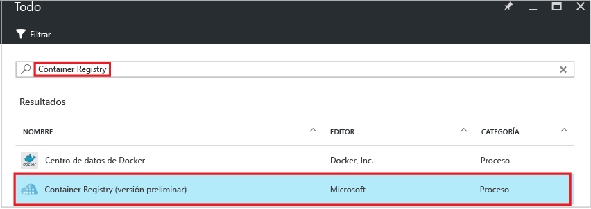
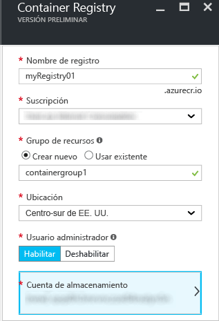
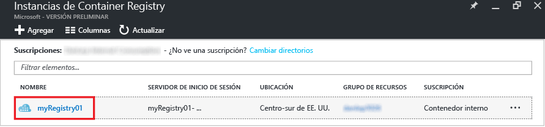
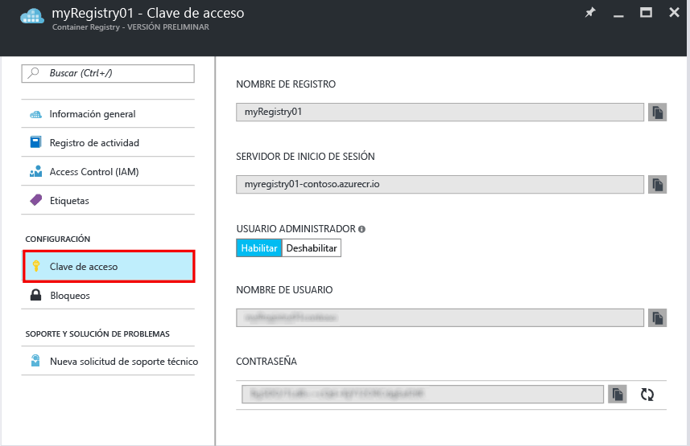

# Creación de un registro de contenedor privado de Docker con Azure Portal
Use Azure Portal para crear un registro de contenedor y administrar su configuración. También puede crear y administrar registros de contenedor mediante los [comandos de la CLI de Azure 2.0](container-registry-get-started-azure-cli.md), [Azure PowerShell](container-registry-get-started-powershell.md) o mediante programación con la [API de REST](https://go.microsoft.com/fwlink/p/?linkid=834376) de Container Registry.

Para más información sobre el entorno y los conceptos, consulte [la información general](container-registry-intro.md).

## Creación de un registro de contenedor
1. En [Azure Portal](https://portal.azure.com), haga clic **+ Nuevo**.
2. Busque en el Marketplace **Azure Container Registry**.
3. Seleccione **Azure Container Registry**, con el publicador **Microsoft**.
    
4. Haga clic en **Crear**. Aparece la hoja **Azure Container Registry**.

    
5. En la hoja **Azure Container Registry**, escriba la siguiente información. Cuando haya terminado, haga clic en **Crear**.

    a. **Nombre del registro**: un nombre de dominio de nivel superior único global para el registro específico. En este ejemplo, el nombre del registro es *myRegistry01*, pero puede sustituirlo por un nombre único de su elección. El nombre puede contener solo letras y números.

    b. **Grupo de recursos**: seleccione un [grupo de recursos](../azure-resource-manager/resource-group-overview.md#resource-groups) existente o escriba el nombre para crear uno.

    c. **Ubicación**: seleccione una ubicación para el centro de datos de Azure en la que el servicio esté [disponible](https://azure.microsoft.com/regions/services/) como, por ejemplo, **centro-sur de EE. UU**.

    d. **Usuario administrador**: si lo desea, habilite un usuario administrador para acceder al registro. Puede cambiar esta configuración después de crear el registro.

      > [!IMPORTANT]
      > Además de proporcionar acceso a través de una cuenta de usuario de administrador, los registros de contenedor admiten la autenticación respaldada por entidades de servicio de Azure Active Directory. Para más información y otras consideraciones, consulte [Authenticate with the container registry](container-registry-authentication.md) (Autenticación con el registro de contenedor).
      >

    e. **Cuenta de almacenamiento**: use la configuración predeterminada para crear una [cuenta de almacenamiento](../storage/common/storage-introduction.md) o seleccione una cuenta de almacenamiento existente en la misma ubicación. Premium Storage no se admite actualmente.

## Administración de la configuración del registro
Después de crear el registro, busque la configuración de este iniciando la hoja **Registros de contenedor** del portal. Por ejemplo, necesitará la configuración para iniciar sesión en el registro, o puede que desee habilitar o deshabilitar el usuario administrador.

1. En la hoja **Registros de contenedor**, haga clic en el nombre del registro.

    
2. Para administrar la configuración de acceso, haga clic en **Clave de acceso**.

    
3. Tenga en cuenta la siguiente configuración:

   * **Servidor de inicio de sesión**: el nombre completo que usa para iniciar sesión en el registro. En este ejemplo, es `myregistry01.azurecr.io`.
   * **Usuario administrador**: elija habilitar o deshabilitar la cuenta de usuario administrador del registro.
   * **Nombre de usuario** y **contraseña**: las credenciales de la cuenta de usuario administrador (si está habilitado) que puede usar para iniciar sesión en el registro. Si lo desea, puede volver a generar la contraseña. Se crean dos contraseñas para que pueda mantener las conexiones en el registro mediante una contraseña mientras vuelve a generar la contraseña de la otra. Para autenticarse con una entidad de servicio en su lugar, consulte [Autenticación con un registro de contenedor privado de Docker](container-registry-authentication.md).

## Pasos siguientes
* [Insertar la primera imagen mediante la CLI de Docker](container-registry-get-started-docker-cli.md)

