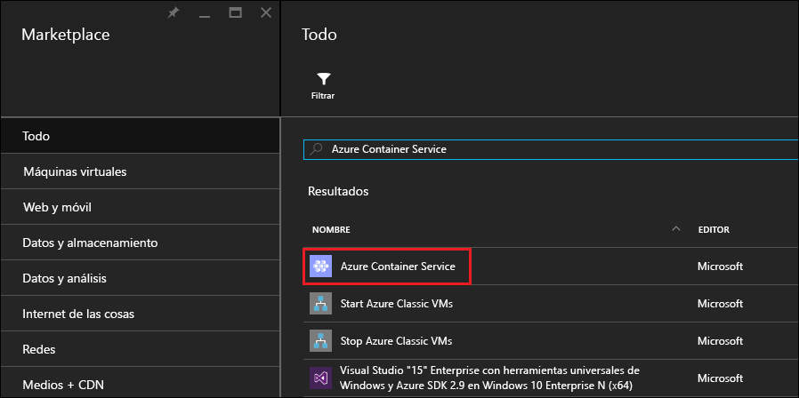
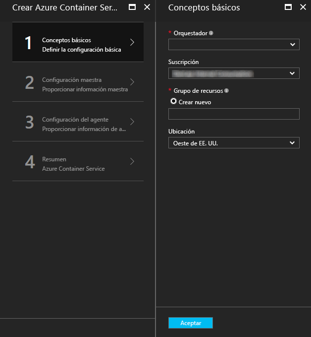
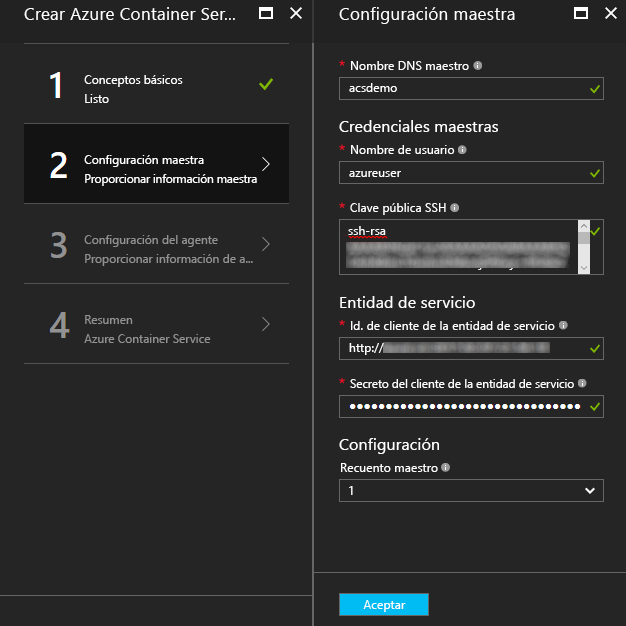
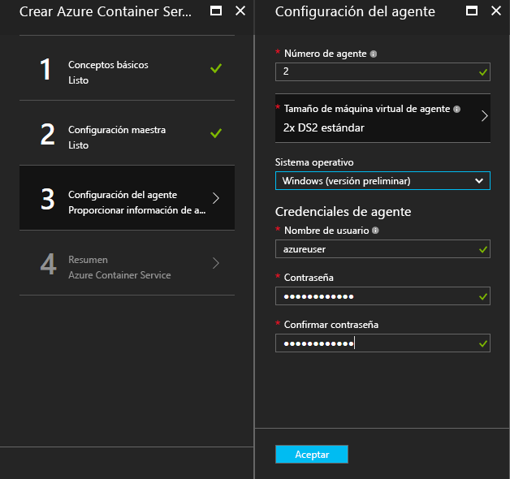
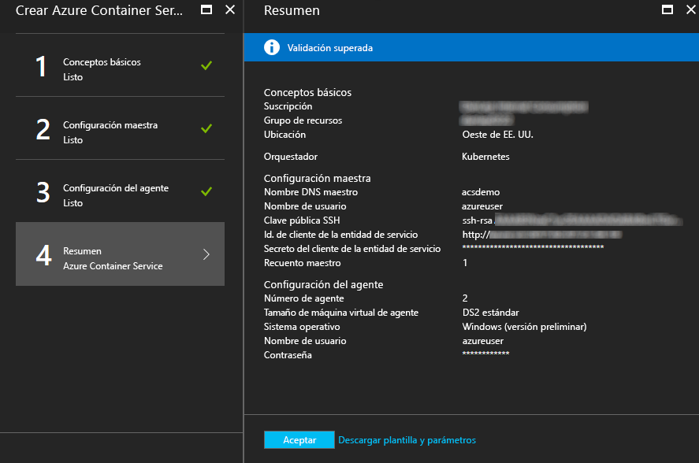
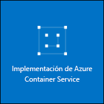

# <a name="deploy-a-docker-container-hosting-solution-using-the-azure-portal"></a>Implementación de una solución de hospedaje de contenedor de Docker mediante Azure Portal


El servicio Contenedor de Azure proporciona una rápida implementación de agrupación en clústeres de contenedor de código abierto y soluciones de orquestación populares. Este documento es una guía paso a paso para implementar un clúster de Azure Container Service mediante Azure Portal o una plantilla de inicio rápido de Azure Resource Manager. 

También se puede implementar un clúster de Azure Container Service mediante la [CLI de Azure 2.0](container-service-create-acs-cluster-cli.md) o las API de Azure Container Service.

Para más información, consulte [Presentación de Azure Container Service](../container-service-intro.md).


## <a name="prerequisites"></a>Requisitos previos

* **Suscripción a Azure:** si no tiene una, suscríbase para una obtener una [evaluación gratuita](http://azure.microsoft.com/pricing/free-trial/?WT.mc_id=AA4C1C935). En un clúster más grande, considere la posibilidad de una suscripción de pago por uso u otras opciones de compra.

    > [!NOTE]
    > El uso de la suscripción de Azure y las [cuotas de recursos](../../azure-subscription-service-limits.md), como las cuotas de núcleos, pueden limitar el tamaño del clúster que se implementa. Para solicitar un aumento de cuota, abra una [solicitud de soporte técnico al cliente en línea](../../azure-supportability/how-to-create-azure-support-request.md) sin cargo alguno.
    >

* **Clave pública RSA de SSH**: si la implementación se realiza a través del portal o de una de las plantillas de inicio rápido de Azure, es preciso especificar la clave pública para la autenticación con máquinas virtuales de Azure Container Service. Para crear claves RSA de SSH (Secure Shell), consulte las instrucciones de [OS X y Linux](../../virtual-machines/linux/mac-create-ssh-keys.md) o de [Windows](../../virtual-machines/linux/ssh-from-windows.md). 

* **Identificador y secreto de cliente de entidad de servicio** (solo Kubernetes): para más información e instrucciones sobre cómo crear una entidad de servicio de Azure Active Directory, consulte [Acerca de la entidad de servicio de Azure Active Directory para un clúster de Kubernetes en Azure Container Service](../kubernetes/container-service-kubernetes-service-principal.md).


## <a name="create-a-cluster-by-using-the-azure-portal"></a>Creación de un clúster mediante Azure Portal
1. Inicie sesión en Azure Portal, seleccione **Nuevo**, y busque **Azure Container Service** en Azure Marketplace.

      <br />

2. Haga clic en **Azure Container Service** y luego en **Crear**.

3. En la hoja **Básico**, especifique la siguiente información:

    * **Orquestador**: seleccione uno de los orquestadores de contenedor para implementar en el clúster.
        * **DC/OS**: implementa un clúster de DC/OS.
        * **Swarm**: implementa un clúster de Docker Swarm.
        * **Kubernetes**: implementa un clúster de Kubernetes.
    * **Suscripción**: seleccione una suscripción de Azure.
    * **Grupo de recursos**: escriba el nombre de un nuevo grupo de recursos para la implementación.
    * **Ubicación**: seleccione una región de Azure para la implementación del servicio Contenedor de Azure. Para ver la disponibilidad, consulte [Productos disponibles por región](https://azure.microsoft.com/regions/services/).
    
      <br />
    
    Haga clic en **Aceptar** cuando esté listo para continuar.

4. En la hoja **Master configuration** (Configuración maestra), especifique la siguiente configuración para los nodos maestros de Linux del clúster (algunos valores de configuración de especifican para cada orquestador):

    * **Master DNS name** (Nombre DNS del maestro): el prefijo usado para crear un nombre de dominio completo (FQDN) para el maestro. El FQDN del maestro tiene el formato *prefijo*mgmt.*ubicación*.cloudapp.azure.com.
    * **Nombre de usuario**: el nombre de usuario de una cuenta en cada una de las máquinas virtuales Linux del clúster.
    * **SSH RSA public key** (Clave pública RSA de SSH): agregue la clave pública que se usará para la autenticación en las máquinas virtuales Linux. Es importante que esta clave no tenga saltos de línea y que incluya el prefijo `ssh-rsa`. El sufijo `username@domain` es opcional. La clave debería tener un formato similar al siguiente: **ssh-rsa AAAAB3Nz...<...>...UcyupgH azureuser@linuxvm**. 
    * **Entidad de servicio**: si seleccionó el orquestador Kubernetes, escriba un **id. de cliente de entidad de servicio** (también llamado appId) de Azure Active Directory y un **secreto de cliente de entidad de servicio** (contraseña). Para más información, consulte [About the Azure Active Directory service principal for a Kubernetes cluster in Azure Container Service](../kubernetes/container-service-kubernetes-service-principal.md) (Acerca de la entidad de servicio de Azure Active Directory para un clúster de Kubernetes de Azure Container Service).
    * **Master count**(Número de patrones): el número de patrones en el clúster.
    * **VM diagnostics** (Diagnóstico de máquina virtual): en algunos orquestadores, puede habilitar el diagnóstico de máquina virtual en los maestros.

      <br />

    Haga clic en **Aceptar** cuando esté listo para continuar.

5. En la hoja **Configuración del Agente**, escriba la siguiente información:

    * **Número de agentes**: en el caso de Docker Swarm y Kubernetes, este valor es el número inicial de agentes del conjunto de escalado de agentes. En el caso de DC/OS, se trata del número inicial de agentes de un conjunto de escalado privado. Además, se crea un conjunto de escalado público para DC/OS, que contiene un número predeterminado de agentes. El número de agentes de este conjunto de escalado público lo determina el número de maestros en el clúster: un agente público para un maestro y dos agentes públicos para tres o cinco maestros.
    * **Agent virtual machine size**(Tamaño de máquina virtual de agente): el tamaño de las máquinas virtuales de los agentes.
    * **Sistema operativo**: esta opción está actualmente disponible solo si seleccionó el orquestrator Kubernetes. Elija una distribución de Linux o un sistema operativo de Windows Server para que se ejecute en los agentes. Esta configuración determina si el clúster puede ejecutar aplicaciones de contenedor de Linux o Windows. 

        > [!NOTE]
        > La compatibilidad con el contenedor de Windows está en versión preliminar para los clústeres de Kubernetes. En clústeres de DC/OS y Swarm, actualmente solo se admiten agentes de Linux en Azure Container Service.

    * **Agent credentials** (Credenciales del agente): si seleccionó el sistema operativo Windows, escriba un **nombre de usuario** y una **contraseña** de administrador para las máquinas virtuales del agente. 

      <br />

    Haga clic en **Aceptar** cuando esté listo para continuar.

6. Una vez finalizada la validación del servicio, haga clic en **Aceptar**.

      <br />

7. Revise los términos. Haga clic en **Crear** para iniciar el proceso de implementación.

    Si ha elegido anclar la implementación al Portal de Azure, se verá el estado de la implementación.

      <br />

La implementación tarda varios minutos en completarse. Después, el clúster de Azure Container Service estará listo para su uso.


## <a name="create-a-cluster-by-using-a-quickstart-template"></a>Creación de un clúster mediante una plantilla de inicio rápido
Las plantillas de inicio rápido de Azure permiten implementar un clúster en Azure Container Service. Las plantillas de inicio rápido que se proporcionan se pueden modificar para que incluyan una configuración de Azure adicional o avanzada. Para crear un clúster de Azure Container Service mediante una plantilla de inicio rápido de Azure, se necesita una suscripción a Azure. Si no dispone de ninguna, suscríbase para obtener una [evaluación gratuita](http://azure.microsoft.com/pricing/free-trial/?WT.mc_id=AA4C1C935). 

Siga estos pasos para implementar un clúster mediante una plantilla y la CLI de Azure 2.0 (consulte las [instrucciones de instalación y configuración ](/cli/azure/install-az-cli2)).

> [!NOTE] 
> En un sistema Windows, puede utilizar pasos similares para implementar una plantilla mediante Azure PowerShell. En esta misma sección encontrará los pasos necesarios para hacerlo. Las plantillas también se pueden implementar a través del [portal](../../azure-resource-manager/resource-group-template-deploy-portal.md) o mediante otros métodos.

1. Para implementar un clúster de DC/OS, Docker Swarm o Kubernetes, seleccione una de las plantillas de inicio rápido disponibles en GitHub. Se muestra una lista parcial. Las plantillas de DC/OS y Swarm son las mismas, excepto por la selección del orquestador predeterminado.

    * [Plantilla de DC/OS](https://github.com/Azure/azure-quickstart-templates/tree/master/101-acs-dcos)
    * [Plantilla Swarm](https://github.com/Azure/azure-quickstart-templates/tree/master/101-acs-swarm)
    * [Plantilla de Kubernetes](https://github.com/Azure/azure-quickstart-templates/tree/master/101-acs-kubernetes)

2. Inicie sesión en su cuenta de Azure (`az login`) y asegúrese de que la CLI de Azure está conectada a su suscripción a Azure. Para ver la suscripción predeterminada, use el siguiente comando:

    ```azurecli
    az account show
    ```
    
    Si tiene más de una suscripción y necesita establecer otra suscripción predeterminada, ejecute `az account set --subscription` y especifique el nombre o identificador de la suscripción.

3. Como procedimiento recomendado, utilice un grupo de recursos nuevo para la implementación. Para crear un grupo de recursos nuevo, use el comando `az group create` y especifique el nombre y la ubicación del grupo de recursos: 

    ```azurecli
    az group create --name "RESOURCE_GROUP" --location "LOCATION"
    ```

4. Cree un archivo JSON que contenga los parámetros de plantilla necesarios. Descargue el archivo de parámetros denominado `azuredeploy.parameters.json` que acompaña a la plantilla de Azure Container Service `azuredeploy.json` en GitHub. Especifique los valores de parámetro necesarios para el clúster. 

    Por ejemplo, para usar la [plantilla de DC/OS](https://github.com/Azure/azure-quickstart-templates/tree/master/101-acs-dcos), especifique los valores de parámetro para `dnsNamePrefix` y `sshRSAPublicKey`. Vea las descripciones de `azuredeploy.json` y opciones para otros parámetros.  
 

5. Para crear un clúster de Container Service, use el archivo de parámetros de implementación con el comando siguiente, donde:

    * **RESOURCE_GROUP** es el nombre del grupo de recursos que creó en el paso anterior.
    * **DEPLOYMENT_NAME** (opcional) es el nombre que se asigna a la implementación.
    * **TEMPLATE_URI** es la ubicación del archivo de implementación `azuredeploy.json`. Este identificador URI tiene que ser el archivo sin formato, no un puntero a la interfaz de usuario de GitHub. Para buscar el identificador URI, seleccione el archivo `azuredeploy.json` en GitHub y haga clic en el botón **Raw** (Sin formato).  

    ```azurecli
    az group deployment create -g RESOURCE_GROUP -n DEPLOYMENT_NAME --template-uri TEMPLATE_URI --parameters @azuredeploy.parameters.json
    ```

    Los parámetros también se pueden especificar en forma de cadena con formato JSON en la línea de comandos. Use un comando similar al siguiente:

    ```azurecli
    az group deployment create -g RESOURCE_GROUP -n DEPLOYMENT_NAME --template-uri TEMPLATE_URI --parameters "{ \"param1\": {\"value1\"} … }"
    ```

    > [!NOTE]
    > La implementación tarda varios minutos en completarse.
    > 

### <a name="equivalent-powershell-commands"></a>Comandos de PowerShell equivalentes
Las plantillas de clúster de Azure Container Service también se pueden implementar con PowerShell. Este documento se basa en la versión 1.0 del [módulo de Azure PowerShell](https://azure.microsoft.com/blog/azps-1-0/).

1. Para implementar un clúster de DC/OS, Docker Swarm o Kubernetes, seleccione una de las plantillas de inicio rápido disponibles en GitHub. Se muestra una lista parcial. Tenga en cuenta que las plantillas de DC/OS y Swarm son iguales, a excepción de la selección del orquestador predeterminado.

    * [Plantilla de DC/OS](https://github.com/Azure/azure-quickstart-templates/tree/master/101-acs-dcos)
    * [Plantilla Swarm](https://github.com/Azure/azure-quickstart-templates/tree/master/101-acs-swarm)
    * [Plantilla de Kubernetes](https://github.com/Azure/azure-quickstart-templates/tree/master/101-acs-kubernetes)

2. Antes de crear un clúster en su suscripción de Azure, compruebe que la sesión de PowerShell se ha iniciado en Azure. Para ello, puede usar el comando `Get-AzureRMSubscription` :

    ```powershell
    Get-AzureRmSubscription
    ```

3. Si tiene que iniciar sesión en Azure, use el comando `Login-AzureRMAccount` :

    ```powershell
    Login-AzureRmAccount
    ```

4. Como procedimiento recomendado, utilice un grupo de recursos nuevo para la implementación. Para crear un nuevo grupo de recursos, use el comando `New-AzureRmResourceGroup` y especifique el nombre y la región de destino de dicho grupo:

    ```powershell
    New-AzureRmResourceGroup -Name GROUP_NAME -Location REGION
    ```

5. Después de crear un grupo de recursos, puede crear el clúster con el comando siguiente. El URI de la plantilla deseada se especifica con el parámetro `-TemplateUri`. Al ejecutar este comando, PowerShell solicita los valores de los parámetros de implementación.

    ```powershell
    New-AzureRmResourceGroupDeployment -Name DEPLOYMENT_NAME -ResourceGroupName RESOURCE_GROUP_NAME -TemplateUri TEMPLATE_URI
    ```

#### <a name="provide-template-parameters"></a>Suministro de los parámetros de plantilla
Si está familiarizado con PowerShell, sabe que puede recorrer los parámetros disponibles para un cmdlet; basta con que escriba un signo menos (-) y luego presione la tecla TAB. Esta misma funcionalidad también sirve para los parámetros que se definen en la plantilla. En cuanto escribe el nombre de la plantilla, el cmdlet captura la plantilla, analiza los parámetros y agrega los parámetros de la plantilla al comando de manera dinámica. Esto hace que sea fácil especificar los valores de los parámetros de la plantilla. Además, si olvida el valor de algún parámetro necesario, PowerShell le pide dicho valor.

A continuación se muestra el comando completo con parámetros incluidos. Proporcione sus propios valores para los nombres de los recursos.

```powershell
New-AzureRmResourceGroupDeployment -ResourceGroupName RESOURCE_GROUP_NAME-TemplateURI TEMPLATE_URI -adminuser value1 -adminpassword value2 ....
```

## <a name="next-steps"></a>Pasos siguientes
Ahora que tiene un clúster funcionando, consulte los siguientes documentos para obtener información detallada sobre conexión y administración:

* [Conexión a un clúster del servicio Contenedor de Azure](../container-service-connect.md)
* [Administración de contenedores con la API de REST](container-service-mesos-marathon-rest.md)
* [Administración de contenedores con Docker Swarm](container-service-docker-swarm.md)
* [Trabajo con Azure Container Service y Kubernetes](../kubernetes/container-service-kubernetes-walkthrough.md)
