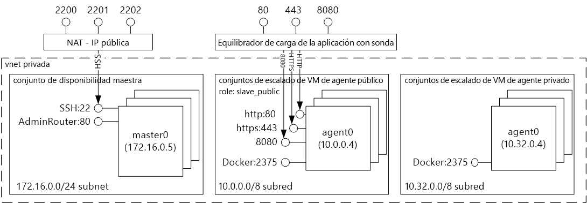
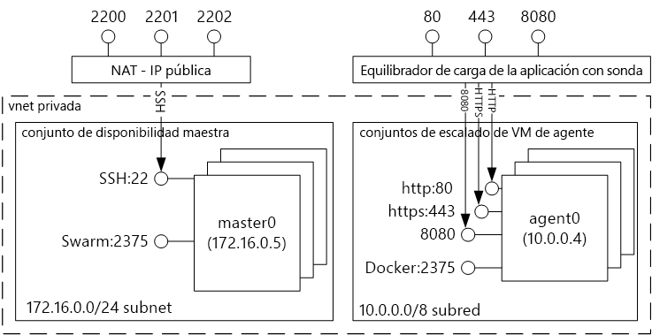

# Introducción a las soluciones de hospedaje de contenedores de Docker mediante Azure Container Service 

El servicio Contenedor de Azure simplifica la creación, configuración y administración de un clúster de máquinas virtuales preconfiguradas para ejecutar aplicaciones en contenedor. Usa una configuración optimizada de herramientas de programación y orquestación de código abierto conocidas. Esto le permite usar sus conocimientos o recurrir a un importante y creciente grupo de expertos comunitarios para implementar y administrar aplicaciones basadas en contenedores en Microsoft Azure.

El servicio Contenedor de Azure usa el formato de contenedor Docker para garantizar que los contenedores de su aplicación sean completamente portátiles. También es compatible con su elección de Marathon y DC/OS, Docker Swarm o Kubernetes para que pueda escalar estas aplicaciones a miles e incluso a decenas de miles de contenedores.

Con el servicio Contenedor de Azure puede aprovechar las características empresariales de Azure sin dejar de mantener la portabilidad de aplicaciones, incluida la portabilidad en las capas de orquestación.

## Uso del servicio Contenedor de Azure
Nuestro objetivo con el servicio Contenedor de Azure es proporcionar un entorno de hospedaje de contenedores mediante el uso de tecnologías y herramientas de código abierto, conocidas por nuestros clientes. Con este fin, se exponen los puntos de conexión de API estándar del orquestador que haya elegido (DC/OS, Docker Swarm o Kubernetes). Al usar estos puntos de conexión, puede aprovechar cualquier software que se comunique con estos. Por ejemplo, en el caso del punto de conexión de Docker Swarm, puede usar la interfaz de la línea de comandos (CLI) de Docker. Para DC/OS, puede usar la CLI de DCOS. Para Kubernetes, puede elegir `kubectl`.

## Creación de un clúster de Docker con el servicio Contenedor de Azure
Para comenzar a usar Azure Container Service, implementará un clúster de Azure Container Service mediante el portal (busque **Azure Container Service** en Marketplace), mediante una plantilla de Azure Resource Manager ([Docker Swarm](https://github.com/Azure/azure-quickstart-templates/tree/master/101-acs-swarm), [DC/OS](https://github.com/Azure/azure-quickstart-templates/tree/master/101-acs-dcos) o [Kubernetes](https://github.com/Azure/azure-quickstart-templates/tree/master/101-acs-kubernetes)), o con la [CLI de Azure 2.0](container-service-create-acs-cluster-cli.md). Las plantillas de inicio rápido que se proporcionan se pueden modificar para que incluyan una configuración de Azure adicional o avanzada. Para más información, consulte [Implementación de un clúster de Azure Container Service](container-service-deployment.md).

## Implementación de una aplicación
Azure Container Service permite elegir los orquestadores Docker Swarm, DC/OS o Kubernetes. El procedimiento para implementar la aplicación dependerá del orquestador que elija.

### Uso de DC/OS
DC/OS es un sistema operativo distribuido basado en el kernel de sistemas distribuidos Apache Mesos. Apache Mesos se hospeda en Apache Software Foundation e incluye algunos de los [principales nombres de TI](http://mesos.apache.org/documentation/latest/powered-by-mesos/) como usuarios y colaboradores.

DC/OS y Apache Mesos presentan una impresionante serie de características:

* Escalabilidad demostrada
* Patrón y esclavos replicados tolerantes a errores que usan Apache ZooKeeper
* Compatibilidad con los contenedores en formato Docker
* Aislamiento nativo entre las tareas con contenedores de Linux
* Programación de varios recursos (memoria, CPU, disco y puertos)
* API de Java, Python y C++ para desarrollar nuevas aplicaciones paralelas
* Una IU web para ver el estado del clúster

De forma predeterminada, la instancia de DC/OS que se ejecuta en el servicio de contenedor de Azure incluye la plataforma de orquestación Marathon para cargas de trabajo de programación. Sin embargo, con la implementación de DC/OS de ACS, se incluye el universo de servicios de Mesosphere que se puede agregar a su servicio. Los servicios del universo incluyen Spark, Hadoop, Cassandra, y muchos más.

#### Uso de Marathon
Marathon es un sistema de inicialización y control de todo el clúster para servicios en cgroups o, en el caso del servicio Contenedor de Azure, contenedores en formato Docker. Marathon proporciona una IU web desde la que puede implementar aplicaciones. Puede acceder a esta desde una dirección URL semejante a `http://DNS_PREFIX.REGION.cloudapp.azure.com`, donde DNS\_PREFIX y REGION se definen en el momento de la implementación. Por supuesto, también puede proporcionar su propio nombre DNS. Para más información sobre cómo ejecutar un contenedor mediante la interfaz de usuario web de Marathon, consulte [Administración de contenedores de DC/OS a través de la interfaz de usuario web de Marathon](container-service-mesos-marathon-ui.md).

Además, puede usar las API de REST para comunicarse con Marathon. Existen varias bibliotecas de cliente que están disponibles para cada herramienta. Abarcan una variedad de lenguajes y, por supuesto, puede usar el protocolo HTTP en cualquier lenguaje. Muchas herramientas de DevOps conocidas también proporcionan compatibilidad con Marathon. Esto proporciona la máxima flexibilidad a su equipo de operaciones cuando trabaja con un clúster del servicio Contenedor de Azure. Para más información sobre cómo ejecutar un contenedor mediante la API de REST de Marathon, consulte [Administración de contenedores de DC/OS mediante la API de REST de Marathon](container-service-mesos-marathon-rest.md).

### Uso de Docker Swarm
Docker Swarm proporciona agrupación en clústeres nativa para Docker. Como Docker Swarm proporciona servicio a la API de Docker estándar, cualquier herramienta que ya se comunique con Docker daemon podrá usar Swarm para escalar de forma transparente a varios hosts en el servicio Contenedor de Azure.

[!INCLUDE [container-service-swarm-mode-note](../../../includes/container-service-swarm-mode-note.md)]

Entre las herramientas compatibles para administrar contenedores en un clúster Swarm se incluyen las siguientes:

* Dokku
* CLI de Docker y Docker Compose
* Krane
* Jenkins

### Uso de Kubernetes
Kubernetes es una conocida herramienta de orquestación de código abierto para su uso en producción. Kubernetes automatiza la implementación, el escalado y la administración de aplicaciones en contenedor. Dado que es una solución de código abierto y está controlada por la comunidad de código abierto, se ejecuta sin problemas en Azure Container Service y puede usarse para implementar contenedores a escala en Azure Container Service.

Tiene un amplio conjunto de características que incluyen:
* Escalado horizontal
* Detección de servicio y equilibrio de carga
* Secretos y administración de configuración
* Lanzamientos y reversiones automatizados basados en API
* Recuperación automática

## Vídeos
Introducción a Azure Container Service:  

> [!VIDEO https://channel9.msdn.com/Shows/Azure-Friday/Azure-Container-Service-101/player]
>
>

Building Applications Using the Azure Container Service (Creación de aplicaciones mediante Azure Container Service) (Build 2016)

> [!VIDEO https://channel9.msdn.com/Events/Build/2016/B822/player]
>
>

## Pasos siguientes

Implementar un clúster del servicio de contenedores mediante el [portal](container-service-deployment.md) o la [CLI de Azure 2.0](container-service-create-acs-cluster-cli.md).