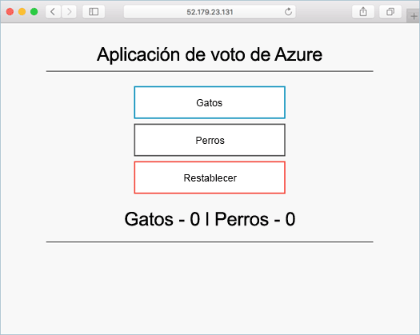

# <a name="deploy-kubernetes-cluster-for-linux-containers"></a>Implementación de un clúster de Kubernetes para los contenedores de Linux

[!INCLUDE [aks-preview-redirect.md](../../../includes/aks-preview-redirect.md)]

En esta guía de inicio rápido se implementa un clúster de Kubernetes mediante la CLI de Azure. A continuación, se ejecuta e implementa en el clúster una aplicación de varios contenedores que consta de un front-end web y una instancia de Redis. Una vez finalizado el proceso, la aplicación es accesible a través de Internet. 

La aplicación de ejemplo usada en este documento está escrita en Python. Los conceptos y los pasos que se detallan aquí pueden utilizarse para implementar cualquier imagen de contenedor en un clúster de Kubernetes. Los archivos de manifiesto de Kubernetes creados previamente, Dockerfile y el código relacionados con este proyecto están disponibles en [GitHub](https://github.com/Azure-Samples/azure-voting-app-redis.git).



En esta guía se supone que tiene unos conocimientos básicos de los conceptos de Kubernetes. Para obtener una información más detallada sobre esta aplicación, consulte la [documentación de Kubernetes]( https://kubernetes.io/docs/home/).

Si no tiene una suscripción a Azure, cree una [cuenta gratuita](https://azure.microsoft.com/free/?WT.mc_id=A261C142F) antes de empezar.

[!INCLUDE [cloud-shell-try-it.md](../../../includes/cloud-shell-try-it.md)]

Si decide instalar y usar la CLI localmente, para esta guía de inicio rápido es preciso que ejecute la CLI de Azure versión 2.0.4 o posterior. Ejecute `az --version` para encontrar la versión. Si necesita instalarla o actualizarla, consulte [Instalación de la CLI de Azure 2.0]( /cli/azure/install-azure-cli). 

## <a name="create-a-resource-group"></a>Crear un grupo de recursos

Cree un grupo de recursos con el comando [az group create](/cli/azure/group#create). Un grupo de recursos de Azure es un grupo lógico en el que se implementan y se administran los recursos de Azure. 

En el ejemplo siguiente, se crea un grupo de recursos denominado *myResourceGroup* en la ubicación *westeurope*.

```azurecli-interactive 
az group create --name myResourceGroup --location westeurope
```

Salida:

```json
{
  "id": "/subscriptions/00000000-0000-0000-0000-000000000000/resourceGroups/myResourceGroup",
  "location": "westeurope",
  "managedBy": null,
  "name": "myResourceGroup",
  "properties": {
    "provisioningState": "Succeeded"
  },
  "tags": null
}
```

## <a name="create-kubernetes-cluster"></a>Creación de un clúster de Kubernetes

Cree un clúster de Kubernetes en Azure Container Service con el comando [az acs create](/cli/azure/acs#create). En el ejemplo siguiente, se crea un clúster denominado *myK8sCluster* con un nodo maestro de Linux y tres nodos de agente de Linux.

```azurecli-interactive 
az acs create --orchestrator-type kubernetes --resource-group myResourceGroup --name myK8sCluster --generate-ssh-keys
```

En algunos casos, como con las versiones de evaluación de tiempo limitado, una suscripción a Azure tiene un acceso limitado a los recursos de Azure. Si se produce un error en la implementación debido a que los núcleos disponibles son limitados, reduzca el número de agentes predeterminado agregando `--agent-count 1` al comando [az acs create](/cli/azure/acs#create). 

Después de varios minutos, el comando se completa y devuelve información en formato json sobre el clúster. 

## <a name="connect-to-the-cluster"></a>Conexión al clúster

Para administrar un clúster de Kubernetes, use [kubectl](https://kubernetes.io/docs/user-guide/kubectl/), el cliente de línea de comandos de Kubernetes. 

Si usa Azure CloudShell, kubectl ya está instalado. Si desea instalarlo de forma local, puede usar el comando [az acs kubernetes install-cli](/cli/azure/acs/kubernetes#install-cli).

Para configurar kubectl para conectarse al clúster de Kubernetes, ejecute el comando [az acs kubernetes get-credentials](/cli/azure/acs/kubernetes#get-credentials). Con este paso se descargan las credenciales y se configura la CLI de Kubernetes para usarlas.

```azurecli-interactive 
az acs kubernetes get-credentials --resource-group=myResourceGroup --name=myK8sCluster
```

Para comprobar la conexión con el clúster, use el comando [kubectl get](https://kubernetes.io/docs/user-guide/kubectl/v1.6/#get) para que devuelva una lista de los nodos del clúster.

```azurecli-interactive
kubectl get nodes
```

Salida:

```bash
NAME                    STATUS                     AGE       VERSION
k8s-agent-14ad53a1-0    Ready                      10m       v1.6.6
k8s-agent-14ad53a1-1    Ready                      10m       v1.6.6
k8s-agent-14ad53a1-2    Ready                      10m       v1.6.6
k8s-master-14ad53a1-0   Ready,SchedulingDisabled   10m       v1.6.6
```

## <a name="run-the-application"></a>Ejecución de la aplicación

Un archivo de manifiesto de Kubernetes define un estado deseado del clúster, por ejemplo, qué imágenes de contenedor se deben ejecutar. En este ejemplo, se usa un manifiesto para crear todos los objetos necesarios para ejecutar la aplicación Azure Vote. 

Cree un archivo denominado `azure-vote.yml` y copie el siguiente código YAML. Si está trabajando en Azure Cloud Shell, este archivo se puede crear mediante vi o Nano, como si trabajara en un sistema físico o virtual.

```yaml
apiVersion: apps/v1beta1
kind: Deployment
metadata:
  name: azure-vote-back
spec:
  replicas: 1
  template:
    metadata:
      labels:
        app: azure-vote-back
    spec:
      containers:
      - name: azure-vote-back
        image: redis
        ports:
        - containerPort: 6379
          name: redis
---
apiVersion: v1
kind: Service
metadata:
  name: azure-vote-back
spec:
  ports:
  - port: 6379
  selector:
    app: azure-vote-back
---
apiVersion: apps/v1beta1
kind: Deployment
metadata:
  name: azure-vote-front
spec:
  replicas: 1
  template:
    metadata:
      labels:
        app: azure-vote-front
    spec:
      containers:
      - name: azure-vote-front
        image: microsoft/azure-vote-front:redis-v1
        ports:
        - containerPort: 80
        env:
        - name: REDIS
          value: "azure-vote-back"
---
apiVersion: v1
kind: Service
metadata:
  name: azure-vote-front
spec:
  type: LoadBalancer
  ports:
  - port: 80
  selector:
    app: azure-vote-front
```

Use el comando [kubectl create](https://kubernetes.io/docs/user-guide/kubectl/v1.6/#create) para ejecutar la aplicación.

```azurecli-interactive
kubectl create -f azure-vote.yml
```

Salida:

```bash
deployment "azure-vote-back" created
service "azure-vote-back" created
deployment "azure-vote-front" created
service "azure-vote-front" created
```

## <a name="test-the-application"></a>Prueba de la aplicación

Cuando se ejecuta la aplicación, se crea un [servicio de Kubernetes](https://kubernetes.io/docs/concepts/services-networking/service/) que expone la aplicación front-end a Internet. Este proceso puede tardar unos minutos en completarse. 

Para supervisar el progreso, utilice el comando [kubectl get service](https://kubernetes.io/docs/user-guide/kubectl/v1.6/#get) con el argumento `--watch`.

```azurecli-interactive
kubectl get service azure-vote-front --watch
```

En un primer momento, el parámetro **EXTERNAL-IP** del servicio *azure-vote-front* aparece como *pendiente*. Una vez que el parámetro EXTERNAL-IP ha cambiado de *pendiente* a una *dirección IP*, use `CTRL-C` para detener el proceso de inspección de kubectl. 
  
```bash
azure-vote-front   10.0.34.242   <pending>     80:30676/TCP   7s
azure-vote-front   10.0.34.242   52.179.23.131   80:30676/TCP   2m
```

Ahora ya puede navegar a la dirección IP externa para ver la aplicación Azure Vote.

  

## <a name="delete-cluster"></a>Eliminación de clúster
Cuando un clúster ya no se necesite, puede usar el comando [az group delete](/cli/azure/group#delete) para quitar el grupo de recursos, el servicio de contenedor y todos los recursos relacionados.

```azurecli-interactive 
az group delete --name myResourceGroup --yes --no-wait
```

## <a name="get-the-code"></a>Obtención del código

En esta guía de inicio rápido, se han usado imágenes de un contenedor creado previamente para crear una implementación de Kubernetes. El código de la aplicación relacionada, Dockerfile, y el archivo de manifiesto de Kubernetes están disponibles en GitHub.

[https://github.com/Azure-Samples/azure-voting-app-redis](https://github.com/Azure-Samples/azure-voting-app-redis.git)

## <a name="next-steps"></a>Pasos siguientes

En esta guía de inicio rápido, ha implementado un clúster de Kubernetes y una aplicación de varios contenedores en él. 

Para más información sobre Azure Container Service y sobre un ejemplo completo desde el código hasta la implementación, siga con el tutorial del clúster de Kubernetes.

> [!div class="nextstepaction"]
> [Administración de un clúster de ACS Kubernetes](./container-service-tutorial-kubernetes-prepare-app.md)
