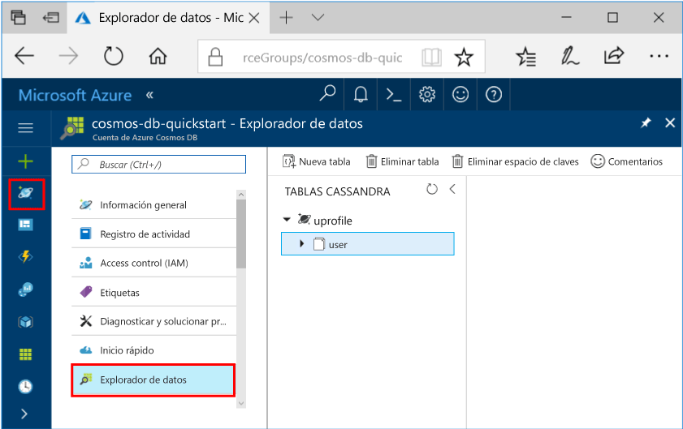

# <a name="quickstart-build-a-cassandra-app-with-java-and-azure-cosmos-db"></a>Guía de inicio rápido: compilación de una aplicación de Cassandra con Java y Azure Cosmos DB

Esta guía de inicio rápido muestra cómo se usan Java y la [API de Cassandra](cassandra-introduction.md) de Azure Cosmos DB para compilar una aplicación de perfil mediante la clonación de un ejemplo de GitHub. Esta guía de inicio rápido también le guía a través de la creación de una cuenta de Azure Cosmos DB a través de Azure Portal en la web.

Azure Cosmos DB es un servicio de base de datos con varios modelos y de distribución global de Microsoft. Puede crear rápidamente bases de datos de documentos, tablas, clave-valor y grafos, y realizar consultas en ellas. Todas las bases de datos se beneficiarán de las funcionalidades de distribución global y escala horizontal en Azure Cosmos DB. 

## <a name="prerequisites"></a>Requisitos previos

[!INCLUDE [quickstarts-free-trial-note](../../includes/quickstarts-free-trial-note.md)] También puede [probar gratis Azure Cosmos DB](https://azure.microsoft.com/try/cosmosdb/) sin suscripción de Azure, sin cargos y sin compromiso.

Acceda a la versión preliminar del programa de la API de Cassandra de Azure Cosmos DB. Si no ha solicitado el acceso aún, [regístrese ahora](cassandra-introduction.md#sign-up-now).

Además: 

* [Kit de desarrollo de Java (JDK) 1.7+](http://www.oracle.com/technetwork/java/javase/downloads/jdk8-downloads-2133151.html)
    * En Ubuntu, ejecute `apt-get install default-jdk` para instalar el JDK.
    * Asegúrese de establecer la variable de entorno JAVA_HOME para que apunte a la carpeta donde está instalado el JDK.
* [Descargar](http://maven.apache.org/download.cgi) e [instalar](http://maven.apache.org/install.html) un archivo binario de [Maven](http://maven.apache.org/)
    * En Ubuntu, puede ejecutar `apt-get install maven` para instalar Maven.
* [Git](https://www.git-scm.com/)
    * En Ubuntu, puede ejecutar `sudo apt-get install git` para instalar Git.


## <a name="create-a-database-account"></a>Creación de una cuenta de base de datos

Para poder crear una base de datos de documentos, debe crear una cuenta de Cassandra con Azure Cosmos DB.

[!INCLUDE [cosmos-db-create-dbaccount-cassandra](../../includes/cosmos-db-create-dbaccount-cassandra.md)]

## <a name="clone-the-sample-application"></a>Clonación de la aplicación de ejemplo

Ahora vamos a empezar a trabajar con el código. Vamos a clonar una aplicación de Cassandra desde GitHub, establecer la cadena de conexión y ejecutarla. Verá lo fácil que es trabajar con datos mediante programación. 

1. Abra una ventana de terminal de Git, como git bash y utilice el comando `cd` para cambiar a una carpeta para instalar la aplicación de ejemplo. 

    ```bash
    cd "C:\git-samples"
    ```

2. Ejecute el comando siguiente para clonar el repositorio de ejemplo. Este comando crea una copia de la aplicación de ejemplo en el equipo.

    ```bash
    git clone https://github.com/Azure-Samples/azure-cosmos-db-cassandra-java-getting-started.git
    ```

## <a name="review-the-code"></a>Revisar el código

Este paso es opcional. Si está interesado en aprender cómo se crean los recursos de base de datos en el código, puede revisar los siguientes fragmentos de código. En caso contrario, puede ir directamente a [Actualización de la cadena de conexión](#update-your-connection-string). Estos fragmentos de código se toman de src/main/java/com/azure/cosmosdb/cassandra/util/CassandraUtils.java.  

* Se establecen las opciones de Cassandra de host, puerto, nombre de usuario, contraseña y SSL. La información de la cadena de conexión procede de la página de cadena de conexión de Azure Portal.

   ```java
   cluster = Cluster.builder().addContactPoint(cassandraHost).withPort(cassandraPort).withCredentials(cassandraUsername, cassandraPassword).withSSL(sslOptions).build();
   ```

* El elemento `cluster` se conecta a la API de Cassandra de Azure Cosmos DB y devuelve una sesión a la que se accede.

    ```java
    return cluster.connect();
    ```

Los fragmentos de código siguientes son del archivo src/main/java/com/azure/cosmosdb/cassandra/repository/UserRepository.java.

* Cree un nuevo espacio de claves.

    ```java
    public void createKeyspace() {
        final String query = "CREATE KEYSPACE IF NOT EXISTS uprofile WITH replication = {'class': 'SimpleStrategy', 'replication_factor': '3' } ";
        session.execute(query);
        LOGGER.info("Created keyspace 'uprofile'");
    }
    ```

* Cree una nueva tabla.

   ```java
   public void createTable() {
        final String query = "CREATE TABLE IF NOT EXISTS uprofile.user (user_id int PRIMARY KEY, user_name text, user_bcity text)";
        session.execute(query);
        LOGGER.info("Created table 'user'");
   }
   ```

* Inserte las entidades de usuario mediante un objeto de instrucción preparado.

    ```java
    public PreparedStatement prepareInsertStatement() {
        final String insertStatement = "INSERT INTO  uprofile.user (user_id, user_name , user_bcity) VALUES (?,?,?)";
        return session.prepare(insertStatement);
    }

    public void insertUser(PreparedStatement statement, int id, String name, String city) {
        BoundStatement boundStatement = new BoundStatement(statement);
        session.execute(boundStatement.bind(id, name, city));
    }
    ```

* Realice una consulta para obtener la información de todos los usuarios.

    ```java
   public void selectAllUsers() {
        final String query = "SELECT * FROM uprofile.user";
        List<Row> rows = session.execute(query).all();

        for (Row row : rows) {
            LOGGER.info("Obtained row: {} | {} | {} ", row.getInt("user_id"), row.getString("user_name"), row.getString("user_bcity"));
        }
    }
    ```

* Realice una consulta para obtener la información de un único usuario.

    ```java
    public void selectUser(int id) {
        final String query = "SELECT * FROM uprofile.user where user_id = 3";
        Row row = session.execute(query).one();

        LOGGER.info("Obtained row: {} | {} | {} ", row.getInt("user_id"), row.getString("user_name"), row.getString("user_bcity"));
    }
    ```

## <a name="update-your-connection-string"></a>Actualizar la cadena de conexión

Ahora vuelva a Azure Portal para obtener la información de la cadena de conexión y cópiela en la aplicación. Esto permite que la aplicación se comunique con la base de datos hospedada.

1. En [Azure Portal](http://portal.azure.com/), haga clic en **Cadena de conexión**. 

    

2. Use el  del lado derecho de la pantalla para copiar el valor de CONTACT POINT (PUNTO DE CONTACTO).

3. Abra el archivo `config.properties` desde la carpeta C:\git-samples\azure-cosmosdb-cassandra-java-getting-started\java-examples\src\main\resources. 

3. Pegue el valor de CONTACT POINT (PUNTO DE CONTACTO) del portal sobre `<Cassandra endpoint host>` en la línea 2.

    La línea 2 de config.properties debe parecerse a esta: 

    `cassandra_host=cosmos-db-quickstarts.documents.azure.com`

3. Vuelva al portal y copie el valor de NOMBRE DE USUARIO. Pegue el valor de NOMBRE DE USUARIO del portal sobre `<cassandra endpoint username>` en la línea 4.

    La línea 4 de config.properties debe parecerse a esta: 

    `cassandra_username=cosmos-db-quickstart`

4. Vuelva al portal y copie el valor de CONTRASEÑA. Pegue el valor de CONTRASEÑA del portal sobre `<cassandra endpoint password>` en la línea 5.

    La línea 5 de config.properties debe parecerse a esta: 

    `cassandra_password=2Ggkr662ifxz2Mg...==`

5. En la línea 6, si quiere usar un certificado SSL específico, reemplace `<SSL key store file location>` por la ubicación del certificado SSL. Si no se proporciona un valor, se usa el certificado JDK instalado en <JAVA_HOME>/jre/lib/security/cacerts. 

6. Si cambió la línea 6 para usar un certificado SSL específico, actualice la línea 7 para usar la contraseña para ese certificado. 

7. Guarde el archivo config.properties.

## <a name="run-the-app"></a>Ejecución de la aplicación

1. En la ventana de terminal de Git, use `cd` para cambiar a la carpeta azure-cosmosdb-cassandra-java-getting-started\java-examples.

    ```git
    cd "C:\git-samples\azure-cosmosdb-cassandra-java-getting-started\java-examples"
    ```

2. En la ventana de terminal de Git, use el siguiente comando para generar el archivo cosmosdb-cassandra-examples.jar.

    ```git
    mvn clean install
    ```

3. En la ventana de terminal de Git, ejecute el siguiente comando para iniciar la aplicación de Java.

    ```git
    java -cp target/cosmosdb-cassandra-examples.jar com.azure.cosmosdb.cassandra.examples.UserProfile
    ```

    En la ventana de terminal se notifica que se ha creado el espacio de claves y la tabla. A continuación, se seleccionan y devuelven todos los usuarios de la tabla y se muestra la salida. Seguidamente, se selecciona una fila por el identificador y se muestra el valor.  

    Presione CTRL + C para detener la ejecución del programa y cerrar la ventana de consola. 
    
    Ahora puede volver al Explorador de datos de Azure Portal para ver, consultar, modificar estos nuevos datos y trabajar con ellos. 

    

## <a name="review-slas-in-the-azure-portal"></a>Revisar los SLA en Azure Portal

[!INCLUDE [cosmosdb-tutorial-review-slas](../../includes/cosmos-db-tutorial-review-slas.md)]

## <a name="clean-up-resources"></a>Limpieza de recursos

[!INCLUDE [cosmosdb-delete-resource-group](../../includes/cosmos-db-delete-resource-group.md)]

## <a name="next-steps"></a>Pasos siguientes

En esta guía de inicio rápido, ha aprendido a crear una cuenta de Azure Cosmos DB, una base de datos de Cassandra y una colección usando el Explorador de datos, así como a ejecutar una aplicación para que haga lo mismo mediante programación. Ahora puede importar datos adicionales en la colección de Azure Cosmos DB. 

> [!div class="nextstepaction"]
> [Importación de datos de Cassandra en Azure Cosmos DB](cassandra-import-data.md)
