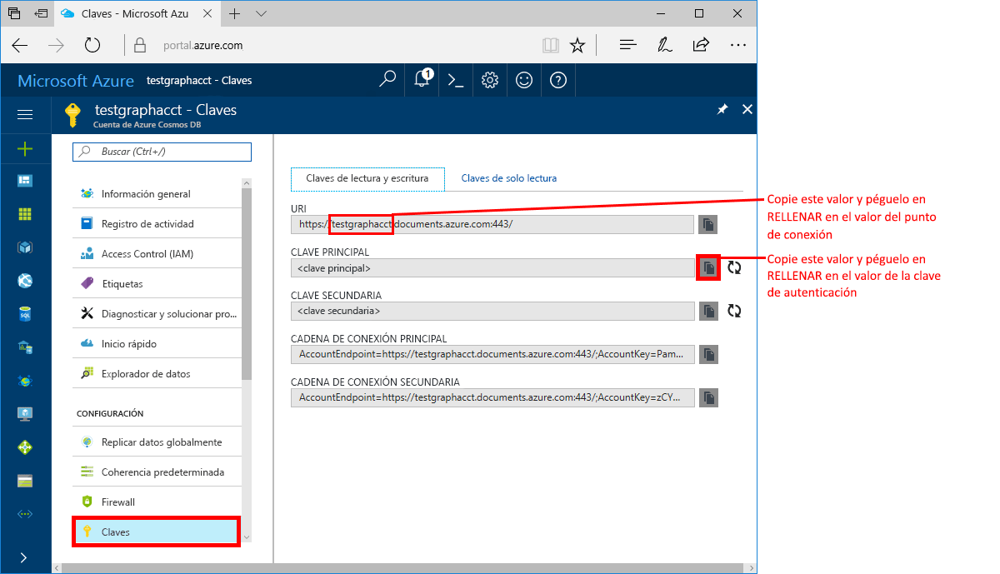

# <a name="azure-cosmos-db-build-a-net-framework-or-core-application-using-the-graph-api"></a>Azure Cosmos DB: compilación de una aplicación .NET Framework o Core mediante la API Graph

Azure Cosmos DB es un servicio de base de datos con varios modelos y de distribución global de Microsoft. Puede crear rápidamente bases de datos de documentos, clave-valor y grafos, y realizar consultas en ellas. Todas las bases de datos se beneficiarán de las funcionalidades de distribución global y escala horizontal en Azure Cosmos DB. 

En esta guía de inicio rápido se muestra cómo crear una cuenta, una base de datos y un grafo (contenedor) de Azure Cosmos DB mediante Azure Portal. Después, compilará y ejecutará una aplicación de consola compilada en [API Graph](graph-sdk-dotnet.md).  

## <a name="prerequisites"></a>requisitos previos

Si aún no tiene Visual Studio de 2017 instalado, puede descargar y usar la versión **gratis** de [Visual Studio 2017 Community Edition](https://www.visualstudio.com/downloads/). Asegúrese de que habilita **Desarrollo de Azure** durante la instalación de Visual Studio.

Si ya tiene instalado Visual Studio 2017, asegúrese de tener aplicado [Visual Studio 2017 Update 3](https://www.visualstudio.com/en-us/news/releasenotes/vs2017-relnotes).

[!INCLUDE [quickstarts-free-trial-note](../../includes/quickstarts-free-trial-note.md)]

## <a name="create-a-database-account"></a>Creación de una cuenta de base de datos

[!INCLUDE [cosmos-db-create-dbaccount-graph](../../includes/cosmos-db-create-dbaccount-graph.md)]

## <a name="add-a-graph"></a>Agregar un grafo

[!INCLUDE [cosmos-db-create-graph](../../includes/cosmos-db-create-graph.md)]

## <a name="clone-the-sample-application"></a>Clonación de la aplicación de ejemplo

Ahora vamos a clonar una aplicación de API Graph desde GitHub, establecer la cadena de conexión y ejecutarla. Verá lo fácil que es trabajar con datos mediante programación. 

Este proyecto de ejemplo usa el formato de proyecto de .NET Core y se ha configurado para usar los siguientes marcos:
 - netcoreapp2.0
 - net461

1. Abra una ventana de terminal de Git, como Git Bash, y `cd` en un directorio de trabajo.  

2. Ejecute el comando siguiente para clonar el repositorio de ejemplo. 

    ```bash
    git clone https://github.com/Azure-Samples/azure-cosmos-db-graph-dotnet-getting-started.git
    ```

3. A continuación, abra Visual Studio y el archivo de solución. 

## <a name="review-the-code"></a>Revisión del código

Vamos a revisar rápidamente lo que sucede en la aplicación. Abra el archivo Program.cs y observe que estas líneas de código crean los recursos de Azure Cosmos DB. 

* Se inicializa DocumentClient. 

    ```csharp
    using (DocumentClient client = new DocumentClient(
        new Uri(endpoint),
        authKey,
        new ConnectionPolicy { ConnectionMode = ConnectionMode.Direct, ConnectionProtocol = Protocol.Tcp }))
    ```

* Se crea una base de datos.

    ```csharp
    Database database = await client.CreateDatabaseIfNotExistsAsync(new Database { Id = "graphdb" });
    ```

* Se crea un grafo.

    ```csharp
    DocumentCollection graph = await client.CreateDocumentCollectionIfNotExistsAsync(
        UriFactory.CreateDatabaseUri("graphdb"),
        new DocumentCollection { Id = "graph" },
        new RequestOptions { OfferThroughput = 1000 });
    ```
* Se ejecuta una serie de pasos de Gremlin mediante el método `CreateGremlinQuery`.

    ```csharp
    // The CreateGremlinQuery method extensions allow you to execute Gremlin queries and iterate
    // results asychronously
    IDocumentQuery<dynamic> query = client.CreateGremlinQuery<dynamic>(graph, "g.V().count()");
    while (query.HasMoreResults)
    {
        foreach (dynamic result in await query.ExecuteNextAsync())
        {
            Console.WriteLine($"\t {JsonConvert.SerializeObject(result)}");
        }
    }

    ```

## <a name="update-your-connection-string"></a>Actualización de la cadena de conexión

Ahora vuelva a Azure Portal para obtener la información de la cadena de conexión y cópiela en la aplicación.

1. En [Azure Portal](http://portal.azure.com/), haga clic en **Claves**. 

    Copie la primera parte del valor URI.

    

2. En Visual Studio 2017, abra el archivo appsettings.json y pegue el valor encima de `FILLME` en `endpoint`. 

    `"endpoint": "https://FILLME.documents.azure.com:443/",`

    El valor del punto de conexión debe tener el siguiente aspecto:

    `"endpoint": "https://testgraphacct.documents.azure.com:443/",`

3. Copie el valor de **CLAVE PRINCIPAL** del portal y conviértalo en el valor de la clave AuthKey en App.config. A continuación, guarde los cambios. 

    `"authkey": "FILLME"`

4. Guarde el archivo appsettings.json. 

Ya ha actualizado la aplicación con toda la información que necesita para comunicarse con Azure Cosmos DB. 

## <a name="run-the-console-app"></a>Ejecutar la aplicación de consola

Antes de ejecutar la aplicación, se recomienda que actualice el paquete *Microsoft.Azure.Graphs* a la versión más reciente.

1. En Visual Studio, haga clic con el botón derecho en el proyecto **GraphGetStarted** en el **Explorador de soluciones** y, después, haga clic en **Administrar paquetes NuGet**. 

2. En la pestaña **Actualizaciones** del Administrador de paquetes NuGet, escriba *Microsoft.Azure.Graphs* y active la casilla **Includes prerelease** (Incluye versión preliminar). 

3. En los resultados, actualice la biblioteca **Microsoft.Azure.Graphs** a la versión más reciente del paquete. De este modo se instala el paquete de la biblioteca de extensión de grafos de Azure Cosmos DB y todas las dependencias.

    Si recibe un mensaje sobre cómo revisar los cambios en la solución, haga clic en **Aceptar**. Si recibe un mensaje acerca de la aceptación de licencia, haga clic en **Acepto**.

4. Haga clic en CTRL + F5 para ejecutar la aplicación.

   En la ventana de la consola se muestran los vértices y los bordes que se agregan al grafo. Cuando se complete el script, presione ENTRAR dos veces para cerrar la ventana de la consola.

## <a name="browse-using-the-data-explorer"></a>Examinar mediante el Explorador de datos

Ahora puede volver al Explorador de datos en Azure Portal para examinar y consultar los datos del nuevo grafo.

1. En el Explorador de datos, la nueva base de datos aparece en el panel Grafos. Expanda **graphdb**, **graphcollz** y, después, haga clic en **Grafo**.

2. Haga clic en el botón **Aplicar filtro** para usar la consulta predeterminada para ver todos los vértices del grafo. Los datos generados por la aplicación de ejemplo se muestran en el panel grafos.

    Puede acercar o alejar el grafo, expandir el espacio de visualización del grafo, agregar vértices adicionales y mover los vértices sobre la superficie de visualización.

    

## <a name="review-slas-in-the-azure-portal"></a>Revisión de los SLA en Azure Portal

[!INCLUDE [cosmosdb-tutorial-review-slas](../../includes/cosmos-db-tutorial-review-slas.md)]

## <a name="clean-up-resources"></a>Limpieza de recursos

Si no va a seguir usando esta aplicación, siga estos pasos para eliminar todos los recursos creados en esta guía de inicio rápido en Azure Portal: 

1. En el menú de la izquierda de Azure Portal, haga clic en **Grupos de recursos** y en el nombre del recurso que creó. 
2. En la página del grupo de recursos, haga clic en **Eliminar**, escriba en el cuadro de texto el nombre del recurso que quiere eliminar y haga clic en **Eliminar**.

## <a name="next-steps"></a>pasos siguientes

En esta guía de inicio rápido, ha obtenido información sobre cómo crear una cuenta de Azure Cosmos DB, crear un grafo mediante el Explorador de datos y ejecutar una aplicación. Ahora puede crear consultas más complejas e implementar con Gremlin una lógica eficaz de recorrido del grafo. 

> [!div class="nextstepaction"]
> [Consulta mediante Gremlin](tutorial-query-graph.md)

