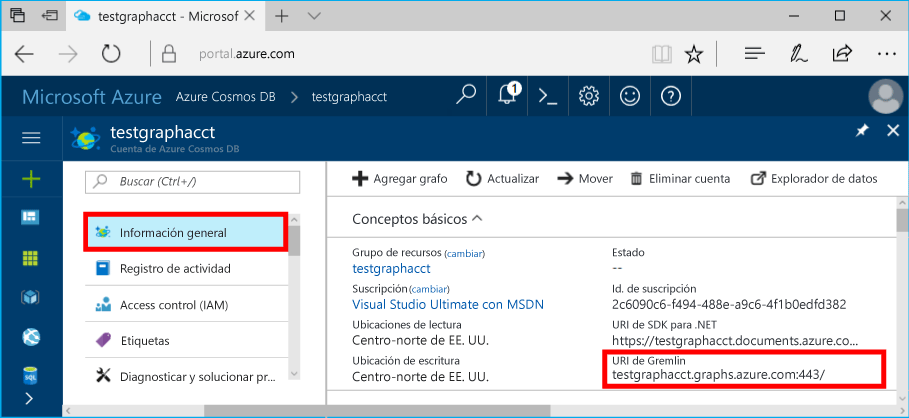

# <a name="azure-cosmos-db-create-query-and-traverse-a-graph-in-the-gremlin-console"></a>Azure Cosmos DB: crear, consultar y recorrer un grafo en la consola de Gremlin

Azure Cosmos DB es un servicio de base de datos con varios modelos y de distribución global de Microsoft. Puede crear rápidamente bases de datos de documentos, clave-valor y grafos, y realizar consultas en ellas. Todas las bases de datos se beneficiarán de las funcionalidades de distribución global y escala horizontal en Azure Cosmos DB. 

En esta guía de inicio rápido se muestra cómo crear una cuenta, una base de datos y un grafo (contenedor) de Azure Cosmos DB mediante Azure Portal y, después, cómo usar la [consola de Gremlin](https://tinkerpop.apache.org/docs/current/reference/#gremlin-console) de [Apache TinkerPop](http://tinkerpop.apache.org) para trabajar con los datos de la API Graph. En este tutorial, creará y consultará vértices y bordes, actualizará una propiedad de vértice, consultará vértices, recorrerá el grafo y quitará un vértice.


La consola de Gremlin se basa en Groovy/Java y se ejecuta en Linux, Mac y Windows. Puede descargarla desde el [sitio de Apache TinkerPop](http://tinkerpop.apache.org/downloads.html).

## <a name="prerequisites"></a>requisitos previos

Necesita tener una suscripción de Azure para crear una cuenta de Azure Cosmos DB para este inicio rápido.

[!INCLUDE [quickstarts-free-trial-note](../../includes/quickstarts-free-trial-note.md)]

También necesita instalar la [consola de Gremlin](http://tinkerpop.apache.org/). Use la versión 3.2.5 o posterior.

## <a name="create-a-database-account"></a>Creación de una cuenta de base de datos

[!INCLUDE [cosmos-db-create-dbaccount-graph](../../includes/cosmos-db-create-dbaccount-graph.md)]

## <a name="add-a-graph"></a>Agregar un grafo

[!INCLUDE [cosmos-db-create-graph](../../includes/cosmos-db-create-graph.md)]

## <a id="ConnectAppService"></a>Conectarse a su App Service
1. Antes de iniciar la consola de Gremlin, cree o modifique el archivo de configuración remote-secure.yaml en el directorio `apache-tinkerpop-gremlin-console-3.2.5/conf`.
2. Rellene sus configuraciones *host*, *puerto*, *nombre de usuario*, *contraseña*, *connectionPool* y *serializador*:

    Configuración|Valor sugerido|DESCRIPCIÓN
    ---|---|---
    hosts|[***. gremlin.cosmosdb.azure.com] o [***. graphs.azure.com] para las cuentas creadas antes del 20 de diciembre de 2017|Ver la captura de pantalla siguiente. Este es el valor del Identificador URI de Gremlin en la página Información general de Azure Portal, entre corchetes, sin la terminación :443/.<br><br>Este valor también se puede obtener desde la pestaña Claves; para ello, use el valor del identificador URI mediante la supresión de https://, el cambio de los documentos a grafos o gremlin.cosmosdb y la eliminación de la terminación :443/.
    puerto|443|Se establece en 443.
    Nombre de usuario|*Su nombre de usuario*|El recurso con la forma `/dbs/<db>/colls/<coll>` donde `<db>` es el nombre de la base de datos y `<coll>` es el nombre de la colección.
    contraseña|*La clave principal*| Ver la segunda captura de pantalla más adelante. Es la clave principal, que puede obtener en la página Claves de Azure Portal, en el cuadro de texto Clave principal. Use el botón Copiar a la izquierda del cuadro de texto para copiar el valor.
    connectionPool|{enableSsl: true}|La configuración del grupo de conexiones para SSL.
    serializer|{ className:org.apache.tinkerpop.gremlin.<br>driver.ser.GraphSONMessageSerializerV1d0,<br> config: { serializeResultToString: true }}|Establecer en este valor y eliminar los saltos de línea `\n` cuando se pegue el valor.

    Para obtener el valor de hosts, copie el valor del **Identificador URI de Gremlin** de la página **Información general**: 

    Para obtener el valor de la contraseña, copie la **Clave principal** en la página **Claves**: 

El archivo remote-secure.yaml debe tener este aspecto:

```
hosts: [your_database_server.gremlin.cosmosdb.azure.com]
port: 443
username: /dbs/your_database_account/colls/your_collection
password: your_primary_key
connectionPool: {
  enableSsl: true
}
serializer: { className: org.apache.tinkerpop.gremlin.driver.ser.GraphSONMessageSerializerV1d0, config: { serializeResultToString: true }}
```

3. En el terminal, ejecute `bin/gremlin.bat` o `bin/gremlin.sh` para iniciar la [Consola de Gremlin](http://tinkerpop.apache.org/docs/3.2.5/tutorials/getting-started/).
4. En el terminal, ejecute `:remote connect tinkerpop.server conf/remote-secure.yaml` para conectarse a App Service.

    > [!TIP]
    > Si recibe el error `No appenders could be found for logger` asegúrese de que ha actualizado el valor de serializador en el archivo remote-secure.yaml tal como se describe en el paso 2. 

Estupendo. Ahora que hemos terminado la configuración, comencemos a ejecutar algunos comandos de la consola.

Probemos un comando count() sencillo. En el símbolo del sistema de la consola, escriba lo siguiente:
```
:> g.V().count()
```

> [!TIP]
> ¿Ve los caracteres `:>` que preceden al texto `g.V().count()`? 
>
> Forma parte del comando que debe escribir. Es importante si se usa la consola de Gremlin con Azure Cosmos DB.  
>
> Si omite este prefijo `:>`, le indica a la consola que ejecute el comando localmente, a menudo con un grafo en memoria.
> Mediante este prefijo `:>` le indica a la consola que ejecute un comando remoto, en este caso, con Cosmos DB (ya sea el emulador local o una instancia de Azure).


## <a name="create-vertices-and-edges"></a>Crear vértices y bordes

Comencemos agregando cinco vértices de personas para *Thomas*, *Mary Kay*, *Robin*, *Ben* y *Jack*.

Entrada (Thomas):

```
:> g.addV('person').property('firstName', 'Thomas').property('lastName', 'Andersen').property('age', 44).property('userid', 1)
```

Salida:

```
==>[id:796cdccc-2acd-4e58-a324-91d6f6f5ed6d,label:person,type:vertex,properties:[firstName:[[id:f02a749f-b67c-4016-850e-910242d68953,value:Thomas]],lastName:[[id:f5fa3126-8818-4fda-88b0-9bb55145ce5c,value:Andersen]],age:[[id:f6390f9c-e563-433e-acbf-25627628016e,value:44]],userid:[[id:796cdccc-2acd-4e58-a324-91d6f6f5ed6d|userid,value:1]]]]
```
Entrada (Mary Kay):

```
:> g.addV('person').property('firstName', 'Mary Kay').property('lastName', 'Andersen').property('age', 39).property('userid', 2)

```

Salida:

```
==>[id:0ac9be25-a476-4a30-8da8-e79f0119ea5e,label:person,type:vertex,properties:[firstName:[[id:ea0604f8-14ee-4513-a48a-1734a1f28dc0,value:Mary Kay]],lastName:[[id:86d3bba5-fd60-4856-9396-c195ef7d7f4b,value:Andersen]],age:[[id:bc81b78d-30c4-4e03-8f40-50f72eb5f6da,value:39]],userid:[[id:0ac9be25-a476-4a30-8da8-e79f0119ea5e|userid,value:2]]]]

```

Entrada (Robin):

```
:> g.addV('person').property('firstName', 'Robin').property('lastName', 'Wakefield').property('userid', 3)
```

Salida:

```
==>[id:8dc14d6a-8683-4a54-8d74-7eef1fb43a3e,label:person,type:vertex,properties:[firstName:[[id:ec65f078-7a43-4cbe-bc06-e50f2640dc4e,value:Robin]],lastName:[[id:a3937d07-0e88-45d3-a442-26fcdfb042ce,value:Wakefield]],userid:[[id:8dc14d6a-8683-4a54-8d74-7eef1fb43a3e|userid,value:3]]]]
```

Entrada (Ben):

```
:> g.addV('person').property('firstName', 'Ben').property('lastName', 'Miller').property('userid', 4)

```

Salida:

```
==>[id:ee86b670-4d24-4966-9a39-30529284b66f,label:person,type:vertex,properties:[firstName:[[id:a632469b-30fc-4157-840c-b80260871e9a,value:Ben]],lastName:[[id:4a08d307-0719-47c6-84ae-1b0b06630928,value:Miller]],userid:[[id:ee86b670-4d24-4966-9a39-30529284b66f|userid,value:4]]]]
```

Entrada (Jack):

```
:> g.addV('person').property('firstName', 'Jack').property('lastName', 'Connor').property('userid', 5)
```

Salida:

```
==>[id:4c835f2a-ea5b-43bb-9b6b-215488ad8469,label:person,type:vertex,properties:[firstName:[[id:4250824e-4b72-417f-af98-8034aa15559f,value:Jack]],lastName:[[id:44c1d5e1-a831-480a-bf94-5167d133549e,value:Connor]],userid:[[id:4c835f2a-ea5b-43bb-9b6b-215488ad8469|userid,value:5]]]]
```


Después, vamos a agregar bordes a las relaciones entre estas personas.

Entrada (Thomas -> Mary Kay):

```
:> g.V().hasLabel('person').has('firstName', 'Thomas').addE('knows').to(g.V().hasLabel('person').has('firstName', 'Mary Kay'))
```

Salida:

```
==>[id:c12bf9fb-96a1-4cb7-a3f8-431e196e702f,label:knows,type:edge,inVLabel:person,outVLabel:person,inV:0d1fa428-780c-49a5-bd3a-a68d96391d5c,outV:1ce821c6-aa3d-4170-a0b7-d14d2a4d18c3]
```

Entrada (Thomas -> Robin):

```
:> g.V().hasLabel('person').has('firstName', 'Thomas').addE('knows').to(g.V().hasLabel('person').has('firstName', 'Robin'))
```

Salida:

```
==>[id:58319bdd-1d3e-4f17-a106-0ddf18719d15,label:knows,type:edge,inVLabel:person,outVLabel:person,inV:3e324073-ccfc-4ae1-8675-d450858ca116,outV:1ce821c6-aa3d-4170-a0b7-d14d2a4d18c3]
```

Entrada (Robin -> Ben):

```
:> g.V().hasLabel('person').has('firstName', 'Robin').addE('knows').to(g.V().hasLabel('person').has('firstName', 'Ben'))
```

Salida:

```
==>[id:889c4d3c-549e-4d35-bc21-a3d1bfa11e00,label:knows,type:edge,inVLabel:person,outVLabel:person,inV:40fd641d-546e-412a-abcc-58fe53891aab,outV:3e324073-ccfc-4ae1-8675-d450858ca116]
```

## <a name="update-a-vertex"></a>Actualizar un vértice

Vamos a actualizar el vértice *Thomas* con una nueva edad de *45*.

Entrada:
```
:> g.V().hasLabel('person').has('firstName', 'Thomas').property('age', 45)
```
Salida:

```
==>[id:ae36f938-210e-445a-92df-519f2b64c8ec,label:person,type:vertex,properties:[firstName:[[id:872090b6-6a77-456a-9a55-a59141d4ebc2,value:Thomas]],lastName:[[id:7ee7a39a-a414-4127-89b4-870bc4ef99f3,value:Andersen]],age:[[id:a2a75d5a-ae70-4095-806d-a35abcbfe71d,value:45]]]]
```

## <a name="query-your-graph"></a>Consultar el grafo

Ahora, vamos a ejecutar una variedad de consultas en su grafo.

Primero, vamos a probar una consulta con un filtro para devolver solo las personas mayores de 40 años.

Entrada (consulta de filtro):

```
:> g.V().hasLabel('person').has('age', gt(40))
```

Salida:

```
==>[id:ae36f938-210e-445a-92df-519f2b64c8ec,label:person,type:vertex,properties:[firstName:[[id:872090b6-6a77-456a-9a55-a59141d4ebc2,value:Thomas]],lastName:[[id:7ee7a39a-a414-4127-89b4-870bc4ef99f3,value:Andersen]],age:[[id:a2a75d5a-ae70-4095-806d-a35abcbfe71d,value:45]]]]
```

Después, vamos a proyectar el nombre de las personas que sean mayores de 40 años.

Entrada (filtro + consulta de proyección):

```
:> g.V().hasLabel('person').has('age', gt(40)).values('firstName')
```

Salida:

```
==>Thomas
```

## <a name="traverse-your-graph"></a>Recorrer el grafo

Vamos a recorrer el grafo para devolver todos los amigos de Thomas.

Entrada (amigos de Thomas):

```
:> g.V().hasLabel('person').has('firstName', 'Thomas').outE('knows').inV().hasLabel('person')
```

Salida: 

```
==>[id:f04bc00b-cb56-46c4-a3bb-a5870c42f7ff,label:person,type:vertex,properties:[firstName:[[id:14feedec-b070-444e-b544-62be15c7167c,value:Mary Kay]],lastName:[[id:107ab421-7208-45d4-b969-bbc54481992a,value:Andersen]],age:[[id:4b08d6e4-58f5-45df-8e69-6b790b692e0a,value:39]]]]
==>[id:91605c63-4988-4b60-9a30-5144719ae326,label:person,type:vertex,properties:[firstName:[[id:f760e0e6-652a-481a-92b0-1767d9bf372e,value:Robin]],lastName:[[id:352a4caa-bad6-47e3-a7dc-90ff342cf870,value:Wakefield]]]]
```

Ahora, vamos a obtener la siguiente capa de vértices. Recorra el grafo para devolver todos los amigos de los amigos de Thomas.

Entrada (amigos de los amigos de Thomas):

```
:> g.V().hasLabel('person').has('firstName', 'Thomas').outE('knows').inV().hasLabel('person').outE('knows').inV().hasLabel('person')
```
Salida:

```
==>[id:a801a0cb-ee85-44ee-a502-271685ef212e,label:person,type:vertex,properties:[firstName:[[id:b9489902-d29a-4673-8c09-c2b3fe7f8b94,value:Ben]],lastName:[[id:e084f933-9a4b-4dbc-8273-f0171265cf1d,value:Miller]]]]
```

## <a name="drop-a-vertex"></a>Quitar un vértice

Vamos a eliminar un vértice de la base de datos del grafo.

Entrada (quitar vértice de Jack):

```
:> g.V().hasLabel('person').has('firstName', 'Jack').drop()
```

## <a name="clear-your-graph"></a>Borrar el grafo

Por último, vamos a borrar todos los vértices y bordes de la base de datos.

Entrada:

```
:> g.E().drop()
:> g.V().drop()
```

Felicidades. Ha finalizado este tutorial de API Graph de Azure Cosmos DB.

## <a name="review-slas-in-the-azure-portal"></a>Revisión de los SLA en Azure Portal

[!INCLUDE [cosmosdb-tutorial-review-slas](../../includes/cosmos-db-tutorial-review-slas.md)]

## <a name="clean-up-resources"></a>Limpieza de recursos

Si no va a seguir usando esta aplicación, siga estos pasos para eliminar todos los recursos creados en esta guía de inicio rápido en Azure Portal:  

1. En el menú de la izquierda de Azure Portal, haga clic en **Grupos de recursos** y en el nombre del recurso que creó. 
2. En la página del grupo de recursos, haga clic en **Eliminar**, escriba en el cuadro de texto el nombre del recurso que quiere eliminar y haga clic en **Eliminar**.

## <a name="next-steps"></a>pasos siguientes

En este inicio rápido, ha obtenido información sobre cómo crear una cuenta de Azure Cosmos DB, crear un grafo con el Explorador de datos, crear vértices y bordes, y recorrer el grafo con la consola de Gremlin. Ahora puede crear consultas más complejas e implementar con Gremlin una lógica de recorrido del grafo eficaz. 

> [!div class="nextstepaction"]
> [Consulta mediante Gremlin](tutorial-query-graph.md)
