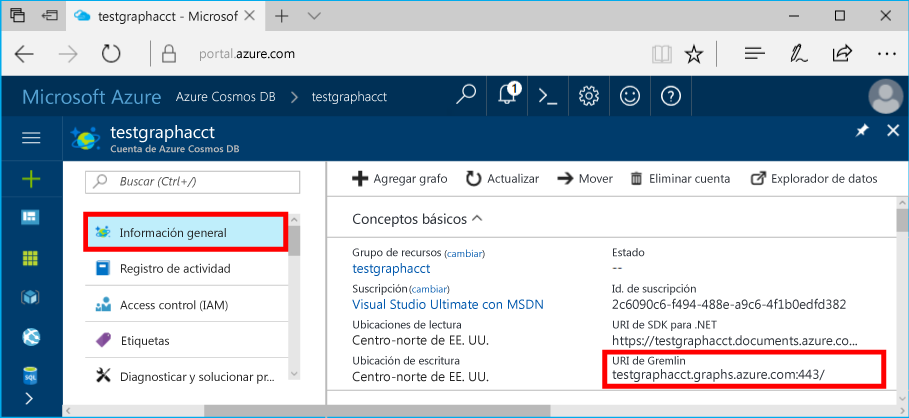

# <a name="azure-cosmos-db-build-a-nodejs-application-by-using-graph-api"></a>Azure Cosmos DB: compilación de una aplicación de Node.js mediante API Graph

Azure Cosmos DB es el servicio de base de datos con varios modelos y de distribución global de Microsoft. Puede crear rápidamente bases de datos de documentos, clave-valor y grafos, y realizar consultas en ellas. Todas las bases de datos se beneficiarán de las funcionalidades de distribución global y escala horizontal en Azure Cosmos DB. 

En este artículo de inicio rápido se muestra cómo crear un grafo, una base de datos y una cuenta de Azure Cosmos DB para API Graph (versión preliminar) mediante Azure Portal. Después, compilará y ejecutará una aplicación de consola con el controlador [Node.js de Gremlin](https://www.npmjs.com/package/gremlin) de código abierto.

## <a name="prerequisites"></a>Requisitos previos

Antes de ejecutar este ejemplo, debe cumplir los siguientes requisitos previos:
* [Node.js](https://nodejs.org/en/) versión v0.10.29 o posterior
* [Git](http://git-scm.com/)

[!INCLUDE [quickstarts-free-trial-note](../../includes/quickstarts-free-trial-note.md)]

## <a name="create-a-database-account"></a>Creación de una cuenta de base de datos

[!INCLUDE [cosmos-db-create-dbaccount-graph](../../includes/cosmos-db-create-dbaccount-graph.md)]

## <a name="add-a-graph"></a>Agregar un grafo

[!INCLUDE [cosmos-db-create-graph](../../includes/cosmos-db-create-graph.md)]

## <a name="clone-the-sample-application"></a>Clonación de la aplicación de ejemplo

Ahora, vamos a clonar una aplicación de API Graph desde GitHub, establecer la cadena de conexión y ejecutarla. Verá lo fácil que es trabajar con datos mediante programación. 

1. Abra una ventana de terminal de Git, como Git Bash, y cambie a un directorio de trabajo (mediante el comando `cd`).

2. Ejecute el comando siguiente para clonar el repositorio de ejemplo: 

    ```bash
    git clone https://github.com/Azure-Samples/azure-cosmos-db-graph-nodejs-getting-started.git
    ```

3. Abra el archivo de solución en Visual Studio. 

## <a name="review-the-code"></a>Revisar el código

Vamos a revisar rápidamente lo que sucede en la aplicación. Abra el archivo `app.js` y verá las líneas de código siguientes. 

* Se crea el cliente Gremlin.

    ```nodejs
    const client = Gremlin.createClient(
        443, 
        config.endpoint, 
        { 
            "session": false, 
            "ssl": true, 
            "user": `/dbs/${config.database}/colls/${config.collection}`,
            "password": config.primaryKey
        });
    ```

  Las configuraciones están todas en `config.js`, que podemos editar en la sección siguiente.

* Se ejecuta una serie de pasos de Gremlin con el método `client.execute`.

    ```nodejs
    console.log('Running Count'); 
    client.execute("g.V().count()", { }, (err, results) => {
        if (err) return console.error(err);
        console.log(JSON.stringify(results));
        console.log();
    });
    ```

## <a name="update-your-connection-string"></a>Actualización de la cadena de conexión

1. Abra el archivo config.js. 

2. En config.js, rellene la clave config.endpoint con el valor del **Identificador URI de Gremlin** de la página **Información general** de Azure Portal. 

    `config.endpoint = "GRAPHENDPOINT";`

    

   Si el valor del **Identificador URI de Gremlin** está en blanco, puede generar el valor en la página **Claves** del portal. Use el valor del **Identificador URI**, quite https:// y modifique los documentos en grafos.

   El punto de conexión de Gremlin debe ser solo el nombre de host sin el número de puerto y protocolo, como `mygraphdb.graphs.azure.com` (no como `https://mygraphdb.graphs.azure.com` ni `mygraphdb.graphs.azure.com:433`).

3. En config.js, rellene el valor de config.primaryKey con el valor de la **Clave principal** de la página **Claves** de Azure Portal. 

    `config.primaryKey = "PRIMARYKEY";`

   

4. Escriba el nombre de la base de datos y el nombre del grafo (contenedor) para el valor de config.database y config.collection. 

Este es un ejemplo del aspecto que debería tener el archivo config.js completado:

```nodejs
var config = {}

// Note that this must not have HTTPS or the port number
config.endpoint = "testgraphacct.graphs.azure.com";
config.primaryKey = "Pams6e7LEUS7LJ2Qk0fjZf3eGo65JdMWHmyn65i52w8ozPX2oxY3iP0yu05t9v1WymAHNcMwPIqNAEv3XDFsEg==";
config.database = "graphdb"
config.collection = "Persons"

module.exports = config;
```

## <a name="run-the-console-app"></a>Ejecutar la aplicación de consola

1. Abra una ventana del terminal y, con el comando `cd`, cambie al directorio de instalación del archivo package.json incluido en el proyecto.

2. Ejecute `npm install` para instalar los módulos npm necesarios, incluido `gremlin`.

3. Ejecute `node app.js` en un terminal para iniciar la aplicación de nodo.

## <a name="browse-with-data-explorer"></a>Examinar con el Explorador de datos

Ahora puede volver al Explorador de datos en Azure Portal para examinar, consultar, modificar y trabajar con los datos del nuevo grafo.

En el Explorador de datos, la nueva base de datos aparece en el panel **Grafos**. Expanda la base de datos, luego la colección y, finalmente, seleccione **Grafo**.

Los datos generados por la aplicación de ejemplo se muestran en el panel siguiente dentro de la pestaña **Grafo** al seleccionar **Aplicar filtro**.

Intente completar `g.V()` con `.has('firstName', 'Thomas')` para probar el filtro. Tenga en cuenta que el valor distingue mayúsculas de minúsculas.

## <a name="review-slas-in-the-azure-portal"></a>Revisar los SLA en Azure Portal

[!INCLUDE [cosmosdb-tutorial-review-slas](../../includes/cosmos-db-tutorial-review-slas.md)]

## <a name="clean-up-your-resources"></a>Limpiar los recursos

Si no piensa seguir usando la aplicación, haga lo siguiente para eliminar todos los recursos que ha creado en este artículo: 

1. En Azure Portal, en el menú de navegación izquierdo, seleccione **Grupos de recursos**. A continuación, seleccione el nombre del recurso que ha creado. 

2. En la página del grupo de recursos, seleccione **Eliminar**. Escriba el nombre del recurso que se va a eliminar y, después, seleccione **Eliminar**.

## <a name="next-steps"></a>Pasos siguientes

En este artículo, ha aprendido crear una cuenta de Azure Cosmos DB, crear un grafo mediante el Explorador de datos y ejecutar una aplicación. Ahora puede usar Gremlin para implementar una lógica de recorrido del grafo eficaz y crear consultas más complejas. 

> [!div class="nextstepaction"]
> [Consulta mediante Gremlin](tutorial-query-graph.md)
