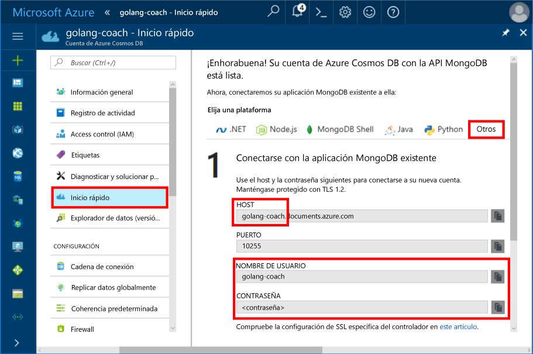
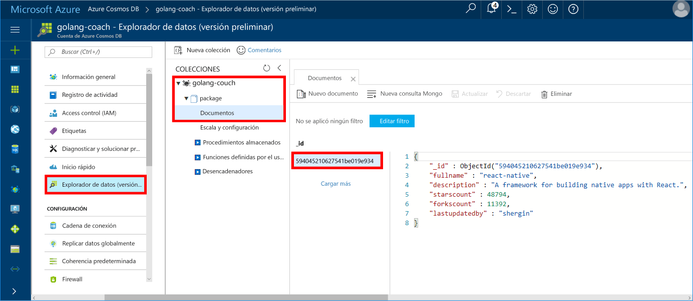

# <a name="azure-cosmos-db-build-a-mongodb-api-console-app-with-golang-and-the-azure-portal"></a>Azure Cosmos DB: Compilar una aplicación de consola de la API MongoDB con Golang y Azure Portal

Azure Cosmos DB es un servicio de base de datos con varios modelos y de distribución global de Microsoft. Puede crear rápidamente bases de datos de documentos, clave-valor y grafos y realizar consultas en ellas. Todas las bases de datos se beneficiarán de las funcionalidades de distribución global y escala horizontal en Azure Cosmos DB.

En esta guía de inicio rápido se muestra cómo se usa una aplicación existente [MongoDB](https://docs.microsoft.com/azure/cosmos-db/mongodb-introduction) escrita en [Golang](https://golang.org/) y cómo se conecta a la base de datos de Azure Cosmos DB, que es compatible con conexiones de cliente de MongoDB.

En otras palabras, la aplicación Golang solo sabe que se está conectando a una base de datos mediante API de MongoDB. Para la aplicación resulta transparente que los datos se almacenan en Azure Cosmos DB.

## <a name="prerequisites"></a>Requisitos previos

- Una suscripción de Azure. Si no tiene una suscripción a Azure, cree una [cuenta gratuita](https://azure.microsoft.com/free) antes de empezar. 

  [!INCLUDE [cosmos-db-emulator-mongodb](../../includes/cosmos-db-emulator-mongodb.md)]

- [Go](https://golang.org/dl/) y conocimientos básicos sobre el lenguaje [Go](https://golang.org/).
- Un IDE: [Gogland](https://www.jetbrains.com/go/) de Jetbrains, [Visual Studio Code](https://code.visualstudio.com/) de Microsoft o [Atom](https://atom.io/). En este tutorial, utilizo Goglang.

<a id="create-account"></a>
## <a name="create-a-database-account"></a>Creación de una cuenta de base de datos

[!INCLUDE [cosmos-db-create-dbaccount](../../includes/cosmos-db-create-dbaccount-mongodb.md)]

## <a name="clone-the-sample-application"></a>Clonación de la aplicación de ejemplo

Clonar la aplicación de ejemplo e instalar los paquetes de requisitos.

1. Crear una carpeta denominada CosmosDBSample dentro de la carpeta GOROOT\src, que se encuentra de forma predeterminada en C:\Go\.
2. Ejecutar el comando siguiente mediante una ventana de terminal de Git, como Git Bash, para clonar el repositorio de ejemplo en la carpeta CosmosDBSample. 

    ```bash
    git clone https://github.com/Azure-Samples/azure-cosmos-db-mongodb-golang-getting-started.git
    ```
3.  Ejecutar el comando siguiente para obtener el paquete mgo. 

    ```
    go get gopkg.in/mgo.v2
    ```

El controlador [mgo](http://labix.org/mgo) (pronunciado *mango*) es un controlador [MongoDB](http://www.mongodb.org/) para el [lenguaje Go](http://golang.org/) que implementa una selección bien probada y enriquecida de características en una API muy sencilla que sigue giros estándar de Go.

<a id="connection-string"></a>

## <a name="update-your-connection-string"></a>Actualización de la cadena de conexión

Ahora vuelva a Azure Portal para obtener la información de la cadena de conexión y cópiela en la aplicación.

1. Haga clic en **Inicio rápido** en el menú de navegación izquierdo y, a continuación, haga clic en **Otros** para ver la información de cadena de conexión necesaria para la aplicación Go.

2. En Goglang, abra el archivo main.go en el directorio GOROOT\CosmosDBSample y actualice las siguientes líneas de código mediante la información de la cadena de conexión desde Azure Portal como se muestra en la siguiente captura de pantalla. 

    El nombre de la base de datos es el prefijo del valor **Host** en el panel de la cadena de conexión de Azure Portal. Para la cuenta que se muestra en la imagen siguiente, el nombre de la base de datos es golang-coach.

    ```go
    Database: "The prefix of the Host value in the Azure portal",
    Username: "The Username in the Azure portal",
    Password: "The Password in the Azure portal",
    ```

    

3. Guarde el archivo main.go.

## <a name="review-the-code"></a>Revisión del código

Vamos a revisar rápidamente lo que sucede en el archivo main.go. 

### <a name="connecting-the-go-app-to-azure-cosmos-db"></a>Conexión de una aplicación Go a Azure Cosmos DB

Azure Cosmos DB admite MongoDB con SSL habilitado. Para conectarse a MongoDB con SSL habilitado, debe definir la función **DialServer** en [mgo.DialInfo](http://gopkg.in/mgo.v2#DialInfo) y utilizar la función [tls.*Dial*](http://golang.org/pkg/crypto/tls#Dial) para realizar la conexión.

El siguiente fragmento de código de Golang conecta la aplicación Go a la API de MongoDB de Azure Cosmos DB. La clase *DialInfo* contiene opciones para establecer una sesión con un clúster de MongoDB.

```go
// DialInfo holds options for establishing a session with a MongoDB cluster.
dialInfo := &mgo.DialInfo{
    Addrs:    []string{"golang-couch.documents.azure.com:10255"}, // Get HOST + PORT
    Timeout:  60 * time.Second,
    Database: "database", // It can be anything
    Username: "username", // Username
    Password: "Azure database connect password from Azure Portal", // PASSWORD
    DialServer: func(addr *mgo.ServerAddr) (net.Conn, error) {
        return tls.Dial("tcp", addr.String(), &tls.Config{})
    },
}

// Create a session which maintains a pool of socket connections
// to our Azure Cosmos DB MongoDB database.
session, err := mgo.DialWithInfo(dialInfo)

if err != nil {
    fmt.Printf("Can't connect to mongo, go error %v\n", err)
    os.Exit(1)
}

defer session.Close()

// SetSafe changes the session safety mode.
// If the safe parameter is nil, the session is put in unsafe mode, 
// and writes become fire-and-forget,
// without error checking. The unsafe mode is faster since operations won't hold on waiting for a confirmation.
// 
session.SetSafe(&mgo.Safe{})
```

El método **mgo. Dial()** se utiliza cuando no hay conexión SSL. Para establecer una conexión SSL, se necesita el método **mgo.DialWithInfo()**.

Para crear el objeto de sesión, se utiliza una instancia del objeto **DialWIthInfo{}**. Cuando se establezca la sesión, puede acceder a la colección mediante el siguiente fragmento de código:

```go
collection := session.DB(“database”).C(“package”)
```

<a id="create-document"></a>

### <a name="create-a-document"></a>Creación de un documento

```go
// Model
type Package struct {
    Id bson.ObjectId  `bson:"_id,omitempty"`
    FullName      string
    Description   string
    StarsCount    int
    ForksCount    int
    LastUpdatedBy string
}

// insert Document in collection
err = collection.Insert(&Package{
    FullName:"react",
    Description:"A framework for building native apps with React.",
    ForksCount: 11392,
    StarsCount:48794,
    LastUpdatedBy:"shergin",

})

if err != nil {
    log.Fatal("Problem inserting data: ", err)
    return
}
```

### <a name="query-or-read-a-document"></a>Realizar consultas o leer un documento

Azure Cosmos DB admite consultas enriquecidas en los documentos JSON que se almacenan en las colecciones. El código de ejemplo siguiente muestra una consulta que se puede ejecutar en los documentos de la colección.

```go
// Get a Document from the collection
result := Package{}
err = collection.Find(bson.M{"fullname": "react"}).One(&result)
if err != nil {
    log.Fatal("Error finding record: ", err)
    return
}

fmt.Println("Description:", result.Description)
```


### <a name="update-a-document"></a>Actualización de un documento

```go
// Update a document
updateQuery := bson.M{"_id": result.Id}
change := bson.M{"$set": bson.M{"fullname": "react-native"}}
err = collection.Update(updateQuery, change)
if err != nil {
    log.Fatal("Error updating record: ", err)
    return
}
```

### <a name="delete-a-document"></a>Eliminar un documento

Azure Cosmos DB admite la eliminación de documentos JSON.

```go
// Delete a document
query := bson.M{"_id": result.Id}
err = collection.Remove(query)
if err != nil {
   log.Fatal("Error deleting record: ", err)
   return
}
```
    
## <a name="run-the-app"></a>Ejecución de la aplicación

1. En Goglang, asegúrese de que su GOPATH (disponible en **Archivo**, **Configuración**, **Go**, **GOPATH**) incluye la ubicación en la que se instaló el gopkg, que es USERPROFILE\go de forma predeterminada. 
2. Convierta en comentario las líneas que eliminan el documento, de la 91 a la 96, para que pueda ver el documento después de ejecutar la aplicación.
3. En Goglang, haga clic en **Ejecutar**y, a continuación, haga clic en **Ejecutar "Build main.go and run"**.

    La aplicación finaliza y muestra la descripción del documento creado en [Crear un documento](#create-document).
    
    ```
    Description: A framework for building native apps with React.
    
    Process finished with exit code 0
    ```

    
    
## <a name="review-your-document-in-data-explorer"></a>Revisar el documento en el Explorador de datos

Vuelva a Azure Portal para ver el documento en el Explorador de datos.

1. Haga clic en **Explorador de datos (vista previa)** en el menú de navegación izquierdo, expanda **golang-coach**, **paquete** y, a continuación, haga clic en **Documentos**. En la pestaña **Documentos**, haga clic en el \_identificador que muestra el documento en el panel derecho. 

    
    
2. Puede trabajar con el documento en línea y hacer clic en **Actualización** para guardarlo. También puede eliminar el documento o crear nuevos documentos o consultas.

## <a name="review-slas-in-the-azure-portal"></a>Revisión de los SLA en Azure Portal

[!INCLUDE [cosmosdb-tutorial-review-slas](../../includes/cosmos-db-tutorial-review-slas.md)]

## <a name="clean-up-resources"></a>Limpieza de recursos

Si no va a seguir usando esta aplicación, siga estos pasos para eliminar todos los recursos creados en esta guía de inicio rápido en Azure Portal:

1. En el menú de la izquierda de Azure Portal, haga clic en **Grupos de recursos** y en el nombre del recurso que creó. 
2. En la página del grupo de recursos, haga clic en **Eliminar**, escriba en el cuadro de texto el nombre del recurso que quiere eliminar y haga clic en **Eliminar**.

## <a name="next-steps"></a>Pasos siguientes

En esta guía de inicio rápido, ha aprendido a crear una cuenta de Azure Cosmos DB y ejecutar una aplicación Golang con la API para MongoDB. Ahora puede importar datos adicionales en la cuenta de Cosmos DB. 

> [!div class="nextstepaction"]
> [Importar datos en Azure Cosmos DB para la API MongoDB](mongodb-migrate.md)
