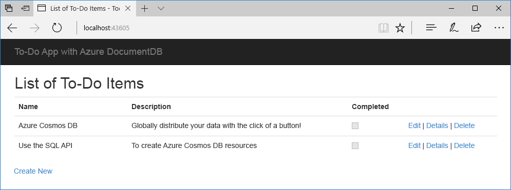

# <a name="quickstart-build-a-net-web-app-with-azure-cosmos-db-using-the-sql-api-and-the-azure-portal"></a>Inicio rápido: Compilación de una aplicación web de .NET con Azure Cosmos DB y la API de SQL en Azure Portal

Azure Cosmos DB es un servicio de base de datos con varios modelos y de distribución global de Microsoft. Puede crear rápidamente bases de datos de documentos, clave-valor y grafos, y realizar consultas en ellas. Todas las bases de datos se beneficiarán de las funcionalidades de distribución global y escala horizontal en Azure Cosmos DB. 

En esta guía de inicio rápido se muestra cómo crear una cuenta de [SQL API](sql-api-introduction.md) de Azure Cosmos DB, una base de datos de documentos y una colección mediante Azure Portal. Después, compilará e implementará una aplicación web de lista de tareas pendientes integrada en [SQL API de .NET](sql-api-sdk-dotnet.md), tal como se muestra en la captura de pantalla siguiente. 



## <a name="prerequisites"></a>requisitos previos

Si aún no tiene Visual Studio de 2017 instalado, puede descargar y usar la versión **gratis** de [Visual Studio 2017 Community Edition](https://www.visualstudio.com/downloads/). Asegúrese de que habilita **Desarrollo de Azure** durante la instalación de Visual Studio.

[!INCLUDE [quickstarts-free-trial-note](../../includes/quickstarts-free-trial-note.md)] 
[!INCLUDE [cosmos-db-emulator-docdb-api](../../includes/cosmos-db-emulator-docdb-api.md)]  

<a id="create-account"></a>
## <a name="create-a-database-account"></a>Creación de una cuenta de base de datos

[!INCLUDE [cosmos-db-create-dbaccount](../../includes/cosmos-db-create-dbaccount.md)]

<a id="create-collection"></a>
## <a name="add-a-collection"></a>Agregar una colección

[!INCLUDE [cosmos-db-create-collection](../../includes/cosmos-db-create-collection.md)]

<a id="add-sample-data"></a>
## <a name="add-sample-data"></a>Adición de datos de ejemplo

[!INCLUDE [cosmos-db-create-sql-api-add-sample-data](../../includes/cosmos-db-create-sql-api-add-sample-data.md)]

## <a name="query-your-data"></a>Consulta de los datos

[!INCLUDE [cosmos-db-create-sql-api-query-data](../../includes/cosmos-db-create-sql-api-query-data.md)]

## <a name="clone-the-sample-application"></a>Clonación de la aplicación de ejemplo

Ahora vamos a empezar a trabajar con el código. Vamos a clonar una aplicación de SQL API desde GitHub, establecer la cadena de conexión y ejecutarla. Verá lo fácil que es trabajar con datos mediante programación. 

1. Abra un símbolo del sistema, cree una carpeta nueva denominada ejemplos de GIT y, después, cierre el símbolo del sistema.

    ```bash
    md "C:\git-samples"
    ```

2. Abra una ventana de terminal de Git, como git bash y utilice el comando `cd` para cambiar a la nueva carpeta para instalar la aplicación de ejemplo.

    ```bash
    cd "C:\git-samples"
    ```

3. Ejecute el comando siguiente para clonar el repositorio de ejemplo. Este comando crea una copia de la aplicación de ejemplo en el equipo.

    ```bash
    git clone https://github.com/Azure-Samples/documentdb-dotnet-todo-app.git
    ```

4. Después, abra el archivo de solución de tareas pendientes en Visual Studio. 

## <a name="review-the-code"></a>Revisión del código

Este paso es opcional. Si está interesado en aprender cómo se crean los recursos de base de datos en el código, puede revisar los siguientes fragmentos de código. En caso contrario, puede ir directamente a [Actualización de la cadena de conexión](#update-your-connection-string). 

Los fragmentos de código siguientes se han tomado del archivo DocumentDBRepository.cs.

* DocumentClient se inicializa en la línea 76.

    ```csharp
    client = new DocumentClient(new Uri(ConfigurationManager.AppSettings["endpoint"]), ConfigurationManager.AppSettings["authKey"]);
    ```

* Se crea una nueva base de datos en la línea 91.

    ```csharp
    await client.CreateDatabaseAsync(new Database { Id = DatabaseId });
    ```

* Se crea una nueva colección en la línea 110.

    ```csharp
    await client.CreateDocumentCollectionAsync(
        UriFactory.CreateDatabaseUri(DatabaseId),
        new DocumentCollection { Id = CollectionId },
        new DocumentCollection
            {
               Id = CollectionId
            },
        new RequestOptions { OfferThroughput = 400 });
    ```

## <a name="update-your-connection-string"></a>Actualización de la cadena de conexión

Ahora vuelva a Azure Portal para obtener la información de la cadena de conexión y cópiela en la aplicación.

1. En [Azure Portal](http://portal.azure.com/), en la cuenta de Azure Cosmos DB, en el panel de navegación izquierdo, haga clic en **Claves** y en **Claves de lectura y escritura**. Deberá usar los botones de copia del lado derecho de la pantalla para copiar el URI y la clave principal en el archivo web.config en el paso siguiente.

    

2. En Visual Studio 2017, abra el archivo web.config. 

3. Copie el valor del URI del portal (con el botón de copia) y conviértalo en el valor de la clave de punto de conexión en web.config. 

    `<add key="endpoint" value="FILLME" />`

4. Después, copie el valor de la clave principal del portal y conviértalo en el valor de la clave de autenticación en web.config. Ya ha actualizado la aplicación con toda la información que necesita para comunicarse con Azure Cosmos DB. 

    `<add key="authKey" value="FILLME" />`
    
## <a name="run-the-web-app"></a>Ejecución de la aplicación web
1. En Visual Studio, haga clic con el botón derecho en el proyecto en el **Explorador de soluciones** y, después, haga clic en **Administrar paquetes NuGet**. 

2. En el cuadro **Examinar** de NuGet, escriba *DocumentDB*.

3. En los resultados, instale la biblioteca **Microsoft.Azure.DocumentDB**. De este modo, se instalan el paquete Microsoft.Azure.DocumentDB y todas las dependencias.

4. Haga clic en CTRL + F5 para ejecutar la aplicación. La aplicación se muestra en el explorador. 

5. Haga clic en **Crear nuevo** en el explorador y cree algunas tareas en la aplicación de tareas pendientes.

   

Ahora puede volver al Explorador de datos y ver, consultar, modificar y trabajar con estos nuevos datos. 

## <a name="review-slas-in-the-azure-portal"></a>Revisión de los SLA en Azure Portal

[!INCLUDE [cosmosdb-tutorial-review-slas](../../includes/cosmos-db-tutorial-review-slas.md)]

## <a name="clean-up-resources"></a>Limpieza de recursos

[!INCLUDE [cosmosdb-delete-resource-group](../../includes/cosmos-db-delete-resource-group.md)]

## <a name="next-steps"></a>Pasos siguientes

En esta guía de inicio rápido, ha aprendido a crear una cuenta de Azure Cosmos DB, crear una colección mediante el Explorador de datos y ejecutar una aplicación web. Ahora puede importar datos adicionales en la cuenta de Cosmos DB. 

> [!div class="nextstepaction"]
> [Importación de datos a Azure Cosmos DB](import-data.md)


