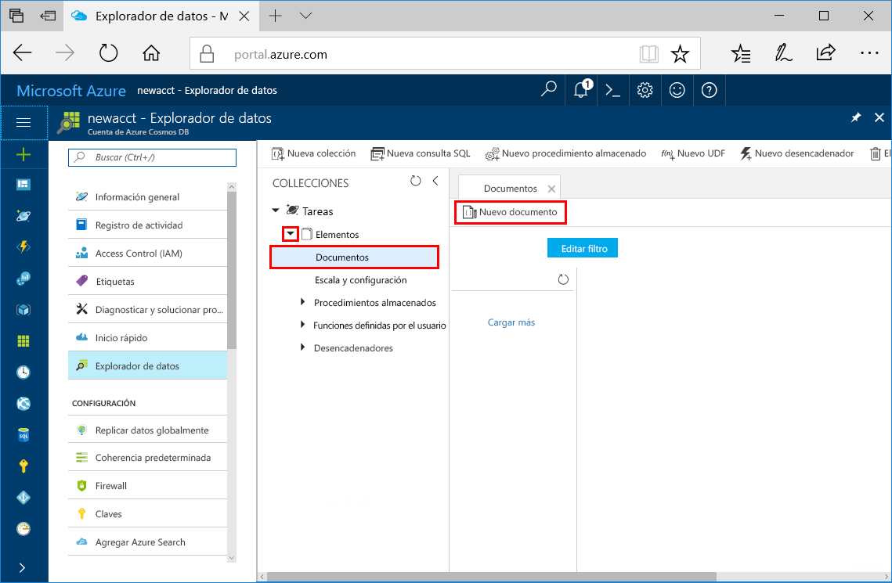
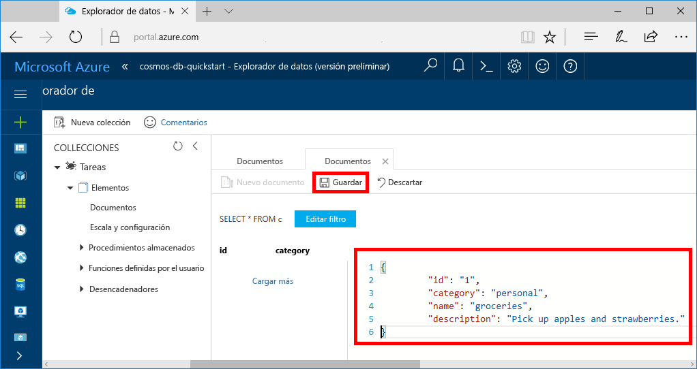
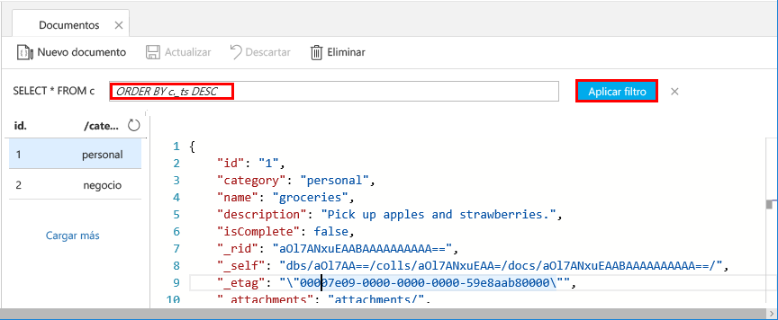
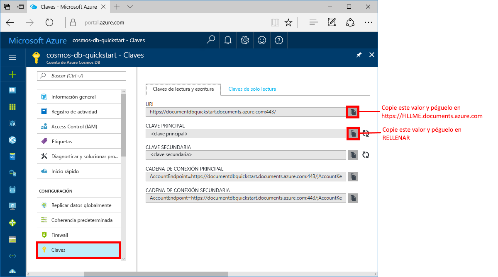

# <a name="azure-cosmos-db-create-a-document-database-using-java-and-the-azure-portal"></a>Azure Cosmos DB: creación una base de datos de documentos mediante Java y Azure Portal

[!INCLUDE [cosmos-db-sql-api](../../includes/cosmos-db-sql-api.md)] 

Azure Cosmos DB es un servicio de base de datos con varios modelos y de distribución global de Microsoft. Utilice Azure Cosmos DB para crear y consultar rápidamente las bases de datos de gráficos, tablas y documentos administradas.

Este tutorial rápido crea una base de datos de documentos mediante las herramientas de Azure Portal para Azure Cosmos DB. En esta guía de inicio rápido también se muestra cómo crear rápidamente una aplicación de consola Java mediante [SQL API de Java](sql-api-sdk-java.md). Las instrucciones que se indican en este tutorial rápido se pueden seguir en cualquier sistema operativo que sea capaz de ejecutar Java. Al completar este tutorial rápido aprenderá a crear y modificar los recursos de base de datos de documentos en la interfaz de usuario o mediante programación, lo que prefiera.

## <a name="prerequisites"></a>requisitos previos

[!INCLUDE [quickstarts-free-trial-note](../../includes/quickstarts-free-trial-note.md)] 
[!INCLUDE [cosmos-db-emulator-docdb-api](../../includes/cosmos-db-emulator-docdb-api.md)]

Además: 

* [Kit de desarrollo de Java (JDK) 1.7+](http://www.oracle.com/technetwork/java/javase/downloads/jdk8-downloads-2133151.html)
    * En Ubuntu, ejecute `apt-get install default-jdk` para instalar el JDK.
    * Asegúrese de establecer la variable de entorno JAVA_HOME para que apunte a la carpeta donde está instalado el JDK.
* [Descargar](http://maven.apache.org/download.cgi) e [instalar](http://maven.apache.org/install.html) un archivo binario de [Maven](http://maven.apache.org/)
    * En Ubuntu, puede ejecutar `apt-get install maven` para instalar Maven.
* [Git](https://www.git-scm.com/)
    * En Ubuntu, puede ejecutar `sudo apt-get install git` para instalar Git.

## <a name="create-a-database-account"></a>Creación de una cuenta de base de datos

Para poder crear una base de datos de documentos, debe crear una cuenta de SQL Database con Azure Cosmos DB.

[!INCLUDE [cosmos-db-create-dbaccount](../../includes/cosmos-db-create-dbaccount.md)]

## <a name="add-a-collection"></a>Incorporación de una colección

[!INCLUDE [cosmos-db-create-collection](../../includes/cosmos-db-create-collection.md)]

<a id="add-sample-data"></a>
## <a name="add-sample-data"></a>Adición de datos de ejemplo

Ahora puede agregar datos a la nueva colección mediante el Explorador de datos.

1. Expanda la colección **Elementos**, haga clic en **Documentos** > **Nuevo documento**.

   
  
2. Ahora agregue un documento a la colección con la estructura siguiente y haga clic en **Guardar**.

     ```json
     {
         "id": "1",
         "category": "personal",
         "name": "groceries",
         "description": "Pick up apples and strawberries.",
         "isComplete": false
     }
     ```

    

3.  Cree y guarde un documento más donde cambiará `id` a 2, y cambie las demás propiedades como corresponda. Los nuevos documentos pueden tener la estructura que quiera, ya que Azure Cosmos DB no impone ningún esquema en los datos.

## <a name="query-your-data"></a>Consulta de los datos

Ahora puede usar consultas en el Explorador de datos para recuperar y filtrar los datos.

1. Vea que de forma predeterminada, la consulta se establece en `SELECT * FROM c`. Esta consulta predeterminada se recupera y muestra todos los documentos en la colección. 

    

2. Cambie la consulta haciendo clic en el botón **Editar filtro** agregando `ORDER BY c._ts DESC` al cuadro de predicado de la consulta y, luego, haciendo clic en **Aplicar filtro**.

    

Esta consulta modificada muestra los documentos en orden descendente según su marca de tiempo, por lo que ahora el segundo documento aparece en primer lugar. Si está familiarizado con la sintaxis SQL, puede especificar cualquiera de las [consultas SQL](sql-api-sql-query.md) admitidas en este cuadro. 

Esto completa nuestro trabajo en el Explorador de datos. Antes de pasar al trabajo con el código, tenga en cuenta que también puede usar el Explorador de datos para crear procedimientos almacenados, UDF y desencadenadores para realizar la lógica de negocios del servidor, así como escalar el rendimiento. El Explorador de datos expone todo el acceso a datos mediante programación integrado que está disponible en las API, pero permite un acceso fácil a los datos de Azure Portal.

## <a name="clone-the-sample-application"></a>Clonación de la aplicación de ejemplo

Ahora vamos a empezar a trabajar con el código. Vamos a clonar una aplicación de SQL API desde GitHub, establecer la cadena de conexión y ejecutarla. Verá lo fácil que es trabajar con datos mediante programación. 

1. Abra un símbolo del sistema, cree una carpeta nueva denominada ejemplos de GIT y, después, cierre el símbolo del sistema.

    ```bash
    md "C:\git-samples"
    ```

2. Abra una ventana de terminal de Git, como git bash y utilice el comando `cd` para cambiar a la nueva carpeta para instalar la aplicación de ejemplo. 

    ```bash
    cd "C:\git-samples"
    ```

3. Ejecute el comando siguiente para clonar el repositorio de ejemplo. Este comando crea una copia de la aplicación de ejemplo en el equipo.

    ```bash
    git clone https://github.com/Azure-Samples/azure-cosmos-db-documentdb-java-getting-started.git
    ```

## <a name="review-the-code"></a>Revisión del código

Este paso es opcional. Si está interesado en aprender cómo se crean los recursos de base de datos en el código, puede revisar los siguientes fragmentos de código. Todos los fragmentos de código se toman del archivo `Program.java` instalado en la carpeta C:\git-samples\azure-cosmos-db-documentdb-java-getting-started\src\GetStarted. En caso contrario, puede ir directamente a [Actualización de la cadena de conexión](#update-your-connection-string). 

* Inicialización de `DocumentClient`. [DocumentClient](https://docs.microsoft.com/java/api/com.microsoft.azure.documentdb._document_client) proporciona representación lógica del cliente para el servicio de base de datos de Azure Cosmos DB. Este cliente se usa para configurar y ejecutar solicitudes en el servicio.

    ```java
    this.client = new DocumentClient("https://FILLME.documents.azure.com",
            "FILLME", 
            new ConnectionPolicy(),
            ConsistencyLevel.Session);
    ```

* Creación de [Database](https://docs.microsoft.com/java/api/com.microsoft.azure.documentdb._database).

    ```java
    Database database = new Database();
    database.setId(databaseName);
    
    this.client.createDatabase(database, null);
    ```

* Creación de [DocumentCollection](https://docs.microsoft.com/java/api/com.microsoft.azure.documentdb._document_collection).

    ```java
    DocumentCollection collectionInfo = new DocumentCollection();
    collectionInfo.setId(collectionName);

    ...

    this.client.createCollection(databaseLink, collectionInfo, requestOptions);
    ```

* Creación de documentos mediante el método [createDocument](https://docs.microsoft.com/java/api/com.microsoft.azure.documentdb._document_client.createdocument).

    ```java
    // Any Java object within your code can be serialized into JSON and written to Azure Cosmos DB
    Family andersenFamily = new Family();
    andersenFamily.setId("Andersen.1");
    andersenFamily.setLastName("Andersen");
    // More properties

    String collectionLink = String.format("/dbs/%s/colls/%s", databaseName, collectionName);
    this.client.createDocument(collectionLink, family, new RequestOptions(), true);
    ```

* Las consultas SQL a través de JSON se realizan con el método [queryDocuments](https://docs.microsoft.com/java/api/com.microsoft.azure.documentdb._document_client.querydocuments).

    ```java
    FeedOptions queryOptions = new FeedOptions();
    queryOptions.setPageSize(-1);
    queryOptions.setEnableCrossPartitionQuery(true);

    String collectionLink = String.format("/dbs/%s/colls/%s", databaseName, collectionName);
    FeedResponse<Document> queryResults = this.client.queryDocuments(
        collectionLink,
        "SELECT * FROM Family WHERE Family.lastName = 'Andersen'", queryOptions);

    System.out.println("Running SQL query...");
    for (Document family : queryResults.getQueryIterable()) {
        System.out.println(String.format("\tRead %s", family));
    }
    ```    

## <a name="update-your-connection-string"></a>Actualización de la cadena de conexión

Ahora vuelva a Azure Portal para obtener la información de la cadena de conexión y cópiela en la aplicación. Esto permite que la aplicación se comunique con la base de datos hospedada.

1. En [Azure Portal](http://portal.azure.com/), haga clic en **Claves**. 

    Utilice los botones de copia en el lado derecho de la pantalla para copiar el valor superior, el URI.

    

2. Abra el archivo `Program.java` desde la carpeta C:\git-samples\azure-cosmos-db-documentdb-java-getting-started\src\GetStarted. 

3. Pegue el valor del URI desde el portal en `https://FILLME.documents.azure.com` en la línea 45.

4. Vuelva al portal y copie el valor de clave principal, como se muestra en la captura de pantalla. Pegue el valor de clave principal desde el porta en `FILLME` en la línea 46.

    El método getStartedDemo debe tener un aspecto similar a este: 
    
    ```java
    private void getStartedDemo() throws DocumentClientException, IOException {
        this.client = new DocumentClient("https://youraccountname.documents.azure.com:443/",
                "your-primary-key...RJhQrqQ5QQ==", 
                new ConnectionPolicy(),
                ConsistencyLevel.Session);
    ```

5. Guarde el archivo Program.java.

## <a name="run-the-app"></a>Ejecución de la aplicación

1. En la ventana del terminal de git, use `cd` para cambiar a la carpeta azure-cosmos-db-documentdb-java-getting-started.

    ```git
    cd "C:\git-samples\azure-cosmos-db-documentdb-java-getting-started"
    ```

2. En la ventana del terminal de GIT, use el comando siguiente para instalar los paquetes Java necesarios.

    ```
    mvn package
    ```

3. En la ventana de terminal de GIT, use el siguiente comando para iniciar la aplicación de Java.

    ```
    mvn exec:java -D exec.mainClass=GetStarted.Program
    ```

    La ventana del terminal muestra una notificación de que se ha creado la base de datos FamilyDB. 
    
4. Pulse una tecla para crear la colección. 

5. Vuelva al Explorador de datos y verá que ahora contiene una base de datos FamilyDB.
    
6. Continúe pulsando las teclas en la ventana de la consola para que el código cree documentos y realice una consulta.
    
    Al final del programa, se eliminan todos los recursos de esta aplicación de su cuenta para que no se produzca ningún gasto. 

    


## <a name="review-slas-in-the-azure-portal"></a>Revisión de los SLA en Azure Portal

[!INCLUDE [cosmosdb-tutorial-review-slas](../../includes/cosmos-db-tutorial-review-slas.md)]

## <a name="clean-up-resources"></a>Limpieza de recursos

[!INCLUDE [cosmosdb-delete-resource-group](../../includes/cosmos-db-delete-resource-group.md)]

## <a name="next-steps"></a>pasos siguientes

En esta guía de inicio rápido, ha aprendido a crear una cuenta de Azure Cosmos DB, una base de datos de documentos y una colección mediante el Explorador de datos, así como a ejecutar una aplicación para que haga lo mismo mediante programación. Ahora puede importar datos adicionales en la colección de Azure Cosmos DB. 

> [!div class="nextstepaction"]
> [Importación de datos a Azure Cosmos DB](import-data.md)


