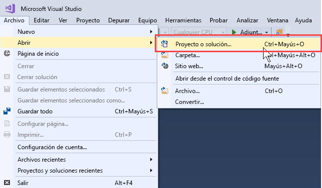
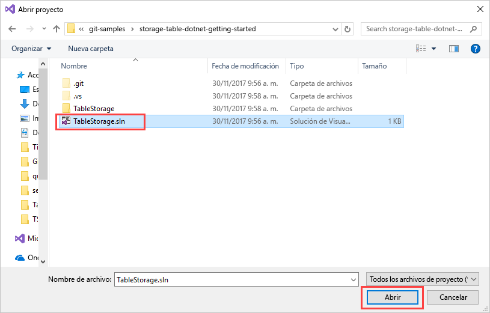
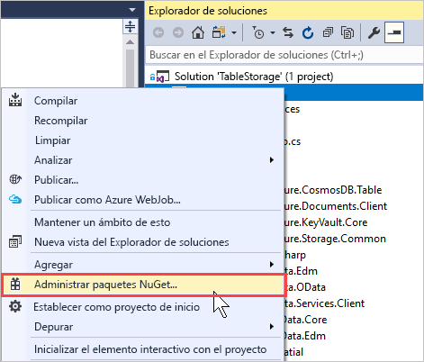
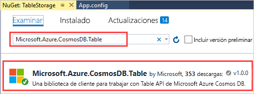
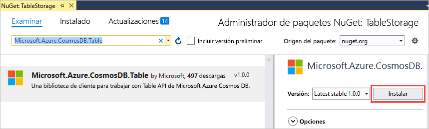
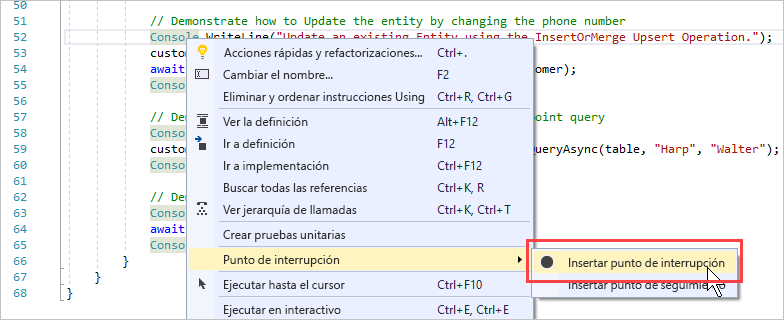
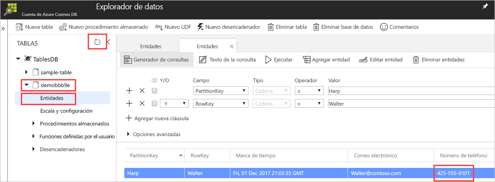

# <a name="quickstart-build-a-table-api-app-with-net-and-azure-cosmos-db"></a>Guía de inicio rápido: Creación de una aplicación de Table API con .NET y Azure Cosmos DB 

Esta guía de inicio rápido muestra cómo se usan .NET y [Table API](table-introduction.md) de Azure Cosmos DB para compilar una aplicación mediante la clonación de un ejemplo de GitHub. Esta guía de inicio rápido también muestra cómo crear una cuenta de Azure Cosmos DB y cómo usar el Explorador de datos para crear tablas y entidades en Azure Portal basado en web.

Azure Cosmos DB es un servicio de base de datos con varios modelos y de distribución global de Microsoft. Puede crear rápidamente bases de datos de documentos, clave-valor y grafos, y realizar consultas en ellas. Todas las bases de datos se beneficiarán de las funcionalidades de distribución global y escala horizontal en Azure Cosmos DB. 

## <a name="prerequisites"></a>requisitos previos

Si aún no tiene Visual Studio de 2017 instalado, puede descargar y usar la versión **gratis** de [Visual Studio 2017 Community Edition](https://www.visualstudio.com/downloads/). Asegúrese de que habilita **Desarrollo de Azure** durante la instalación de Visual Studio.

[!INCLUDE [quickstarts-free-trial-note](../../includes/quickstarts-free-trial-note.md)]

## <a name="create-a-database-account"></a>Creación de una cuenta de base de datos

> [!IMPORTANT] 
> Debe crear una nueva cuenta de Table API para trabajar con los SDK de Table API disponibles para el público general. Las cuentas de Table API creadas durante la versión preliminar no son compatibles con los SDK disponibles para el público general.
>

[!INCLUDE [cosmos-db-create-dbaccount-table](../../includes/cosmos-db-create-dbaccount-table.md)]

## <a name="add-a-table"></a>Adición de una tabla

[!INCLUDE [cosmos-db-create-table](../../includes/cosmos-db-create-table.md)]

## <a name="add-sample-data"></a>Adición de datos de ejemplo

Ahora puede agregar datos a la nueva tabla mediante el Explorador de datos.

1. En el Explorador de datos, expanda **sample-table** y haga clic en **Entidades** y en **Agregar entidad**.

   
2. Ahora agregue datos al cuadro de valores de PartitionKey y RowKey y haga clic en **Agregar entidad**.

   
  
    Ahora puede agregar más entidades a la tabla, editar las entidades o consultar los datos en el Explorador de datos. En el Explorador de datos también puede escalar el rendimiento y agregar procedimientos almacenados, funciones definidas por el usuario y desencadenadores a su tabla.

## <a name="clone-the-sample-application"></a>Clonación de la aplicación de ejemplo

Ahora vamos a clonar una aplicación de Table desde GitHub, establecer la cadena de conexión y ejecutarla. Verá lo fácil que es trabajar con datos mediante programación. 

1. Abra una ventana de terminal de GIT, como Git Bash, y utilice el comando `cd` para cambiar a una carpeta para instalar la aplicación de ejemplo. 

    ```bash
    cd "C:\git-samples"
    ```

2. Ejecute el comando siguiente para clonar el repositorio de ejemplo. Este comando crea una copia de la aplicación de ejemplo en el equipo. 

    ```bash
    git clone https://github.com/Azure-Samples/storage-table-dotnet-getting-started.git
    ```
## <a name="open-the-sample-application-in-visual-studio"></a>Abrir la aplicación de ejemplo en Visual Studio

1. En Visual Studio, desde el menú **Archivo**, elija **Abrir** y, a continuación, elija **Proyecto o solución**. 

    

2. Navegue hasta la carpeta donde clonó la aplicación de ejemplo y abra el archivo TableStorage.sln.

    

## <a name="update-your-connection-string"></a>Actualización de la cadena de conexión

Ahora vuelva a Azure Portal para obtener la información de la cadena de conexión y cópiela en la aplicación. Esto permite que la aplicación se comunique con la base de datos hospedada. 

1. En [Azure Portal](http://portal.azure.com/), haga clic en **Cadena de conexión**. 

    Use el botón de copia en el lado derecho de la ventana para copiar la **CADENA DE CONEXIÓN PRINCIPAL**.

    

2. En Visual Studio, abra el archivo App.config. 

3. Quite la marca de comentario de StorageConnectionString en la línea 8 y póngala en la línea 7, ya que este tutorial no utiliza el emulador de almacenamiento de Azure SDK. Las líneas 7 y 8 ahora deben tener el siguiente aspecto:

    ```
    <!--key="StorageConnectionString" value="UseDevelopmentStorage=true;" />-->
    <add key="StorageConnectionString" value="DefaultEndpointsProtocol=https;AccountName=[AccountName];AccountKey=[AccountKey]" />
    ```

4. Pegue la **CADENA DE CONEXIÓN PRINCIPAL** del portal en el valor de StorageConnectionString de la línea 8. Pegue la cadena dentro de las comillas. 

    > [!IMPORTANT]
    > Si el punto de conexión utiliza documents.azure.com, significa que tiene una cuenta en versión preliminar y que deberá crear una [nueva cuenta de Table API](#create-a-database-account) para trabajar con el SDK de Table API disponible para el público general. 
    > 

    La línea 8 debe tener un aspecto similar al siguiente:

    ```
    <add key="StorageConnectionString" value="DefaultEndpointsProtocol=https;AccountName=<account name>;AccountKey=txZACN9f...==;TableEndpoint=https://<account name>.table.cosmosdb.azure.com;" />
    ```

5. Presione CTRL+S para guardar el archivo App.config.

Ya ha actualizado la aplicación con toda la información que necesita para comunicarse con Azure Cosmos DB. 

## <a name="build-and-deploy-the-app"></a>Compilación e implementación de la aplicación

1. En Visual Studio, haga clic con el botón derecho en el proyecto **TableStorage** en **Explorador de soluciones** y, después, haga clic en **Administrar paquetes NuGet**. 

   
2. En el cuadro **Examinar** de NuGet, escriba *Microsoft.Azure.CosmosDB.Table*. Se buscará la biblioteca de cliente de Table API de Cosmos DB.
   
   

3. Haga clic en **Instalar** para instalar la biblioteca **Microsoft.Azure.CosmosDB.Table**. De este modo, se instalan el paquete de Table API de Azure Cosmos DB y todas las dependencias.

    

4. Abrir BasicSamples.cs. Haga doble clic en la línea 52, seleccione **Punto de interrupción** y, a continuación, seleccione **Insertar punto de interrupción**. Inserte otro punto de interrupción en la línea 55.

    

5. Presione F5 para ejecutar la aplicación.

    En la ventana de consola se muestra el nombre de la nueva base de datos de tablas (en este caso, demo91ab4) en Azure Cosmos DB. 
    
    

    Si recibe un error acerca de las dependencias, consulte [Solución de problemas](table-sdk-dotnet.md#troubleshooting).

    Cuando se alcance el primer punto de interrupción, vuelva al Explorador de datos en Azure Portal. Haga clic en el botón **Actualizar**, expanda la tabla demo* y haga clic en **Entidades**. En la pestaña **Entidades** que está a la derecha se muestra la nueva entidad que se agregó para Walter Harp. Tenga en cuenta que el número de teléfono para la nueva entidad es 425-555-0101.

    
    
6. Cierre la pestaña **Entidades** en el Explorador de datos.
    
7. Presione F5 para ejecutar la aplicación hasta el siguiente punto de interrupción. 

    Cuando se alcance el punto de interrupción, vuelva a Azure Portal, haga clic de nuevo en la pestaña **Entidades** para abrirla y compruebe que el número de teléfono se haya actualizado a 425-555-0105.

8. Presione F5 para ejecutar la aplicación. 
 
   La aplicación agrega entidades para usar en una aplicación de ejemplo avanzada que Table API no admite actualmente. A continuación, la aplicación elimina la tabla creada por la aplicación de ejemplo.

9. En la ventana de la consola, presione Entrar para finalizar la ejecución de la aplicación. 
  

## <a name="review-slas-in-the-azure-portal"></a>Revisión de los SLA en Azure Portal

[!INCLUDE [cosmosdb-tutorial-review-slas](../../includes/cosmos-db-tutorial-review-slas.md)]

## <a name="clean-up-resources"></a>Limpieza de recursos

[!INCLUDE [cosmosdb-delete-resource-group](../../includes/cosmos-db-delete-resource-group.md)]

## <a name="next-steps"></a>pasos siguientes

En esta guía de inicio rápido, ha obtenido información sobre cómo crear una cuenta de Azure Cosmos DB, crear una tabla mediante el Explorador de datos y ejecutar una aplicación.  Ahora ya puede consultar los datos mediante Table API.  

> [!div class="nextstepaction"]
> [Importación de datos de tabla a Table API](table-import.md)

