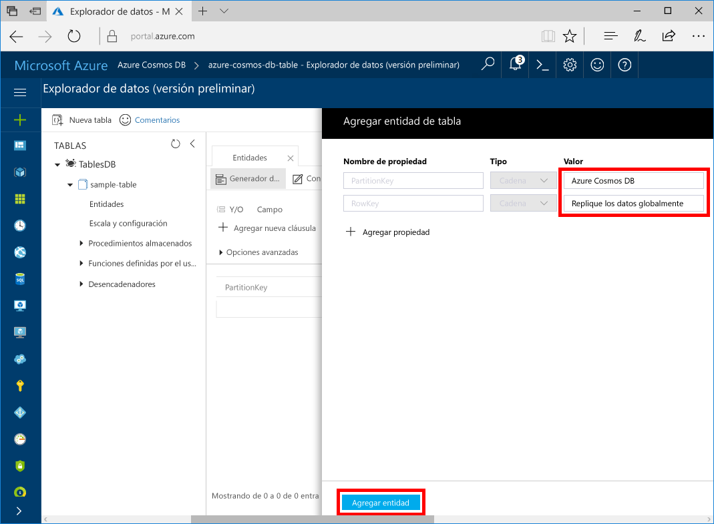
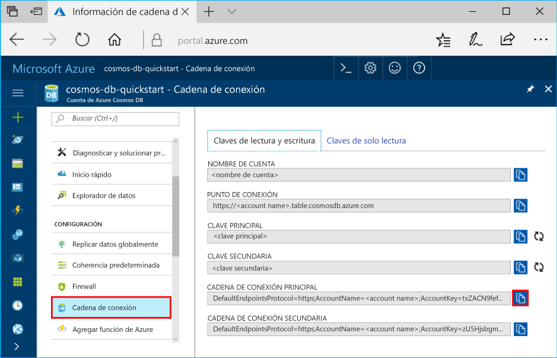

# <a name="quickstart-build-a-table-api-app-with-java-and-azure-cosmos-db"></a>Guía de inicio rápido: Creación de una aplicación de Table API con Java y Azure Cosmos DB

Esta guía de inicio rápido muestra cómo se usa Java y [Table API](table-introduction.md) de Azure Cosmos DB para crear una aplicación mediante la clonación de un ejemplo de GitHub. Esta guía de inicio rápido también muestra cómo crear una cuenta de Azure Cosmos DB y cómo usar el Explorador de datos para crear tablas y entidades en Azure Portal basado en web.

Azure Cosmos DB es un servicio de base de datos con varios modelos y de distribución global de Microsoft. Puede crear rápidamente bases de datos de documentos, clave-valor y grafos, y realizar consultas en ellas. Todas las bases de datos se beneficiarán de las funcionalidades de distribución global y escala horizontal en Azure Cosmos DB. 

## <a name="prerequisites"></a>Requisitos previos

[!INCLUDE [quickstarts-free-trial-note](../../includes/quickstarts-free-trial-note.md)]
[!INCLUDE [cosmos-db-emulator-docdb-api](../../includes/cosmos-db-emulator-docdb-api.md)]

Además: 

* [Kit de desarrollo de Java (JDK) 1.7+](http://www.oracle.com/technetwork/java/javase/downloads/jdk8-downloads-2133151.html)
    * En Ubuntu, ejecute `apt-get install default-jdk` para instalar el JDK.
    * Asegúrese de establecer la variable de entorno JAVA_HOME para que apunte a la carpeta donde está instalado el JDK.
* [Descargar](http://maven.apache.org/download.cgi) e [instalar](http://maven.apache.org/install.html) un archivo binario de [Maven](http://maven.apache.org/)
    * En Ubuntu, puede ejecutar `apt-get install maven` para instalar Maven.
* [Git](https://www.git-scm.com/)
    * En Ubuntu, puede ejecutar `sudo apt-get install git` para instalar Git.

## <a name="create-a-database-account"></a>Creación de una cuenta de base de datos

> [!IMPORTANT] 
> Debe crear una nueva cuenta de Table API para trabajar con los SDK de Table API disponibles para el público general. Las cuentas de Table API creadas durante la versión preliminar no son compatibles con los SDK disponibles para el público general.
>

[!INCLUDE [cosmos-db-create-dbaccount-table](../../includes/cosmos-db-create-dbaccount-table.md)]

## <a name="add-a-table"></a>Adición de una tabla

[!INCLUDE [cosmos-db-create-table](../../includes/cosmos-db-create-table.md)]

## <a name="add-sample-data"></a>Adición de datos de ejemplo

Ahora puede agregar datos a la nueva tabla mediante el Explorador de datos.

1. En el Explorador de datos, expanda **sample-table** y haga clic en **Entidades** y en **Agregar entidad**.

   
2. Ahora agregue datos a los cuadros de valores de PartitionKey y RowKey y haga clic en **Agregar entidad**.

   
  
    Ahora puede agregar más entidades a la tabla, editar las entidades o consultar los datos en el Explorador de datos. En el Explorador de datos también puede escalar el rendimiento y agregar procedimientos almacenados, funciones definidas por el usuario y desencadenadores a su tabla.

## <a name="clone-the-sample-application"></a>Clonación de la aplicación de ejemplo

Ahora vamos a clonar una aplicación de Table desde GitHub, establecer la cadena de conexión y ejecutarla. Verá lo fácil que es trabajar con datos mediante programación. 

1. Abra una ventana de terminal de Git, como git bash y utilice el comando `cd` para cambiar a una carpeta para instalar la aplicación de ejemplo. 

    ```bash
    cd "C:\git-samples"
    ```

2. Ejecute el comando siguiente para clonar el repositorio de ejemplo. Este comando crea una copia de la aplicación de ejemplo en el equipo. 

    ```bash
    git clone https://github.com/Azure-Samples/storage-table-java-getting-started.git 
    ```

## <a name="update-your-connection-string"></a>Actualizar la cadena de conexión

Ahora vuelva a Azure Portal para obtener la información de la cadena de conexión y cópiela en la aplicación. Esto permite que la aplicación se comunique con la base de datos hospedada. 

1. En [Azure Portal](http://portal.azure.com/), haga clic en **Cadena de conexión**. 

   

2. Utilice los botones de copia en el lado derecho para copiar la cadena de conexión principal (PRIMARY CONNECTION STRING).

3. Abra config.properties desde la carpeta C:\git-samples\storage-table-java-getting-started\src\main\resources. 

5. Convierta en comentario la línea uno y quite la marca de comentario de la línea dos. Las dos primeras líneas tendrán ahora un aspecto similar al siguiente.

    ```
    #StorageConnectionString = UseDevelopmentStorage=true
    StorageConnectionString = DefaultEndpointsProtocol=https;AccountName=[ACCOUNTNAME];AccountKey=[ACCOUNTKEY]
    ```

6. Pegue la cadena de conexión principal (PRIMARY CONNECTION STRING) del portal en el valor de StorageConnectionString, en la línea 2. 

    > [!IMPORTANT]
    > Si el punto de conexión utiliza documents.azure.com, significa que tiene una cuenta en versión preliminar y que deberá crear una [nueva cuenta de Table API](#create-a-database-account) para trabajar con el SDK de Table API disponible para el público general.
    >

7. Guarde el archivo config.properties.

Ya ha actualizado la aplicación con toda la información que necesita para comunicarse con Azure Cosmos DB. 

## <a name="run-the-app"></a>Ejecución de la aplicación

1. En la ventana de terminal de Git, use `cd` para cambiar a la carpeta storage-table-java-getting-started.

    ```git
    cd "C:\git-samples\storage-table-java-getting-started"
    ```

2. En la ventana de terminal de Git, ejecute los siguientes comandos para iniciar la aplicación de Java.

    ```git
    mvn compile exec:java 
    ```

    La ventana de consola muestra los datos de tabla que se van a agregar a la nueva base de datos de tablas en Azure Cosmos DB.

    Ahora puede volver al Explorador de datos y ver, consultar, modificar y trabajar con estos nuevos datos. 

## <a name="review-slas-in-the-azure-portal"></a>Revisión de los SLA en Azure Portal

[!INCLUDE [cosmosdb-tutorial-review-slas](../../includes/cosmos-db-tutorial-review-slas.md)]

## <a name="clean-up-resources"></a>Limpieza de recursos

[!INCLUDE [cosmosdb-delete-resource-group](../../includes/cosmos-db-delete-resource-group.md)]

## <a name="next-steps"></a>Pasos siguientes

En esta guía de inicio rápido, ha obtenido información sobre cómo crear una cuenta de Azure Cosmos DB, crear una tabla mediante el Explorador de datos y ejecutar una aplicación.  Ahora ya puede consultar los datos mediante Table API.  

> [!div class="nextstepaction"]
> [Importación de datos de tabla a Table API](table-import.md)
