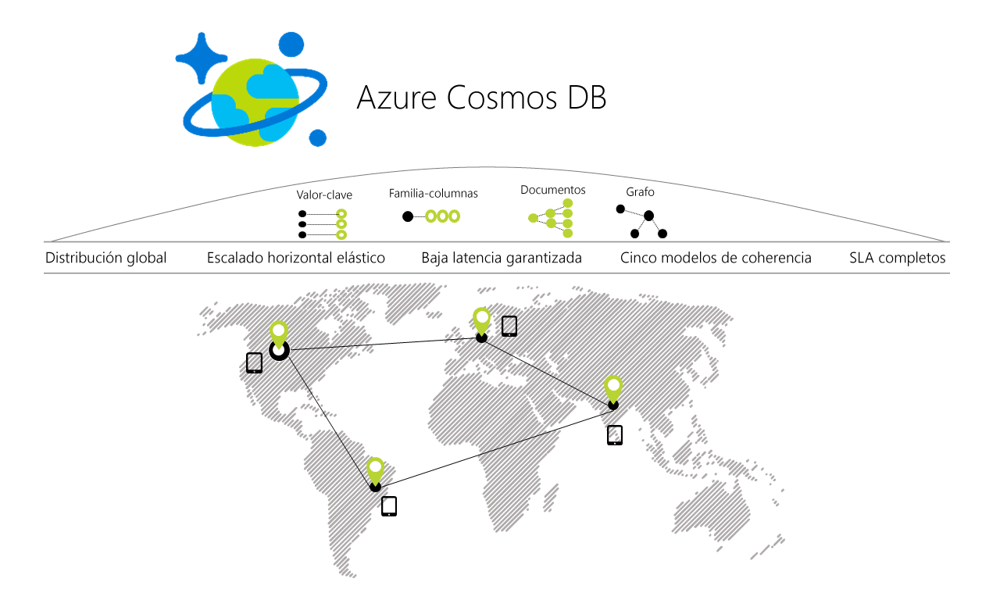

# Bienvenido a Azure Cosmos DB

Azure Cosmos DB es la base de datos de varios modelos de distribución global de Microsoft. Con solo hacer clic en un botón, Azure Cosmos DB le permite escalar de forma elástica e individual el rendimiento y el almacenamiento en cualquier número de regiones geográficas de Azure. Ofrece garantía de rendimiento, latencia, disponibilidad y coherencia con [acuerdos de nivel de servicio](https://aka.ms/acdbsla) (SLA) integrales, algo que no ofrece ningún otro servicio de base de datos.

Azure Cosmos DB contiene un motor de base de datos con escritura optimizada, regulado por recursos, independiente del esquema que admite varios modelos de datos de forma nativa: de valores clave, documentos, gráficos y columnas. También admite muchas API para acceder a datos, como [MongoDB](mongodb-introduction.md), [DocumentDB SQL](documentdb-introduction.md), [Gremlin](graph-introduction.md) (versión preliminar), y [Azure Tables](table-introduction.md) (versión preliminar), de forma extensible. 

Azure Cosmos DB se lanzó en 2010 para abordar los problemas de desarrollo que aparecen en las aplicaciones a grande escala de Microsoft. Puesto que la creación de aplicaciones distribuidas globalmente no es un problema exclusivo de Microsoft, hemos puesto el servicio a disponibilidad de todos los desarrolladores de Azure como Azure DocumentDB. Azure Cosmos DB es el siguiente gran salto en la evolución de DocumentDB y ahora lo ponemos a su disposición. Como parte de esta versión de Azure Cosmos DB, los clientes de DocumentDB (con sus datos) se convierten automáticamente en clientes de Azure Cosmos DB. La transición es perfecta y ya tienen acceso a la gama más amplia de funcionalidades nuevas que ofrece Azure Cosmos DB. 

## Comparación de funcionalidades

Azure Cosmos DB proporciona las mejores funcionalidades de las bases de datos relacionales y no relacionales.

| Capacidades | Bases de datos relacionales    | Bases de datos no relacionales (NoSQL) |     Azure Cosmos DB |
| --- | --- | --- | --- |
| Distribución global | x | x | ✓ Inmediata, más de 30 regiones, hospedaje múltiple |
| Escalado horizontal | x | ✓  | ✓ Almacenamiento de escalado y rendimiento independientes | 
| Garantías de latencia | x | ✓  | ✓ < 10 ms para la lectura, < 15 ms para la escritura en p99 | 
| Alta disponibilidad | x | ✓  | ✓ Siempre activa, compensaciones PACELC, conmutación por error automática y manual |
| Modelo de datos + API | Relacional + SQL | Varios modelos + API de OSS | Varios modelos + SQL + API de OSS (más próximamente) |
| SLA | ✓  | x | ✓ SLA integrales para la latencia, el rendimiento, la coherencia y la disponibilidad |

## Principales capacidades
Como un servicio de base de datos de distribución global, Azure Cosmos DB proporciona las siguientes funcionalidades para ayudarle a crear aplicaciones escalables de distribución global y gran capacidad de respuesta:

* [**Distribución global inmediata**](#global-distribution)
    * La aplicación está disponible al instante para los usuarios desde cualquier lugar. Ahora, los datos, también.
    * No se preocupe del hardware ni de agregar nodos, máquinas virtuales o núcleos. Solo apunte y haga clic, los datos están ahí. 

* [**Varios modelos de datos y API populares para acceder a los datos y consultarlos**](#data-models)
    * Compatibilidad con varios modelos de datos, como los de valores clave, documentos, gráficos y columnas.
    * API extensibles para Node.js, Java,.NET, .NET Core, Python y MongoDB.
    * SQL y Gremlin para las consultas. 

* [**Escalado elástico del rendimiento y el almacenamiento a petición en todo el mundo**](#horizontal-scale)
    * Escale fácilmente el rendimiento por [segundos](request-units.md) y [minutos](https://aka.ms/acdbrupm), y cámbielo cuando quiera. 
    * Escale el almacenamiento de manera [transparente y automática](partition-data.md) para cumplir los requisitos de tamaño ahora y siempre.

* [**Creación de aplicaciones de alta capacidad de respuesta y de misión crítica**](#low-latency) 
    * Acceda a los datos con latencias de milisegundos de un solo dígito en el percentil 99, en cualquier lugar del mundo. 

* [**Disponibilidad "siempre activa" garantizada**](#high-availability)
    * Disponibilidad del 99,99 % en una única región.
    * Impleméntela en cualquier número de [regiones de Azure](https://azure.microsoft.com/regions) para mayor disponibilidad.
    * [Simule un error](regional-failover.md) en una o más regiones sin pérdida de datos, garantizada. 

* [**Escritura de aplicaciones de distribución global de la forma correcta**](#consistency)
    * [Cinco modelos de coherencia](consistency-levels.md) ofrecen homogeneidad similar a SQL a la coherencia definitiva similar a NoSQL y en todo lo intermedio. 
  
* [**Garantía de devolución del dinero**](#sla) 
    * Los datos llegarán rápidamente o le devolvemos el dinero. 
    * [Acuerdos de nivel de servicio](https://aka.ms/acdbsla) para la disponibilidad, la latencia, el rendimiento y la coherencia. 

* [**Sin administración de esquema o índice de la base de datos**](#schema-free)
    * Deje de preocuparse acerca de cómo mantener sus esquemas e índices de la base de datos e índices en sincronía con el esquema de la aplicación. No usamos esquemas. 

* [**Costo de propiedad reducido**](#tco)
    * De cinco a diez veces [más rentable](https://aka.ms/documentdb-tco-paper) que una solución no administrada.
    * Tres veces más económica que DynamoDB.

## Distribución global
Los contenedores de Azure Cosmos DB se distribuyen en dos dimensiones: 

1. En una región determinada, todos los recursos se dividen horizontalmente con particiones de recursos (distribución local). 
2. Cada partición de recursos también se replica en regiones geográficas (distribución global). 

 

Cuando es necesario escalar el rendimiento y el almacenamiento, Cosmos DB realiza las operaciones de administración de particiones de manera transparente en todas las regiones. Cosmos DB proporciona una sola imagen de sistema de los recursos distribuidos globalmente, independientemente de la escala, la distribución o los errores. 

La distribución global de los recursos en Cosmos DB es [inmediata](distribute-data-globally.md). En cualquier momento, con unos pocos clics de botón (o mediante programación con una sola llamada de API), puede asociar a la cuenta de la base de datos cualquier número de regiones geográficas. 

Cosmos DB garantiza que cada región recién asociada comenzará a procesar las solicitudes de cliente en una hora del percentil 99, independientemente de la cantidad de datos o el número de regiones. Para ello, paraleliza los datos de propagación y copia de todas las particiones de recursos de origen en la región recién asociada. Los clientes también pueden eliminar una región existente o dejar desconectada una región asociada previamente a su cuenta de la base de datos.

## Compatibilidad con varios modelos y varias API
 Azure Cosmos DB admite de forma nativa varios modelos de datos, como de documentos, valores clave, gráficos y familias de columnas. El modelo de contenido principal del motor de la base de datos de Cosmos DB se basa en la secuencia de registro de átomos (ARS). Los átomos constan de un pequeño conjunto de tipos primitivos, como cadenas, booleanos y números. Los registros son estructuras formadas por estos tipos. Las secuencias son matrices que constan de átomos, registros o secuencias. 
 
 El motor de la base de datos puede traducir y proyectar eficazmente modelos de datos diferentes en el modelo de datos basado en ARS. El del modelo de datos central de Cosmos DB es accesible de forma nativa desde los lenguajes de programación escritos dinámicamente y se puede exponer tal cual como JSON. 
 
 El servicio también admite las API de base de datos populares para acceder a los datos y consultarlos. El motor de base de datos de Cosmos DB actualmente admite [DocumentDB SQL](documentdb-introduction.md), [MongoDB](mongodb-introduction.md), [Azure Tables](table-introduction.md) (versión preliminar) y [Gremlin](graph-introduction.md) (versión preliminar). Puede seguir creando aplicaciones que utilicen API de OSS populares y obtener todas las ventajas de un servicio de base de datos totalmente probado y administrado de distribución global. 

## Escalado horizontal del almacenamiento y el rendimiento
Todos los datos de un contenedor de Cosmos DB (por ejemplo, una colección de documentos, una tabla o un gráfico) se dividen horizontalmente y se administran de manera transparente con particiones de recursos. Una partición de recursos es un contenedor de datos coherente y de alta disponibilidad con particiones realizadas por una [clave de partición especificada por el cliente](partition-data.md). Proporciona una sola imagen de sistema para un conjunto de recursos que administra y es una unidad fundamental de escalabilidad y distribución. Cosmos DB está diseñado para permitirle escalar elásticamente el rendimiento en función de patrones de tráfico de la aplicación en diferentes regiones geográficas para admitir cargas de trabajo que varían tanto geográfica como temporalmente. El servicio administra las particiones de forma transparente sin poner en peligro la disponibilidad, la coherencia, la latencia ni el rendimiento del contenedor de Cosmos DB.  
 
 

Puede escalar elásticamente el rendimiento de un contenedor de Azure Cosmos DB al aprovisionarlo mediante programación con [unidades de solicitud por segundo (RU/s)](request-units.md). Internamente, el servicio administra de forma transparente las particiones de los recursos para ofrecer el rendimiento en un contenedor determinado. Cosmos DB garantiza que el rendimiento esté disponible para su uso en todas las regiones asociadas al contenedor. El nuevo rendimiento es efectivo en cinco segundos a partir del cambio en el valor de rendimiento configurado. 

Puede aprovisionar el rendimiento de un contenedor de Cosmos DB por segundos y [por minutos (RU/m)](request-units-per-minute.md). El rendimiento aprovisionado por minutos se usa para administrar picos inesperados de la carga de trabajo producidos en el nivel por segundos. 

## Garantías de baja latencia en el percentil 99
Como parte de sus SLA, Cosmos DB garantiza una baja latencia global en el percentil 99 para sus clientes. Para un elemento típico de 1 KB, Cosmos DB garantiza latencias de lectura globales de menos de 10 ms y escrituras indexadas de menos de 15 ms en el percentil 99, en la misma región de Azure. Las latencias medianas son mucho menores (menos de 5 ms).  Gracias al procesamiento con límite superior de solicitudes de las transacciones con bases de datos, Cosmos DB permite a los clientes distinguir claramente las transacciones con latencia elevada de la falta de disponibilidad de una base de datos.

## Hospedaje múltiple transparente y alta disponibilidad al 99,99 %
Es posible asignar dinámicamente "prioridades" a las regiones asociadas a la cuenta de base de datos Azure Cosmos DB. Las prioridades se usan para dirigir las solicitudes a regiones específicas en caso de errores regionales. En el improbable caso de un desastre regional, Cosmos DB conmuta por error automáticamente en el orden de prioridad establecido.

Para probar la disponibilidad global de la aplicación, puede [desencadenar manualmente la conmutación por error](regional-failover.md) (velocidad limitada a dos operaciones por hora). Cosmos DB garantiza la conservación de todos los datos durante las conmutaciones por error manuales regionales. En caso de que se produzca un desastre regional, Cosmos DB garantiza un límite superior de pérdida de datos durante la conmutación por error automática que inicie el sistema. No es necesario volver a implementar la aplicación después de la conmutación por error regional y Azure Cosmos DB conserva los SLA de disponibilidad. 

En este escenario, Cosmos DB le permite interactuar con los recursos mediante puntos de conexión lógicos (independientes de la región) o físicos (específicos de la región). La primera opción garantiza que la aplicación puede hospedarse de forma transparente en varios hosts en caso de conmutación por error. La última proporciona un control específico de la aplicación para redirigir las lecturas y escrituras a regiones concretas. Cosmos DB garantiza el SLA de disponibilidad al 99,99 % para todas las cuentas de base de datos. Las garantías de disponibilidad son independientes de la escala (rendimiento y almacenamiento aprovisionados), el número de regiones o la distancia geográfica entre regiones asociadas a una base de datos determinada. 

## Varios modelos de coherencia bien definida
Las bases de datos distribuidas comerciales se dividen en dos categorías: las bases de datos que no ofrecen opciones de coherencia bien definida en absoluto y las que ofrecen dos opciones de programación opuestas (coherencia alta y ocasional). La primera supone una carga de detalles pormenorizados de los protocolos de replicación para los desarrolladores de aplicaciones y espera de ellos difíciles compensaciones entre coherencia, disponibilidad, latencia y rendimiento. La última obliga a elegir uno de los dos extremos. A pesar de la gran cantidad de investigación y propuestas de más de 50 modelos de coherencia, la comunidad de bases de datos distribuidas no ha sido capaz de comercializar otros niveles de coherencia distintos del alto y el final. 

Cosmos DB le permite elegir entre [cinco modelos de coherencia bien definida](consistency-levels.md) dentro del espectro de coherencia: alta, de obsolescencia limitada, [de sesión](http://dl.acm.org/citation.cfm?id=383631), de prefijo coherente y final. 

En la tabla siguiente se muestran las garantías específicas que ofrece cada nivel de coherencia.
 
**Niveles de coherencia y garantías**

| Nivel de coherencia    | Garantías |
| --- | --- |
| Alta | Linealidad |
| De obsolescencia entrelazada    | Prefijo coherente. Los prefijos k y los intervalos t retrasan las lecturas tras las escrituras |
| Sesión    | Prefijo coherente. Lecturas monótonas, escrituras monótonas, lectura de la escritura, escritura tras las lecturas |
| De prefijo coherente    | Las actualizaciones devueltas son prefijos de todas las actualizaciones, sin espacios |
| Ocasional    | Lecturas sin orden |

Puede establecer la coherencia predeterminada en la cuenta de Cosmos DB (y después reemplazar la para una solicitud de lectura concreta). Internamente, la coherencia predeterminada se aplica a los datos de los conjuntos de particiones que pueden ser intervalos de regiones. 

## Acuerdos de nivel de servicio garantizados

Cosmos DB es el primer servicio de bases de datos administradas que ofrece [garantías de SLA](https://aka.ms/acdbsla) del 99,99 % de disponibilidad, rendimiento, baja latencia y coherencia.
* Disponibilidad: SLA del 99,99 % de tiempo de actividad para todas las operaciones de datos y del plano de control.
* Rendimiento: el 99,99 % de las solicitudes se terminan correctamente. 
* Latencia: el 99,99 % de las latencias < 10 ms en el percentil 99.
* Coherencia: el 100 % de las solicitudes de lectura se adapta a la garantía de coherencia del nivel que solicite.

## Sin esquemas

Las bases de datos relacionales y NoSQL le obligan a administrar esquemas e índices, versiones y migraciones (lo cual es extremadamente difícil en un escenario de distribución global). Pero no se preocupe, Cosmos DB elimina este problema. Con Cosmos DB no es necesario administrar esquemas ni índices, ocuparse de las versiones del esquema ni preocuparse por el tiempo de inactividad de la aplicación al migrar esquemas. El motor de la base de datos de Cosmos DB es totalmente independiente del esquema: indexa automáticamente todos los datos que se introducen sin necesidad de esquemas ni índices y las consultas son ultrarrápidas. 

## Costo de propiedad reducido

 Al tener en cuenta el costo total de propiedad (TCO), los servicios administrados en la nube como Azure Cosmos DB pueden ser de cinco a diez veces más rentables que sus OSS homólogos que se ejecutan en máquinas virtuales o de manera local. Y Azure Cosmos DB es hasta dos o tres veces más económico que DynamoDB para cargas de trabajo de gran volumen. Más información en la [documentación del costo total de propiedad](https://aka.ms/documentdb-tco-paper). 

## Pasos siguientes
Comience a usar Azure Cosmos DB con una de nuestras guías rápidas:

* [Introducción a la API DocumentDB para Azure Cosmos DB](create-documentdb-dotnet.md)
* [Introducción a la API MongoDB para Azure Cosmos DB](create-mongodb-nodejs.md)
* [Introducción a la API Graph para Azure Cosmos DB](create-graph-dotnet.md)
* [Introducción a la API Table para Azure Cosmos DB](create-table-dotnet.md)

