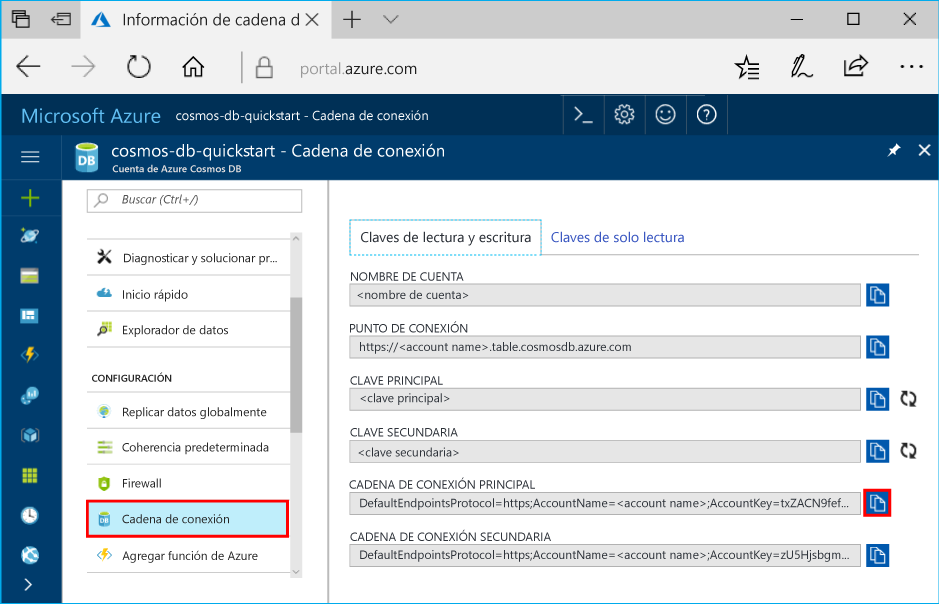

# <a name="azure-cosmos-db-develop-with-the-table-api-in-net"></a>Azure Cosmos DB: desarrollo con Table API en .NET

Azure Cosmos DB es un servicio de base de datos con varios modelos y de distribución global de Microsoft. Puede crear rápidamente bases de datos de documentos, clave-valor y grafos, y realizar consultas en ellas. Todas las bases de datos se beneficiarán de las funcionalidades de distribución global y escala horizontal en Azure Cosmos DB.

En este tutorial se describen las tareas siguientes: 

> [!div class="checklist"] 
> * Creación de una cuenta de Azure Cosmos DB 
> * Habilitación de la funcionalidad en el archivo app.config 
> * Creación de una tabla con [Table API](table-introduction.md)
> * Adición de una entidad a una tabla 
> * Inserción de un lote de entidades 
> * una sola entidad 
> * Consulta de entidades con índices secundarios automáticos 
> * una entidad 
> * Eliminación de una entidad 
> * Eliminación de una tabla
 
## <a name="tables-in-azure-cosmos-db"></a>Tablas en Azure Cosmos DB 

Azure Cosmos DB proporciona [Table API](table-introduction.md) para las aplicaciones que necesitan un almacén de pares clave-valor con un diseño sin esquema. Tanto Table API de Azure Cosmos DB como [Azure Table Storage](../storage/common/storage-introduction.md) ahora admiten los mismos SDK y API de REST. Puede usar Azure Cosmos DB para crear tablas con requisitos de alto rendimiento.

Este tutorial está dirigido a desarrolladores que conocen el SDK de Azure Table Storage y que quieran usar las características premium disponibles con Azure Cosmos DB. Se basa en [Introducción a Azure Table Storage mediante .NET](table-storage-how-to-use-dotnet.md) y muestra cómo aprovechar funcionalidades adicionales, como índices secundarios, rendimiento aprovisionado y hospedaje múltiple. En este tutorial se explica cómo usar Azure Portal para crear una cuenta de Azure Cosmos DB y, luego, compilar e implementar una aplicación con Table API. También analizaremos ejemplos de .NET para crear y eliminar una tabla, además de insertar, actualizar, eliminar y consultar datos de tabla. 

Si actualmente usa Azure Table Storage, obtendrá las siguientes ventajas con Table API de Azure Cosmos DB:

- [Distribución global](distribute-data-globally.md) llave en mano con hospedaje múltiple y [conmutaciones por error manuales y automáticas](regional-failover.md)
- Compatibilidad con el indexado automático independiente del esquema con respecto a todas las propiedades ("índices secundarios") y consultas rápidas 
- Compatibilidad con el [escalado independiente de proceso y almacenamiento](partition-data.md), en cualquier número de regiones
- Compatibilidad con [rendimiento dedicado por tabla](request-units.md) que se puede escalar de cientos a millones de solicitudes por segundo
- Compatibilidad con [cinco niveles de coherencia bien definidos](consistency-levels.md) para compensar la disponibilidad, la latencia y la coherencia en función de lo que necesita la aplicación
- Disponibilidad del 99,99 % dentro de una única región y la capacidad de agregar más regiones para tener una mayor disponibilidad, además de [Acuerdos de Nivel de Servicio completos líderes en el sector](https://azure.microsoft.com/support/legal/sla/cosmos-db/?ref=microsoft.com&utm_source=microsoft.com&utm_medium=docs&utm_campaign=visualstudio) sobre la disponibilidad general
- Trabajo con el SDK de .NET para Azure Storage, sin cambios de código en la aplicación

Este tutorial trata sobre Table API de Azure Cosmos DB usando el SDK de .NET. Puede descargar el [SDK de versión preliminar de Azure Storage](https://aka.ms/tableapinuget) desde NuGet.

Para más información sobre las tareas complejas de Azure Table Storage, consulte:

* [Introducción a Table API de Azure Cosmos DB](table-introduction.md)
* Consulte la documentación de referencia de Table service para obtener información detallada acerca de las API disponibles: [SDK de .NET de Table API de Azure Cosmos DB](https://docs.microsoft.com/dotnet/api/overview/azure/cosmosdb/client?view=azure-dotnet)

### <a name="about-this-tutorial"></a>Acerca de este tutorial
Este tutorial está dirigido a desarrolladores que conocen el SDK de Azure Table Storage y que quieran usar las características premium disponibles con Azure Cosmos DB. Se basa en [Introducción a Azure Table Storage mediante .NET](table-storage-how-to-use-dotnet.md) y muestra cómo aprovechar funcionalidades adicionales, como índices secundarios, rendimiento aprovisionado y hospedaje múltiple. Se explica cómo usar Azure Portal para crear una cuenta de Azure Cosmos DB y, luego, compilar e implementar una aplicación de Table. También analizaremos ejemplos de .NET para crear y eliminar una tabla, además de insertar, actualizar, eliminar y consultar datos de tabla. 

Si todavía no tiene instalado Visual Studio 2017, puede descargar y usar la versión **gratis** de [Visual Studio 2017 Community Edition](https://www.visualstudio.com/downloads/). Asegúrese de que habilita **Desarrollo de Azure** durante la instalación de Visual Studio.

[!INCLUDE [quickstarts-free-trial-note](../../includes/quickstarts-free-trial-note.md)]

## <a name="create-a-database-account"></a>Creación de una cuenta de base de datos

Para comenzar, creemos una cuenta de Azure Cosmos DB en Azure Portal.  
 
> [!IMPORTANT]  
> Debe crear una nueva cuenta de Table API para trabajar con los SDK de Table API disponibles para el público general. Las cuentas de Table API creadas durante la versión preliminar no son compatibles con los SDK disponibles para el público general. 
>

[!INCLUDE [cosmosdb-create-dbaccount-table](../../includes/cosmos-db-create-dbaccount-table.md)] 

## <a name="clone-the-sample-application"></a>Clonación de la aplicación de ejemplo

Ahora vamos a clonar una aplicación de Table desde GitHub, establecer la cadena de conexión y ejecutarla. Verá lo fácil que es trabajar con datos mediante programación. 

1. Abra una ventana de terminal de Git, como git bash y utilice el comando `cd` para cambiar a una carpeta para instalar la aplicación de ejemplo. 

    ```bash
    cd "C:\git-samples"
    ```

2. Ejecute el comando siguiente para clonar el repositorio de ejemplo. Este comando crea una copia de la aplicación de ejemplo en el equipo. 

    ```bash
    git clone https://github.com/Azure-Samples/storage-table-dotnet-getting-started.git
    ```

3. Después, abra el archivo de solución en Visual Studio. 

## <a name="update-your-connection-string"></a>Actualización de la cadena de conexión

Ahora vuelva a Azure Portal para obtener la información de la cadena de conexión y cópiela en la aplicación. Esto permite que la aplicación se comunique con la base de datos hospedada. 

1. En [Azure Portal](http://portal.azure.com/), haga clic en **Cadena de conexión**. 

    Utilice los botones de copia en el lado derecho de la pantalla para copiar la cadena de conexión principal (PRIMARY CONNECTION STRING).

    

2. En Visual Studio, abra el archivo app.config. 

3. Quite la marca de comentario de StorageConnectionString en la línea 8 y ponga la marca de comentario de StorageConnectionString en la línea 7, ya que este tutorial no utiliza el Emulador de Azure Storage. Las líneas 7 y 8 deben tener el siguiente aspecto:

    ```
    <!--key="StorageConnectionString" value="UseDevelopmentStorage=true;" />-->
    <add key="StorageConnectionString" value="DefaultEndpointsProtocol=https;AccountName=[AccountName];AccountKey=[AccountKey]" />
    ```

4. Pegue la cadena de conexión principal (PRIMARY CONNECTION STRING) del portal en el valor de StorageConnectionString, en la línea 8. Pegue la cadena dentro de las comillas.
   
    > [!IMPORTANT]
    > Si el punto de conexión utiliza documents.azure.com, significa que tiene una cuenta en versión preliminar y que deberá crear una [nueva cuenta de Table API](#create-a-database-account) para trabajar con el SDK de Table API disponible para el público general. 
    >

    La línea 8 debe tener un aspecto similar al siguiente:

    ```
    <add key="StorageConnectionString" value="DefaultEndpointsProtocol=https;AccountName=<account name>;AccountKey=txZACN9f...==;TableEndpoint=https://<account name>.table.cosmosdb.azure.com;" />
    ```

5. Guarde el archivo app.config.

Ya ha actualizado la aplicación con toda la información que necesita para comunicarse con Azure Cosmos DB. 

## <a name="azure-cosmos-db-capabilities"></a>Funcionalidades de Azure Cosmos DB
Azure Cosmos DB admite una serie de funcionalidades que no están disponibles en la API de Azure Table Storage. 

Se tiene acceso a determinadas funcionalidades a través de las nuevas sobrecargas para el elemento CreateCloudTableClient que permiten especificar el nivel de directiva de conexión y de coherencia.

| Configuración de conexión de la tabla | DESCRIPCIÓN |
| --- | --- |
| Modo de conexión  | Azure Cosmos DB admite dos modos de conectividad. En el modo `Gateway`, las solicitudes siempre se hacen a la puerta de enlace de Azure Cosmos DB, que las reenvía a las particiones de datos correspondientes. En el modo de conectividad `Direct`, el cliente recupera la asignación de tablas a particiones y las solicitudes se hacen directamente en las particiones de datos. Se recomienda el valor predeterminado, `Direct`.  |
| Protocolo de la conexión | Azure Cosmos DB admite dos protocolos de conexión: `Https` y `Tcp`. El valor predeterminado es`Tcp` que es, además, el valor recomendado porque es más ligero. |
| Ubicaciones preferidas | Lista separada por comas de las ubicaciones preferidas (hospedaje múltiple) para las lecturas. Cada cuenta de Azure Cosmos DB se puede asociar con entre 1 y 30 regiones más. Cada instancia de cliente puede especificar un subconjunto de estas regiones en el orden de preferencia para las lecturas de latencia baja. Estas regiones se deben denominar según sus [nombres para mostrar](https://msdn.microsoft.com/library/azure/gg441293.aspx), por ejemplo, `West US`. Consulte también las [API de hospedaje múltiple](tutorial-global-distribution-table.md). |
| Nivel de coherencia | Puede compensar entre la latencia, la coherencia y la disponibilidad si elige entre cinco niveles de coherencia bien definidos: `Strong`, `Session`, `Bounded-Staleness`, `ConsistentPrefix` y `Eventual`. El valor predeterminado es `Session`. La elección del nivel de coherencia marca una diferencia importante en el rendimiento en las configuraciones con varias regiones. Consulte [Niveles de coherencia](consistency-levels.md) para obtener detalles. |

Otras funcionalidades se pueden habilitar a través de los siguientes valores de configuración de `appSettings`.

| Clave | DESCRIPCIÓN |
| --- | --- |
| TableQueryMaxItemCount | Configure el número máximo de elementos devueltos por consulta de tabla en un solo recorrido de ida y vuelta. El valor predeterminado es `-1`, que permite que Azure Cosmos DB determine el valor en runtime de manera dinámica. |
| TableQueryEnableScan | Si la consulta no puede usar el índice para algún filtro, ejecútela de todas maneras a través de un examen. El valor predeterminado es `false`.|
| TableQueryMaxDegreeOfParallelism | El grado de paralelismo para la ejecución de una consulta entre particiones. `0` es un valor en serie sin captura previa, `1` es un valor en serie con captura previa y los valores más altos aumentan el índice de paralelismo. El valor predeterminado es `-1`, que permite que Azure Cosmos DB determine el valor en runtime de manera dinámica. |

Para cambiar el valor predeterminado, abra el archivo `app.config` del Explorador de soluciones en Visual Studio. Agregue el contenido del elemento `<appSettings>` , que se muestra a continuación. Reemplace `account-name` por el nombre de su cuenta de almacenamiento, y `account-key` por la clave de acceso de su cuenta. 

```xml
<configuration>
    ...
    <appSettings>
      <!-- Client options -->
      <add key="CosmosDBStorageConnectionString" 
        value="DefaultEndpointsProtocol=https;AccountName=MYSTORAGEACCOUNT;AccountKey=AUTHKEY;TableEndpoint=https://account-name.table.cosmosdb.azure.com" />
      <add key="StorageConnectionString" value="DefaultEndpointsProtocol=https;AccountName=account-name;AccountKey=account-key; TableEndpoint=https://account-name.documents.azure.com" />

      <!-- Table query options -->
      <add key="TableQueryMaxItemCount" value="-1"/>
      <add key="TableQueryEnableScan" value="false"/>
      <add key="TableQueryMaxDegreeOfParallelism" value="-1"/>
      <add key="TableQueryContinuationTokenLimitInKb" value="16"/>
            
    </appSettings>
</configuration>
```

Vamos a revisar rápidamente lo que sucede en la aplicación. Abra el archivo `Program.cs` y observará que estas líneas de código crean los recursos de Table. 

## <a name="create-the-table-client"></a>Creación del cliente de Table
Inicializa un elemento `CloudTableClient` para conectarse a la cuenta de Table.

```csharp
CloudTableClient tableClient = storageAccount.CreateCloudTableClient();
```
El cliente se inicializa a través de los valores de configuración `TableConnectionMode`, `TableConnectionProtocol`, `TableConsistencyLevel` y `TablePreferredLocations` si se especifican en la configuración de la aplicación.

## <a name="create-a-table"></a>Creación de una tabla
Luego, se crea una tabla con `CloudTable`. Las tablas en Azure Cosmos DB pueden escalar de manera independiente en términos de almacenamiento y rendimiento, y el servicio controla automáticamente la creación de particiones. Azure Cosmos DB admite tanto tablas ilimitadas como de tamaño fijo. Consulte [Creación de particiones en Azure Cosmos DB](partition-data.md) para obtener detalles. 

```csharp
CloudTable table = tableClient.GetTableReference("people");
400
table.CreateIfNotExists(throughput: 800);
```

Existe una diferencia importante en la manera de crear las tablas. Azure Cosmos DB reserva rendimiento, a diferencia del modelo basado en consumo de Azure Storage para las transacciones. El rendimiento es dedicado/reservado, por lo que nunca se verá limitado si la velocidad de solicitudes se encuentra en el rendimiento aprovisionado o está por debajo de este.

Puede configurar el rendimiento predeterminado al incluirlo como parámetro de CreateIfNotExists.

Una lectura de una entidad de 1 KB se normaliza como 1 RU y otras operaciones se normalizan como un valor de RU fijo basado en el consumo de CPU, memoria e IOPS. Obtenga más información sobre [Unidades de solicitud en Azure Cosmos DB](request-units.md) y específicamente sobre [almacenes de pares clave-valor](key-value-store-cost.md).

A continuación, analizaremos las operaciones simples de lectura y escritura (CRUD) mediante el SDK de Azure Table Storage. En este tutorial se muestran las consultas rápidas y las latencias bajas predecibles de milisegundos de un solo dígito que proporciona Azure Cosmos DB.

## <a name="add-an-entity-to-a-table"></a>Adición de una entidad a una tabla
Las entidades de Azure Table Storage se extienden desde la clase `TableEntity` y deben tener las propiedades `PartitionKey` y `RowKey`. La siguiente es una definición de ejemplo de una entidad de cliente.

```csharp
public class CustomerEntity : TableEntity
{
    public CustomerEntity(string lastName, string firstName)
    {
        this.PartitionKey = lastName;
        this.RowKey = firstName;
    }

    public CustomerEntity() { }

    public string Email { get; set; }

    public string PhoneNumber { get; set; }
}
```

El fragmento de código siguiente muestra cómo insertar una entidad con el SDK de Azure Storage. Azure Cosmos DB está diseñado para garantizar una latencia baja a cualquier escala, en todo el mundo.

Las escrituras completan <15 ms en p99 y ~6 ms en p50 en el caso de las aplicaciones que se ejecutan en la misma región que la cuenta de Azure Cosmos DB. Además, esta duración explica el hecho de que las escrituras se reconocen en el cliente solo una vez que se replican de forma sincrónica, se confirman de forma duradera y se indexa todo el contenido.


```csharp
// Create a new customer entity.
CustomerEntity customer1 = new CustomerEntity("Harp", "Walter");
customer1.Email = "Walter@contoso.com";
customer1.PhoneNumber = "425-555-0101";

// Create the TableOperation object that inserts the customer entity.
TableOperation insertOperation = TableOperation.Insert(customer1);

// Execute the insert operation.
table.Execute(insertOperation);
```

## <a name="insert-a-batch-of-entities"></a>Inserción de un lote de entidades
Azure Table Storage admite una API de operación por lotes que le permite combinar actualizaciones, eliminaciones e inserciones en la misma operación por lotes.

```csharp
// Create the batch operation.
TableBatchOperation batchOperation = new TableBatchOperation();

// Create a customer entity and add it to the table.
CustomerEntity customer1 = new CustomerEntity("Smith", "Jeff");
customer1.Email = "Jeff@contoso.com";
customer1.PhoneNumber = "425-555-0104";

// Create another customer entity and add it to the table.
CustomerEntity customer2 = new CustomerEntity("Smith", "Ben");
customer2.Email = "Ben@contoso.com";
customer2.PhoneNumber = "425-555-0102";

// Add both customer entities to the batch insert operation.
batchOperation.Insert(customer1);
batchOperation.Insert(customer2);

// Execute the batch operation.
table.ExecuteBatch(batchOperation);
```
## <a name="retrieve-a-single-entity"></a>una sola entidad
Las recuperaciones (operaciones GET) en Azure Cosmos DB completan <10 ms en p99 y ~1 ms en p50 en la misma región de Azure. Puede agregar todas las regiones necesarias en la cuenta para las lecturas de latencia baja e implementar aplicaciones para leer desde la región local ("con hospedaje múltiple") si establece `TablePreferredLocations`. 

Puede recuperar una sola entidad mediante el siguiente fragmento de código:

```csharp
// Create a retrieve operation that takes a customer entity.
TableOperation retrieveOperation = TableOperation.Retrieve<CustomerEntity>("Smith", "Ben");

// Execute the retrieve operation.
TableResult retrievedResult = table.Execute(retrieveOperation);
```
> [!TIP]
> Obtenga información sobre las API de hospedaje múltiple en [Desarrollo con varias regiones](tutorial-global-distribution-table.md)
>

## <a name="query-entities-using-automatic-secondary-indexes"></a>Consulta de entidades con índices secundarios automáticos
Puede usar la clase `TableQuery` para consultar las tablas. Azure Cosmos DB tiene un motor de base de datos optimizado para escritura que indexa automáticamente todas las columnas dentro de la tabla. El indexado en Azure Cosmos DB es independiente del esquema. Por lo tanto, incluso si el esquema es distinto entre las filas o si el esquema evoluciona en el tiempo, se indexará automáticamente. Como Azure Cosmos DB admite los índices secundarios automáticos, las consultas en cualquier propiedad pueden usar el índice y se atenderán de forma eficaz.

```csharp
CloudTable table = tableClient.GetTableReference("people");

// Filter against a property that's not partition key or row key
TableQuery<CustomerEntity> emailQuery = new TableQuery<CustomerEntity>().Where(
    TableQuery.GenerateFilterCondition("Email", QueryComparisons.Equal, "Ben@contoso.com"));

foreach (CustomerEntity entity in table.ExecuteQuery(emailQuery))
{
    Console.WriteLine("{0}, {1}\t{2}\t{3}", entity.PartitionKey, entity.RowKey,
        entity.Email, entity.PhoneNumber);
}
```

Azure Cosmos DB admite la misma funcionalidad de consulta que Azure Table Storage para Table API. Azure Cosmos DB también admite ordenación, agregados, consulta geoespacial, jerarquía y una amplia variedad de funciones integradas. Una futura actualización de servicio de Table API ofrecerá funcionalidades adicionales. En [Consulta de Azure Cosmos DB](sql-api-sql-query.md) puede encontrar información general sobre esas funcionalidades. 

## <a name="replace-an-entity"></a>una entidad
Para actualizar una entidad, recupérela de Table service, modifique su objeto y, luego, guarde los cambios de nuevo en Table service. El código siguiente cambia el número de teléfono de un cliente. 

```csharp
TableOperation updateOperation = TableOperation.Replace(updateEntity);
table.Execute(updateOperation);
```
Del mismo modo, puede realizar las operaciones `InsertOrMerge` o `Merge`.  

## <a name="delete-an-entity"></a>Eliminación de una entidad
Puede eliminar fácilmente una entidad una vez recuperada utilizando el mismo patrón mostrado para actualizar una entidad. El código siguiente recupera y elimina una entidad de cliente.

```csharp
TableOperation deleteOperation = TableOperation.Delete(deleteEntity);
table.Execute(deleteOperation);
```

## <a name="delete-a-table"></a>Eliminación de una tabla
Finalmente, el ejemplo de código siguiente elimina una tabla de una cuenta de almacenamiento. Puede eliminar una tabla y volver a crearla de inmediato con Azure Cosmos DB.

```csharp
CloudTable table = tableClient.GetTableReference("people");
table.DeleteIfExists();
```

## <a name="clean-up-resources"></a>Limpieza de recursos

[!INCLUDE [cosmosdb-delete-resource-group](../../includes/cosmos-db-delete-resource-group.md)]

## <a name="next-steps"></a>pasos siguientes

En este tutorial, describimos cómo empezar a usar Azure Cosmos DB con Table API y se realizó lo siguiente: 

> [!div class="checklist"] 
> * Se creó una cuenta de Azure Cosmos DB 
> * Se habilitaron funcionalidades en el archivo app.config 
> * Se creó una tabla 
> * Se agregó una entidad a una tabla 
> * Se insertó un lote de entidades 
> * Se recuperó una sola entidad 
> * Se consultaron las entidades con índices secundarios automáticos 
> * Se reemplazó una entidad 
> * Se eliminó una entidad 
> * Se eliminó una tabla  

Ahora puede pasar al siguiente tutorial y obtener más información sobre cómo consultar los datos de tabla. 

> [!div class="nextstepaction"]
> [Consulta con Table API](tutorial-query-table.md)
