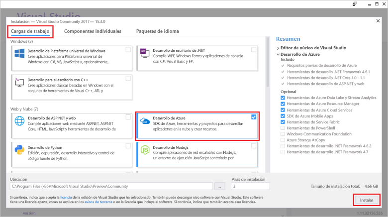

# <a name="create-an-azure-functions-http-trigger-with-an-azure-cosmos-db-input-binding"></a>Creación de un desencadenador HTTP de Azure Functions con un enlace de entrada de Azure Cosmos DB

Azure Cosmos DB es una base de datos de varios modelos distribuida globalmente que no tiene esquema ni servidor. Azure Functions es un servicio de procesos sin servidor que le permite ejecutar código a petición. Empareje estos dos servicios de Azure y tendrá la base de una arquitectura sin servidor que le permite centrarse en la creación de aplicaciones fantásticas y no preocuparse acerca del aprovisionamiento y el mantenimiento de servidores que cubran las necesidades del proceso y de la base de datos necesita.

Este tutorial se basa en el código creado en el artículo [Azure Cosmos DB: Compilar una aplicación de .NET mediante API Graph](create-graph-dotnet.md). Este tutorial agrega una función de Azure que contiene un [desencadenador HTTP](https://github.com/MicrosoftDocs/azure-docs-pr/azure-functions/functions-bindings-http-webhook.md#http-trigger). El desencadenador HTTP utiliza un [enlace de entrada](https://github.com/MicrosoftDocs/azure-docs-pr/azure-functions/functions-triggers-bindings.md) de Azure Cosmos DB para recuperar datos de la base de datos de grafos creada en la guía de inicio rápido. Este desencadenador HTTP concreto consulta los datos de Azure Cosmos DB, pero los enlaces de entrada de Azure Cosmos DB se pueden usar para recuperar los valores de entrada de datos de todo aquello que la función requiera.

En este tutorial se describen las tareas siguientes:

> [!div class="checklist"]
> * Creación de un proyecto de Azure Functions 
> * Creación de un desencadenador HTTP
> * Publicación de la función de Azure
> * Conexión de la función de Azure con la base de datos de Azure Cosmos DB

## <a name="prerequisites"></a>Requisitos previos

- [Versión 15.3 de Visual Studio 2017](https://www.visualstudio.com/vs/preview/), con la carga de trabajo **Desarrollo de Azure**.

    
    
- Después de instalar Visual Studio 2017 versión 15.3 o actualizar a esta versión, también debe actualizar manualmente las herramientas de Visual Studio 2017 para Azure Functions. Puede actualizar las herramientas del menú **Herramientas** situado bajo **Extensiones y actualizaciones...**  > **Actualizaciones** > **Visual Studio Marketplace** > **Herramientas de Azure Functions y Web Jobs** > **Actualizar**.

- Complete el tutorial [Azure Cosmos DB: desarrollo con API Graph en .NET](tutorial-develop-graph-dotnet.md) u obtenga el código de ejemplo del repositorio de GitHub [azure-cosmos-db-graph-dotnet-getting-started](https://github.com/Azure-Samples/azure-cosmos-db-graph-dotnet-getting-started) y compile el proyecto.
 
## <a name="build-a-function-in-visual-studio"></a>Compilación de una función en Visual Studio

1. Agregue un proyecto de **Azure Functions** proyecto a la solución haciendo clic con el botón derecho en el nodo de solución **del Explorador de soluciones** y, después, elija **Agregar** > **Nuevo proyecto**. Elija **Azure Functions** en el cuadro de diálogo cuadro y asígnele el nombre **PeopleDataFunctions**.

   

2. Después de crear el proyecto de Azure Functions, hay que realizar varias actualizaciones e instalaciones relacionadas con NuGet. 

    a. Para asegurarse de que tiene el SDK de Functions más reciente, use el Administrador de NuGet para actualizar el paquete **Microsoft.NET.Sdk.Functions**. En el **Explorador de soluciones**, haga clic con el botón derecho en el proyecto y seleccione **Administrar paquetes NuGet**. En la pestaña **Instalado**, seleccione Microsoft.NET.Sdk.Functions y haga clic en **Actualizar**.

   

    b. En la pestaña **Examinar**, escriba **azure.graphs** para buscar el paquete **Microsoft.Azure.Graphs** y haga clic en **Instalar**. Este paquete contiene el SDK de cliente .NET de API Graph.

   

    c. En la pestaña **Examinar**, escriba **mono.csharp** para buscar el paquete **Mono.CSharp** y. después, haga clic en **Instalar**.

   

3. El Explorador de soluciones debe incluir los paquetes que ha instalado, como se muestra aquí. 
   
   A continuación, es preciso escribir código, por lo que se va a agregar un nuevo elemento **Azure Functions** al proyecto. 

    a. Haga clic con el botón derecho del ratón en el nodo del proyecto en el **Explorador de soluciones** y, después, elija **Agregar** > **Nuevo elemento**.   
    b. En el cuadro de diálogo **Agregar nuevo elemento**, seleccione **Elementos de Visual C#**, seleccione **Función de Azure**, escriba **Search** como nombre del proyecto y haga clic en **Agregar**.  
 
   

4. La función de Azure responderá a las solicitudes HTTP, por lo que la plantilla de desencadenador de Http es adecuada aquí.
   
   En el cuadro **Nueva función de Azure**, seleccione **Desencadenador HTTP**. También deseamos que esta función de Azure esté "totalmente abierta", por lo que en **Derechos de acceso** seleccionamos **Anónimo**, lo que permite pasar a todos los usuarios. Haga clic en **Aceptar**.

   

5. Después de agregar Search.cs al proyecto de Azure Functions, copie estas instrucciones de **using** instrucciones sobre las instrucciones de using existentes:

   ```csharp
   using Microsoft.Azure.Documents;
   using Microsoft.Azure.Documents.Client;
   using Microsoft.Azure.Documents.Linq;
   using Microsoft.Azure.Graphs;
   using Microsoft.Azure.WebJobs;
   using Microsoft.Azure.WebJobs.Extensions.Http;
   using Microsoft.Azure.WebJobs.Host;
   using System;
   using System.Collections.Generic;
   using System.Configuration;
   using System.Linq;
   using System.Net;
   using System.Net.Http;
   using System.Threading.Tasks;
   ```

6. A continuación, reemplace el código de clase de la función de Azure por el código siguiente. El código busca en la base de datos de Azure Cosmos DB mediante la API Graph todas las personas o la persona específica identificado por el parámetro de la cadena de consulta `name` .

   ```csharp
   public static class Search
   {
       static string endpoint = ConfigurationManager.AppSettings["Endpoint"];
       static string authKey = ConfigurationManager.AppSettings["AuthKey"];

       [FunctionName("Search")]
       public static async Task<HttpResponseMessage> Run(
           [HttpTrigger(AuthorizationLevel.Anonymous, "get", "post", Route = null)]HttpRequestMessage req,
           TraceWriter log)
       {
           log.Info("C# HTTP trigger function processed a request.");

           // the person objects are free-form in structure
           List<dynamic> results = new List<dynamic>();

           // open the client's connection
           using (DocumentClient client = new DocumentClient(
               new Uri(endpoint),
               authKey,
               new ConnectionPolicy
               {
                   ConnectionMode = ConnectionMode.Direct,
                   ConnectionProtocol = Protocol.Tcp
               }))
           {
               // get a reference to the database the console app created
               Database database = await client.CreateDatabaseIfNotExistsAsync(
                   new Database
                   {
                       Id = "graphdb"
                   });

               // get an instance of the database's graph
               DocumentCollection graph = await client.CreateDocumentCollectionIfNotExistsAsync(
                   UriFactory.CreateDatabaseUri("graphdb"),
                   new DocumentCollection { Id = "graphcollz" },
                   new RequestOptions { OfferThroughput = 1000 });

               // build a gremlin query based on the existence of a name parameter
               string name = req.GetQueryNameValuePairs()
                   .FirstOrDefault(q => string.Compare(q.Key, "name", true) == 0)
                   .Value;

               IDocumentQuery<dynamic> query = (!String.IsNullOrEmpty(name))
                   ? client.CreateGremlinQuery<dynamic>(graph, string.Format("g.V('{0}')", name))
                   : client.CreateGremlinQuery<dynamic>(graph, "g.V()");

               // iterate over all the results and add them to the list
               while (query.HasMoreResults)
                   foreach (dynamic result in await query.ExecuteNextAsync())
                       results.Add(result);
           }

           // return the list with an OK response
           return req.CreateResponse<List<dynamic>>(HttpStatusCode.OK, results);
       }
   }
   ```

   El código es básicamente la misma lógica de conexión que en la aplicación de consola original que propagaba la base de datos, con una consulta simple para recuperar los registros coincidentes.

## <a name="debug-the-azure-function-locally"></a>Depuración local de la función de Azure

Ahora que el código está completo, puede usar las herramientas de depuración local de la función de Azure y el emulador para ejecutar el código localmente para probarlo.

1. Para que el código se ejecute correctamente, debe configurarlo para la ejecución local con la información de conexión de Azure Cosmos DB. Puede usar el archivo local.settings.json para configurar la función de Azure para la ejecución local de la misma manera que utilizaría el archivo App.config para configurar la aplicación de consola original para la ejecución.

    Para ello, agregue las siguientes líneas de código a local.settings.json y cópielas en Endpoint y Authkey desde el archivo App.Config del proyecto GraphGetStarted, como se muestra en la siguiente imagen.

   ```json
    "Endpoint": "",
    "AuthKey": ""
    ```

   

2. Cambie el proyecto de inicio a la nueva aplicación Functions. En el **Explorador de soluciones**, haga clic con el botón derecho en **PeopleDataFunctions** y seleccione **Establecer como proyecto de inicio**.

3. En el **Explorador de soluciones**, haga clic con el botón derecho en **Dependencias** en el proyecto **PeopleDataFunctions** y haga clic en **Agregar referencia**. En la lista, seleccione System.Configuration y haga clic en **Aceptar**.

3. Ahora vamos a ejecutar la aplicación. Presione F5 para iniciar la herramienta de depuración local, func.exe, con el código de Azure Function hospedado y listo para usarse.

   Al final de la salida inicial de func.exe, se ve que Azure Functions se hospeda en localhost:7071. Esto resulta útil para probarlo en un cliente.

   

4. Para probar la función de Azure, use [Visual Studio Code](http://code.visualstudio.com/) con la extensión de Huachao Mao, [REST Client](https://marketplace.visualstudio.com/items?itemName=humao.rest-client). REST Client ofrece la funcionalidad de solicitud HTTP local o remota haciendo un solo clic con el botón derecho. 

    Para ello, cree un nuevo archivo denominado test-function-locally.http y agregue el código siguiente:

    ```http
    get http://localhost:7071/api/Search

    get http://localhost:7071/api/Search?name=ben
   ```

    Ahora, haga clic con el botón derecho en la primera línea de código y seleccione **Enviar solicitud**, como se muestra en la siguiente imagen.

   

   Se le presenta la respuesta HTTP sin formato de los encabezados de Azure Functions que se ejecutan localmente, el contenido del cuerpo JSON, todo.

   

5. Ahora seleccione la segunda línea de código y, después, seleccione **Enviar solicitud**. Mediante la incorporación del parámetro de cadena de búsqueda `name` con un valor que se sepa que se encuentra en la base de datos, se pueden filtrar los resultados que devuelve la función de Azure.

   

Una vez que la función de Azure se ha validado y parece funcionar correctamente, el último paso es realizar su publicación en Azure App Service y configurarla para que se ejecute en la nube.

## <a name="publish-the-azure-function"></a>Publicación de la función de Azure

1. En el **Explorador de soluciones**, haga clic con el botón derecho en el proyecto y seleccione **Publicar**.

   

2. Estamos listos para publicarlo en la nube para probarlo en un escenario disponible públicamente. En la pestaña **Publicar**, seleccione **Azure Function App**, **Crear nuevo** para crear una función de Azure en su suscripción de Azure y, después, haga clic en **Publicar**.

   

3. En el cuadro de diálogo **Publicar**, haga lo siguiente:
   
    a. En **Nombre de aplicación**, asigne un nombre único a la función.

    b. En **Suscripción**, seleccione la suscripción de Azure que se va a usar.
   
    c. En **Grupo de recursos**, cree un nuevo grupo de recursos y asígnele el mismo nombre que a la aplicación.
   
    d. En **Plan de App Service**, haga clic en **Nuevo** para crear un nuevo plan de App Service basado en el consumo, ya que tenemos intención de usar el método de facturación de pago por uso para la función de Azure sin servidor. Use los valores predeterminados en la página **Configurar el plan de App Service** y, después, haga clic en **Aceptar**.
   
    e. En **Cuenta de almacenamiento**, haga también clic en **Nueva** para crear una nueva cuenta de almacenamiento para usar con la función de Azure, en caso de que alguna vez se necesite compatibilidad con blobs, tablas o colas para desencadenar la ejecución de otra funcionalidad. Use los valores predeterminados en la página **Cuenta de Storage** y haga clic en **Aceptar**.

    f. Luego, haga clic en el botón **Crear** del cuadro de diálogo para crear todos los recursos en la suscripción a Azure. Visual Studio descarga un perfil público (un archivo XML simple) que usará la próxima vez que publique su código de Azure Functions.

   

    Luego, Visual Studio muestra una página Publicar que puede usar si realiza cambios en la función y necesita volver a publicarla. No es preciso que realice todas las acciones de dicha página ahora mismo.

4. Después de que se publique la función de Azure, puede ir a la página [Azure Portal](https://portal.azure.com/) de la función de Azure. Allí puede ver un vínculo a la **configuración de la aplicación** de la función de Azure. ábralo para configurar la instancia de Azure Functions activa para la conectividad a la base de datos de Azure Cosmos DB con sus datos personales.

   

5. Como ya ha hecho en el archivo App.config de la aplicación de consola y en el archivo local.settings.json de la aplicación de Azure Function App, tendrá que agregar Endpoint y AuthKey a la base de datos de Azure Cosmos DB a la función publicada. De esta manera, nunca tiene insertar en el repositorio el código de configuración que contiene las claves (puede configurarlas en el portal y asegurarse de que no se almacenan en el control de código fuente). Para agregar cada valor, haga clic en el botón **Agregar nueva configuración**, agregue **Endpoint** y su valor de app.config, vuelva a hacer clic en **Agregar nueva configuración** y agregue tanto **AuthKey** como su valor personalizado. Una vez que haya agregado y guardado los valores, la configuración debería ser similar a la siguiente.

   

6. Una vez que la función de Azure esté configurado correctamente en la suscripción a Azure, puede volver a usar la extensión REST Client de Visual Studio Code para consultar la dirección URL de la función de Azure disponible públicamente. Agregue estas dos líneas de código al archivo test-function-locally.http y ejecutar todas y cada una de las líneas para probar esta función. Reemplace el nombre de la función en la dirección URL por el nombre de su función.

    ```json
    get https://peoplesearchfunction.azurewebsites.net/api/Search

    get https://peoplesearchfunction.azurewebsites.net/api/Search?name=thomas
    ```

    La función responde con los datos recuperados de Azure Cosmos DB.

    


## <a name="next-steps"></a>Pasos siguientes

En este tutorial, ha hecho lo siguiente:

> [!div class="checklist"]
> * Ha creado un proyecto de Azure Functions 
> * Ha creado un desencadenador HTTP
> * Ha publicado la función de Azure
> * Ha conectado la función con la base de datos de Azure Cosmos DB

Ahora puede continuar a la sección de conceptos para obtener más información sobre Cosmos DB.

> [!div class="nextstepaction"]
> [Distribución global](distribute-data-globally.md) 

Este artículo se basa en uno de los blogs de la serie [Schemaless & Serverless de Brady Gaster](http://www.bradygaster.com/category/%20Serverless%20&%20Schemaless). Para ver otras publicaciones de la serie, visite dicho blog.
