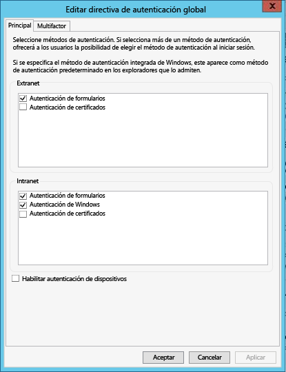

# Introducción a Azure Data Catalog
Azure Data Catalog es un servicio en la nube totalmente administrado que actúa como sistema de registro y de detección para recursos de datos empresariales. Si desea información detallada, consulte [¿Qué es Azure Data Catalog](data-catalog-what-is-data-catalog.md).

Este tutorial le ayudará a empezar a trabajar con Azure Data Catalog. En este tutorial, se realizan los siguientes procedimientos:

| Procedimiento | DESCRIPCIÓN |
|:--- |:--- |
| [Aprovisionamiento del catálogo de datos](#provision-data-catalog) |En este procedimiento, se aprovisiona o se configura Azure Data Catalog. Este paso solo se realiza si el catálogo no se ha configurado antes. Solo puede haber un catálogo de datos por organización (dominio de Microsoft Azure Active Directory), aunque haya varias suscripciones asociadas a su cuenta de Azure. |
| [Registro de los recursos de datos](#register-data-assets) |En este procedimiento, se registran los recursos de datos de la base de datos de ejemplo AdventureWorks2014 con el catálogo de datos. Registro es el proceso de extraer metadatos estructurales clave (como nombres, tipos y ubicaciones) del origen de datos, y copiar esos metadatos en el catálogo. El origen de datos y los recursos de datos permanecen donde están, pero el catálogo usa los metadatos para que se puedan detectar y comprender más fácilmente. |
| [Detección de los recursos de datos](#discover-data-assets) |En este procedimiento, se usa el portal de Azure Data Catalog para detectar los recursos de datos que se registraron en el paso anterior. Cuando un origen de datos se haya registrado en Azure Data Catalog, el servicio indexa sus metadatos, con el fin de que los usuarios puedan buscar fácilmente los datos que necesitan. |
| [Anotación de los recursos de datos](#annotate-data-assets) |En este procedimiento, se proporcionan anotaciones (información como descripciones, etiquetas, documentación o expertos) para los recursos de datos. Esta información complementa los metadatos extraídos del origen de datos y hace que más personas comprendan mejor el origen de datos. |
| [Conexión con los recursos de datos](#connect-to-data-assets) |En este procedimiento se abren los recursos de datos en herramientas de cliente integradas (como Excel y SQL Server Data Tools) y en una herramienta no integrada (SQL Server Management Studio). |
| [Administración de recursos de datos](#manage-data-assets) |En este procedimiento, se configura la seguridad de los recursos de datos. Catálogo de datos no ofrece a los usuarios acceso a los mismos datos. El propietario del origen de datos controla el acceso a los datos.    Con Catálogo de datos se pueden detectar los orígenes de datos y ver los **metadatos** relacionados con los orígenes registrados en el catálogo. Sin embargo, puede haber situaciones en las que solo determinados usuarios o miembros de grupos concretos deberían poder ver los orígenes de datos. Para estos escenarios, Catálogo de datos se puede usar para tomar propiedad de los recursos de datos registrados en el catálogo y controlar la visibilidad de los recursos que se poseen. |
| [Eliminación de los recursos de datos](#remove-data-assets) |En este procedimiento se aprende a quitar los recursos de datos del catálogo de datos. |

## Requisitos previos de tutoriales
### Suscripción de Azure
Para configurar Azure Data Catalog, debe ser propietario o copropietario de una suscripción de Azure.

Las suscripciones de Azure le ayudan a organizar el acceso a los recursos de servicio en la nube como Azure Data Catalog. También le ayudan a controlar cómo se informa, factura y paga el uso de recursos. Cada suscripción puede tener una configuración de facturación y pago diferente, por lo que puede tener varias suscripciones y planes diferentes por departamento, proyecto, oficina regional, etc. Cada servicio en la nube pertenece a una suscripción, y debe tener una suscripción para poder configurar Azure Data Catalog. Para más información, consulte [Administración de cuentas, suscripciones y roles administrativos](../active-directory/active-directory-how-subscriptions-associated-directory.md).

Si no tiene una suscripción, puede crear una cuenta de prueba gratuita en tan solo un par de minutos. Para más información, consulte [Evaluación gratuita](https://azure.microsoft.com/pricing/free-trial/) .

### Azure Active Directory
Para configurar Azure Data Catalog, debe haber iniciado sesión con una cuenta de usuario de Azure Active Directory (Azure AD). Debe ser propietario o copropietario de una suscripción de Azure.  

Azure AD proporciona una manera fácil de que cualquier empresa pueda administrar la identidad y el acceso, tanto en la nube como de forma local. Puede usar una única cuenta profesional o educativa para iniciar sesión en cualquier aplicación web en la nube o local. Azure Data Catalog usa Azure AD para autenticar el inicio de sesión. Para más información, consulte [¿Qué es Azure Active Directory?](../active-directory/active-directory-whatis.md)

### Configuración de directivas de Azure Active Directory
Se puede dar el caso de que pueda iniciar sesión en el portal de Azure Data Catalog, pero al intentar iniciar sesión en la herramienta de registro de orígenes de datos, se mostrará un mensaje de error que le impedirá hacerlo. Dicho error puede aparecer cuando se utiliza la red de la empresa o cuando la conexión se realiza desde fuera de la red de la empresa.

La herramienta de registro usa la *autenticación de formularios* para validar los inicios de sesión de usuario en Azure Active Directory. Para que el inicio de sesión sea correcto, un administrador de Azure Active Directory tiene que habilitar la autenticación de formularios en la *directiva de autenticación global*.

Con la directiva de autenticación global se puede habilitar la autenticación de forma independiente para las conexiones de extranet y de intranet, como se muestra en la siguiente imagen. Pueden producirse errores de inicio de sesión si no está habilitada la autenticación de formularios en la red desde la que se conecta.

 

Para más información, consulte [Configuración de directivas de autenticación](https://technet.microsoft.com/library/dn486781.aspx).

## Aprovisionamiento del catálogo de datos
Solo se puede aprovisionar un catálogo de datos por organización (dominio de Azure Active Directory). Por consiguiente, si el propietario o copropietario de una suscripción de Azure que pertenezca a dicho dominio de Active Directory ya ha creado un catálogo, no podrá volver a crear otro, aunque tenga varias suscripciones de Azure. Para comprobar si algún usuario ha creado un catálogo de datos en un dominio de Azure Active Directory, vaya a la [página principal de Azure Data Catalog](http://azuredatacatalog.com) y compruebe si ve un catálogo. Si ya hay un catálogo creado, omita el siguiente procedimiento y vaya a la siguiente sección.    

1. Vaya a la [página del servicio Data Catalog](https://azure.microsoft.com/services/data-catalog) y haga clic en **Introducción**.
   
    
2. Inicie sesión con la cuenta de un usuario que sea el propietario o copropietario de una suscripción de Azure. Tras iniciar sesión verá la página siguiente.
   
    
3. Especifique el **nombre** del catálogo de datos, la **suscripción** que desea usar y la **ubicación** del catálogo.
4. Expanda **Precios** y seleccione una **edición** de Azure Data Catalog (Gratis o Estándar).
    
5. Expanda **Usuarios de catálogo** y haga clic en **Agregar** para agregar usuarios al catálogo de datos. Se le agregará automáticamente a este grupo.
    
6. Expanda **Administradores de catálogo** y haga clic en **Agregar** para agregar más administradores al catálogo de datos. Se le agregará automáticamente a este grupo.
    
7. Haga clic en **Crear catálogo** para crear el catálogo de datos de la organización. Una vez que el catálogo de datos se haya creado verá su página principal.
        

### Búsqueda de un catálogo de datos en el Portal de Azure
1. En otra pestaña o en otra ventana del explorador web, vaya al [Azure Portal](https://portal.azure.com) e inicie sesión con la misma cuenta que usó para crear el catálogo de datos en el paso anterior.
2. Seleccione **Examinar** y haga clic en **Catálogo de datos**.
   
     Verá el catálogo de datos que ha creado.
   
    
3. Haga clic en el catálogo que ha creado. Verá la hoja **Catálogo de datos** en el portal.
   
   
4. Puede ver las propiedades del catálogo de datos y actualizarlas. Por ejemplo, haga clic en **Plan de tarifa** y cambie la edición.
   
    

### Base de datos de ejemplo Adventure Works
En este tutorial, registrará recursos de datos (tablas) de la base de datos de ejemplo Adventure Works2014 para el motor de base de datos de SQL Server, pero puede usar cualquier origen de datos compatible si prefiere trabajar con datos que conozca y que sean relevantes para su rol. Para ver una lista de los orígenes de datos compatibles, consulte [Orígenes de datos compatibles con Azure Data Catalog](data-catalog-dsr.md).

### Instalación de la base de datos Adventure Works 2014 OLTP
La base de datos Adventure Works admite escenarios de procesamiento de transacciones en línea estándar para un fabricante de bicicletas ficticio (Adventure Works Cycles), que incluyen productos, ventas y compras. En este tutorial registrará información acerca de los productos en Azure Data Catalog.

Para instalar la base de datos de ejemplo Adventure Works:

1. Descargue el archivo [Adventure Works 2014 Full Database Backup.zip](https://msftdbprodsamples.codeplex.com/downloads/get/880661) en CodePlex.
2. Para restaurar la base de datos en su máquina, siga las instrucciones de [Restore a Database Backup Using SSMS](http://msdn.microsoft.com/library/ms177429.aspx)(Restauración de una base de datos mediante SSMS) o realice estos pasos:
   1. Abra SQL Server Management Studio y conéctese al motor de base de datos de SQL Server.
   2. Haga clic con el botón derecho en **Bases de datos** y seleccione **Restaurar base de datos**.
   3. En **Restaurar base de datos**, haga clic en la opción **Dispositivo** de **Origen** y en **Examinar**.
   4. En **Seleccionar dispositivos de copia de seguridad**, haga clic en **Agregar**.
   5. Vaya a la carpeta en la que tenga el archivo **AdventureWorks2014.bak**, selecciónelo y haga clic en **Aceptar** para cerrar el cuadro de diálogo **Buscar archivo de copia de seguridad**.
   6. Haga clic en **Aceptar** para cerrar el cuadro de diálogo **Seleccionar dispositivos de copia de seguridad**.    
   7. Haga clic en **Aceptar** para cerrar el cuadro de diálogo **Restaurar base de datos**.

Ya puede registrar recursos de datos de la base de datos de ejemplo Adventure Works mediante Azure Data Catalog.

## Registro de los recursos de datos
En este ejercicio se usa la herramienta de registro para registrar los recursos de datos de la base de datos Adventure Works en el catálogo. El registro es el proceso de extraer metadatos estructurales clave (como nombres, tipos y ubicaciones) del origen de datos y los recursos que contiene, y copiar dichos metadatos en el catálogo. El origen de datos y los recursos de datos permanecen donde están, pero el catálogo usa los metadatos para que se puedan detectar y comprender más fácilmente.

### Registro de un origen de datos
1. Vaya a la [página principal de Azure Data Catalog](http://azuredatacatalog.com) y haga clic en **Publicar datos**.
   
   
2. Haga clic en **Iniciar aplicación** para descargar, instalar y ejecutar la herramienta de registro en el equipo.
   
   
3. En la **página principal**, haga clic en **Iniciar sesión** y escriba sus credenciales.     
   
    
4. En la página **Microsoft Azure Data Catalog**, haga clic en **SQL Server** y en **Siguiente**.
   
    
5. Especifique las propiedades de la conexión de SQL Server para **AdventureWorks2014** (consulte el ejemplo siguiente) y haga clic en **CONECTAR**.
   
   
6. Registre los metadatos del recurso de datos. En este ejemplo, registre los objetos de **Production/Product** desde el espacio de nombres Production de AdventureWorks:
   
   1. En el árbol **Jerarquía de servidor**, expanda **AdventureWorks2014** y haga clic en **Production**.
   2. Seleccione **Product**, **ProductCategory**, **ProductDescription** y **ProductPhoto** mediante Ctrl + clic.
   3. Haga clic en la **flecha de movimiento de selección** (**>**). Esta acción mueve todos los objetos seleccionados a la lista **Objetos que se registrarán** .
      
      
   4. Seleccione **Include a Preview** (Incluir vista previa) para incluir una vista previa de instantánea de los datos. La instantánea incluye hasta 20 registros de cada tabla y se copia en el catálogo.
   5. Seleccione **Incluir perfil de datos** para incluir una instantánea de las estadísticas del objeto del perfil de datos (por ejemplo: los valores mínimo, máximo y medio de una columna, o el número de filas).
   6. En **Agregar etiquetas**, escriba **adventure works, cycles**. Esta acción agrega etiquetas de búsqueda a estos recursos de datos. Las etiquetas son una excelente manera de ayudar a los usuarios a buscar un origen de datos registrados.
   7. Especifique el nombre de un **experto** en estos datos (opcional).
      
      
   8. Haga clic en **REGISTRAR**. Azure Data Catalog registra los objetos seleccionados. En este ejercicio, se registran los objetos seleccionados de Adventure Works. La herramienta de registro extrae metadatos del recurso de datos y los copia en el servicio Azure Data Catalog. Los datos permanecen donde residen en ese momento y quedan bajo el control de los administradores y las directivas del sistema actual.
      
      
   9. Para ver los objetos de origen de datos registrados, haga clic en **Ver portal**. En el portal de Azure Data Catalog, confirme que ve las cuatro tablas y la base de datos en la vista de cuadrícula.
      
      

En este ejercicio ha registrado objetos de la base de datos de ejemplo Adventure Works para que los usuarios de la organización puedan detectarlos fácilmente. En el siguiente ejercicio aprenderá a detectar recursos de datos registrados.

## Detección de los recursos de datos
La detección en Azure Data Catalog usa dos mecanismos principales: la búsqueda y el filtrado.

La búsqueda está diseñada para ser intuitiva y eficaz. De forma predeterminada, los términos de la búsqueda se comparan todas las propiedades del catálogo, incluidas las anotaciones proporcionadas por el usuario.

El filtrado está diseñado para complementar la búsqueda. Puede seleccionar características específicas como expertos, tipos de origen de datos, tipos de objeto y etiquetas, para ver los recursos de datos que coincidan y para restringir los resultados de la búsqueda a los recursos correspondientes.

Con una combinación de la búsqueda y el filtrado, puede navegar rápidamente a través de los orígenes de datos registrados con Azure Data Catalog para detectar los recursos de datos que necesita.

En este ejercicio se usa el portal de Azure Data Catalog para detectar los recursos de datos que registró en el ejercicio anterior. Para más información acerca de la sintaxis de búsqueda, consulte [Referencia de sintaxis de búsqueda en Data Catalog](https://msdn.microsoft.com/library/azure/mt267594.aspx) .

A continuación hay varios ejemplos de detección de recursos de datos en el catálogo.  

### Detección de recursos de datos con la búsqueda básica
La búsqueda básica permite buscar en un catálogo con uno o varios términos de búsqueda. Los resultados son los recursos que tienen alguna propiedad que coincide con uno o varios de los términos especificados.

1. Haga clic en **Inicio** en el portal del Azure Data Catalog. Si ha cerrado el explorador web, vaya a la [página principal de Azure Data Catalog](https://www.azuredatacatalog.com).
2. En el cuadro de búsqueda, escriba `cycles` y presione **ENTRAR**.
   
    
3. Confirme que ve las cuatro tablas y la base de datos (AdventureWorks2014) en los resultados. Para alternar entre la **vista de cuadrícula** y la **vista de lista**, haga clic en los botones de la barra de herramientas, como se muestra en la siguiente imagen. Observe que la palabra clave de la búsqueda aparece resaltada en los resultados de la búsqueda, ya que la opción **Resaltar** está **activada**. También puede especificar el número de **resultados por página** .
   
    
   
    El panel **Búsquedas** está a la izquierda y el panel **Propiedades**, a la derecha. En panel **Búsquedas** se pueden cambiar los criterios de búsqueda y filtrar los resultados. El panel **Propiedades** muestra las propiedades de un objeto seleccionado en la cuadrícula o en la lista.
4. Haga clic en **Product** en los resultados de la búsqueda. Haga clic en las pestañas **Vista previa**, **Columnas**, **Perfil de datos** y **Documentación**, o bien haga clic en la flecha para expandir el panel inferior.  
   
    
   
    En la pestaña **Vista previa**, se muestra una vista previa de los datos de la tabla **Product**.  
5. Haga clic en la pestaña **Columnas** para buscar detalles de las columnas (como el **nombre** y el **tipo de datos**) en el recurso de datos.
6. Haga clic en la pestaña **Perfil de datos** para ver la generación de perfiles de los datos (por ejemplo: número de filas, tamaño de los datos o valor mínimo de una columna) en el recurso de datos.
7. Filtre los resultados con la pestaña **Filtros** de la izquierda. Por ejemplo, haga clic en **Tabla** en **Tipo de objeto** y verá solo las cuatro tablas, no la base de datos.
   
    

### Detección de recursos de datos con ámbito de propiedad
El ámbito de una propiedad le ayuda a detectar recursos de datos en los que el término de búsqueda coincide con la propiedad especificada.

1. Desactive el filtro **Tabla** en **Tipo de objeto** en **Filtros**.  
2. En el cuadro de búsqueda, escriba `tags:cycles` y presione **ENTRAR**. En [Referencia de sintaxis de búsqueda en Data Catalog](https://msdn.microsoft.com/library/azure/mt267594.aspx) encontrará todas las propiedades que se pueden usar en las búsquedas en el catálogo de datos.
3. Confirme que ve las cuatro tablas y la base de datos (AdventureWorks2014) en los resultados.  
   
    

### Guardado de una búsqueda
1. En el panel **Búsquedas** de la sección **Búsqueda actual**, escriba el nombre de la búsqueda y haga clic en **Guardar**.
   
    
2. Confirme que la búsqueda guardada se muestra en **Búsquedas guardadas**.
   
    
3. Seleccione una de las acciones que puede realizar en la búsqueda guardada (**Cambiar nombre**, **Eliminar**, **Guardar como predeterminado**).
   
    

### Operadores booleanos
Cualquier búsqueda puede ampliarse o restringirse con operadores booleanos.

1. En el cuadro de búsqueda, escriba `tags:cycles AND objectType:table`y presione **ENTRAR**.
2. Confirme que en los resultados solo ve tablas (no la base de datos).  
   
    

### Agrupación con paréntesis
Mediante los paréntesis se pueden agrupar partes de la consulta para conseguir el aislamiento lógico, especialmente junto con los operadores booleanos.

1. En el cuadro de búsqueda, escriba `name:product AND (tags:cycles AND objectType:table)` y presione **ENTRAR**.
2. Confirme que en los resultados de la búsqueda solo ve la tabla **Product** .
   
       

### Operadores de comparación
Con los operadores de comparación puede usar comparaciones diferentes de la igualdad de propiedades que tengan tipos de datos numéricos y de fechas.

1. En el cuadro de búsqueda, escriba `lastRegisteredTime:>"06/09/2016"`.
2. Desactive el filtro **Tabla** en **Tipo de objeto**.
3. Presione **ENTRAR**.
4. Confirme que ve las tablas **Product**, **ProductCategory**, **ProductDescription** y **ProductPhoto**, y la base de datos AdventureWorks2014 que registró en los resultados de la búsqueda.
   
    

Consulte [Detección de orígenes de datos](data-catalog-how-to-discover.md) para ver información detallada sobre la detección de recursos de datos y la [referencia de sintaxis de búsqueda en Data Catalog](https://msdn.microsoft.com/library/azure/mt267594.aspx) para conocer la sintaxis de búsqueda.

## Anotación de los recursos de datos
En este ejercicio, usará el portal de Azure Data Catalog para anotar (agregar información como descripciones, etiquetas o expertos) los recursos de datos que ha registrado anteriormente en el catálogo. Las anotaciones complementan y mejoran los metadatos estructurales extraídos del origen de datos durante el registro y hace que los recursos de datos sean mucho más fáciles de detectar y entender.

En este ejercicio, se anota un único recurso de datos (ProductPhoto). y se agrega un nombre descriptivo y una descripción al recurso de datos ProductPhoto.  

1. Vaya a la [página principal de Azure Data Catalog](https://www.azuredatacatalog.com) y busque con `tags:cycles` para encontrar los recursos de datos que ha registrado.  
2. Haga clic en **ProductPhoto** en los resultados de la búsqueda.  
3. Escriba **Imágenes de productos** en **Nombre descriptivo** y **Fotos de productos para materiales de marketing** en **Descripción**.
   
    
   
    El contenido del campo **Descripción** ayuda a otros usuarios a detectar el recurso de datos seleccionado y entender por qué y cómo se usa. También se pueden agregar otras etiquetas y ver columnas. Ya puede intentar buscar y filtrar para detectar recursos de datos mediante los metadatos descriptivos que haya agregado al catálogo.

Tenga en cuenta que en esta página también se pueden realizar estas otras acciones:

* Agregar a expertos para el recurso de datos. Haga clic en **Agregar** in the **Expertos** .
* Agregar etiquetas en el nivel de conjunto de datos. Haga clic en **Agregar** in the **Etiquetas** . Una etiqueta puede ser una etiqueta de usuario o una etiqueta de glosario. La edición estándar del Catálogo de datos incluye un glosario empresarial que ayuda a los administradores del catálogo a definir una taxonomía empresarial central. Después, los usuarios del catálogo pueden anotar los recursos de datos con los términos del glosario. Para más información, consulte [Configuración del glosario empresarial para el etiquetado regulado](data-catalog-how-to-business-glossary.md)
* Agregar etiquetas a nivel de columna. Haga clic en **Agregar** under **Etiquetas** para la columna en la que desee realizar anotaciones.
* Agregar descripción en el nivel de columna. En **Descripción** , escriba la descripción de la columna. También puede ver los metadatos de descripción extraídos del origen de datos.
* Agregue la información de **Solicitar acceso** que muestra a los usuarios cómo solicitar acceso al recurso de datos.
  
    
* Elija la pestaña **Documentación** y proporcione la documentación del recurso de datos. Con la documentación de Azure Data Catalog se puede usar un catálogo de datos como repositorio de contenido para crear una descripción completa de los recursos de datos.
  
    

También puede agregar una anotación a varios recursos de datos. Por ejemplo, puede seleccionar todos los recursos de datos que ha registrado y especificar un experto para ellos.

Azure Data Catalog admite un enfoque de colaboración abierta distribuida con respecto a las anotaciones. Esto conlleva que cualquier usuario de Catálogo de datos puede agregar etiquetas (usuario o glosario), descripciones y otros metadatos. Por tanto, cualquier usuario con una perspectiva sobre un recurso de datos y su uso puede capturar dicha perspectiva para que esté disponible para otros usuarios.

Consulte [Anotación de recursos de datos](data-catalog-how-to-annotate.md) para ver información detallada acerca de cómo anotar recursos de datos.

## Conexión con los recursos de datos
En este ejercicio, se abren recursos de datos en una herramienta cliente integrada (Excel) y en una herramienta no integrada (SQL Server Management Studio) mediante la información de conexión.

> [!NOTE]
> Es importante recordar que Azure Data Catalog no brinda acceso al origen de datos en sí, simplemente facilita su detección y comprensión. Al conectarse a un origen de datos, la aplicación cliente que elija usa sus credenciales de Windows o le solicita las credenciales cuando sea necesario. Si no se le ha otorgado previamente acceso al origen de datos, será preciso que se le otorgue para que se pueda conectar.
> 
> 

### Conexión a un recurso de datos desde Excel
1. Seleccione **Product** en los resultados de la búsqueda. Haga clic en **Abrir en** en la barra de herramientas y en **Excel**.
   
    
2. Haga clic en **Abrir** en la ventana emergente de descarga. Este proceso puede variar en función del explorador.
   
    
3. En la ventana **Aviso de seguridad de Microsoft Excel**, haga clic en **Habilitar**.
   
    
4. Mantenga los valores predeterminados del cuadro de diálogo **Importar datos** y haga clic en **Aceptar**.
   
    
5. Vea el origen de datos en Excel.
   
    

En este ejercicio se ha conectado a los recursos de datos detectados mediante Azure Data Catalog. Con el portal de Azure Data Catalog, puede conectarse directamente mediante las aplicaciones cliente integradas en el menú **Abrir en** . También puede conectarse con cualquier aplicación que elija mediante la información de la ubicación de la conexión incluida en los metadatos del recurso. Por ejemplo, puede utilizar SQL Server Management Studio para conectarse a la base de datos AdventureWorks2014 para acceder a los datos de los recursos de datos registrados en este tutorial.

1. Abra **SQL Server Management Studio**.
2. En el cuadro de diálogo **Conectar con el servidor**, escriba el nombre del servidor del panel **Propiedades** del portal de Azure Data Catalog.
3. Use la autenticación y las credenciales apropiadas para acceder al recurso de datos. Si no tiene acceso, utilice la información del campo **Solicitar acceso** para obtenerla.
   
    

Haga clic en **Ver cadenas de conexión** para ver y copiar las cadenas de conexión ADF.NET, ODBC y OLEDB en el Portapapeles para utilizarlas en la aplicación.

## Administración de recursos de datos
En este paso, verá cómo se configura la seguridad de los recursos de datos. Catálogo de datos no ofrece a los usuarios acceso a los mismos datos. El propietario del origen de datos controla el acceso a los datos.

Catálogo de datos se puede usar para detectar los orígenes de datos y ver los metadatos relacionados con los orígenes registrados en el catálogo. Sin embargo, puede haber situaciones en las que los orígenes de datos solo deben verlos determinados usuarios o miembros de grupos concretos. Para estos escenarios, Catálogo de datos se puede usar para tomar propiedad de los recursos de datos registrados en el catálogo y, posteriormente, controlar la visibilidad de los recursos que se poseen.

> [!NOTE]
> Las funcionalidades de administración descritas en este ejercicio solo están disponibles en la edición estándar de Azure Data Catalog, no en la edición gratuita.
> En Azure Data Catalog, puede tomar propiedad de los recursos de datos, agregar copropietarios a los recursos de datos y establecer la visibilidad de los recursos de datos.
> 
> 

### Toma de propiedad de los recursos de datos y restricción de la visibilidad
1. Vaya a la [página principal de Azure Data Catalog](https://www.azuredatacatalog.com). En el cuadro de texto **Buscar**, escriba `tags:cycles` y presione **ENTRAR**.
2. Haga clic en un elemento de la lista de resultados y haga clic en **Tomar propiedad** en la barra de herramientas.
3. En la sección **Administración** del panel **Propiedades**, haga clic en **Tomar propiedad**.
   
    
4. Para restringir la visibilidad, elija **Propietarios y estos usuarios** en la sección **Visibilidad** y haga clic en **Agregar**. Escriba las direcciones de correo electrónico de los usuarios en el cuadro de texto y presione **ENTRAR**.
   
    

## Eliminación de los recursos de datos
En este ejercicio se usa el portal de Azure Data Catalog para quitar los datos de vista previa de los recursos de datos registrados y eliminar los recursos de datos del catálogo.

En Azure Data Catalog se pueden eliminar uno o varios recursos.

1. Vaya a la [página principal de Azure Data Catalog](https://www.azuredatacatalog.com).
2. En el cuadro de texto **Buscar**, escriba `tags:cycles` y haga clic en **ENTRAR**.
3. Seleccione un elemento de la lista de resultados y haga clic en **Eliminar** en la barra de herramientas, como se muestra en la siguiente imagen:
   
    
   
    Si utiliza la vista de lista, la casilla está a la izquierda del elemento, como se muestra en la siguiente imagen:
   
    
   
    También puede seleccionar varios recursos de datos y eliminarlos, según se muestra en la siguiente imagen:
   
    

> [!NOTE]
> El comportamiento predeterminado del catálogo es permitir que cualquier usuario registre cualquier origen de datos y permitir que cualquier usuario elimine cualquier recurso de datos que se haya registrado. Las funcionalidades de administración que se incluyen en la edición estándar de Azure Data Catalog proporcionan más opciones para la toma de propiedad de los recursos, ya que restringen quiénes puede detectar y eliminar los recursos.
> 
> 

## Resumen
En este tutorial ha explorado las funcionalidades esenciales de Azure Data Catalog, entre las que se incluyen el registro, la anotación, la detección y la administración de recursos de datos empresariales. Ahora que ha completado el tutorial, ha llegado el momento de comenzar. Puede empezar hoy mismo por registrar los orígenes de datos en los que confían usted y su equipo, e invitando a compañeros a usar el catálogo.

## Referencias
* [Registro de recursos de datos](data-catalog-how-to-register.md)
* [Detección de recursos de datos](data-catalog-how-to-discover.md)
* [Anotación de recursos de datos](data-catalog-how-to-annotate.md)
* [Documentación de recursos de datos](data-catalog-how-to-documentation.md)
* [Conexión a recursos de datos](data-catalog-how-to-connect.md)
* [Cómo administrar recursos de datos](data-catalog-how-to-manage.md)

