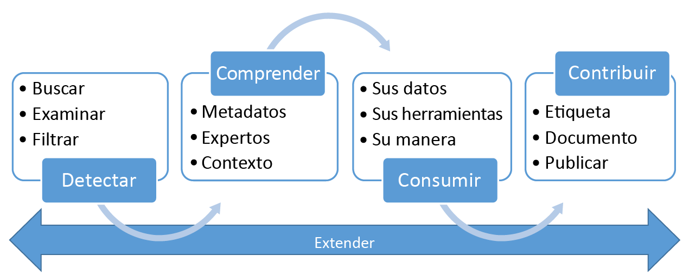

# ¿Qué es Azure Data Catalog?
Azure Data Catalog es un servicio en la nube totalmente administrado cuyos usuarios pueden detectar los orígenes de datos que necesitan y comprender los orígenes de datos que encuentran. Al mismo tiempo, Data Catalog ayuda a las organizaciones a obtener más valor de sus inversiones existentes. 

Con Data Catalog, cualquier usuario (analista, científico de datos o desarrollador) puede detectar, comprender y consumir orígenes de datos. Data Catalog incluye un modelo de colaboración abierta distribuida de metadatos y anotaciones. Es un único lugar centralizado para que todos los usuarios de una organización aporten sus conocimientos y generen una comunidad y la referencia cultural de los datos.

## Desafíos de detección para los consumidores de datos
Tradicionalmente, la detección de orígenes de datos empresariales ha sido un proceso orgánico basado en conocimiento tribal. Este enfoque presenta varios desafíos a las empresas que desean sacar el máximo partido de sus recursos de información:

* Es posible que los usuarios no sepan que un origen de datos existe, a menos que se lo encuentren como parte de otro proceso. No hay ninguna ubicación central en la que estén registrados los orígenes de datos.
* Salvo que los usuarios conozcan la ubicación de un origen de datos, no se podrán conectar a los datos mediante una aplicación cliente. Las experiencias de consumo de datos requieren que los usuarios conozcan la cadena de conexión o la ruta de acceso.
* Salvo que los usuarios conozcan la ubicación de la documentación de un origen de datos, no podrán conocer los usos previstos de los datos. Tanto los orígenes de datos como la documentación pueden encontrarse en varios lugares y consumirse a través de varias experiencias.
* Si los usuarios tienen dudas acerca de un recurso de información, deben buscar al experto o equipos responsables de los datos e interactuar con ellos sin conexión. No hay ninguna conexión explícita entre los datos y las perspectivas de expertas sobre su uso.
* A menos que los usuarios conozcan el proceso de solicitud de acceso al origen de datos, la detección del origen de datos y su documentación no les ayudan a acceder a los datos.

## Desafíos de detección para los productores de datos
Aunque los consumidores de datos se enfrentan a los desafíos mencionados, los usuarios responsables de producir y mantener recursos de información se enfrentan a los suyos propios:

* A menudo, la anotación de orígenes de datos con metadatos descriptivos es un esfuerzo baldío. Las aplicaciones cliente suelen ignorar las descripciones que se almacenan en el origen de datos.
* La creación de documentación para los orígenes de datos suele ser un esfuerzo baldío. El mantenimiento de la sincronización entre la documentación y los orígenes de datos es una responsabilidad continua, ya que se puede dar el caso de que los usuarios no confíen en documentación que se percibe como obsoleta.
* La creación y el mantenimiento de la documentación de los orígenes de datos son tareas complejas y lentas. Que dicha documentación esté disponible para todos los que usen el origen de datos también puede serlo.
* La restricción del acceso a los orígenes de datos y la garantía de que los consumidores de datos saben cómo solicitar el acceso suponen un desafío continuo.

Cuando dichos retos de se combinan, suponen una barrera importante para las empresas que desean estimular y promover el uso y conocimiento de los datos empresariales.

## Azure Data Catalog puede ser de gran ayuda
Data Catalog está diseñado para abordar estos problemas y ayudar a las empresas a sacar el máximo partido a los recursos de información existentes. Data Catalog facilita que los usuarios que administran los datos puedan detectar y comprender los orígenes de datos.

Data Catalog proporciona un servicio basado en la nube en el que es posible registrar un origen de datos. Los datos permanecen en la ubicación existente, pero se agrega una copia de sus metadatos a Data Catalog, junto con una referencia a la ubicación del origen de datos. Los metadatos también se indexan no solo para que todos los orígenes de datos se puedan detectar fácilmente a través de la búsqueda, sino también para que los usuarios que los detecten puedan comprenderlos.

Una vez que se ha registrado un origen de datos, a continuación sus metadatos los puede enriquecer el usuario que realizó el registro u otros usuarios de la empresa. Cualquier usuario puede anotar un origen de datos proporcionando descripciones, etiquetas u otros metadatos, como la documentación y procesos para solicitar acceso al origen de datos. Estos metadatos descriptivos complementan a los metadatos estructurales (como los nombres de columna y los tipos de datos) registrados desde el origen de datos.

El descubrimiento y comprensión de los orígenes de datos y su uso es el propósito principal de registrar los orígenes. Los usuarios empresariales pueden necesitar los datos para la inteligencia empresarial, el desarrollo de aplicaciones, la ciencia de datos o cualquier otra tarea en la que se requieran los datos correctos. Pueden usar la detección de Data Catalog para encontrar rápidamente datos que se ajusten a sus necesidades, conocer los datos para evaluar su idoneidad para un fin concreto y consumir los datos abriendo el origen de datos en su herramienta preferida. 

Al mismo tiempo, los usuarios pueden contribuir al catálogo mediante el etiquetado, la documentación y la anotación de los orígenes de datos que ya han registrado. También pueden registrar nuevos orígenes de datos que la comunidad de usuarios del catálogo, posteriormente, puede detectar, entender y consumir.

## Más información acerca de Data Catalog
Para más información acerca de las funcionalidades de Data Catalog, consulte:

* [Registro de orígenes de datos](data-catalog-how-to-register.md)
* [Detección de orígenes de datos](data-catalog-how-to-discover.md)
* [Anotación de orígenes de datos](data-catalog-how-to-annotate.md)
* [Documentación de los orígenes de datos](data-catalog-how-to-documentation.md)
* [Conexión a orígenes de datos](data-catalog-how-to-connect.md)
* [Trabajo con macrodatos](data-catalog-how-to-big-data.md)
* [Cómo administrar recursos de datos](data-catalog-how-to-manage.md)
* [Configuración del glosario empresarial](data-catalog-how-to-business-glossary.md)
* [Preguntas más frecuentes](data-catalog-frequently-asked-questions.md)

## Pasos siguientes
Para empezar a usar Data Catalog, vaya a:
* [Microsoft Azure Data Catalog](https://www.azuredatacatalog.com)
* [Introducción al Catálogo de datos de Azure](data-catalog-get-started.md)
