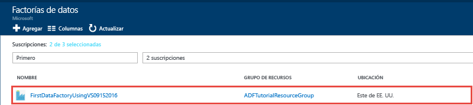
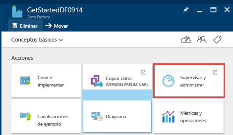
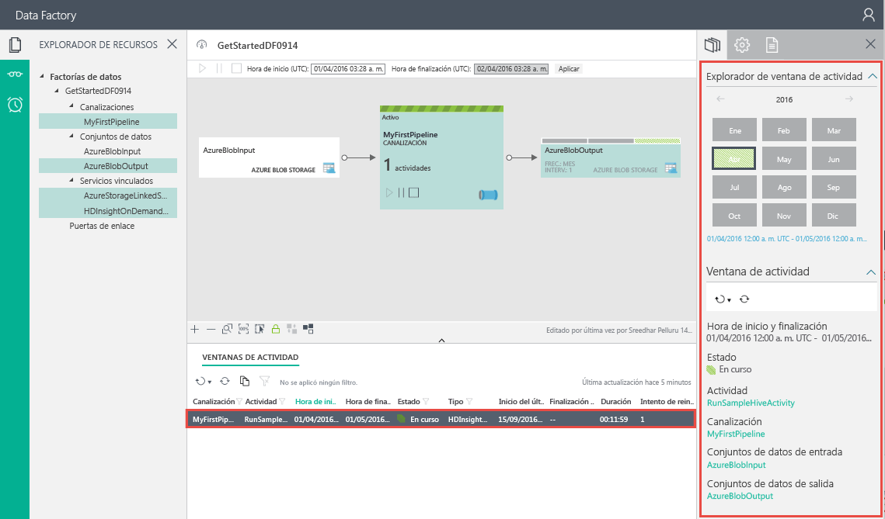

<properties
	pageTitle="Compilación de la primera Data Factory (Visual Studio) | Microsoft Azure"
	description="En este tutorial, creará un de ejemplo de canalización de Data Factory de Azure mediante Visual Studio."
	services="data-factory"
	documentationCenter=""
	authors="spelluru"
	manager="jhubbard"
	editor="monicar"/>

<tags
	ms.service="data-factory"
	ms.workload="data-services"
	ms.tgt_pltfrm="na"
	ms.devlang="na"
	ms.topic="hero-article" 
	ms.date="08/01/2016"
	ms.author="spelluru"/>

# Tutorial: Compilación de la primera instancia de Azure Data Factory con Microsoft Visual Studio
> [AZURE.SELECTOR]
- [Introducción y requisitos previos](data-factory-build-your-first-pipeline.md)
- [Portal de Azure](data-factory-build-your-first-pipeline-using-editor.md)
- [Visual Studio](data-factory-build-your-first-pipeline-using-vs.md)
- [PowerShell](data-factory-build-your-first-pipeline-using-powershell.md)
- [Plantilla de Resource Manager](data-factory-build-your-first-pipeline-using-arm.md)
- [API DE REST](data-factory-build-your-first-pipeline-using-rest-api.md)

En este artículo usará Microsoft Visual Studio para crear su primera instancia de Azure Data Factory.

## Requisitos previos
1. Lea el artículo [Tutorial: Compilación de la primera canalización para procesar datos mediante el clúster de Hadoop](data-factory-build-your-first-pipeline.md) y complete los pasos de los **requisitos previos**.
2. Debe ser **administrador de la suscripción de Azure** para poder publicar entidades de Data Factory desde Visual Studio en Azure Data Factory.
3. Debe tener lo siguiente instalado en el equipo:
	- Visual Studio 2013 o Visual Studio 2015.
	- Descargue el SDK de Azure para Visual Studio 2013 o Visual Studio 2015. Vaya a la [página Descargas de Azure](https://azure.microsoft.com/downloads/) y haga clic en **VS 2013** o **VS 2015** en la sección **.NET**.
	- Descargue el último complemento de Data Factory de Azure para Visual Studio: [VS 2013](https://visualstudiogallery.msdn.microsoft.com/754d998c-8f92-4aa7-835b-e89c8c954aa5) o [VS 2015](https://visualstudiogallery.msdn.microsoft.com/371a4cf9-0093-40fa-b7dd-be3c74f49005). Si usa Visual Studio 2013, también puede actualizar el complemento mediante el proceso siguiente: haga clic en el menú **Herramientas** -> **Extensiones y actualizaciones** -> **En línea** -> **Galería de Visual Studio** -> **Herramientas de Factoría de datos de Microsoft Azure para Visual Studio** -> **Actualizar**.
 
Vamos a usa Visual Studio para crear una instancia de Azure Data Factory.

## Creación de un proyecto de Visual Studio 
1. Inicie **Visual Studio 2013** o **Visual Studio 2015**. Haga clic en **Archivo**, seleccione **Nuevo** y, luego, haga clic en **Proyecto**. Debe aparecer el cuadro de diálogo **Nuevo proyecto**.
2. En el cuadro de diálogo **Nuevo proyecto**, seleccione la plantilla **DataFactory** y haga clic en **Proyecto vacío de Factoría de datos**.

	

3. Escriba un **nombre** para el proyecto, la **ubicación** y un nombre para la **solución**; a continuación, haga clic en **Aceptar**.

	

## Crear servicios vinculados
Una factoría de datos puede tener una o más canalizaciones. Una canalización puede tener una o más actividades. Por ejemplo, una actividad de copia para copiar datos desde un origen a un almacén de datos de destino o una actividad de Hive de HDInsight para ejecutar un script de Hive que transforme los datos de entrada. El nombre y la configuración de la factoría de datos se especifican más adelante, al publicar la solución de Data Factory.

En este paso, vinculará su cuenta de Almacenamiento de Azure y el clúster de HDInsight de Azure a petición con su factoría de datos. La cuenta de Almacenamiento de Azure contiene los datos de entrada y salida de la canalización de este ejemplo. Para ejecutar el script de Hive especificado en la actividad de la canalización en este ejemplo, se usa el servicio vinculado de HDInsight. Identifique qué datos de almacén o servicios de proceso se usan en el escenario y vincular dichos servicios con la factoría de datos mediante la creación de servicios vinculados.

#### Creación de un servicio vinculado de Almacenamiento de Azure
En este paso, vinculará su cuenta de Almacenamiento de Azure con su factoría de datos. Para este tutorial, usará la misma cuenta de Almacenamiento de Azure para almacenar los datos de entrada y salida y el archivo de script de HQL.

4. Haga clic con el botón derecho en **Servicios vinculados**en el Explorador de soluciones, seleccione **Agregar** y haga clic en **Nuevo elemento**.
5. En el cuadro de diálogo **Agregar nuevo elemento**, seleccione **Servicio vinculado de Almacenamiento de Azure** en la lista y haga clic en **Agregar**.
3. Reemplace los valores de **accountname** y **accountkey** por el nombre de la cuenta de Almacenamiento de Azure y su clave. Para aprender a obtener una clave de acceso de almacenamiento, consulte [Visualización y copia de las claves de acceso de almacenamiento](../storage/storage-create-storage-account.md#view-copy-and-regenerate-storage-access-keys).

	

4. Guarde el archivo **AzureStorageLinkedService1.json**.

#### Creación de un servicio vinculado de HDInsight de Azure
En este paso, vinculará un clúster de HDInsight a petición con la factoría de datos. El clúster de HDInsight se crea automáticamente en tiempo de ejecución y se elimina después de hacer el procesamiento y de permanecer inactivo durante el período de tiempo especificado. Puede usar su propio clúster de HDInsight en lugar de usar un clúster de HDInsight a petición. Consulte [Servicios vinculados de procesos](data-factory-compute-linked-services.md) para más información.

1. En el **Explorador de soluciones**, haga clic con el botón derecho en **Servicios vinculados**, seleccione **Agregar** y haga clic en **Nuevo elemento**.
2. Seleccione **Servicio vinculado de HDInsight a petición** y haga clic en **Agregar**.
3. Reemplace el código **JSON** por el siguiente:

		{
		  "name": "HDInsightOnDemandLinkedService",
		  "properties": {
		    "type": "HDInsightOnDemand",
		    "typeProperties": {
		      "version": "3.2",
		      "clusterSize": 1,
		      "timeToLive": "00:30:00",
		      "linkedServiceName": "AzureStorageLinkedService1"
		    }
		  }
		}
	
	En la siguiente tabla se ofrecen descripciones de las propiedades JSON que se usan en el fragmento de código:
	
	Propiedad | Descripción
	-------- | -----------
	Versión | Especifica que la versión de HDInsight creada sea la 3.2. 
	ClusterSize | Especifica el tamaño del clúster de HDInsight. 
	TimeToLive | Especifica el tiempo de inactividad del clúster de HDInsight, antes de que se elimine.
	linkedServiceName | Especifica la cuenta de almacenamiento que se usa para almacenar los registros que genera HDInsight.

	Tenga en cuenta lo siguiente:
	
	- Data Factory crea un clúster de HDInsight **basado en Windows** con el código JSON anterior. También podría hacer que cree un clúster de HDInsight **basado en Linux**. Para más información, consulte la sección [Servicio vinculado a petición de HDInsight de Azure](data-factory-compute-linked-services.md#azure-hdinsight-on-demand-linked-service).
	- Puede usar **su propio clúster de HDInsight** en lugar de usar un clúster de HDInsight a petición. Para más información, consulte [Servicio vinculado de HDInsight de Azure](data-factory-compute-linked-services.md#azure-hdinsight-linked-service).
	- El clúster de HDInsight crea un **contenedor predeterminado** en el Almacenamiento de blobs especificado en el código JSON (**linkedServiceName**). HDInsight no elimina este contenedor cuando se elimina el clúster. Este comportamiento es así por diseño. Con el servicio vinculado de HDInsight a petición se crea un clúster de HDInsight cada vez se procesa un segmento, a menos que haya un clúster existente activo (**timeToLive**). El clúster se elimina automáticamente cuando se realiza el procesamiento.
	
		A medida que se procesen más segmentos, verá numerosos contenedores en su Almacenamiento de blobs de Azure. Si no los necesita para solucionar problemas de trabajos, puede eliminarlos para reducir el costo de almacenamiento. Los nombres de estos contenedores siguen un patrón: "adf**nombreDeDataFactory**-**nombreDeServicioVinculado**-marcaDeFechaYHora". Use herramientas como el [Explorador de almacenamiento de Microsoft](http://storageexplorer.com/) para eliminar contenedores del almacenamiento de blobs de Azure.

	Consulte la sección [Servicio vinculado a petición de HDInsight](data-factory-compute-linked-services.md#azure-hdinsight-on-demand-linked-service) para obtener más información.
4. Guarde el archivo **HDInsightOnDemandLinkedService1.json**.

## Creación de conjuntos de datos
En este paso, creará conjuntos de datos que representan los datos de entrada y salida para el procesamiento de Hive. Estos conjuntos de datos hacen referencia al servicio **AzureStorageLinkedService1** que creó anteriormente en este tutorial. El servicio vinculado apunta a una cuenta de Almacenamiento de Azure y los conjuntos de datos especifican el contenedor, la carpeta y el nombre de archivo en el almacenamiento que contiene los datos de entrada y salida.

#### Creación de un conjunto de datos de entrada

1. En el **Explorador de soluciones**, haga clic con el botón derecho en **Tablas**, seleccione **Agregar** y haga clic en **Nuevo elemento**.
2. Seleccione **Blob de Azure** en la lista, cambie el nombre del archivo a **InputDataSet.json** y haga clic en **Agregar**.
3. Reemplace el código **JSON** del editor por lo siguiente:

	En el fragmento de código JSON, va a crear un conjunto de datos denominado **AzureBlobInput** que representa los datos de entrada para una actividad de la canalización. Además, va a especificar que los datos de entrada se coloquen en el contenedor de blobs llamado **adfgetstarted** y en la carpeta llamada **inputdata**.
		
		{
			"name": "AzureBlobInput",
		    "properties": {
		        "type": "AzureBlob",
		        "linkedServiceName": "AzureStorageLinkedService1",
		        "typeProperties": {
		            "fileName": "input.log",
		            "folderPath": "adfgetstarted/inputdata",
		            "format": {
		                "type": "TextFormat",
		                "columnDelimiter": ","
		            }
		        },
		        "availability": {
		            "frequency": "Month",
		            "interval": 1
		        },
		        "external": true,
		        "policy": {}
		    }
		} 

	En la siguiente tabla se ofrecen descripciones de las propiedades JSON que se usan en el fragmento de código:

	| Propiedad | Description |
	| :------- | :---------- |
	| type | La propiedad type se establece en AzureBlob porque los datos residen en Almacenamiento de blobs de Azure. |  
	| linkedServiceName | Hace referencia al servicio AzureStorageLinkedService1 que creó anteriormente. |
	| fileName | Esta propiedad es opcional. Si omite esta propiedad, se seleccionan todos los archivos de folderPath. En este caso, se procesa solo el archivo input.log. |
	| type | Los archivos de registro están en formato de texto, por lo que usaremos TextFormat. | 
	| columnDelimiter | Las columnas de los archivos de registro están delimitadas por una coma (,). |
	| frecuencia/intervalo | La frecuencia está establecida en Mes y el intervalo es 1, lo que significa que los segmentos de entrada estarán disponibles cada mes. | 
	| external | Esta propiedad se establece en true si el servicio Factoría de datos no ha generado los datos de entrada. | 
	  
	
3. Guarde el archivo **InputDataset.json**.

 
#### Creación del conjunto de datos de salida
Ahora, se crea el conjunto de datos de salida que representa los datos de salida almacenados en Almacenamiento de blobs de Azure.

1. En el **Explorador de soluciones**, haga clic con el botón derecho en **Tablas**, seleccione **Agregar** y haga clic en **Nuevo elemento**.
2. Seleccione **Blob de Azure** en la lista, cambie el nombre del archivo a **OutputDataset.json** y haga clic en **Agregar**.
3. Reemplace el código **JSON** del editor por lo siguiente:

	En el fragmento de código JSON, cree un conjunto de datos llamado **AzureBlobOutput** y especifique la estructura de los datos que genera el script de Hive. Además, especifique que los resultados se almacenen en el contenedor de blobs llamado **adfgetstarted** y en la carpeta llamada **partitioneddata**. La sección **availability** especifica que el conjunto de datos de salida se genera mensualmente.
	
		{
		  "name": "AzureBlobOutput",
		  "properties": {
		    "type": "AzureBlob",
		    "linkedServiceName": "AzureStorageLinkedService1",
		    "typeProperties": {
		      "folderPath": "adfgetstarted/partitioneddata",
		      "format": {
		        "type": "TextFormat",
		        "columnDelimiter": ","
		      }
		    },
		    "availability": {
		      "frequency": "Month",
		      "interval": 1
		    }
		  }
		}

	Consulte la sección **Creación del conjunto de datos de entrada** para obtener las descripciones de estas propiedades. No establezca la propiedad externa en un conjunto de datos ya que este es generado por el servicio Factoría de datos.

4. Guarde el archivo **OutputDataset.json**.

### Creación de una canalización
En este paso, creará la primera canalización con una actividad **HDInsightHive**. El segmento de entrada está disponible mensualmente (frecuencia: mensual, intervalo: 1), el segmento de salida se genera mensualmente y la propiedad de programador de la actividad también se establece en mensual. La configuración del conjunto de datos de salida y la del programador de la actividad deben coincidir. Actualmente, el conjunto de datos de salida es lo que controla la programación, por lo que debe crear un conjunto de datos de salida aunque la actividad no genere ninguna salida. Si la actividad no toma ninguna entrada, puede omitir la creación del conjunto de datos de entrada. Al final de esta sección se explican las propiedades usadas en el siguiente JSON.

1. En el **Explorador de soluciones**, haga clic con el botón derecho en **Canalizaciones**, seleccione **Agregar** y haga clic en **Nuevo elemento**.
2. Seleccione **Canalización de transformación de Hive** en la lista y haga clic en **Agregar**.
3. Reemplace el código **JSON** por el siguiente fragmento de código.

	> [AZURE.IMPORTANT] Reemplace **storageaccountname** por el nombre de la cuenta de almacenamiento.

		{
		    "name": "MyFirstPipeline",
		    "properties": {
		        "description": "My first Azure Data Factory pipeline",
		        "activities": [
		            {
		                "type": "HDInsightHive",
		                "typeProperties": {
		                    "scriptPath": "adfgetstarted/script/partitionweblogs.hql",
		                    "scriptLinkedService": "AzureStorageLinkedService1",
		                    "defines": {
		                        "inputtable": "wasb://adfgetstarted@<storageaccountname>.blob.core.windows.net/inputdata",
		                        "partitionedtable": "wasb://adfgetstarted@<storageaccountname>.blob.core.windows.net/partitioneddata"
		                    }
		                },
		                "inputs": [
		                    {
		                        "name": "AzureBlobInput"
		                    }
		                ],
		                "outputs": [
		                    {
		                        "name": "AzureBlobOutput"
		                    }
		                ],
		                "policy": {
		                    "concurrency": 1,
		                    "retry": 3
		                },
		                "scheduler": {
		                    "frequency": "Month",
		                    "interval": 1
		                },
		                "name": "RunSampleHiveActivity",
		                "linkedServiceName": "HDInsightOnDemandLinkedService"
		            }
		        ],
		        "start": "2016-04-01T00:00:00Z",
		        "end": "2016-04-02T00:00:00Z",
		        "isPaused": false
		    }
		}

 	En el fragmento de código JSON, se crea una canalización que consta de una sola actividad que usa Hive para procesar los datos en un clúster de HDInsight.
	
	En el fragmento de código JSON, se crea una canalización que consta de una sola actividad que usa Hive para procesar los datos en un clúster de HDInsight.
	
	El archivo de script de Hive, **partitionweblogs.hql**, se almacena en la cuenta de Almacenamiento de Azure (especificada mediante la propiedad scriptLinkedService, llamada **AzureStorageLinkedService1**) en una carpeta denominada **script** del contenedor **adfgetstarted**.

	La sección **defines** se usa para especificar la configuración de tiempo de ejecución que se pasa al script de Hive como valores de configuración de Hive (por ejemplo, ${hiveconf:inputtable}, ${hiveconf:partitionedtable}).

	Las propiedades **start** y **end** de la canalización especifican el período activo de esta.

	En el código JSON de la actividad, se especifica que el script de Hive se ejecuta en el proceso que especifica el servicio vinculado **linkedServiceName**: **HDInsightOnDemandLinkedService**.

	> [AZURE.NOTE] Consulte en la sección [Anatomía de una canalización](data-factory-create-pipelines.md#anatomy-of-a-pipeline) las propiedades JSON que se usan en el ejemplo.
3. Guarde el archivo **HiveActivity1.json**.

### Adición de partitionweblogs.hql e input.log como una dependencia 

1. Haga clic con el botón derecho en **Dependencias** en la ventana del **Explorador de soluciones**, seleccione **Agregar** y haga clic en **Elemento existente**.
2. Navegue hasta **C:\\ADFGettingStarted**, seleccione los archivos **partitionweblogs.hql** e **input.log** y haga clic en **Agregar**. Se crearon estos dos archivos como parte de los requisitos previos de la sección [Tutorial Overview](data-factory-build-your-first-pipeline.md).

Al publicar la solución en el paso siguiente, se carga el archivo **partitionweblogs.hql** en la carpeta de scripts del contenedor de blobs **adfgetstarted**.

### Publicación e implementación de las entidades de Factoría de datos

18. Haga clic con el botón derecho en el proyecto en el Explorador de soluciones y haga clic en **Publicar**.
19. Si ve el cuadro de diálogo **Iniciar sesión en tu cuenta Microsoft**, escriba sus credenciales para la cuenta que tiene la suscripción de Azure y haga clic en **Iniciar sesión**.
20. Debería ver el siguiente cuadro de diálogo:

	

21. En la página Configurar Data Factory, haga lo siguiente:
	1. Seleccione la opción **Crear la nueva factoría de datos**.
	2. Escriba un **nombre** único para la factoría de datos. Por ejemplo: **FirstDataFactoryUsingVS09152016**. El nombre debe ser único globalmente.
	
		> [AZURE.IMPORTANT] Si recibe el error **El nombre "FirstDataFactoryUsingVS" de la factoría de datos no está disponible** al realizar la publicación, cambie el nombre (por ejemplo, a suNombreFirstDataFactoryUsingVS). Consulte el tema [Data Factory: reglas de nomenclatura](data-factory-naming-rules.md) para conocer las reglas de nomenclatura para los artefactos de Data Factory.
	3. Seleccione la suscripción correcta en el campo **Suscripción**.
	 
		> [AZURE.IMPORTANT] Si no ve ninguna suscripción, asegúrese de que ha iniciado sesión con una cuenta que sea administrador o coadministrador de la suscripción.
	4. Seleccione el **grupo de recursos** para la factoría de datos que se va a crear.
	5. Seleccione la **Región** de la factoría de datos.
	6. Haga clic en **Siguiente** para cambiar a la página **Publicar elementos**. (Presione la tecla **TAB** para salir del campo Nombre si el botón **Siguiente** está deshabilitado).
23. En la página **Publicar elementos**, asegúrese de que todas las entidades de Factorías de datos están seleccionadas y haga clic en **Siguiente** para cambiar a la página **Resumen**.
24. Revise el resumen y haga clic en **Siguiente** para iniciar el proceso de implementación y ver el **Estado de implementación**.
25. En la página **Estado de implementación**, debería ver el estado del proceso de implementación. Cuando se haya completado la implementación, haga clic en Finalizar.

 
Puntos importantes que hay que tener en cuenta:

- Si recibe el error: "**La suscripción no está registrada para usar el espacio de nombres Microsoft.DataFactory**", realice una de las acciones siguientes e intente publicarla de nuevo:

	- En Azure PowerShell, ejecute el siguiente comando para registrar el proveedor de Data Factory.
		
			Register-AzureRmResourceProvider -ProviderNamespace Microsoft.DataFactory
	
		Puede ejecutar el comando siguiente para confirmar que se ha registrado el proveedor de Data Factory.
	
			Get-AzureRmResourceProvider
	- Inicie sesión mediante la suscripción de Azure en el [Portal de Azure](https://portal.azure.com) y vaya a una hoja de Data Factory (o) cree una factoría de datos en el Portal de Azure. Esta acción registra automáticamente el proveedor.
- 	El nombre de la factoría de datos se puede registrar como un nombre DNS en el futuro y, por lo tanto, hacerse públicamente visible.
- 	Para crear instancias de Data Factory, es preciso ser administrador o coadministrador de la suscripción de Azure

 
## Supervisión de la canalización

### Supervisión de una canalización desde la vista de diagrama
6. Inicie sesión en el [Portal de Azure](https://portal.azure.com/) y realice lo siguiente:
	1. Haga clic en **Más servicios** y, a continuación, en **Fábricas de datos**. 
	2. Seleccione el nombre de la factoría de datos (por ejemplo: **FirstDataFactoryUsingVS09152016**) en la lista de factorías de datos. 
7. En la página principal de la factoría de datos, haga clic en **Diagrama**.
  
	
7. En la Vista de diagrama, se ve información general de las canalizaciones y los conjuntos de datos empleados en este tutorial.
	
	
8. Para ver todas las actividades de la canalización, haga clic con el botón derecho en la canalización en el diagrama y haga clic en Abrir canalización.

	
9. Confirme que la actividad de HDInsightHive está en la canalización.
  
	

	Para volver a la vista anterior, haga clic en **Data Factory** en el menú de la ruta de navegación de la parte superior.
10. En la **Vista de diagrama**, haga doble clic en el conjunto de datos **AzureBlobInput**. Confirme que el estado del segmento es **Listo**. Puede que el segmento tarde un par de minutos en aparecer con ese estado. Si no aparece después de un tiempo, compruebe si el archivo de entrada (input.log) está en el contenedor (adfgetstarted) y en la carpeta (inputdata) correctos.

	
11. Haga clic en **X** para cerrar la hoja **AzureBlobInput**.
12. En la **Vista de diagrama**, haga doble clic en el conjunto de datos **AzureBlobOutput**. Se ve que el segmento se está procesando.

	
9. Cuando finalice el procesamiento, el segmento aparece con el estado **Listo**.
	>[AZURE.IMPORTANT] La creación de un clúster de HDInsight a petición normalmente tarda algún tiempo (20 minutos aproximadamente). Por tanto, cabe esperar que la canalización tarde **aproximadamente 30 minutos** en procesar el segmento.

	
	
10. Cuando el segmento se encuentre en el estado **Listo**, busque los datos de salida en la carpeta **partitioneddata** del contenedor **adfgetstarted** de Almacenamiento de blobs.
 
	
11. Haga clic en el segmento para ver sus detalles en una hoja **Segmento de datos**.

	
12. Haga clic en una cualquiera de las ejecuciones de la lista **Ejecuciones de actividad** para ver sus detalles (una actividad de Hive en nuestro escenario) en la ventana **Detalles de la ejecución de actividad**.
	
	En los archivos de registro, puede ver la consulta de Hive que se ejecutó y la información sobre el estado. Estos registros son útiles para solucionar cualquier problema.
 

Consulte [Supervisión de conjuntos de datos y canalizaciones](data-factory-monitor-manage-pipelines.md) para obtener instrucciones sobre cómo usar el Portal de Azure para supervisar la canalización y los conjuntos de datos creados en este tutorial.

### Supervisión de una canalización con la Aplicación de supervisión y administración
La Aplicación de supervisión y administración también se puede usar para supervisar las canalizaciones. Para más información acerca del uso de esta aplicación, consulte [Supervisión y administración de canalizaciones de Azure Data Factory mediante la nueva Aplicación de supervisión y administración](data-factory-monitor-manage-app.md).

1. Haga clic en el icono Supervisión y administración.

	
2. Debería ver la Aplicación de supervisión y administración. Cambie la **hora de inicio** y la **hora de finalización** para ajustar las horas de inicio (01-04-2016 12:00 A.M.) y finalización (02-04-2016 12:00 A.M.) de la canalización y haga clic en **Aplicar**.

	
3. Seleccione una ventana en la lista de ventanas de actividad para ver información sobre ella. 

> [AZURE.IMPORTANT] El archivo de entrada se elimina cuando el segmento se procesa correctamente. Por lo tanto, si desea volver a ejecutar el segmento o volver a realizar el tutorial, cargue el archivo de entrada (input.log) en la carpeta inputdata del contenedor adfgetstarted.
 

## Uso del Explorador de servidores para ver las entidades de Data Factory

1. En **Visual Studio** haga clic en **Vista** en el menú y haga clic en **Explorador de servidores**.
2. En la ventana Explorador de servidores, expanda **Azure** y **Factoría de datos**. Si aparece **Iniciar sesión en Visual Studio**, escriba la **cuenta** asociada a su suscripción de Azure y haga clic en **Continuar**. Escriba la **contraseña** y haga clic en **Iniciar sesión**. Visual Studio intenta obtener información acerca de todas las factorías de datos de Azure de su suscripción. Puede ver el estado de esta operación en la ventana **Data Factory Task List** (Lista de tareas de Data Factory).

	
3. Puede hacer clic con el botón derecho en una factoría de datos y seleccionar **Export Data Factory to New Project** (Exportar Data Factory al nuevo proyecto) para crear un proyecto de Visual Studio basado en una factoría de datos existente.

	

## Actualización de herramientas de Factoría de datos para Visual Studio

Para actualizar las herramientas de Factoría de datos de Azure para Visual Studio, haga lo siguiente:

1. Haga clic en el menú **Herramientas** y seleccione **Extensiones y actualizaciones**.
2. Seleccione **Actualizaciones** en el panel izquierdo y, luego, seleccione **Galería de Visual Studio**.
3. Seleccione **Herramientas de Factoría de datos de Azure para Visual Studio** y haga clic en **Actualizar**. Si no ve esta entrada, ya tiene la versión más reciente de las herramientas.

## Uso de archivos de configuración
Puede usar archivos de configuración de Visual Studio para configurar propiedades para servicios vinculados/tablas/canalizaciones distintos para cada entorno.

Considere la siguiente definición de JSON para un servicio vinculado de Almacenamiento de Azure. Con ella, podrá especificar la propiedad **connectionString** con distintos valores para accountname y accountkey basados en el entorno (desarrollo, pruebas y producción) en el que va a implementar las entidades de Data Factory. Puede conseguir este comportamiento mediante el uso del archivo de configuración independiente para cada entorno.

	{
	    "name": "StorageLinkedService",
	    "properties": {
	        "type": "AzureStorage",
	        "description": "",
	        "typeProperties": {
	            "connectionString": "DefaultEndpointsProtocol=https;AccountName=<accountname>;AccountKey=<accountkey>"
	        }
	    }
	} 

### Adición de un archivo de configuración
Agregue un archivo de configuración a cada entorno realizando los pasos siguientes:

1. Haga clic con el botón derecho en el proyecto de Data Factory en la solución de Visual Studio, seleccione **Agregar** y haga clic en **Nuevo elemento**.
2. Seleccione **Config.** en la lista de plantillas instaladas de la izquierda, seleccione **Archivo de configuración**, escriba el **nombre** del archivo de configuración y haga clic en **Agregar**.

	
3. Agregue parámetros de configuración y sus valores en el formato siguiente.

		{
		    "$schema": "http://datafactories.schema.management.azure.com/vsschemas/V1/Microsoft.DataFactory.Config.json",
		    "AzureStorageLinkedService1": [
		        {
		            "name": "$.properties.typeProperties.connectionString",
		            "value": "DefaultEndpointsProtocol=https;AccountName=<accountname>;AccountKey=<accountkey>"
		        }
		    ],
		    "AzureSqlLinkedService1": [
		        {
		            "name": "$.properties.typeProperties.connectionString",
		            "value":  "Server=tcp:spsqlserver.database.windows.net,1433;Database=spsqldb;User ID=spelluru;Password=Sowmya123;Trusted_Connection=False;Encrypt=True;Connection Timeout=30"
		        }
		    ]
		}

	En este ejemplo se configura la propiedad connectionString de un servicio vinculado de Almacenamiento de Azure y un servicio vinculado de SQL de Azure. Observe que la sintaxis para especificar el nombre es [JsonPath](http://goessner.net/articles/JsonPath/).

	Si JSON tiene una propiedad con una matriz de valores como se muestra en el código siguiente:

		"structure": [
	  		{
	  			"name": "FirstName",
	    		"type": "String"
	  		},
	  		{
	    		"name": "LastName",
	    	    "type": "String"
			}
		],
	
	Configure las propiedades tal como se muestra en el siguiente archivo de configuración (use la indexación de base cero):
		
		{
            "name": "$.properties.structure[0].name",
            "value": "FirstName"
        }
        {
            "name": "$.properties.structure[0].type",
            "value": "String"
        }
        {
            "name": "$.properties.structure[1].name",
            "value": "LastName"
        }
        {
            "name": "$.properties.structure[1].type",
            "value": "String"
        }

### Nombres de propiedad con espacios
Si un nombre de propiedad contiene espacios, utilice corchetes como se muestra en el ejemplo siguiente (nombre de servidor de base de datos):

     {
         "name": "$.properties.activities[1].typeProperties.webServiceParameters.['Database server name']",
         "value": "MyAsqlServer.database.windows.net"
     }

### Implementación de la solución mediante una configuración
Al publicar las entidades de Factoría de datos de Azure en Visual Studio, puede especificar la configuración que desea usar para esa operación de publicación.

Para publicar entidades en un proyecto de Factoría de datos de Azure mediante el archivo de configuración:

1. Haga clic con el botón derecho en el proyecto de Data Factory y haga clic en **Publicar** para ver el cuadro de diálogo **Publish Items** (Publicar elementos).
2. Seleccione una factoría de datos existente o especifique los valores necesarios para crear una en la página **Configure data factory** (Configurar Data Factory) y haga clic en **Siguiente**.
3. En la página **Publish Items** (Publicar elementos), verá una lista desplegable con las configuraciones disponibles para el campo **Select Deployment Config** (Seleccionar configuración de implementación).

	

4. Seleccione el **archivo de configuración** que desea usar y haga clic en **Siguiente**.
5. Confirme que ve el nombre del archivo JSON en la página **Resumen** y haga clic en **Siguiente**.
6. Cuando finalice la operación de implementación, haga clic en **Finalizar**.

Cuando realiza la implementación, se usan los valores del archivo de configuración para establecer los valores de las propiedades de los archivos JSON para entidades de Data Factory antes de que las entidades se implementen en el servicio Azure Data Factory.

## Resumen 
En este tutorial, ha creado una instancia de Data Factory de Azure para procesar datos mediante la ejecución de un script de Hive en un clúster de Hadoop en HDInsight. Ha usado el Editor de Data Factory en el Portal de Azure para realizar los siguientes pasos:

1.	Ha creado una **factoría de datos** de Azure.
2.	Ha creado dos **servicios vinculados**:
	1.	El servicio vinculado **Almacenamiento de Azure** para vincular el almacenamiento de blobs de Azure que contiene los archivos de entrada y salida a la factoría de datos.
	2.	El servicio vinculado a petición **HDInsight de Azure** para vincular un clúster de Hadoop en HDInsight a petición a la factoría de datos. Data Factory de Azure crea un clúster de Hadoop en HDInsight justo a tiempo para procesar los datos de entrada y generar los datos de salida.
3.	Ha creado dos **conjuntos de datos**, que describen los datos de entrada y salida para la actividad de Hive de HDInsight en la canalización.
4.	Ha creado una **canalización** con una actividad de **Hive de HDInsight**.

## Pasos siguientes
En este artículo, creó una canalización con una actividad de transformación (actividad de HDInsight) que ejecuta un script de Hive en un clúster de HDInsight a petición. Para ver cómo se usa una actividad de copia para copiar datos de un blob de Azure en SQL Azure, consulte [Tutorial: Copia de datos de un blob de Azure a SQL Azure](data-factory-copy-data-from-azure-blob-storage-to-sql-database.md).
  
## Otras referencias
| Tema. | Descripción |
| :---- | :---- |
| [Transformación y análisis con Data Factory de Azure](data-factory-data-transformation-activities.md) | En este artículo se proporciona una lista de actividades de transformación de datos (por ejemplo, la transformación de Hive para HDInsight usada en este tutorial), que se admiten en Data Factory de Azure. | 
| [Programación y ejecución con Data Factory](data-factory-scheduling-and-execution.md) | En este artículo se explican los aspectos de programación y ejecución del modelo de aplicación de Factoría de datos de Azure. |
| [Procesos](data-factory-create-pipelines.md) | Este artículo ayuda a conocer las canalizaciones y actividades de Data Factory de Azure y cómo aprovecharlas para construir flujos de trabajo controlados por datos de un extremo a otro para su escenario o negocio. |
| [Conjuntos de datos](data-factory-create-datasets.md) | Este artículo le ayuda a comprender los conjuntos de datos de Data Factory de Azure.
| [Supervisión y administración de canalizaciones de Data Factory de Azure mediante la nueva Aplicación de supervisión y administración](data-factory-monitor-manage-app.md) | En este artículo se describe cómo supervisar, administrar y depurar las canalizaciones mediante la aplicación de supervisión y administración. 

<!---HONumber=AcomDC_0921_2016-->