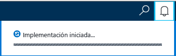
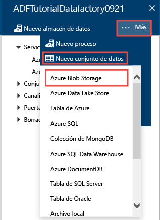
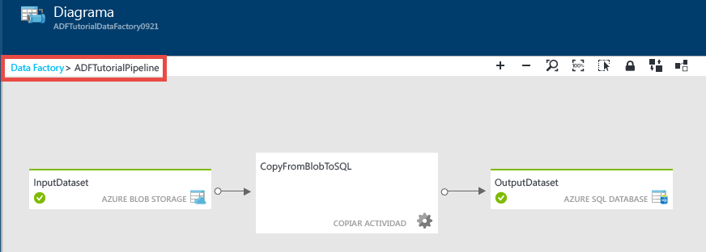
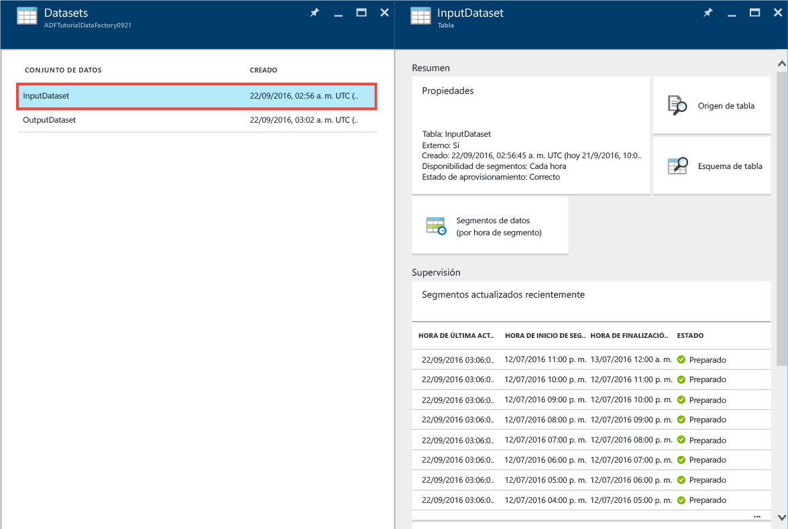
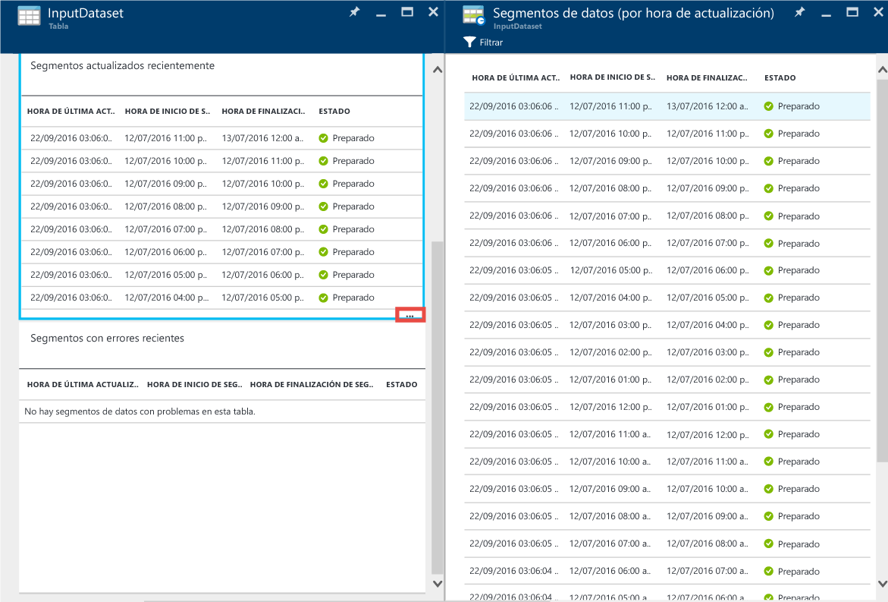
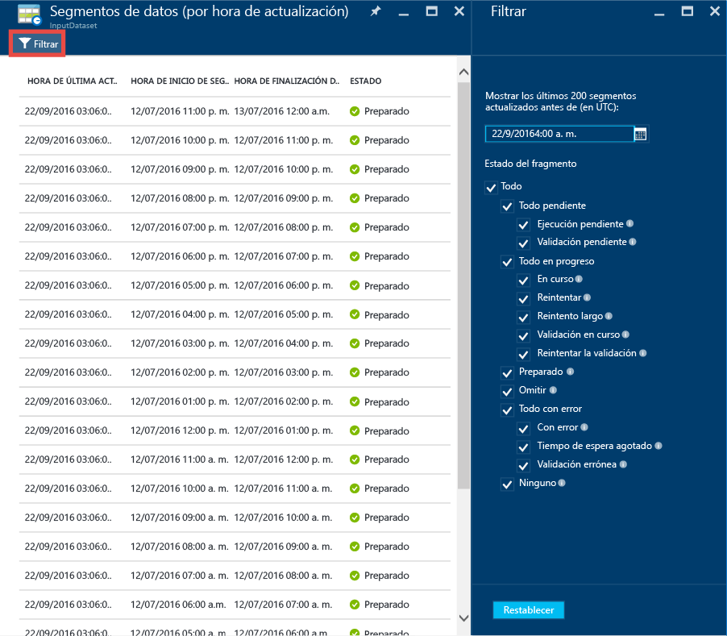
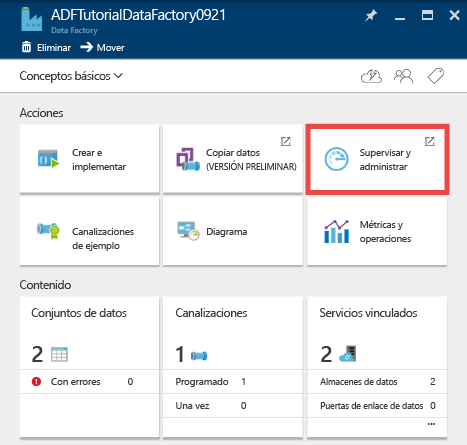
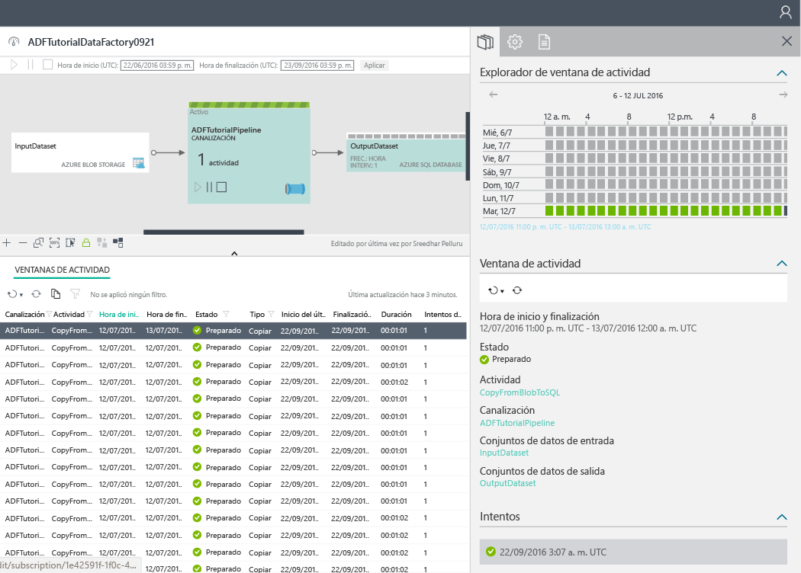

<properties 
	pageTitle="Tutorial: crear una canalización con la actividad de copia con Azure Portal | Microsoft Azure" 
	description="En este tutorial, creará una canalización de Data Factory de Azure con una actividad de copia mediante el Editor de Data Factory en el Portal de Azure." 
	services="data-factory" 
	documentationCenter="" 
	authors="spelluru" 
	manager="jhubbard" 
	editor="monicar"/>

<tags 
	ms.service="data-factory" 
	ms.workload="data-services" 
	ms.tgt_pltfrm="na" 
	ms.devlang="na" 
	ms.topic="get-started-article" 
	ms.date="09/16/2016" 
	ms.author="spelluru"/>

# Tutorial: Crear una canalización con la actividad de copia mediante Azure Portal
> [AZURE.SELECTOR]
- [Introducción y requisitos previos](data-factory-copy-data-from-azure-blob-storage-to-sql-database.md)
- [Portal de Azure](data-factory-copy-activity-tutorial-using-azure-portal.md)
- [Visual Studio](data-factory-copy-activity-tutorial-using-visual-studio.md)
- [PowerShell](data-factory-copy-activity-tutorial-using-powershell.md)
- [API DE REST](data-factory-copy-activity-tutorial-using-rest-api.md)
- [API de .NET](data-factory-copy-activity-tutorial-using-dotnet-api.md)
- [Asistente para copia](data-factory-copy-data-wizard-tutorial.md)

Este tutorial muestra cómo crear y supervisar una factoría de datos de Azure mediante Azure Portal. La canalización de la factoría de datos utiliza una actividad de copia para copiar datos desde Almacenamiento de blobs de Azure a Base de datos SQL de Azure.

Estos son los pasos que se realizan en este tutorial:

Paso | Description
-----| -----------
[Crear una factoría de datos de Azure](#create-data-factory) | En este paso creará una factoría de datos de Azure denominada **ADFTutorialDataFactory**.  
[Crear servicios vinculados](#create-linked-services) | En este paso, creará dos servicios vinculados: **AzureStorageLinkedService** y **AzureSqlLinkedService**.   AzureStorageLinkedService vincula Azure Storage y AzureSqlLinkedService vincula Azure SQL Database a ADFTutorialDataFactory. Los datos de entrada para la canalización se encuentran en un contenedor de blob en el almacenamiento de blobs de Azure y los datos de salida se almacenan en una tabla en Base de datos SQL de Azure. Por lo tanto, agregue estos almacenes de datos como servicios vinculados en la factoría de datos.      
[Crear conjuntos de datos de entrada y salida](#create-datasets) | En el paso anterior, creó servicios vinculados que hacen referencia a los almacenes de datos que contienen datos de entrada y salida. En este paso, defina dos conjuntos de datos (**InputDataset** y **OutputDataset**) que representen los datos de entrada y salida que se almacenan en los almacenes de datos.   Para InputDataset, especifique el contenedor de blobs que contiene un blob con los datos de origen y para OutputDataset, especifique la tabla SQL que almacena los datos de salida. Especifique también otras propiedades como estructura, disponibilidad y directiva. 
[Crear una canalización](#create-pipeline) | En este paso, creará una canalización denominada **ADFTutorialPipeline** en ADFTutorialDataFactory.   Agregará una **actividad de copia** a la canalización que copia datos de entrada del blob de Azure en la tabla de salida de SQL Azure. La actividad de copia realiza el movimiento de datos en Data Factory de Azure. Funciona con un servicio disponible de forma global que puede copiar datos entre varios almacenes de datos de forma segura, confiable y escalable. Consulte el artículo [Actividades de movimiento de datos](data-factory-data-movement-activities.md) para obtener más información sobre la actividad de copia. 
[Supervisión de la canalización](#monitor-pipeline) | En este paso, supervisará los sectores de las tablas de entrada y salida con Azure Portal.

## Requisitos previos 
Antes de realizar este tutorial, complete los requisitos previos que se enumeran en el artículo [Copia de datos de Almacenamiento de blobs en Base de datos SQL mediante Data Factory](data-factory-copy-data-from-azure-blob-storage-to-sql-database.md).

## Creación de Data Factory
En este paso, utilizará el Portal de Azure para crear una factoría de datos de Azure llamada **ADFTutorialDataFactory**.

1.	Después de iniciar sesión en [Azure Portal](https://portal.azure.com/), haga clic en **Nuevo**, seleccione **Intelligence + Analytics** y haga clic en **Data Factory**.

	

6. En la hoja **Nueva factoría de datos**:
	1. Escriba **ADFTutorialDataFactory** como **nombre**.
	
  		

		El nombre de Azure Data Factory debe ser **único de forma global**. Si recibe el siguiente error, cambie el nombre de la factoría de datos (por ejemplo, yournameADFTutorialDataFactory) e intente crearlo de nuevo. Consulte el tema [Data Factory: reglas de nomenclatura](data-factory-naming-rules.md) para conocer las reglas de nomenclatura para los artefactos de Data Factory.
	
			Data factory name “ADFTutorialDataFactory” is not available  
	 
		
	2. Selección la **suscripción** de Azure.
	3. Para el grupo de recursos, realice uno de los siguientes pasos:
		1. Seleccione en primer lugar **Usar existente** y después un grupo de recursos de la lista desplegable.
		2. Seleccione **Crear nuevo** y escriba el nombre de un grupo de recursos.
	
			En algunos de los pasos de este tutorial se supone que se usa el nombre: **ADFTutorialResourceGroup** para el grupo de recursos. Para obtener más información sobre los grupos de recursos, consulte [Uso de grupos de recursos para administrar los recursos de Azure](../resource-group-overview.md).
	4. Seleccione la **ubicación** de Data Factory. La lista desplegable solo muestra las regiones que admite el servicio Data Factory.
	5. Seleccione **Anclar a Panel de inicio**.
	6. Haga clic en **Crear**.

		> [AZURE.IMPORTANT] Para crear instancias de Data Factory, es preciso ser miembro del rol [Colaborador de Data Factory](../active-directory/role-based-access-built-in-roles.md/#data-factory-contributor) en el nivel de grupo de recursos o suscripción.
		>  
		>  El nombre de la factoría de datos se puede registrar como un nombre DNS en el futuro y, por lo tanto, hacerse públicamente visible.
9.  Para ver los mensajes de notificación de estado o de notificación, haga clic en el icono de la campana de la barra de herramientas.

	
10. Una vez completada la creación, puede ver la hoja **Data Factory**, tal como se muestra en la imagen.

    

## Crear servicios vinculados
Los servicios vinculados vinculan almacenes de datos o servicios de proceso con una factoría de datos de Azure. Consulte los [almacenes de datos compatibles](data-factory-data-movement-activities.md##supported-data-stores-and-formats) para ver todos orígenes y receptores que admite la actividad de copia. Consulte los [servicios vinculados de procesos](data-factory-compute-linked-services.md) para ver la lista de servicios de proceso compatibles con Data Factory. En este tutorial no se usan servicios de proceso.

En este paso, creará dos servicios vinculados: **AzureStorageLinkedService** y **AzureSqlLinkedService**. El servicio vinculado AzureStorageLinkedService vincula una cuenta de almacenamiento de Azure y AzureSqlLinkedService vincula una Base de datos SQL de Azure a **ADFTutorialDataFactory**. Más adelante en este tutorial, creará una canalización que copia datos de un contenedor de blobs de AzureStorageLinkedService en una tabla SQL de AzureSqlLinkedService.

### Crear un servicio vinculado para una cuenta de almacenamiento de Azure
1.	En la hoja **Data Factory**, haga clic en icono **Crear e implementar** para iniciar el **Editor** para la instancia de Data Factory.

	
5. En el **Editor**, haga clic en el botón **Nuevo almacén de datos** de la barra de herramientas y seleccione **Almacenamiento de Azure** en el menú desplegable. Debería ver la plantilla JSON para crear un servicio vinculado de almacenamiento de Azure en el panel derecho.

	
6. Reemplace `<accountname>` y `<accountkey>` por los valores de clave y nombre de la cuenta de Azure Storage.

	
6. Haga clic en **Implementar** en la barra de herramientas. Debería ver que **AzureStorageLinkedService** está implementado en la vista de árbol.

	

> [AZURE.NOTE]
Para más información acerca de las propiedades de JSON, consulte [Movimiento de datos hacia y desde Blob de Azure mediante Azure Data Factory](data-factory-azure-blob-connector.md#azure-storage-linked-service).

### Crear un servicio vinculado para la base de datos SQL de Azure
1. En **Data Factory Editor**, haga clic en el botón **Nuevo almacén de datos** de la barra de herramientas y seleccione **Azure SQL Database** en el menú desplegable. Verá la plantilla JSON para crear un servicio vinculado SQL de Azure en el panel derecho.
2. Reemplace `<servername>`, `<databasename>`, `<username>@<servername>` y `<password>` por los nombres del servidor, la base de datos, la cuenta de usuario y la contraseña de SQL Azure.
3. Haga clic en **Implementar** en la barra de herramientas para crear e implementar **AzureSqlLinkedService**.
4. Confirme que **AzureSqlLinkedService** aparece en la vista de árbol.

> [AZURE.NOTE]
Para más información acerca de las propiedades de JSON, consulte [Movimiento de datos hacia y desde Azure SQL Database mediante Azure Data Factory](data-factory-azure-sql-connector.md#azure-sql-linked-service-properties).

## Creación de conjuntos de datos
En el paso anterior, creó los servicios vinculados **AzureStorageLinkedService** y **AzureSqlLinkedService** para vincular una cuenta de Almacenamiento de Azure y una Base de datos SQL de Azure a la factoría de datos **ADFTutorialDataFactory**. En este paso, defina dos conjuntos de datos (**InputDataset** y **OutputDataset**) que representen los datos de entrada y salida que se almacenan en los almacenes de datos a los que hacen referencia AzureStorageLinkedService y AzureSqlLinkedService, respectivamente. Para InputDataset, especifique el contenedor de blobs que contiene un blob con los datos de origen y para OutputDataset, especifique la tabla SQL que almacena los datos de salida.

### Creación de un conjunto de datos de entrada 
En este paso, se crea un conjunto de datos denominado **InputDataset** que apunta a un contenedor de blobs de Azure Storage que está representado por el servicio vinculado **AzureStorageLinkedService**.

1. En el **Editor** en la instancia de Data Factory, haga clic en **... Más**, luego en **Nuevo conjunto de datos** y, finalmente, en **Azure Blob Storage** en el menú desplegable.

	
2. Reemplace JSON en el panel derecho por el siguiente fragmento JSON:

		{
		  "name": "InputDataset",
		  "properties": {
		    "structure": [
		      {
		        "name": "FirstName",
		        "type": "String"
		      },
		      {
		        "name": "LastName",
		        "type": "String"
		      }
		    ],
		    "type": "AzureBlob",
		    "linkedServiceName": "AzureStorageLinkedService",
		    "typeProperties": {
		      "folderPath": "adftutorial/",
			  "fileName": "emp.txt",
		      "format": {
		        "type": "TextFormat",
		        "columnDelimiter": ","
		      }
		    },
		    "external": true,
		    "availability": {
		      "frequency": "Hour",
		      "interval": 1
		    }
		  }
		}
		
     Tenga en cuenta los siguientes puntos:
	
	- **type** de conjunto de datos está establecido en **AzureBlob**.
	- **linkedServiceName** se establece en **AzureStorageLinkedService**. Este servicio vinculado lo creó en el paso 2.
	- **folderPath** se establece en el contenedor **adftutorial**. También puede especificar el nombre de un blob en la carpeta mediante la propiedad **fileName**. Puesto que no se especifica el nombre del blob, los datos de todos los blobs del contenedor se consideran datos de entrada.
	- el **tipo** de formato se establece en **TextFormat**
	- Hay dos campos en el archivo de texto: **FirstName** y **LastName** separados por un carácter de coma (**columnDelimiter**)
	- El elemento **availability** está establecido en **hourly** (**frequency** está establecido en **hour** e **interval** en **1**). Por consiguiente, Data Factory busca los datos de entrada cada hora en la carpeta raíz del contenedor de blobs (**adftutorial**) que se ha especificado.
	
	Si no especifica **fileName** para un conjunto de datos de **entrada**, todos los archivos o blobs de la carpeta de entrada (**folderPath**) se consideran entradas. Si especifica un nombre de archivo en JSON, solo el archivo o blob especificado se consideran una entrada.
 
	Si no especifica un valor **fileName** para una **tabla de salida**, los archivos generados en la **ruta de la carpeta** se denominan con el siguiente formato: Data.&lt;Guid&gt;.txt (ejemplo: Data.0a405f8a-93ff-4c6f-b3be-f69616f1df7a.txt.).

	Para establecer **folderPath** y **fileName** de forma dinámica según la hora de **SliceStart**, use la propiedad **partitionedBy**. En el ejemplo siguiente, folderPath usa Year, Month y Day de SliceStart (hora de inicio del segmento que se está procesando) y fileName usa Hour de SliceStart. Por ejemplo, si se produce un segmento para 2016-09-20T08:00:00, folderName se establece en wikidatagateway/wikisampledataout/2016/09/20 y fileName se establece en 08.csv.

			"folderPath": "wikidatagateway/wikisampledataout/{Year}/{Month}/{Day}",
	        "fileName": "{Hour}.csv",
	        "partitionedBy": 
	        [
	        	{ "name": "Year", "value": { "type": "DateTime", "date": "SliceStart", "format": "yyyy" } },
	            { "name": "Month", "value": { "type": "DateTime", "date": "SliceStart", "format": "MM" } }, 
	            { "name": "Day", "value": { "type": "DateTime", "date": "SliceStart", "format": "dd" } }, 
	            { "name": "Hour", "value": { "type": "DateTime", "date": "SliceStart", "format": "hh" } } 
	        ],
2. Haga clic en **Implementar** en la barra de herramientas para crear e implementar el conjunto de datos **InputDataset**. Confirme que **InputDataset** aparece en la vista de árbol.

> [AZURE.NOTE]
Para más información acerca de las propiedades de JSON, consulte [Movimiento de datos hacia y desde Blob de Azure mediante Azure Data Factory](data-factory-azure-blob-connector.md#azure-blob-dataset-type-properties).

### Creación del conjunto de datos de salida
En esta parte del paso se crea un conjunto de datos de salida denominado **OutputDataset**. Este conjunto de datos apunta a una tabla SQL de Azure SQL Database representada por **AzureSqlLinkedService**.

1. En el **Editor** en la instancia de Data Factory, haga clic en **... Más**, luego en **Nuevo conjunto de datos** y, finalmente, en **SQL de Azure** en el menú desplegable.
2. Reemplace JSON en el panel derecho por el siguiente fragmento JSON:

		{
		  "name": "OutputDataset",
		  "properties": {
		    "structure": [
		      {
		        "name": "FirstName",
		        "type": "String"
		      },
		      {
		        "name": "LastName",
		        "type": "String"
		      }
		    ],
		    "type": "AzureSqlTable",
		    "linkedServiceName": "AzureSqlLinkedService",
		    "typeProperties": {
		      "tableName": "emp"
		    },
		    "availability": {
		      "frequency": "Hour",
		      "interval": 1
		    }
		  }
		}
		
     Tenga en cuenta los siguientes puntos:
	
	- **type** de conjunto de datos está establecido en **AzureSqlTable**.
	- **linkedServiceName** está establecido en **AzureSqlLinkedService** (este servicio vinculado lo creó en el paso 2).
	- **tablename** está establecido en **emp**.
	- Hay tres columnas (**ID**, **FirstName** y **LastName**) en la tabla emp de la base de datos. ID es una columna de identidad, por lo que en ella solo se deben especificar **FirstName** y **LastName**.
	- El elemento **availability** está establecido en **hourly** (**frequency** está establecido en **hour** e **interval** en **1**). El servicio Data Factory generará un segmento de datos de salida cada hora en la tabla **emp** de la base de datos SQL de Azure.

3. Haga clic en **Implementar** en la barra de herramientas para crear e implementar el conjunto de datos **OutputDataset**. Confirme que **OutputDataset** aparece en la vista de árbol.

> [AZURE.NOTE]
Para más información acerca de las propiedades de JSON, consulte [Movimiento de datos hacia y desde Azure SQL Database mediante Azure Data Factory](data-factory-azure-sql-connector.md#azure-sql-linked-service-properties).

## Creación de una canalización
En este paso, creará una canalización con una **actividad de copia** que utiliza **InputDataset** como entrada y **OutputDataset** como salida.

1. En el **Editor** en la instancia de Data Factory, haga clic en **... Más** y, luego, en **Nueva canalización**. O bien, haga clic con el botón secundario **Canalizaciones** en la vista de árbol y elija **Nueva canalización**.
2. Reemplace JSON en el panel derecho por el siguiente fragmento JSON:
		
		{
		  "name": "ADFTutorialPipeline",
		  "properties": {
		    "description": "Copy data from a blob to Azure SQL table",
		    "activities": [
		      {
		        "name": "CopyFromBlobToSQL",
		        "type": "Copy",
		        "inputs": [
		          {
		            "name": "InputDataset"
		          }
		        ],
		        "outputs": [
		          {
		            "name": "OutputDataset"
		          }
		        ],
		        "typeProperties": {
		          "source": {
		            "type": "BlobSource"
		          },
		          "sink": {
		            "type": "SqlSink",
		            "writeBatchSize": 10000,
		            "writeBatchTimeout": "60:00:00"
		          }
		        },
		        "Policy": {
		          "concurrency": 1,
		          "executionPriorityOrder": "NewestFirst",
		          "retry": 0,
		          "timeout": "01:00:00"
		        }
		      }
		    ],
		    "start": "2016-07-12T00:00:00Z",
		    "end": "2016-07-13T00:00:00Z"
		  }
		} 

	Tenga en cuenta los siguientes puntos:

	- En la sección de actividades, solo hay una actividad con **type** establecido en **Copy**.
	- La entrada de la actividad está establecida en **InputDataset**, mientras que la salida está establecida en **OutputDataset**.
	- En la sección **typeProperties**, **BlobSource** se especifica como el tipo de origen y **SqlSink** como el tipo de receptor.

	Reemplace el valor de la propiedad **start** por el día actual y el valor **end** por el próximo día. Puede especificar solo la parte de fecha y omitir la parte de hora de la fecha y hora. Por ejemplo, "03-02-2016", que es equivalente a "03-02-2016T00:00:00Z"
	
	Las fechas y horas de inicio y de finalización deben estar en [formato ISO](http://en.wikipedia.org/wiki/ISO_8601). Por ejemplo: 2016-10-14T16:32:41Z. La hora de finalización (**end**) es opcional, pero se utilizará en este tutorial.
	
	Si no especifica ningún valor para la propiedad **end**, se calcula como "**start + 48 horas**". Para ejecutar la canalización indefinidamente, especifique **9999-09-09** como valor de propiedad **end**.
	
	En el ejemplo anterior hay 24 segmentos de datos, ya que cada segmento de datos se produce cada hora.
	
4. Haga clic en **Implementar** en la barra de herramientas para crear e implementar **ADFTutorialPipeline**. Confirme que la canalización aparece en la vista de árbol.
5. Ahora, para cerrar la hoja **Editor**, haga clic en **X**. Vuelva a hacer clic en **X** para ver la página principal de **Data Factory** de **ADFTutorialDataFactory**.

**¡Enhorabuena!** Ha creado correctamente una factoría de datos de Azure, servicios vinculados, tablas y una canalización, y ha programado la canalización.
 
### Visualización de la factoría de datos en una vista de diagrama 
1. En la hoja **Data Factory**, haga clic en **Diagrama**.

	
2. Debería ver un diagrama similar a la siguiente imagen:

	

	Puede acercar, alejar, acercar al 100%, ampliar para ajustar, colocar automáticamente canalizaciones y tablas, y mostrar información de linaje (resalta elementos ascendentes y descendentes de los elementos seleccionados). Puede hacer doble clic en un objeto (tabla o canalización de entrada o salida) para ver sus propiedades.
3. Haga clic con el botón derecho en **ADFTutorialPipeline** en la vista Diagrama y haga clic en **Abrir canalización**.

	
4. Debería ver las actividades de la canalización, junto con los conjuntos de datos de entrada y salida para las actividades. En este tutorial, solo tiene una actividad en la canalización (actividad de copia) con InputDataset como conjunto de datos de entrada y OutputDataset como conjunto de datos de salida.

	
5. Haga clic en **Factoría de datos** en la ruta de navegación de la esquina superior izquierda para volver a la vista de diagrama. La vista de diagrama muestra todas las canalizaciones. En este ejemplo, solo ha creado una canalización.
 

## Supervisión de la canalización
En este paso, usará el Portal de Azure para supervisar lo que está ocurriendo en una factoría de datos de Azure.

### Supervisión de una canalización desde la vista de diagrama

1. Haga clic en **X** para cerrar la vista **Diagrama**, con el fin de ver la página principal de Data Factory de la instancia. Si ha cerrado el explorador web, siga estos pasos:
	2. Navegue hasta [Azure Portal](https://portal.azure.com/).
	2. Haga doble clic en **ADFTutorialDataFactory** en el **Panel de inicio** (o) haga clic en **Factorías de datos** en el menú de la izquierda y busque ADFTutorialDataFactory.
3. Deben mostrarse el recuento y los nombres de las tablas y la canalización que creó en esta hoja.

	
4. Ahora haga clic en la ventana **Conjunto de datos**.
5. En la hoja **Conjuntos de datos**, haga clic en **InputDataset**. Este es el conjunto de datos de entrada de **ADFTutorialPipeline**.

	
5. Haga clic en **… (puntos suspensivos)** para ver todos los segmentos de datos.

	

	Observe que todos los segmentos de datos hasta la hora actual están **listos**, porque el archivo **emp.txt** existe todo el tiempo en el contenedor de blobs: **adftutorial\\input**. Confirme que no aparecen segmentos en la sección **Segmentos que han fallado recientemente** de la parte inferior.

	Las listas **Segmentos actualizados recientemente** y **Segmentos erróneos recientes** se ordenan por la **HORA DE LA ÚLTIMA ACTUALIZACIÓN**.
    
	Haga clic en **Filtro** en la barra de herramientas para filtrar los segmentos.
	
	
6. Cierre las hojas hasta que vea la hoja **Conjuntos de datos**. Haga clic en **OutputDataset**. Este es el conjunto de datos de salida de **ADFTutorialPipeline**.

	
6. Debería ver la hoja **OutputDataset**, tal como se muestra en la siguiente imagen:

	
7. Tenga en cuenta que ya se han producido los segmentos de datos hasta el momento actual y están **listos**. No se muestra ningún segmento en la sección de **segmentos con problemas** de la parte inferior.
8. Haga clic en **… (puntos suspensivos)** para ver todos los segmentos.

	
9. Haga clic en cualquier segmento de datos de la lista y debería ver la hoja **Segmento de datos**.

	
  
	Si el segmento no está en el estado **Listo**, puede ver los segmentos ascendentes que no están en estado Listo y bloquean la ejecución del segmento actual en la lista **Segmentos ascendentes que no están listos**.
11. En la hoja **SEGMENTO DE DATOS**, verá todas las ejecuciones de actividades de la lista en la parte inferior. Haga clic en una **ejecución de actividad** para ver la hoja **Detalles de la ejecución de actividad**.

	
12. Haga clic en **X** para cerrar todas las hojas hasta que regrese a la hoja inicial de **ADFTutorialDataFactory**.
14. (opcional) Haga clic en **Canalizaciones** en la página principal de **ADFTutorialDataFactory**, en **ADFTutorialPipeline** en la hoja **Canalizaciones** y obtenga detalles de las tablas de entrada (**Consumido**) o tablas de salida (**Producido**).
15. Inicie **SQL Server Management Studio**, conéctese a Base de datos SQL de Azure y compruebe que las filas se han insertado en la tabla **emp** de la base de datos.

	

### Supervisión de una canalización con la Aplicación de supervisión y administración
La Aplicación de supervisión y administración también se puede usar para supervisar las canalizaciones. Para más información acerca del uso de esta aplicación, consulte [Supervisión y administración de canalizaciones de Azure Data Factory mediante la nueva Aplicación de supervisión y administración](data-factory-monitor-manage-app.md).

1. Haga clic en el icono **Supervisión y administración** en la página principal de Data Factory.

	
2. Debería ver la **Aplicación de supervisión y administración**. Cambie la **hora de inicio** y la **hora de finalización** para que incluyan los momentos de inicio (12-07-2016) y de finalización (13-07-2016) de la canalización y haga clic en **Aplicar**.

	
3. Seleccione una ventana en la lista de **ventanas de actividad** para ver información sobre ella. 

## Resumen 
En este tutorial, ha creado una factoría de datos de Azure para copiar datos de un blob de Azure en una base de datos SQL de Azure. Ha usado el Portal de Azure para crear la factoría de datos, los servicios vinculados, los conjuntos de datos y una canalización. Estos son los pasos de alto nivel que realizó en este tutorial:

1.	Ha creado una **factoría de datos** de Azure.
2.	Ha creado **servicios vinculados**:
	1. Un servicio vinculado **Almacenamiento de Azure** para vincular la cuenta de Almacenamiento de Azure que contiene datos de entrada.
	2. Un servicio vinculado **SQL Azure** para vincular la base de datos SQL de Azure que contiene los datos de salida.
3.	Ha creado **conjuntos de datos** que describen los datos de entrada y salida de las canalizaciones.
4.	Ha creado una **canalización** con una **actividad de copia** con un origen **BlobSource** y un receptor **SqlSink**.

## Otras referencias
| Tema. | Description |
| :---- | :---- |
| [Actividades de movimiento de datos](data-factory-data-movement-activities.md) | En este artículo se proporciona información detallada sobre la actividad de copia que se usa en el tutorial. |
| [Programación y ejecución con Data Factory](data-factory-scheduling-and-execution.md) | En este artículo se explican los aspectos de programación y ejecución del modelo de aplicación de Factoría de datos de Azure. |
| [Procesos](data-factory-create-pipelines.md) | Este artículo le ayuda a conocer las canalizaciones y actividades de Data Factory de Azure. |
| [Conjuntos de datos](data-factory-create-datasets.md) | Este artículo le ayuda a comprender los conjuntos de datos de Data Factory de Azure.
| [Supervisión y administración de canalizaciones de Data Factory de Azure mediante la nueva Aplicación de supervisión y administración](data-factory-monitor-manage-app.md) | En este artículo se describe cómo supervisar, administrar y depurar las canalizaciones mediante la aplicación de supervisión y administración. 

<!---HONumber=AcomDC_0928_2016-->