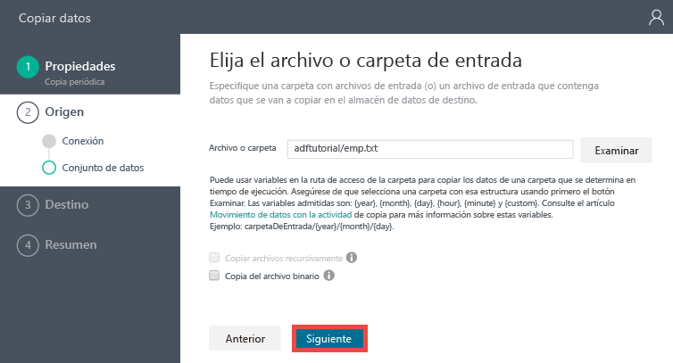
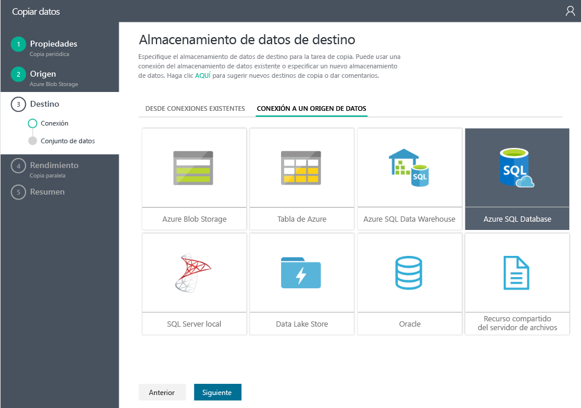
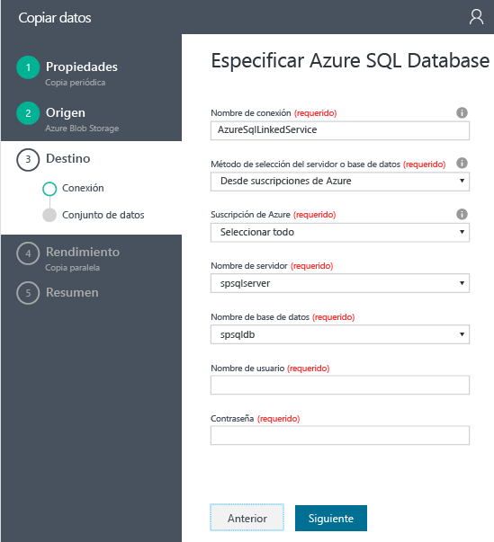
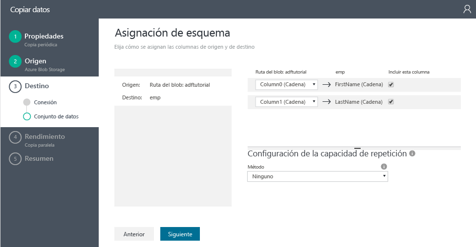
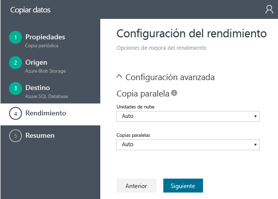
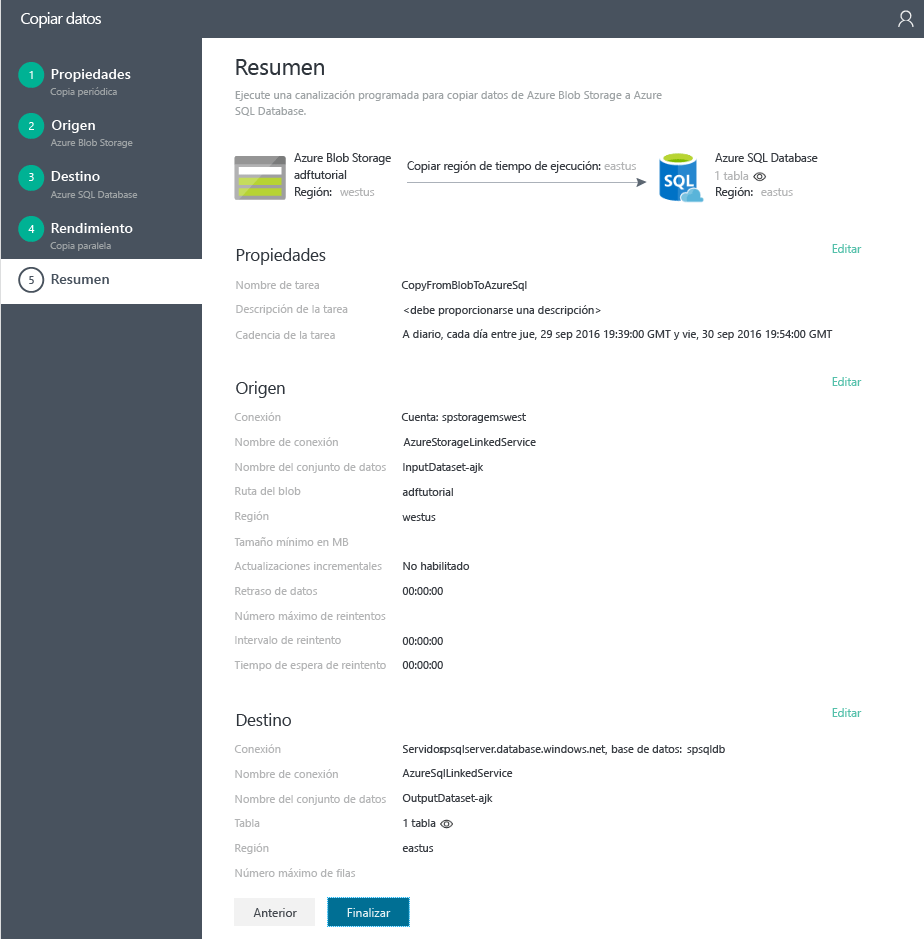

# Tutorial: crear una canalización con la actividad de copia mediante el Asistente para copia de Data Factory
> [!div class="op_single_selector"]
> * [Introducción y requisitos previos](data-factory-copy-data-from-azure-blob-storage-to-sql-database.md)
> * [Asistente para copia](data-factory-copy-data-wizard-tutorial.md)
> * [Portal de Azure](data-factory-copy-activity-tutorial-using-azure-portal.md)
> * [Visual Studio](data-factory-copy-activity-tutorial-using-visual-studio.md)
> * [PowerShell](data-factory-copy-activity-tutorial-using-powershell.md)
> * [Plantilla de Azure Resource Manager](data-factory-copy-activity-tutorial-using-azure-resource-manager-template.md)
> * [API DE REST](data-factory-copy-activity-tutorial-using-rest-api.md)
> * [API de .NET](data-factory-copy-activity-tutorial-using-dotnet-api.md)
> 
> 

El **Asistente para copia** de Azure Data Factory permite crear de manera fácil y rápida una canalización que implementa el escenario de ingesta y movimiento de datos. Por lo tanto, se recomienda utilizar al asistente como primer paso para crear una canalización de ejemplo para el escenario de movimiento de datos. En este tutorial se muestra cómo crear una instancia de Azure Data Factory, iniciar el Asistente para copia, y realizar una serie de pasos en los que se proporcionan detalles acerca del escenario de ingesta y movimiento de datos. Al terminar los pasos del asistente, este crea automáticamente una canalización con una actividad de copia para copiar datos desde Azure Blob Storage a Azure SQL Database. Para más información acerca de la actividad de copia, consulte el artículo [Actividades de movimiento de datos](data-factory-data-movement-activities.md) . 

> [!IMPORTANT]
> Antes de realizar este tutorial, consulte el artículo de [información general del tutorial y requisitos previos](data-factory-copy-data-from-azure-blob-storage-to-sql-database.md) y complete los pasos de los **requisitos previos**.
> 
> 

## Creación de Data Factory
En este paso, utilizará el Portal de Azure para crear una factoría de datos de Azure llamada **ADFTutorialDataFactory**.

1. Tras iniciar sesión en [Azure Portal](https://portal.azure.com), haga clic en **+ NUEVO** en la esquina superior izquierda, después en **Intelligence + analytics** y en **Data Factory**. 
   
   
2. En la hoja **Nueva factoría de datos** :
   
   1. Escriba **ADFTutorialDataFactory** como **nombre**.
       El nombre del generador de datos de Azure debe ser único global. Si recibe el error: **El nombre del generador de datos "ADFTutorialDataFactory" no está disponible**, cambie el nombre de la factoría de datos (por ejemplo, yournameADFTutorialDataFactory) e intente crearlo de nuevo. Consulte el tema [Factoría de datos: reglas de nomenclatura](data-factory-naming-rules.md) para las reglas de nomenclatura para los artefactos de Factoría de datos.  
      
       
      
      > [!NOTE]
      > El nombre de la factoría de datos se puede registrar como un nombre DNS en el futuro y, por lo tanto, hacerse públicamente visible.
      > 
      > 
3. Selección la **suscripción**de Azure.
4. Para el grupo de recursos, realice uno de los siguientes pasos: 1. Seleccione en primer lugar **Usar existente** y después un grupo de recursos existente.
5. Seleccione **Crear nuevo** y escriba un nombre para un grupo de recursos.
   
            Some of the steps in this tutorial assume that you use the name: **ADFTutorialResourceGroup** for the resource group. To learn about resource groups, see [Using resource groups to manage your Azure resources](../azure-resource-manager/resource-group-overview.md).
   1. Seleccione una **ubicación** para la factoría de datos.
   2. Seleccione la casilla **Anclar al panel** en la parte inferior de la hoja.  
   3. Haga clic en **Crear**.
      
                 
6. Una vez completada la creación, puede ver la hoja **Data Factory** como se muestra en la siguiente imagen:
   
   

## Inicio y uso del Asistente para copia
1. En la página principal de Data Factory, haga clic en el icono **Copiar datos** para iniciar el **Asistente para copia**. 
   
   > [!NOTE]
   > Si ve que el explorador web está atascado en "Autorizando...", deshabilite o desactive la opción **Bloquear cookies y datos de sitios de terceros** o déjela habilitada y cree una excepción para **login.microsoftonline.com** e intente iniciar de nuevo el asistente.
   > 
   > 
2. En la página **Propiedades** :
   
   1. Escriba **CopyFromBlobToAzureSql** en **Nombre de tarea**.
   2. Escriba una **descripción** (opcional).
   3. Cambie la **fecha y hora de inicio** y la **fecha y hora de finalización** para establecer la fecha de finalización en hoy y la fecha de inicio en cinco días antes del día de hoy.  
   4. Haga clic en **Siguiente**.  
      
       
3. En la página **Almacén de datos de origen**, haga clic en el icono **Azure Blob Storage**. Use esta página para especificar el almacén de datos de origen para la tarea de copia. Puede usar un servicio vinculado del almacén de datos existente, o bien especificar un almacén de datos nuevo. Para utilizar un servicio vinculado existente, haga clic en **FROM EXISTING LINKED SERVICES** (DE SERVICIOS VINCULADOS EXISTENTES) y seleccione el servicio vinculado correcto. 
   
    
4. En la página **Especificar cuenta de Almacenamiento de blobs de Azure** :
   
   1. Escriba **AzureStorageLinkedService** en **Nombre de servicio vinculado**.
   2. Confirme que la opción **De suscripciones de Azure** está seleccionada para **Método de selección de cuenta**.
   3. Selección la **suscripción**de Azure.  
   4. Seleccione una **cuenta de Azure Storage** en la lista de cuentas de Azure Storage disponibles en la suscripción seleccionada. También puede elegir especificar la configuración de la cuenta de almacenamiento manualmente, para lo que debe seleccionar la opción **Especificar manualmente** en **Método de selección de cuenta** y luego hacer clic en **Siguiente**. 
      
      
5. En la página **Elegir el archivo o la carpeta de entrada** :
   
   1. Navegue hasta la carpeta **adftutorial** .
   2. Seleccione **emp.txt** y haga clic en **Elegir**.
   3. Haga clic en **Siguiente**. 
      
      
6. En la página **Choose the input file or folder** (Elegir el archivo o la carpeta de entrada), haga clic en **Next** (Siguiente). No seleccione **Binary copy**(Copia binaria). 
   
     
7. En la página **Configuración de formato de archivo**, verá los delimitadores y el esquema que el asistente detecta automáticamente al analizar el archivo. También puede especificar los delimitadores manualmente a fin de que el Asistente para copia detenga la detección automática o proceda a la invalidación. Haga clic en **Siguiente** después de revisar los delimitadores y obtener una vista previa de los datos. 
   
      
8. En la página Almacén de datos de destino, seleccione el icono **Azure SQL Database** y haga clic en **Siguiente**.
   
    
9. En la página **Especificar la base de datos SQL de Azure** :
   
   1. Escriba **AzureSqlLinkedService** en el campo **Nombre de la conexión**.
   2. Confirme que la opción **De suscripciones de Azure** esté seleccionada para **Método de selección de servidor y base de datos**.
   3. Selección la **suscripción**de Azure.  
   4. Seleccione **Nombre de servidor** y **Base de datos**.
   5. En **Nombre de usuario** y **Contraseña**, escriba los valores pertinentes.
   6. Haga clic en **Siguiente**.  
      
      
10. En la página **Asignación de tabla**, seleccione **emp** en la lista desplegable del campo **Destino** y haga clic en **flecha abajo** (opcional) para ver el esquema y obtener una vista previa de los datos.
    
      
11. En la página **Asignación de esquema**, haga clic en **Siguiente**.
    
    
12. En la página **Configuración de rendimiento**, haga clic en **Siguiente**. 
    
    
13. Revise la información de la página **Resumen** y haga clic en **Finalizar**. El asistente crea dos servicios vinculados, dos conjuntos de datos (entrada y salida) y una canalización en la factoría de datos (desde donde se inició al Asistente para copia). 
    
    

## Inicio de la aplicación de supervisión y administración
1. En la página **Implementación**, haga clic en el vínculo: `Click here to monitor copy pipeline`.
   
     
2. Utilice las instrucciones de [Supervisar y administrar canalización mediante Aplicación de supervisión](data-factory-monitor-manage-app.md) para más información acerca de cómo supervisar la canalización que ha creado. Haga clic en el icono **Actualizar** de la lista de **VENTANAS DE ACTIVIDAD** para ver el segmento. 
   
    
   
   > [!NOTE]
   > Haga clic en el botón **Actualizar** en la lista **VENTANAS DE ACTIVIDAD** en la parte inferior para ver el estado más reciente. No se actualiza automáticamente. 
   > 
   > 

## Otras referencias
| Tema. | Descripción |
|:--- |:--- |
| [Actividades de movimiento de datos](data-factory-data-movement-activities.md) |En este artículo se proporciona información detallada sobre la actividad de copia que se usa en el tutorial. |
| [Programación y ejecución con Data Factory](data-factory-scheduling-and-execution.md) |En este artículo se explican los aspectos de programación y ejecución del modelo de aplicación de Factoría de datos de Azure. |
| [Procesos](data-factory-create-pipelines.md) |Este artículo ayuda a conocer las canalizaciones y actividades de Data Factory de Azure y cómo aprovecharlas para construir flujos de trabajo controlados por datos de un extremo a otro para su escenario o negocio. |
| [Conjuntos de datos](data-factory-create-datasets.md) |Este artículo le ayuda a comprender los conjuntos de datos de Data Factory de Azure. |
| [Supervisión y administración de canalizaciones de Data Factory de Azure mediante la nueva Aplicación de supervisión y administración](data-factory-monitor-manage-app.md) |En este artículo se describe cómo supervisar, administrar y depurar las canalizaciones mediante la aplicación de supervisión y administración. |

<!--HONumber=Oct16_HO2-->

