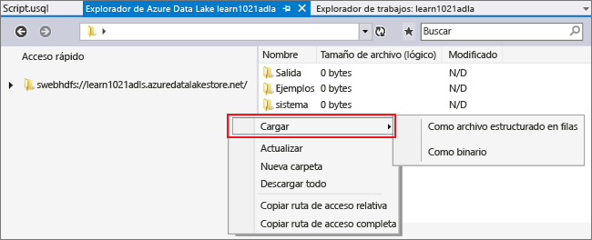
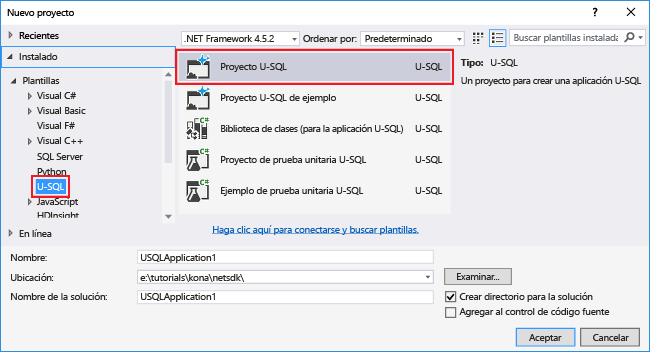
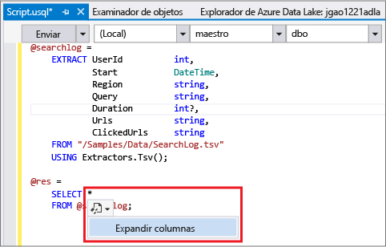
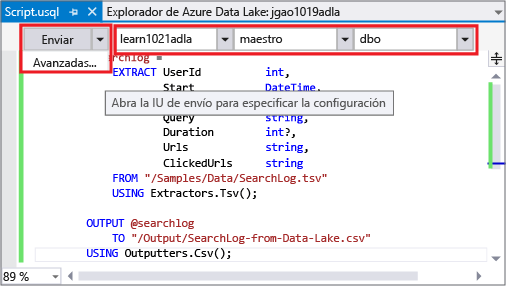
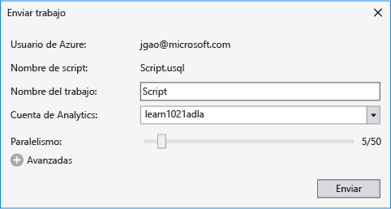
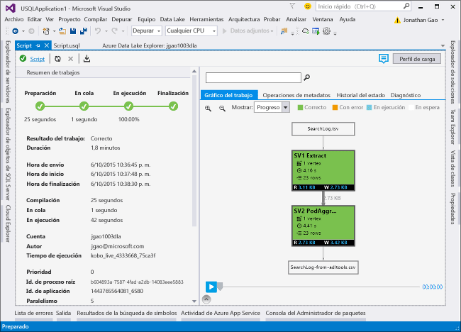

# Tutorial: Desarrollo de scripts U-SQL mediante Data Lake Tools for Visual Studio
[!INCLUDE [get-started-selector](../../includes/data-lake-analytics-selector-get-started.md)]

Cree y pruebe scripts U-SQL mediante Herramientas de Azure Data Lake para Visual Studio.

U-SQL es un lenguaje muy escalable y altamente extensible para preparar, transformar y analizar todos los datos que hay en Data Lake y más allá. Para obtener más información, consulte [Referencia sobre el lenguaje U-SQL](http://go.microsoft.com/fwlink/p/?LinkId=691348).

## Requisitos previos
* **Visual Studio 2017 (para la carga de trabajo Almacenamiento y procesamiento de datos), Visual Studio 2015 Update 3, Visual Studio 2013 Update 4 o Visual Studio 2012. Se admiten las ediciones Enterprise (Ultimate y Premium), Professional, Community; no se admite la edición Express.**
* **SDK de Microsoft Azure para .NET versión 2.7.1 o posterior**.  Instálelo usando el [instalador de plataforma web](http://www.microsoft.com/web/downloads/platform.aspx).
* **[Data Lake Tools para Visual Studio](http://aka.ms/adltoolsvs)**.

    Después de instalar Herramientas de Azure Data Lake para Visual Studio, verá el nodo de "Data Lake Analytics" en el Explorador de servidores bajo el nodo "Azure" (abra el Explorador de servidores presionando Ctrl + Alt + S).

* **Cuenta y datos de ejemplo de Data Lake Analytics**. Las Herramientas de Azure Data Lake no son compatibles con la creación de cuentas de Data Lake Analytics. Cree una cuenta mediante Azure Portal, Azure PowerShell, el SDK de .NET o la CLI de Azure.
Para su comodidad, puede encontrar un script de PowerShell para crear un servicio de Data Lake Analytics y cargar un archivo de datos de origen en [Ejemplo de PowerShell Appx-A para preparar el tutorial](data-lake-analytics-data-lake-tools-get-started.md#appx-a-powershell-sample-for-preparing-the-tutorial).

    De manera opcional, puede consultar las dos secciones del [Tutorial: Introducción a Azure Data Lake Analytics mediante Azure Portal](data-lake-analytics-get-started-portal.md) para crear su cuenta y cargar datos manualmente:

    1. [Creación de una cuenta de Análisis de Azure Data Lake](data-lake-analytics-get-started-portal.md#create-data-lake-analytics-account).
    2. [Carga de SearchLog.tsv en la cuenta predeterminada de Almacén de Data Lake](data-lake-analytics-get-started-portal.md#prepare-source-data).

## Conexión a Azure
**Conexión a Data Lake Analytics**

1. Abra Visual Studio.
2. En el menú **Ver**, haga clic en **Explorador de servidores** para abrir este explorador. O bien, presione **[CTRL] + [ALT] + S**.
3. Haga clic con el botón derecho en **Azure**, haga clic en "Conectar a la suscripción de Microsoft Azure" y siga las instrucciones.
4. En el **Explorador de servidores**, expanda **Azure** y después **Data Lake Analytics**. Verá una lista de las cuentas de Análisis de Data Lake, si las hay. No se pueden crear cuentas de Análisis de Data Lake desde Visual Studio. Para crear una cuenta, consulte [Tutorial: Introducción a Azure Data Lake Analytics mediante Azure Portal](data-lake-analytics-get-started-portal.md) o [Tutorial: Introducción a Azure Data Lake Analytics mediante Azure PowerShell](data-lake-analytics-get-started-powershell.md).

## Carga de archivos de datos de origen
Se cargaron algunos datos en la sección **Requisitos previos** , anteriormente en el tutorial.  

Para utilizar sus propios datos, siga estos pasos para cargar los datos desde las Herramientas de Data Lake.

**Carga de archivos en la cuenta de Azure Data Lake dependiente**

1. En el **Explorador de servidores**, expanda **Azure**, **Data Lake Analytics**, la cuenta de Data Lake Analytics y **Cuentas de almacenamiento**. Verá la cuenta de Almacén de Data Lake predeterminada, las cuentas de Almacén de Data Lake vinculadas y las cuentas de almacenamiento de Azure vinculadas. La cuenta de Data Lake predeterminada tiene la etiqueta "Cuenta de almacenamiento predeterminada".
2. Haga clic con el botón derecho en la cuenta de Almacén de Data Lake predeterminada y después haga clic en **Explorador**.  Se abre el panel del explorador de Data Lake Tools for Visual Studio.  En la izquierda muestra una vista de árbol y la vista de contenido está a la derecha.
3. Vaya a la carpeta donde desea cargar los archivos.
4. Haga clic con el botón derecho en cualquier espacio en blanco y después haga clic en **Cargar**.

    

**Carga de archivos en una cuenta de Azure Blob Storage vinculada**

1. En el **Explorador de servidores**, expanda **Azure**, **Data Lake Analytics**, la cuenta de Data Lake Analytics y **Cuentas de almacenamiento**. Verá la cuenta de Almacén de Data Lake predeterminada, las cuentas de Almacén de Data Lake vinculadas y las cuentas de almacenamiento de Azure vinculadas.
2. Expanda la cuenta de almacenamiento de Azure.
3. Haga clic con el botón derecho en el contenedor donde desea cargar los archivos y después haga clic en **Explorador**. Si no tiene un contenedor, primero debe crearlo en el Portal de Azure, con Azure PowerShell o con otras herramientas.
4. Vaya a la carpeta donde desea cargar los archivos.
5. Haga clic con el botón derecho en cualquier espacio en blanco y después haga clic en **Cargar**.

## Desarrollar scripts U-SQL
Los trabajos de Análisis de Data Lake se escriben en el lenguaje U-SQL. Para más información sobre U-SQL, consulte la [introducción al lenguaje U-SQL](data-lake-analytics-u-sql-get-started.md) y la [referencia del lenguaje U-SQL](http://go.microsoft.com/fwlink/?LinkId=691348).

**Creación y envío de un trabajo de Data Lake Analytics**

1. En el menú **Archivo**, haga clic en **Nuevo** y en **Proyecto**.
2. Seleccione el tipo de **proyecto U-SQL** .

    
3. Haga clic en **Aceptar**. Visual Studio crea una solución con un archivo **Script.usql** .
4. Incluya el siguiente script en el archivo **Script.usql**:

        @searchlog =
            EXTRACT UserId          int,
                    Start           DateTime,
                    Region          string,
                    Query           string,
                    Duration        int?,
                    Urls            string,
                    ClickedUrls     string
            FROM "/Samples/Data/SearchLog.tsv"
            USING Extractors.Tsv();

        @res =
            SELECT *
            FROM @searchlog;        

        OUTPUT @res   
            TO "/Output/SearchLog-from-Data-Lake.csv"
        USING Outputters.Csv();

    Este script de U-SQL lee el archivo de datos de origen mediante **Extractors.Tsv()** y crea un archivo csv con **Outputters.Csv()**.

    No modifique ninguna de las dos rutas a menos que copie el archivo de origen en una ubicación diferente.  Análisis de Data Lake creará la carpeta de salida si no existe.

    Es más fácil usar rutas de acceso relativas para los archivos almacenados en cuentas predeterminadas de Data Lake. También puede usar rutas de acceso absolutas.  Por ejemplo:

        adl://<Data LakeStorageAccountName>.azuredatalakestore.net:443/Samples/Data/SearchLog.tsv

    Debe usar rutas de acceso absolutas para acceder a los archivos de las cuentas de almacenamiento vinculadas.  La sintaxis de los archivos almacenados en la cuenta de Almacenamiento de Azure vinculada es:

        wasb://<BlobContainerName>@<StorageAccountName>.blob.core.windows.net/Samples/Data/SearchLog.tsv

   > [!NOTE]
   > Los contenedores de blobs de Azure con permisos de acceso de contenedores públicos o blobs públicos no se admiten actualmente.  
   >
   >

    Tenga en cuenta las siguientes características:

   * **IntelliSense**

       Se mostrarán los nombres completados automáticamente y los miembros de las entidades conjunto de filas, clases, bases de datos, esquemas y objetos definidos por el usuario (UDO).

       IntelliSense para las entidades de catálogo (bases de datos, esquemas, tablas, UDO, etc.) está relacionado con la cuenta de proceso. Puede comprobar la cuenta de proceso activa actual, la base de datos y el esquema en la barra de herramientas superior y cambiarlos en las listas desplegables.
   * **Expandir columnas***

       Haga clic a la derecha de *; aparecerá un subrayado azul debajo de *. Mueva el cursor del mouse sobre el subrayado azul y haga clic en la flecha abajo.
       

       Haga clic en **Expand Columns (Expandir columnas)**y la herramienta reemplazará * por los nombres de columna.
   * **Formato automático**

       Los usuarios pueden cambiar la sangría del script U-SQL basándose en la estructura de código en Edición -> Opciones avanzadas:

     * Dar formato al documento (CTRL+E, D): da formato a todo el documento.   
     * Dar formato a la selección (CTRL+K, CTRL+F): da formato a la selección. Si no se ha realizado ninguna selección, este método abreviado da formato a la línea en la que se encuentra el cursor.  

       Todas las reglas de formato se pueden configurar en Herramientas -> Opciones -> Editor de texto -> SIP -> Formato.  
   * **Sangría inteligente**

       Data Lake Tools for Visual Studio puede aplicar sangría automáticamente a las expresiones al escribir scripts. Esta característica está deshabilitada de forma predeterminada; los usuarios deben activarla en U-SQL -> Opciones y configuración -> Modificadores -> Habilitar sangría inteligente.
   * **Ir a definición y Buscar todas las referencias**

       Hacer clic con el botón derecho en el nombre de un conjunto de filas, parámetro, columna, UDO, etc. y hacer clic en Ir a definición (F12) permite ir a su definición. Al hacer clic en Buscar todas las referencias (Mayús+F12) se mostrarán todas las referencias.
   * **Insertar ruta de acceso de Azure**

       En lugar de tener que recordar la ruta de acceso del archivo de Azure y especificarla manualmente al escribir el script, Data Lake Tools para Visual Studio facilita esta operación: haga clic con el botón derecho en el editor y haga clic en Insert Azure Path (Insertar ruta de acceso de Azure). Vaya hasta el archivo en el cuadro de diálogo Explorador de blobs de Azure. Haga clic en **Aceptar**. La ruta de acceso del archivo se insertará en el código.
5. Especifique la cuenta de Análisis de Data Lake, la base de datos y el esquema. Puede seleccionar **(local)** para ejecutar el script de forma local para pruebas. Para más información, vea [Ejecución de U-SQL localmente](#run-u-sql-locally).

    

    Para obtener más información, consulte [Uso del catálogo de U-SQL](data-lake-analytics-use-u-sql-catalog.md).
6. En el **Explorador de soluciones**, haga clic con el botón derecho en **Script.usql** y después haga clic en **Build Script** (Compilar script). Compruebe el resultado en el panel Salida.
7. En el **Explorador de soluciones**, haga clic con el botón derecho en **Script.usql** y después haga clic en **Submit Script** (Enviar script). Si lo desea, también puede hacer clic **Enviar** en el panel de Script.usql.  Consulte la captura de pantalla anterior.  Haga clic en la flecha hacia abajo situada junto al botón Enviar para enviar mediante las opciones avanzadas:
8. Especifique un valor en **Nombre del trabajo**, compruebe el valor de **Analytics Account** (Cuenta de Analytics) y haga clic en **Enviar**. Los resultados del envío y el vínculo del trabajo están disponibles en la ventana de resultados de Data Lake Tools for Visual Studio cuando se completa el envío.

    
9. Puede hacer clic en el botón Actualizar para ver el estado de trabajo más reciente y actualizar la pantalla. Si el trabajo se completa correctamente, aparecerá **Job Graph** (Gráfico del trabajo), **Meta Data Operations** (Operaciones de metadatos), **State History** (Historial de estado), **Diagnostics** (Diagnóstico):

    

   * Resumen del trabajo. Muestra la información de resumen del trabajo actual, por ejemplo: estado, progreso, tiempo de ejecución, nombre en tiempo de ejecución, remitente, etc.   
   * Detalles del trabajo. Se proporciona información detallada acerca de este trabajo, incluidos scripts, recursos y la vista de ejecución de vértices.
   * Gráfico del trabajo. Se proporcionan cuatro gráficos para visualizar la información del trabajo: progreso, datos leídos, datos escritos, tiempo de ejecución, promedio de tiempo de ejecución por nodo, capacidad de proceso de entrada, capacidad de proceso de salida.
   * Operaciones de metadatos. Muestra todas las operaciones de metadatos.
   * Historial de estado.
   * Diagnóstico. Data Lake Tools for Visual Studio diagnosticará automáticamente la ejecución del trabajo. Recibirá alertas cuando en caso de errores o problemas de rendimiento en sus trabajos. Consulte Diagnóstico de trabajos (vínculo por determinar) para obtener más información.

**Para comprobar el estado del trabajo**

1. En el Explorador de servidores, expanda **Azure**, **Data Lake Analytics** y el nombre de cuenta de Data Lake Analytics.
2. Haga doble clic en **Trabajos** para enumerar los trabajos.
3. Haga clic en un trabajo para ver el estado.

**Para ver la salida del trabajo**

1. En el **Explorador de servidores**, expanda **Azure**, **Data Lake Analytics**, la cuenta de Data Lake Analytics y **Cuentas de almacenamiento**. A continuación, haga clic con el botón derecho en la cuenta predeterminada de Data Lake Store y después haga clic en **Explorador**.
2. Haga doble clic en **salida** para abrir la carpeta.
3. Haga doble clic en **SearchLog-From-adltools.csv**.

### Reproducción del trabajo
La reproducción del trabajo permite ver el progreso de la ejecución del trabajo y detectar visualmente los cuellos de botella y anomalías de rendimiento. Esta característica se puede usar antes de que finalice la ejecución del trabajo (es decir, durante el tiempo en que el trabajo se está ejecutando activamente), así como una vez finalizada la ejecución. Realizar la reproducción durante la ejecución del trabajo permitirá al usuario reproducir el progreso hasta el momento actual.

**Para ver el progreso de la ejecución del trabajo**  

1. Haga clic en **Load Profile (Cargar perfil)** en la esquina superior derecha. Consulte la captura de pantalla anterior.
2. Haga clic en el botón Reproducir, en la esquina inferior izquierda, para revisar el progreso de la ejecución del trabajo.
3. Durante la reproducción, haga clic en **Pausa** para detenerla o arrastre directamente la barra de progreso a posiciones específicas.

### Mapa térmico
Data Lake Tools for Visual Studio permite realizar superposiciones de colores seleccionables por el usuario en la vista del trabajo para indicar el progreso, la E/S de datos, el tiempo de ejecución, la capacidad de proceso de E/S de cada fase. De este modo, los usuarios pueden determinar posibles problemas y las propiedades de distribución del trabajo de forma directa e intuitiva. Puede elegir un origen de datos para mostrar en la lista desplegable.  

## Ejecución de U-SQL localmente

Puede usar Azure Data Lake Tools para Visual Studio y el SDK de U-SQL para Azure Data Lake para ejecutar trabajos de U-SQL en la estación de trabajo local, de la misma forma que en el servicio Azure Data Lake. Estas dos características de ejecución local ahorran tiempo para probar y depurar los trabajos de U-SQL. 

* [Prueba y depuración de trabajos U-SQL mediante la ejecución local y el SDK de U-SQL para Azure Data Lake](data-lake-analytics-data-lake-tools-local-run.md)

## Consulte también
Para empezar a trabajar con Análisis de Data Lake usando diferentes herramientas, consulte:

* [Introducción a Data Lake Analytics mediante el portal de Azure](data-lake-analytics-get-started-portal.md)
* [Introducción a Data Lake Analytics mediante Azure PowerShell](data-lake-analytics-get-started-powershell.md)
* [Introducción a Data Lake Analytics mediante .NET SDK](data-lake-analytics-get-started-net-sdk.md)
* [Depuración de trabajos U-SQL](data-lake-analytics-debug-u-sql-jobs.md)

Para ver código de Data Lake Tools para Visual Studio, consulte [Use the Azure Data Lake Tools for Visual Studio Code](data-lake-analytics-data-lake-tools-for-vscode.md) (Uso del código de Azure Data Lake Tools para Visual Studio).

Para ver más temas de desarrollo:

* [Analizar weblogs mediante Análisis de Data Lake](data-lake-analytics-analyze-weblogs.md)
* [Desarrollo de scripts U-SQL mediante Data Lake Tools for Visual Studio](data-lake-analytics-data-lake-tools-get-started.md)
* [Introducción al lenguaje U-SQL de Análisis de Azure Data Lake](data-lake-analytics-u-sql-get-started.md)
* [Desarrollo de operadores U-SQL definidos por el usuario para trabajos de Análisis de Data Lake](data-lake-analytics-u-sql-develop-user-defined-operators.md)

## Ejemplo de PowerShell Appx-A para preparar el tutorial
El siguiente script de PowerShell prepara de forma automática una cuenta de Azure Data Lake Analytics y los datos de origen, por lo que puede ir directamente a [Desarrollar scripts U-SQL](data-lake-analytics-data-lake-tools-get-started.md#develop-u-sql-scripts).

    #region - used for creating Azure service names
    $nameToken = "<Enter an alias>"
    $namePrefix = $nameToken.ToLower() + (Get-Date -Format "MMdd")
    #endregion

    #region - service names
    $resourceGroupName = $namePrefix + "rg"
    $dataLakeStoreName = $namePrefix + "adas"
    $dataLakeAnalyticsName = $namePrefix + "adla"
    $location = "East US 2"
    #endregion

    # Treat all errors as terminating
    $ErrorActionPreference = "Stop"

    #region - Connect to Azure subscription
    Write-Host "`nConnecting to your Azure subscription ..." -ForegroundColor Green
    try{Get-AzureRmContext}
    catch{Login-AzureRmAccount}
    #endregion

    #region - Create an Azure Data Lake Analytics service account
    Write-Host "Create a resource group ..." -ForegroundColor Green
    New-AzureRmResourceGroup `
        -Name  $resourceGroupName `
        -Location $location

    Write-Host "Create a Data Lake account ..."  -ForegroundColor Green
    New-AzureRmDataLakeStoreAccount `
        -ResourceGroupName $resourceGroupName `
        -Name $dataLakeStoreName `
        -Location $location

    Write-Host "Create a Data Lake Analytics account ..."  -ForegroundColor Green
    New-AzureRmDataLakeAnalyticsAccount `
        -Name $dataLakeAnalyticsName `
        -ResourceGroupName $resourceGroupName `
        -Location $location `
        -DefaultDataLake $dataLakeStoreName

    Write-Host "The newly created Data Lake Analytics account ..."  -ForegroundColor Green
    Get-AzureRmDataLakeAnalyticsAccount `
        -ResourceGroupName $resourceGroupName `
        -Name $dataLakeAnalyticsName  
    #endregion

    #region - prepare the source data
    Write-Host "Import the source data ..."  -ForegroundColor Green
    $localFolder = "C:\Tutorials\Downloads\" # A temp location for the file.
    $storageAccount = "adltutorials"  # Don't modify this value.
    $container = "adls-sample-data"  #Don't modify this value.

    # Create the temp location  
    New-Item -Path $localFolder -ItemType Directory -Force

    # Download the sample file from Azure Blob storage
    $context = New-AzureStorageContext -StorageAccountName $storageAccount -Anonymous
    $blobs = Azure\Get-AzureStorageBlob -Container $container -Context $context
    $blobs | Get-AzureStorageBlobContent -Context $context -Destination $localFolder

    # Upload the file to the default Data Lake Store account    
    Import-AzureRmDataLakeStoreItem -AccountName $dataLakeStoreName -Path $localFolder"SearchLog.tsv" -Destination "/Samples/Data/SearchLog.tsv"

    Write-Host "List the source data ..."  -ForegroundColor Green
    Get-AzureRmDataLakeStoreChildItem -Account $dataLakeStoreName -Path  "/Samples/Data/"
    #endregion

